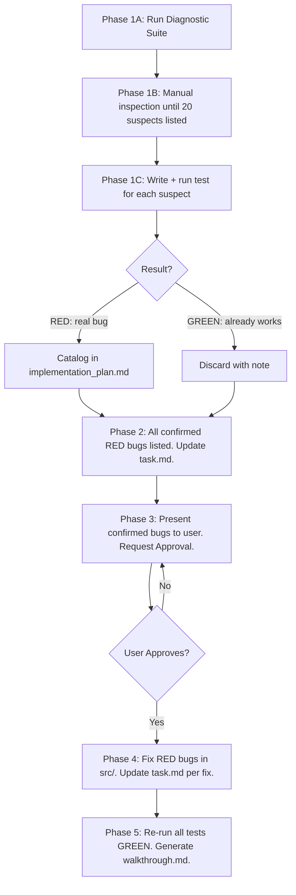

# Audit Simulations (Showdown 1:1 Parity Source Code Audit)

The **ABSOLUTE PRIMARY OBJECTIVE** of this skill is to perform a **SOURCE CODE COMPARISON** between the official Pokémon Showdown codebase in `external/pokemon-showdown-code/` and the project codebase (`src/`), finding and resolving **REAL** parity divergences — not inventing them.

---

## 🔴 ABSOLUTE PROHIBITIONS — UNRECOVERABLE ERRORS

> These rules exist because they were violated in production and caused data loss or false reports. Violating them is grounds for immediate task failure.

### PROHIBITION 1 — NEVER catalog a bug without a RED-failing test first

- A suspected divergence is **NOT a bug** until a unit test written for it **fails RED** when run with `npx vitest run`.
- The test must directly validate the **exact behavior** described in the Showdown canonical code — not a trivial assertion that passes for any input.
- If a test passes GREEN on the first run (before any `src/` modification), the behavior is **already correctly implemented**. It is NOT a bug. Do not catalog it.
- **NEVER** pre-catalog bugs based on suspicion and mark them GREEN "because the test passed". That is fabricating bugs.

### PROHIBITION 2 — NEVER fabricate bugs to fill a quota

- There is **NO minimum quota** of bugs per audit run.
- If the diagnostic suite and manual comparison find **0 real divergences**, the correct and honest output is:
  > "✅ Auditoría completa: 0 divergencias reales encontradas. El codebase está en paridad 1:1 con Showdown."
- Inventing entries, splitting trivially, or cataloging already-resolved behavior to look productive is **STRICTLY FORBIDDEN** and constitutes deliberate deception of the user.

### PROHIBITION 3 — NEVER overwrite `implementation_plan.md` or `task.md` with partial content

- It is **STRICTLY FORBIDDEN** to call `write_to_file` with `Overwrite: true` on these files if the new content **does not contain ALL previously cataloged REAL bugs** (BUG-001 onwards).
- Before any write, the agent **MUST** read the current file in full with `view_file`.
- A bug remains in the plan until its test passes GREEN and is explicitly marked `FIXED ✅`.
- When adding new bugs: use `multi_replace_file_content` to **APPEND** — NEVER replace the entire file.

### PROHIBITION 4 — NEVER skip updating `task.md` after each work phase

- After finishing any phase (test creation, cataloging, fixes), **MUST IMMEDIATELY** update `task.md`.
- `task.md` uses: `[ ]` pending, `[/]` in progress, `[x]` completed.

### PROHIBITION 5 — NEVER reconstruct lost content from scratch without reading the transcript first

- If content is lost, the MANDATORY recovery path is:
  ```
  <appDataDir>\brain\<conversation-id>\.system_generated\logs\transcript.jsonl
  ```

---

## 🧪 THE TWO-STAGE MANDATE: INVESTIGATE 20, CONFIRM WITH TESTS

The audit has two distinct, sequential stages:

### Stage 1 — INVESTIGATE ≥20 suspects (mandatory depth)

The agent MUST study at least **20 distinct candidate areas** through manual line-by-line comparison between `external/pokemon-showdown-code/` and `src/`. This is non-negotiable — it exists to force thorough inspection and prevent lazy single-bug reports.

For each candidate, articulate the suspicion in one sentence:
> *"Showdown does X at `external/sim/field.ts#L220` but src/ appears to do Y instead at `src/logic/battle/battleMath.ts#L180`."*

A list of ≥20 suspects is the output of Stage 1. These are **unconfirmed** — they are hypotheses only.

### Stage 2 — CONFIRM each suspect with a test (gate to bug catalog)

For each of the ≥20 suspects, write a test and run it:

```
SUSPECT (from Stage 1)
       ↓
Write test designed to FAIL if the divergence exists
       ↓
npx vitest run tests/unit/battle/test_candidate.spec.ts
       ↓
RED (test fails)  ──→ Confirmed real bug → Catalog it
GREEN (test passes) ──→ Already working  → Discard. Do NOT catalog.
```

The number of cataloged bugs = number of suspects that fail RED. This may be 0, 5, 10, or 20. All are valid outcomes depending on what the code actually shows.

### Why this two-stage design

- **Stage 1 (≥20 suspects)** forces the agent to actually study the codebase deeply instead of lazily returning 1 bug per session. Shallow investigation is explicitly forbidden.
- **Stage 2 (test gate)** prevents false positives. A test that passes on the first run without any code change proves the behavior is already correct — cataloging it as a bug is fabrication.

**Anti-pattern (STRICTLY FORBIDDEN):**
```
1. Agent finds ≥20 suspects — good so far
2. Writes tests → all pass GREEN
3. Agent catalogs them anyway as "FIXED ✅"   ← WRONG. If they were never broken, they are not bugs.
```

**Correct outcome:**
```
1. Agent finds ≥20 suspects — mandatory
2. Runs tests for all 20
3. 3 fail RED → catalogs 3 real bugs
4. 17 pass GREEN → discards them with a note per suspect
5. Reports: "Investigué 20 áreas. 3 bugs reales confirmados."
```

**Correct protocol:**
```
1. Agent suspects divergence after reading both external/ and src/
2. Writes test designed to FAIL if the behavior is absent
3. npx vitest run → GREEN → discard (feature works fine)
4. npx vitest run → RED  → catalog as real bug, proceed with fix
```

---

## 🔍 Mandatory Source Inspection Procedure

Before writing any test, the agent MUST:

1. Read the **canonical Showdown behavior** in `external/pokemon-showdown-code/` for the suspected area.
2. Read the **project implementation** in `src/` for the same area.
3. Identify a **specific, concrete behavioral difference** — not naming, not comments, not style.
4. Articulate: *"Showdown does X but src/ does Y instead."*

Only after step 4 may the agent write a test.

### What counts as a real divergence

- A formula produces a **different numeric result** (wrong multiplier, wrong floor/ceil, missing factor).
- A Showdown protocol token or event is **silently ignored** in `src/`.
- A status/ability/item effect is **applied in the wrong order or missing entirely**.
- An FSM state transition in Showdown has **no equivalent** in `src/`.

### What does NOT count as a divergence

- `src/` already correctly implements the Showdown behavior (even if named differently).
- A test passes GREEN without code changes — the feature works.
- Code style, naming, or architectural differences that produce **identical results**.
- Behaviors confirmed working by the diagnostic suite tool outputs.

### Writing tests that actually detect bugs

A **good** parity test:
- Calls the **actual `src/` function** under exact conditions where Showdown diverges.
- Asserts the **expected Showdown result** explicitly: `expect(result).toBe(expectedShowdownValue)`.
- **Fails RED if `src/` does not match Showdown** before any fix.

A **bad** (useless) parity test:
- Asserts `expect(result).toBeGreaterThan(0)` — passes trivially for any implementation.
- Calls a stub or mock instead of the real `src/` logic.
- Checks only that a function exists, not what it returns.
- Passes GREEN before any code change — this is not a test of a bug.

---

## 🚨 MANDATORY DIAGNOSTIC SUITE (Always run first)

```bash
npx tsx scripts/maintenance/audit_showdown/run_audit_suite.ts
```

- **If the suite reports violations** (non-empty arrays): each violation is a candidate. Write a test, confirm RED, then catalog.
- **If the suite reports zeros**: proceed to targeted manual comparison. If no RED-failing tests emerge: **report 0 bugs found** — that is correct behavior.
- Diagnostic suite outputs are **SECONDARY ASSISTANTS** — they narrow the search space but do not constitute confirmed bugs by themselves.

---

## 📐 SMART BUG GROUPING MANDATE

If multiple instances of the same root cause appear across different files (e.g., stat stage clamping in `battleMath.ts` AND `moveCalculator.ts`), **group them into ONE bug entry** with one unified test and fix. Splitting a single conceptual root cause into multiple entries to inflate counts is FORBIDDEN.

---

## 5-Step Deep Audit & Approval Workflow



### Phase 1: Diagnostic Suite + Deep Manual Investigation

1. Run `npx tsx scripts/maintenance/audit_showdown/run_audit_suite.ts`.
2. Read `task.md` and `implementation_plan.md` in full — track all prior real bugs.
3. **Stage 1 — Build a list of ≥20 suspects**: Study `external/pokemon-showdown-code/` vs `src/` across multiple modules. For each candidate area, write one sentence describing the suspected divergence. Do NOT write tests yet. Collect ≥20 suspects before moving to Stage 2.
4. **Stage 2 — Confirm each suspect with a test**: For each of the ≥20 suspects, write a test designed to FAIL if the divergence is real, run it, and observe the result:
   - **RED** → real bug confirmed → catalog it.
   - **GREEN** → feature already works → discard the suspect with a brief note.
5. Report summary: `"Investigué N áreas. X bugs reales confirmados por test RED."` where X may be 0.


### Phase 2: Catalog Confirmed Bugs (RED only)

- Add each confirmed RED bug to the **Master 1:1 Bug Table** in `implementation_plan.md`.
- If 0 bugs confirmed: produce a clean "0 divergencias" report. Do NOT write placeholder entries.
- Update `task.md` immediately.

### Phase 3: Mandatory Safety Stop — Present RED Bugs & Request Approval

- Present the complete list of **confirmed RED bugs** (could be 0, 3, 10, 20+ — whatever is real and honest).
- **WAIT for explicit user approval before editing any code in `src/`.**

### Phase 4: Fix RED Bugs in `src/`

- Apply fixes only for confirmed RED bugs.
- Update `task.md` after each fix.

### Phase 5: GREEN Verification & Walkthrough

- Re-run diagnostic suite and all dedicated tests confirming ✅ GREEN.
- Generate `walkthrough.md`.

---

## Mandatory Structure of the Cumulative Master 1:1 Bug Table

| Bug ID | Severity | Status | Canonical Showdown Code (`external/`) | Project File (`src/`) | Logic Discrepancy (confirmed by RED test) | Test File | Fix / State |
| :--- | :--- | :--- | :--- | :--- | :--- | :--- | :--- |
| `BUG-001` | `HIGH` | ✅ **GREEN** | `sim/sim/battle-stream.ts#L45` | `src/logic/battle/showdownBridgeCore.ts#L20` | Showdown does X, src/ does Y — confirmed RED | `tests/unit/battle/test_bug001.spec.ts` | **FIXED**: explanation |
| `BUG-002` | `HIGH` | ❌ **RED** | `sim/sim/field.ts#L220` | `src/logic/battle/showdownBridgeField.ts#L220` | Showdown does X, src/ does Y — confirmed RED | `tests/unit/battle/test_bug002.spec.ts` | **PENDING**: solution |

---

## Mandatory Audit Checklist

- [ ] Was the diagnostic suite `npx tsx scripts/maintenance/audit_showdown/run_audit_suite.ts` run in Phase 1?
- [ ] Were `implementation_plan.md` and `task.md` read in full with `view_file` before any modification?
- [ ] **Stage 1**: Were at least **20 distinct candidate areas** investigated through manual line-by-line comparison between `external/` and `src/`?
- [ ] For EACH suspect: was the suspicion articulated as one concrete sentence before writing the test?
- [ ] **Stage 2**: Was a test written and run for EACH of the ≥20 suspects?
- [ ] Were GREEN-on-first-run tests explicitly **excluded** from the bug catalog?
- [ ] Was each cataloged bug confirmed by a RED-failing test result?
- [ ] Was the final summary reported as `"Investigué N áreas. X bugs reales confirmados."` (honest count)?
- [ ] Were related root-cause bugs grouped into a single entry (smart grouping)?
- [ ] Was `task.md` updated IMMEDIATELY after running Stage 2 tests?
- [ ] Was `task.md` updated IMMEDIATELY after applying each fix?
- [ ] Was explicit user approval obtained before modifying `src/`?
- [ ] Did all dedicated tests pass GREEN after the fix?
- [ ] Was the official `walkthrough.md` artifact generated after completing Phase 5?

---

## 🚨 MANDATORY ARCHITECTURAL RULE: INHERITANCE, POLYMORPHISM & ZERO DUPLICATION

During the audit, the agent **MUST AUDIT THAT THE FUZZER AND SIMULATIONS SHARE THE EXACT SAME CODE**:

- It is strictly forbidden to duplicate logic, structures, helpers, or flow control across fuzzers, replayers, Playwright E2E browser simulations, and workers.
- Headless fuzzer replayers (`fuzzer_case_replayer.ts`) and Playwright E2E browser simulations MUST import and execute the **LITERALLY SAME shared battle execution modules** (`showdownExecutor.ts`, `showdownBattleRunner.ts`).

---

## 🚨 MANDATE: PRESERVE & AUDIT MISSING GAME ANIMATIONS & VISUAL FX

**The Poké Vicio game is fundamentally a rich visual player driven by Showdown logs.**

- It is **STRICTLY FORBIDDEN** to disable, skip, mock, or shortcut GSAP animations, particle effects, or visual sequences solely to make simulations pass faster.
- All visual responses to Showdown logs MUST use GSAP's native deterministic orchestration (`.then()`, `await timeline`, or `onComplete`). Using `setTimeout` or reactive flags for animations is strictly prohibited.
