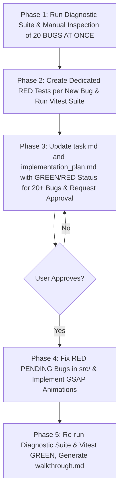

# Audit Simulations (Showdown 1:1 Parity & Massive 20-Bug Batch Source Code Audit)

The **ABSOLUTE PRIMARY OBJECTIVE** of this skill is to perform a **MASSIVE 20-BUG BATCH SOURCE CODE COMPARISON** between the entire official Pokémon Showdown codebase in `external/pokemon-showdown-code/` and the project codebase (`src/`).

---

## 🔴 ABSOLUTE PROHIBITIONS — UNRECOVERABLE ERRORS

> These rules exist because they were violated in production and caused data loss. Violating them is grounds for immediate task failure.

### PROHIBITION 1 — NEVER overwrite `implementation_plan.md` or `task.md` with partial content

- It is **STRICTLY FORBIDDEN** to call `write_to_file` with `Overwrite: true` on `implementation_plan.md` or `task.md` if the new content **does not contain ALL previously listed bugs** (BUG-001 onwards).
- Before any `write_to_file` or `multi_replace_file_content` on these files, the agent **MUST** read the current file in full with `view_file` and verify that NO bug is lost.
- A bug remains in the plan until its test passes GREEN and the agent explicitly marks it `[FIXED ✅]`. Removing it before that is **data destruction**.
- When adding a new batch of bugs: use `multi_replace_file_content` to **APPEND** to the end — NEVER replace the entire file.
- Before writing, **verify bug count**: if the file currently has N bugs and the new write results in fewer than N, it is a **CRITICAL ERROR** and must be aborted.

### PROHIBITION 2 — NEVER skip updating `task.md` after each work phase

- Every time the agent finishes creating tests, writing bugs, or applying fixes, it **MUST IMMEDIATELY** update `task.md` with the current state of each item.
- Completing work without updating `task.md` equals unregistered work. The agent cannot declare a phase complete if `task.md` does not reflect the real state.
- `task.md` uses the standard format: `[ ]` pending, `[/]` in progress, `[x]` completed.

### PROHIBITION 3 — NEVER reconstruct lost content from scratch without reading the transcript first

- If the agent detects it has lost content (bugs, descriptions, states), the MANDATORY recovery path is to read the conversation transcript:
  ```
  <appDataDir>\brain\<conversation-id>\.system_generated\logs\transcript.jsonl
  ```
- Reconstructing from memory or from test file names without reading the transcript first is **FORBIDDEN** — it produces approximate, incomplete descriptions.
- The transcript is the source of truth for everything done in the session.

---

## 🚨 MANDATORY DIAGNOSTIC SUITE RUN & 20-BUG MINIMUM DISCOVERY QUOTA

The agent **MUST EXECUTE THE DIAGNOSTIC SUITE IN PHASE 1 AND DISCOVER AT LEAST 20 BUGS PER AUDIT PASS**:

1. **MANDATORY DIAGNOSTIC SUITE EXECUTION (PHASE 1 STEP 1 - SECONDARY ASSISTANT)**:
   - In Phase 1, the agent **MUST ALWAYS RUN** the complete 21-tool diagnostic audit suite:
     ```bash
     npx tsx scripts/maintenance/audit_showdown/run_audit_suite.ts
     ```
   - **CRITICAL DISTINCTION**: Automated script findings and diagnostic suite tool outputs are **STRICTLY SECONDARY ASSISTANTS** and **DO NOT COUNT TOWARDS THE 20-BUG DISCOVERY QUOTA**.

2. **MASSIVE 20-BUG DISCOVERY QUOTA (MANUAL SOURCE CODE COMPARISON ONLY)**:
   - Each execution of `/audit-simulations` MUST discover, report, and catalog **AT LEAST 20 NEW BUGS AT ONCE** in the Master Table strictly through **DEEP MANUAL LINE-BY-LINE SOURCE CODE COMPARISON** between `external/pokemon-showdown-code/` and `src/`.
   - Counting diagnostic script outputs or reporting a trickle of 1 or 2 bugs is **EXPLICITLY FORBIDDEN**.

3. **MASTER CUMULATIVE BUG CATALOG**:
   - The 1:1 Parity Bug Catalog Table in `implementation_plan.md` and `task.md` **MUST PRESERVE EVERY BUG EVER DISCOVERED** in the conversation (`BUG-001` through `BUG-020` and beyond).
   - Overwriting `implementation_plan.md` or `task.md` with partial entries or wiping unresolved items is **STRICTLY FORBIDDEN**.
   - When adding a new batch of bugs, **ALWAYS append** to the existing catalog — never replace it.

4. **EXPLICIT RESOLUTION STATUS COLUMN (`Status`)**:
   - The Bug Catalog Table MUST include a dedicated **`Status` column** with explicit indicators:
     - ✅ **`GREEN` (Resolved)**: For bugs whose dedicated unit test passes GREEN in Vitest.
     - ❌ **`RED` (Pending)**: For bugs whose dedicated unit test fails RED in Vitest.

---

## 🚨 MANDATORY ARTIFACT CREATION RULE (TASK.MD & IMPLEMENTATION PLAN)

During the audit, the agent **MUST GENERATE THE OFFICIAL TASK ARTIFACT `task.md` AND IMPLEMENTATION PLAN `implementation_plan.md`**:

1. **Official Task Ledger Artifact (`task.md`)**:
   - Path: `<appDataDir>\brain\<conversation-id>\task.md`
   - MUST track cumulative audit progress across all Showdown sub-systems, discovered bug IDs with their RED/GREEN states, and verification steps.
   - MUST be updated **immediately** after each phase completes — not at the end of the full audit.
   - Metadata MUST have `UserFacing: true` and `RequestFeedback: true`.

2. **Implementation Plan Artifact (`implementation_plan.md`)**:
   - Path: `<appDataDir>\brain\<conversation-id>\implementation_plan.md`
   - MUST contain the complete, unabridged, cumulative **Master 1:1 Parity Bug Catalog Table** (with the `Status` column for 20+ bugs), exact file paths, line references in `external/` vs `src/`, RED/GREEN unit test paths, and step-by-step technical plans.
   - Metadata MUST have `UserFacing: true` and `RequestFeedback: true`.

3. **Walkthrough Artifact (`walkthrough.md`)**:
   - Path: `<appDataDir>\brain\<conversation-id>\walkthrough.md`
   - Generated in Phase 5 upon task completion to document final verification results.

---

## 🚨 MANDATORY ARCHITECTURAL RULE: INHERITANCE, POLYMORPHISM & ZERO DUPLICATION

During the audit, the agent **MUST AUDIT THAT THE FUZZER AND SIMULATIONS SHARE THE EXACT SAME CODE**:

1. **ZERO DUPLICATION (MANDATORY INHERITANCE & POLYMORPHISM)**:
   - It is strictly forbidden to duplicate logic, structures, helpers, or flow control across fuzzers, replayers, Playwright E2E browser simulations, and workers.
   - Headless fuzzer replayers (`fuzzer_case_replayer.ts`) and Playwright E2E browser simulations MUST import and execute the **LITERALLY SAME shared battle execution modules** (`showdownExecutor.ts`, `showdownBattleRunner.ts`).
   - If similar functionality is discovered, refactor first by extracting a shared abstract base class, generic helper, or composable before continuing.

---

## 🚨 MANDATE: PRESERVE & AUDIT MISSING GAME ANIMATIONS & VISUAL FX

**The Poké Vicio game is fundamentally a rich visual player of battle sprites, FX, and GSAP animations driven by Showdown logs.**

1. **NO ANIMATION BYPASSES OR SHORTCUTS**:
   - It is **STRICTLY FORBIDDEN** to disable, skip, comment out, mock, or shortcut GSAP animations, particle effects, UI delays, or visual sequences solely to make fuzzer or Playwright simulations pass faster or avoid timeouts.
   - Any fix or parity adaptation MUST preserve full visual fidelity and GSAP animation orchestration.

2. **DETERMINISTIC GSAP ORCHESTRATION (ZERO TIMERS / ZERO STATE FLAGS)**:
   - All visual responses to Showdown logs MUST use GSAP's native deterministic orchestration (`.then()`, `await timeline`, or `onComplete`).
   - Using `setTimeout`, `setInterval`, `page.waitForTimeout`, or reactive boolean flags (e.g. `isAnimating`) to wait for animations is strictly prohibited.

---

## 5-Step Deep Audit & Approval Workflow



### Phase 1: Diagnostic Suite Execution & Manual Comparison of 20 Bugs at Once

1. **Mandatory Diagnostic Suite Execution**:
   - Run `npx tsx scripts/maintenance/audit_showdown/run_audit_suite.ts`.

2. **Read Prior Artifacts & Test Suite** (MANDATORY BEFORE ANY WRITE):
   - Read `task.md` and `implementation_plan.md` in full using `view_file` before any modification.
   - If either file is missing, read the conversation transcript to recover existing content before creating new content.
   - Run Vitest on existing tests to capture all prior bugs with their real RED/GREEN state.
   - **COUNT existing bugs before writing**: the new content MUST NEVER contain fewer bugs than the current file.

3. **Massive Source Code Inspection (20-Bug Manual Quota)**:
   - Systematically audit multiple TypeScript files in `external/` against `src/` through manual line-by-line source code study until discovering a batch of **at least 20 bugs (script findings do not count toward the 20-bug quota)**.

4. **Build the Cumulative Master Table**:
   - Append the full batch of 20 bugs to the **Master 1:1 Bug Table** with their resolution status.

### Phase 2: Create Dedicated RED-State Tests

- For EACH bug in the batch of 20, create a dedicated, isolated unit/integrity test in `tests/unit/battle/`.
- Run Vitest to empirically certify state (❌ **RED** for new bugs, ✅ **GREEN** for already resolved ones).
- Update `task.md` immediately after this phase.

### Phase 3: Mandatory Artifact Generation — `task.md` & `implementation_plan.md` (SAFETY STOP)

- **Update the Official Cumulative Artifacts**:
  - `task.md`: Cumulative task ledger with the list of 20+ bugs and current RED/GREEN states.
  - `implementation_plan.md`: Cumulative Master 1:1 Bug Table with 20+ bugs and `Status` column (GREEN/RED).
- Present the artifacts to the user.
- **WAIT for explicit user approval before editing any code in `src/`.**

### Phase 4: Root Cause Fix in `src/` (Shared & Polymorphic Code)

- Apply fixes in `src/` for all bugs in the batch that are in ❌ **RED** state.
- Update `task.md` immediately after each fix — not at the end of the whole batch.

### Phase 5: GREEN Verification, Walkthrough & Regression

- Re-run the diagnostic suite `run_audit_suite.ts` and all dedicated tests confirming they pass ✅ **GREEN**.
- Generate the official `walkthrough.md` artifact detailing final results.

---

## Mandatory Structure of the Cumulative Master 1:1 Bug Table (Phase 3)

| Bug ID | Severity | Status | Canonical Showdown Code (`external/`) | Project File (`src/`) | Logic Discrepancy / Duplication & Impact | Test File Created | Proposed Fix / State |
| :--- | :--- | :--- | :--- | :--- | :--- | :--- | :--- |
| `BUG-001` | `HIGH` | ✅ **GREEN** | `sim/sim/battle-stream.ts#L45` | `src/logic/battle/showdownBridgeCore.ts#L20` | Exact description | `tests/unit/battle/test_bug001.spec.ts` | **FIXED**: Fix explanation |
| `BUG-002` | `HIGH` | ❌ **RED** | `sim/sim/field.ts#L220` | `src/logic/battle/showdownBridgeField.ts#L220` | Exact description | `tests/unit/battle/test_bug002.spec.ts` | **PENDING**: Proposed solution |

---

## Mandatory Audit Checklist

- [ ] Was the diagnostic suite `npx tsx scripts/maintenance/audit_showdown/run_audit_suite.ts` run in Phase 1?
- [ ] Is it understood that script execution is only a secondary diagnostic tool and **DOES NOT COUNT TOWARD THE 20-BUG QUOTA**?
- [ ] Were `implementation_plan.md` and `task.md` read in full with `view_file` before any modification?
- [ ] Was the bug count verified — confirming the new write does NOT eliminate any previously catalogued bugs?
- [ ] If content was lost: was it recovered from `transcript.jsonl` BEFORE attempting to reconstruct from memory?
- [ ] Were prior artifacts read and Vitest run to accumulate all previous bugs in the table with their real state?
- [ ] Was the massive source code audit performed discovering at least 20 MANUAL BUGS AT ONCE?
- [ ] Were resolved bugs preserved by marking them ✅ **GREEN (Resolved)** in the `Status` column?
- [ ] Was the mandatory **Cumulative Master 1:1 Bug Table** with status column for 20+ bugs built and presented?
- [ ] Was `task.md` updated IMMEDIATELY after creating RED tests (not at the end)?
- [ ] Was `task.md` updated IMMEDIATELY after applying each fix (not at the end)?
- [ ] Was `implementation_plan.md` updated in Phase 3?
- [ ] Was a dedicated RED unit test created for EACH of the 20 bugs in the batch before modifying `src/`?
- [ ] Were the artifacts and cumulative plan presented to the user and explicit approval obtained (Phase 3)?
- [ ] Did all dedicated tests in the batch pass GREEN after the fix?
- [ ] Was the official `walkthrough.md` artifact generated after completing Phase 5?
