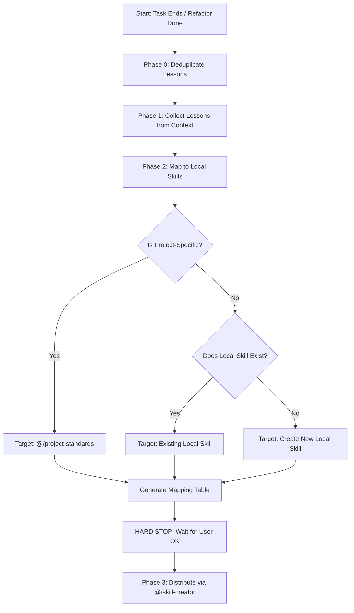

# Extract Lessons

## Overview Workflow

## Workflow

### Phase 0: Deduplicate Lessons

Before mapping or writing anything, scan your context and merge equivalent or overlapping lessons to prevent contaminating the skills database with redundant rules.

**Examples:**
- "Always validate null variables" + "Check undefined objects before accessing properties"  
  → **Merged:** "Validate values and check for undefined/null before property access to avoid runtime crashes."

### Phase 1: Collect Lessons

Scan all accessible conversation context, artifacts, tasks, scratchpads, plans, and walkthroughs for:

| Source | Example | Target Category |
| :--- | :--- | :--- |
| **User corrections** | "That border is not pixel-art" | UI/Aesthetics standards |
| **Bugs fixed** | `p.moves.some` is undefined | Data/Validation safety |
| **Workarounds discovered** | SASS capitalization collision resolved | Build/Styling integration |
| **Infrastructure issues** | Vite proxy mismatch, port busy | Local environment setup |
| **Repeated patterns** | Vue `computed` vs `ref` optimization | Reactive architecture |
| **Aesthetic feedback** | "Use Glassmorphism for panels" | Visual UI/UX specification |

Produce a numbered **Lessons List** with concise, action-oriented one-line summaries.

### Phase 2: Map to Skills

For each consolidated lesson, determine the correct local target:

1. **Verify Local Path**: Inspect `.agents/skills/` to ensure the target skill resides in the local workspace. **NEVER map to or update global skills.** If the list of local skills cannot be obtained, stop and ask the user for the local skill inventory.
2. **Detect Target Language**: Detect the primary language of the target skill file based on the dominant language of its explanatory prose (>70% of non-code text).
3. **Decide the Target (Decision Matrix)**:
   - **Game mechanics, core architecture, styling/UI specs, or project assets** → `@/project-standards` (or its references).
   - **Generic programming patterns / tools** (e.g. Vue.ts, TypeScript, Git, Markdown) → Specific local skill (e.g., `@/vue-best-practices`, `@/safe-commit`).
   - **Uncovered generic patterns** (expected to recur in future tasks) → Mark for **new skill creation** (ONLY if expected to recur across multiple future tasks).
4. **Language Preservation**: Prepare updates in the target language detected. Do not mix languages.

Produce a **Mapping Table**:

| # | Lesson Summary | Target Local Skill / Path | Action (UPDATE/CREATE) | Target Language |
| :-| :------------- | :------------------------ | :--------------------- | :-------------- |
| 1 | Fix UI borders | `.agents/skills/project-standards/references/ui.md` | UPDATE | English |

> [!IMPORTANT]
> **MANDATORY VERIFICATION (HARD STOP):** Present the Lessons List and Mapping Table to the user. You MUST wait for their explicit approval before editing any files.

### Phase 3: Distribute

For each approved lesson in the mapping table:

#### UPDATE existing skill

1. **Mandatory Editor**: ALWAYS edit via the `@/skill-creator` instructions. Skip evaluation/benchmarking for simple updates. Never use a `browser_subagent`.
2. **Zero-Regression Rule**: Preserve all existing instructions. Trimming compatible text for "conciseness" is forbidden.
3. **Write concise additions**: Explain the **why** behind rules so the model understands the logic. Limit additions to 2-3 lines per lesson.
4. **Physical Size Limit**: If the projected size of `SKILL.md` exceeds 450 lines, move technical details/snippets to a reference file under `references/` and keep only a 2-line pointer in the main skill file.
5. **Synchronized Updates**: Ensure any corresponding tests, `references/`, or diagnostic scripts are updated in parity during the same turn.
6. **Language Preservation**: Write all explanatory prose in the exact target language detected. Do not mix languages within a single file.

#### CREATE new skill

1. **Mandatory Editor**: ALWAYS use the `@/skill-creator` workflow (init, edit, package).
2. **Triggering**: Write pushy descriptions detailing *what* the skill does and *when* to trigger.
3. **Avoid Skill Explosion**: Create a new skill ONLY if the pattern is generic and expected to recur across multiple future tasks. Otherwise, consolidate it into an existing skill.
4. **Architecture**: Keep `SKILL.md` under 450 lines, using references and scripts for dense data.

## Rules

- **Local Scope Only**: Update or create skills exclusively within the local `.agents/skills/` directory.
- **Zero-Regression Rule**: Never remove existing compatible lines or functionality during an update. Trimming for "conciseness" is forbidden if it removes distinct instructional value.
- **No duplication**: Before adding, search existing skills with `grep_search` to verify the information isn't already present.
- **Project-Standards Priority**: Any knowledge that is intrinsic to the game (mechanics, specific styles, logic, lore-based UI) MUST be directed to @/project-standards or its manuals. Other skills are only for generic technical or architectural patterns.
- **Language Preservation (Strict)**: ALWAYS respect the original language of the skill or documentation file being modified. It is strictly forbidden to mix languages. All explanatory, descriptive, or communicative prose must conform entirely to the document's original language.
