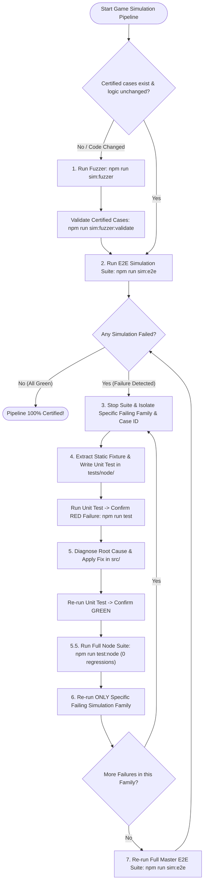

# game-simulation

Orchestrates the game simulation and E2E pipeline with a single goal: **make the
game match what `@pkmn/sim` (Pokemon Showdown) says is correct.** Simulations are
the source of truth. `src/` must conform to them, never the reverse.

---

## ⛔ HARD GATES & INVIOLABLE DEBUGGING LAWS (ZERO DEVIATION)

> These 4 Hard Gates are immutable boundaries. Every AI agent MUST strictly adhere to them:

1. **⛔ HARD GATE 1: PROHIBITION ON PLAYWRIGHT BEFORE VITEST RED-TO-GREEN CYCLE & NODE SUITE PASS**:
   - When ANY simulation or batch fails, it is **STRICTLY PROHIBITED** to modify `src/` or run Playwright commands as an exploratory fix attempt before completing Steps 4, 5, and 5.5.
   - The agent **MUST FIRST** create an isolated, static, and immutable unit test in `tests/node/battle/reproduce_case_xxx.test.ts`, run `npm run test`, and observe a deterministic failure in **RED**.
   - After diagnosing the root cause and seeing the Vitest test turn **GREEN**, the agent **MUST** run the full Node unit regression suite (`npm run test:node`) to ensure 0 regressions.
   - Only after all Node tests pass 100% GREEN is the agent authorized to proceed to browser-level Playwright execution (Step 6).

2. **⛔ HARD GATE 2: STRICT PROHIBITION ON MASTER SUITE (`npm run sim:e2e`) DURING DEBUGGING**:
   - It is **STRICTLY PROHIBITED** to execute `npm run sim:e2e` or master suites while diagnosing, fixing, or testing a failing batch or test file.
   - The agent MUST isolate and execute ONLY the single failing simulation family (e.g. `npm run sim:e2e:combat`, `npm run sim:e2e:gyms`).
   - `npm run sim:e2e` is strictly reserved for **Step 7 (Final Regression Pass)**, executed ONLY after the specific affected simulation file has completed with 100% PASS across all its cases.

3. **⛔ HARD GATE 3: `TEST_BATCH` IS BROWSER VERIFICATION (STEP 6), NEVER A UNIT TEST SUBSTITUTE**:
   - Running `$env:TEST_BATCH="21"; npm run sim:e2e:combat` is an optional browser-level verification tool belonging exclusively to **Step 6**.
   - It is **STRICTLY PROHIBITED** to treat `TEST_BATCH` as a replacement for the mandatory static Node unit test in `tests/node/`.

4. **⛔ HARD GATE 4: ZERO COMPATIBILITY FALLBACKS & SILENT CHOICE INTERVENTIONS**:
   - Replayer logic, workers, and battle runners MUST NOT intercept failed/disabled move choices with speculative fallbacks or automatic defaults.
   - All state desynchronizations, missing properties, or choice mismatches MUST fail fast and loudly (`throw new Error(...)`) so they can be repaired cleanly at the root cause.

---

## 🔴 MANDATORY SIMULATION DIRECTIVES (IMMUTABLE LAWS)

> These rules exist because they were violated in production and caused token waste or false reports. Every AI agent MUST strictly follow them without exception:

1. **Strict Timeout Constants Policy (5s Per-Action Max / Parameter-Configured Suite Timeouts)**:
   - **Per-Action Timeout (`MAX_PER_ACTION_TIMEOUT_MS = 5000`)**: Strictly 5 seconds per UI action, event wait (`battle-ready-for-input`), or turn reaction. A timeout here is NEVER a time shortage; it is 100% guaranteed to be an application bug in `src/`. Modifying, inflating, or wrapping this timeout in ad-hoc retry loops or dynamic multipliers is STRICTLY FORBIDDEN.
   - **Suite Total Timeout (`getSuiteTimeoutForBatch(turnCount?)`)**:
     - When replaying a certified batch with a known turn count (`turnCount > 0`), the test timeout MUST be pre-configured by parameter: `Math.max(MAX_SUITE_TOTAL_TIMEOUT_MS, turnCount * MAX_PER_ACTION_TIMEOUT_MS)`.
     - When a simulation does NOT have pre-generated fuzzer turns to replay (e.g. GTS, gym progression, daycare lifecycle, UI features), it MUST strictly use `MAX_SUITE_TOTAL_TIMEOUT_MS = 180000` (3 minutes statically).
     - Magic numbers or runtime multiplier guessing during test execution are strictly forbidden.
   - **IMMUTABLE LAW — A TIMEOUT IS NEVER A TIME SHORTAGE**: If an action or locator wait reaches 5s (`MAX_PER_ACTION_TIMEOUT_MS`), it is **100% GUARANTEED** to be an underlying structural bug, un-initialized store state, un-rendered component, or un-fulfilled reactive condition — **NEVER** a time shortage. EVERYTHING MUST ALWAYS BE EXCLUSIVELY DRIVEN BY TYPED PUBLIC EVENTS. The agent **MUST ALWAYS** find and fix the true root cause in state/reactivity/code, keeping all action timeouts strictly at 5s.

2. **Mandatory 100% Shared Action Array, Runner Code & Comprehensive History on Disk**:
   - Headless fuzzer replayers (`fuzzer_case_replayer.ts`) and Playwright E2E browser simulations MUST consume the LITERALLY SAME choices (`batchData.playerChoices` and `batchData.enemyChoices`) via the SAME shared class `ShowdownBattleRunner` (`src/logic/battle/helpers/showdownBattleRunner.ts`).
   - It is STRICTLY FORBIDDEN to implement parallel, fallback, or divergent choice arrays between headless replayers and browser simulations.
   - **Mandatory Comprehensive History Recording on Disk**: The fuzzer recorder MUST write complete, unambiguous state and decision metadata directly into `history` entries in `fuzzer_certified_cases.json` (`CertifiedBattleHistoryEntry`). This includes:
     - `p1ActiveUid` and `p2ActiveUid` (explicit active Pokémon UIDs per turn).
     - `p1MoveId` and `p2MoveId` (canonical move IDs executed).
     - `p1LockedMoveId` and `p2LockedMoveId` (locked or recharge move IDs when restricted by Showdown).
     - `p1Trapped` and `p2Trapped` (switching prohibition flags when trapped by ability or move).
     - `p1Volatiles` and `p2Volatiles` (critical active volatiles: `mustrecharge`, `lockedmove`, `twoturnmove`, `taunt`, `encore`, `substitute`).
     - `p1StatStages` and `p2StatStages` (stat boost stages: `atk`, `def`, `spa`, `spd`, `spe`, `accuracy`, `evasion`).
     - `p1Status` and `p2Status` (non-volatile statuses: `slp`, `psn`, `tox`, `par`, `brn`, `frz`).
     - `p1Hp` and `p2Hp` (exact HP snapshots post-turn for instant 1:1 math parity checks).
     - `weather`, `terrain`, `p1SideConditions`, `p2SideConditions` (field and hazard conditions).
     - `p1ForceSwitch` and `p2ForceSwitch` (explicit forced switch flags).
     - `p1Heal`, `p2Heal`, `p1PreHeal`, `p2PreHeal` (explicit Infinite Punching Bag healing and revival flags).
   - **Doubtful & Edge-Case State Logging**: Whenever any combat transition, state, or choice is doubtful, complex, or constrained (e.g. single-slot recharge moves, Outrage/Thrash locked moves, trapped states, forced switches, multi-turn charging moves), the fuzzer MUST record the exact decision and context with rich, self-documenting detail directly into the history on disk.
   - **Strict Runtime Parity Verification & Loud Desync Abort**: Replayers and Playwright simulators MUST consume these explicit history fields to verify active UIDs, enabled move slots, and locked states. If runtime game state diverges from the certified history on disk, execution MUST fail loudly and immediately with an explicit `[E2E-DESYNC]` error detailing the mismatch. Guessing choices, picking default moves, or using silent fallbacks is strictly prohibited.

3. **Event-Driven Architecture & Simulation as a Passive Joystick Mandate**:
   - **IMMUTABLE LAW — SIMULATION IS A PASSIVE JOYSTICK**: The game FSM is the SOLE authority for execution flow and input readiness. A simulation test script is strictly a passive joystick: it MUST ONLY react to explicit FSM readiness states (`WAIT_INPUT`, `SWITCH_MENU`, `over`, `REWARDS_PHASE`, `SEARCH_PHASE`) and public typed application events (`battle-ready-for-input`, `battle-forced-switch-required`).
   - **IMMUTABLE LAW — GENUINE UI INTERACTIONS & 100% ID-BASED LOCATORS**: Every interaction after test setup MUST be performed through the same visible official UI control used by a player: buttons, menus, modal open/close controls, movement controls, move/item selectors, switch controls, and exit controls. Every UI interaction MUST locate elements strictly and exclusively by explicit ID (`page.locator('#<id>')`, `page.locator('[id="<id>"]')`, or `:id`). Locating elements by text content, string matching, generic CSS class lists, or XPath is STRICTLY FORBIDDEN. Calling stores, composables, debug methods, DOM event dispatchers, or browser-side delegates to advance, confirm, close, choose, flee, move, or otherwise mutate gameplay is strictly forbidden.
   - **OFFICIAL KEYBOARD ACTIVATION**: If pointer hover or a tooltip keeps an ID-selected official control unstable, focus that control and press `Enter`. This is a genuine player interaction and is required instead of force-clicking, coordinate clicking, or dispatching a synthetic event.
   - **IMMUTABLE LAW — NPC COMBAT ONLY**: Trainer, rival, gym, and every other NPC encounter is combat-only. Its official UI MUST NOT offer fleeing, and a simulation MUST select the combat control only. A visible or executable NPC flee path is a game defect to fix in `src/`, never a test escape hatch.
   - **NARROW BATTLE-INITIALIZATION EXCEPTION**: The sole permitted state injection is the initialization of a battle that reproduces a current, fuzzer-certified case. It may establish only the initial combat scenario and MUST NOT perform any subsequent gameplay action or transition. The test must then drive the battle exclusively through official visible UI controls. Manual scenarios without a fuzzer-certified battle have no injection exception.
   - **CERTIFIED IPB HEALING EXCEPTION**: The Infinite Punching Bag healing cheat remains permitted exactly as recorded by the certified fuzzer turn flags (`p1Heal` / `p2Heal`) and only during its prescribed coverage phase. It is a deterministic parity instrument, not a UI substitute; it does not authorize internal calls for clicks, menus, modal closure, movement, choices, switching, fleeing, confirmation, or battle exit.
   - **NO AD-HOC HEURISTICS IN SIMULATION HELPERS**: It is **STRICTLY FORBIDDEN** to invent ad-hoc property checks (such as checking `hp === 0`), add manual poll loops, or alter helper functions like `waitForWaitInput` to force early returns. `waitForWaitInput` MUST purely observe FSM readiness states.
   - **PUBLIC-EVENT-ONLY SYNCHRONIZATION & ZERO-TIMER SYNC**: Every simulator wait MUST be armed before the UI action and resolved by a public, typed application event (specifically `battle-ready-for-input`, `battle-forced-switch-required`, a typed battle-flow completion event, or an explicit component event) with 100% zero-timer synchronization. `page.waitForFunction`, store/FSM property polling, DOM-state polling, `sleep`, `page.waitForTimeout`, turn counters, and low-level condition loops are strictly forbidden as synchronization mechanisms. A missing event is a source-code defect: add the typed event at the real transition boundary in `src/`, then consume it without mutating gameplay. It is **STRICTLY FORBIDDEN** to use retry-loop helpers (such as `clickResilient`) that attempt repeated clicks on UI elements while a turn or animation is in progress and the button is disabled.
   - **EVENTS FOLLOW REAL TRANSITIONS**: Tests must never dispatch, forge, or directly call an event to advance the game. A source event must be emitted only after the genuine FSM/UI transition and cleanup complete; a simulator is an observer that then clicks the next visible official control.
   - If a simulation times out waiting for input readiness, it indicates a real bug in `src/` or a missing FSM state transition event emission in game code. The agent MUST fix the bug cleanly at the source in `src/`, NEVER patch the simulation helper with ad-hoc heuristics.
   - It is STRICTLY FORBIDDEN to use `.catch(() => true)` or swallow errors during `page.evaluate()` or state checks. All errors MUST fail loudly immediately to expose state desynchronizations at their source.

4. **Mandatory Generic Root-Cause Verification & Absolute Zero-Fallback Protocol**:
   - BEFORE making or proposing any edits to `src/`, the agent MUST isolate and output the un-truncated trace or exact log line causing the error.
   - **MANDATORY PRE-FIX FALLBACK AUDIT**: Whenever investigating a bug or simulation failure, the agent MUST FIRST verify: *Are there any masking fallbacks (`||`, `??`, default assignments, or property derivations) in the execution path hiding the real root cause?* If any exist, the agent MUST REMOVE THEM FIRST so the system fails loudly with an explicit, traceable stack trace showing the true origin of the bug.
   - **ABSOLUTE PROHIBITION ON FALLBACKS & AUTO-CHOICE ADAPTERS**: It is STRICTLY FORBIDDEN to introduce compatibility adapters, silent fallbacks, default assignments (`||`, `??`), dummy derivations (e.g. deriving `species` from `name`/`id` or assigning dummy/default values), or swallowing errors (`.catch(() => true)` or silent catch blocks) to make tests pass quickly. In particular, it is STRICTLY PROHIBITED to modify `src/` to intercept invalid/disabled move choices or choice rejections and substitute them with fallback choices or automated agent calls.
   - **FALLBACKS ARE BUGS**: Any missing property, undefined value, missing choice, or unregistered constant is an empirical indicator of a missing implementation or data initialization bug upstream. It MUST NOT be "healed" or patched with fallbacks. If a fuzzer or test choice is rejected, the test script or choice generator is wrong and MUST be fixed at the source, while `src/` MUST fail fast and loudly (`throw new Error(...)`).
   - All error handling and data lookups MUST fail loudly with explicit descriptive errors (`throw new Error(...)`) when data or state is missing/corrupted, forcing the fix to be applied at the upstream source.

5. **Natural Battle Execution & Temporary Cheats Deactivation Law**:
   - Fuzzer battle execution MUST operate in two mandatory sequential phases:
     1. **Phase 1 (Cheat-Assisted Testing)**: While there are untested moves/abilities remaining in the batch (`hasUntestedItemsAfterTurn === true`), apply Infinite Punching Bag (IPB) healing cheats when HP drops to critical levels.
     2. **Phase 2 (Natural Unassisted Combat Completion)**: As soon as all moves/abilities in the batch have been certified (`hasUntestedItemsAfterTurn === false`), IPB cheats MUST be completely deactivated. The battle MUST continue executing naturally turn-by-turn until the battle ends organically (`simBattle.ended === true`).
   - It is STRICTLY FORBIDDEN to introduce artificial loop breaks, early returns, or synthetic truncations when testing finishes. Battles must always complete naturally to generate a clean, un-truncated choice stream for Playwright E2E replays.

6. **Sequential Suite Execution Law & Mandatory In-File Parallelism Mandate**:
   - **MANDATORY IN-FILE PARALLELISM**: The entire game architecture, store isolation, and SQLite state MUST work 100% flawlessly under full parallel worker execution within every simulation file.
   - **ABSOLUTE PROHIBITION ON FORCING SERIAL MODE (`mode: 'serial'`)**: Using `test.describe.configure({ mode: 'serial' })` is **STRICTLY FORBIDDEN** and is a direct indicator of broken state isolation, un-isolated global DB wipes, or improper test setup.
   - The script `scripts/e2e/run_sequential_simulations.ts` (`npm run sim:e2e`) exists solely to orchestrate separate `*.simulation.ts` files sequentially to avoid cross-suite dev server or multi-account transaction collisions. However, *within* any given simulation file, tests MUST execute under full Playwright worker parallel concurrency.
   - If parallel execution fails within a simulation file, the agent **MUST ALWAYS** find and fix the true root cause in `src/` or test setup (e.g. eliminating shared global DB resets or un-isolated state calls), NEVER mask it with serial mode or timeout inflation.

7. **Total DB Isolation Per Worker (No Collision Possible — Anti-Pattern Alert)**:
   - **IMMUTABLE LAW**: Each Playwright browser context (worker) runs against its own **completely isolated in-memory SQLite database**. There is zero shared DB state between parallel workers — collisions between workers at the database layer are architecturally impossible by design.
   - **WRONG DIAGNOSIS — UNIQUE USERNAMES AS A DB COLLISION WORKAROUND**: If tests fail in parallel and an agent adds unique per-worker usernames (`DEBUG_ADMIN_${workerIndex}_${Date.now()}`) to "fix" supposed DB collisions, that is **incorrect root cause analysis**. DB collisions between workers are architecturally impossible. The real bug is always structural elsewhere. Remove the workaround and find the actual bug. **Note**: Creating distinct usernames is perfectly valid when the scenario genuinely requires multiple different users (e.g. Player A trading with Player B, or testing profile-specific behaviors). The prohibition is only against using username uniqueness as a patch for a misdiagnosed collision problem.
   - **SOLE EXCEPTION — EXPLICIT SHARED-DB TRANSACTION TESTS**: The ONLY legitimate reason to share a DB user across parallel tests is when the test scenario explicitly requires cross-worker shared state (e.g. GTS buy/sell flows where Player A and Player B transact with each other). In all other cases, any username is valid — workers CANNOT interfere with each other's DB.

8. **Dedicated Simulation Port Law (Port 5174 Isolation)**:
   - All E2E simulations and Playwright test runners MUST strictly use port `5174` (`http://localhost:5174`), leaving port `5173` strictly reserved for interactive developer use.
   - When resetting ports before simulation runs, agents MUST execute `npx kill-port 5174` (it is STRICTLY FORBIDDEN to kill port `5173`).

9. **Mandatory Isolated Reproduction Test Mandate (RED-to-GREEN Unit/Integration Test Before src/ Fix)**:
   - **IMMUTABLE LAW — NO FIX WITHOUT RED REPRODUCTION TEST**: Whenever ANY E2E test, browser simulation, battle scenario, worker task, or feature execution fails anywhere across the entire project, the agent **MUST FIRST** create an isolated, self-contained unit or integration test in `tests/node/` reproducing the exact failing state and inputs.
   - **MANDATORY IMMUTABLE CASE EXTRACTION (ZERO DYNAMIC DEPENDENCY)**: The reproduction test **MUST EXTRACT AND INLINE THE FAILING CASE DATA** (or save it into a dedicated static fixture file under `tests/fixtures/battle/` or directly inside the test file). It is **STRICTLY FORBIDDEN** to query or search dynamically inside `fuzzer_certified_cases.json` by temporary case ID in permanent unit tests, because regenerating the fuzzer produces new IDs and seeds, which would break the unit test. The regression test MUST be 100% self-contained, static, and immutable.
   - **MANDATORY EXACT FUZZER STEPS REPLAY IN UNIT TESTS**: The unit/integration test MUST consume the extracted, static recorded steps, turn-by-turn choice streams (`step.p1Choice`, `step.p2Choice`), `seed`, teams, game actions, and history. These exact steps MUST be executed sequentially in the unit test to:
     1. **Reproduce the bug deterministically in RED** (`npx vitest run <test>` fails with the exact unhandled error/desync).
     2. **Empirically verify that the bug was 100% repaired in GREEN** once `src/` is fixed, confirming clean turn-by-turn execution and state parity.
   - **MANDATORY RED-TO-GREEN CYCLE**: The agent MUST run `npx vitest run <path_to_test>` and confirm that the test reproduces the failure in **RED** before touching or proposing any changes in `src/`.
   - Only after verifying the deterministic RED failure may the agent diagnose the root cause and implement the fix in `src/`.
   - The agent MUST re-run the unit/integration test to confirm that it turns **GREEN**.
   - The test MUST remain permanently in `tests/node/` as an immutable regression guard.
   - Speculative patching, guessing, or editing `src/` without first creating and confirming a failing reproduction test with the extracted fuzzer steps is **STRICTLY PROHIBITED**.

10. **Absolute Pokémon Legality Mandate in Fuzzers and Simulations**:
    - Every Pokémon generated or evaluated in fuzzers, battle runners, replayers, and E2E simulations MUST be 100% legal according to Pokémon Showdown canonical Gen 9 rules and the Poké Vicio Pokédex database.
    - It is **STRICTLY FORBIDDEN** to generate synthetic or illegal Pokémon (e.g. assigning non-native abilities like *Illuminate* or *Rough Skin* to Mew, assigning non-learnable moves, or assigning invalid genders).
    - All generated species must strictly use natural Showdown Dex abilities, biological genders matching species ratio rules, and valid learnsets across all fuzzers and simulators.
    - When testing an ability, move, or mechanic, the generator MUST dynamically select a canonical species from the Showdown Dex that naturally possesses that ability or move.
    - All generated teams MUST pass `PokemonLegalityValidator.assertTeamLegality` before generation and simulation execution.

11. **Inviolable PP Conservation and Replay Determinism Axiom**:
    - Because the Node fuzzer certifies battles to completion deterministically, a Pokémon in a fuzzer or E2E browser simulation can **NEVER** run out of PP or select an exhausted move unexpectedly unless desynchronized.
    - If a Pokémon in the fuzzer or browser simulation reaches a state with 0 PP or selects a move that is `disabled: true`, it is proof positive that a turn-count/cursor desynchronization occurred or that certified cheats/actions were misapplied.
    - It is **STRICTLY FORBIDDEN** to introduce runtime fallbacks that automatically pick another legal move or patch over the desynchronization. The engine MUST fail loudly and immediately (`throw new Error(...)`) with full context to diagnose and fix the root cause.

    **Examples of FORBIDDEN Patterns vs REQUIRED Fail-Loud Patterns:**

    *❌ Forbidden (Silent Fallback Assignment):*
    ```typescript
    // BAD: Silently assigning 'default' when choice is missing in a simulation run
    if (!choiceToExecute) {
      choiceToExecute = 'default';
    }
    ```
    *✅ Required (Generic Fail-Loud Error):*
    ```typescript
    // GOOD: Fail loudly when a required choice is missing from the certified choice stream
    if (!choiceToExecute) {
      throw new Error(`[ShowdownExecutor] Required choice for seat "${seatId}" is missing from certified choices array.`);
    }
    ```

    *❌ Forbidden (Silent Property Recovery / Derivation Fallback):*
    ```typescript
    // BAD: Deriving missing property from secondary fields or using fallback OR operator
    const species = target.species || target.name || target.id;
    ```
    *✅ Required (Strict Boundary Guard & Upstream Fix):*
    ```typescript
    // GOOD: Throw explicit descriptive error when required property is missing, then fix upstream initialization
    if (!target.species) {
      throw new Error(`[ShowdownBridge] Target object "${target.name}" (UID: ${target.uid}) has no species defined.`);
    }
    const species = target.species;
    ```

## 🔄 Canonical Simulation & Debugging Lifecycle Order (Immutable Step-by-Step Flow)

Every AI agent MUST follow this exact sequential order when running simulations, debugging failures, or verifying the codebase:

1. **Step 1: Fuzzer Execution & Regeneration** (`npm run sim:fuzzer`):
   - Execute the fuzzer whenever certified cases do not exist, or whenever battle engine logic (`src/logic/battle/`) has been created, modified, or refactored.
   - Validate that all terminal cases are certified clean with `npm run sim:fuzzer:validate`.

2. **Step 2: E2E Simulation Execution** (`npm run sim:e2e` or targeted family):
   - Execute the simulation suite to validate real UI, FSM, and game feature behavior.

3. **Step 3: Isolate Failing Family and Specific Case ID**:
   - If ANY simulation fails, immediately STOP running the entire suite.
   - Focus exclusively on the specific failing family (e.g. `sim:e2e:combat`, `sim:e2e:gyms`, `sim:e2e:gts`) and identify the exact failing case ID (`case-xxx`).

4. **Step 4: Create Isolated RED Reproduction Test**:
   - Extract the exact static case parameters (`seed`, `playerTeam`, `enemyTeam`, and turn-by-turn choice streams from `history`) into a static fixture file (`tests/fixtures/battle/case_xxx.json`) or directly inside a dedicated Vitest test file (`tests/node/battle/reproduce_case_xxx.test.ts`).
   - Run `npm run test` and verify that the test fails deterministically in **RED**.

5. **Step 5: Fix Root Cause in `src/` & Verify GREEN**:
   - Diagnose the true root cause in `src/` and apply the clean fix without fallbacks.
   - Re-run the reproduction test in Vitest to empirically demonstrate that it turns **GREEN**.

6. **Step 5.5: Full Node Unit Regression Check (`npm run test:node`)**:
   - Execute the entire Node unit test suite across all 126+ test files to confirm 100% GREEN and 0 regressions before touching browser simulations.

7. **Step 6: Re-run ONLY the Specific Failing Simulation in Playwright**:
   - Execute ONLY the specific failing simulator or family (NOT the entire E2E suite).
   - If another case fails in that family, repeat Steps 3 to 5.5 for that specific case.

8. **Step 7: Full E2E Master Regression Pass**:
   - Only after all issues in the failing family are resolved and passing, re-run the full master E2E suite (`npm run sim:e2e`) to verify 100% clean project-wide certification.

### 📊 Simulation & Debugging Lifecycle Flowchart



---

## 📁 Artifact Templates & Boilerplates

The skill provides standardized templates under `.agents/skills/game-simulation/templates/`:

1. **Progress Tracking Artifact Template** (`templates/simulation_progress_template.md`):
   - Used for creating and maintaining `simulation_progress.md` across the 10-step certification pipeline.
2. **Isolated Reproduction Test Template** (`templates/reproduction_test_template.ts`):
   - Standardized Vitest boilerplate to replay extracted static case data turn-by-turn with `@pkmn/sim` and `executeBattleTurn`.
3. **Static Case Fixture Template** (`templates/case_fixture_template.json`):
   - Canonical JSON format for extracted cases saved under `tests/fixtures/battle/`.

---

## 🛠️ Holistic Diagnosis & Zero-Fallback Guidelines

1. **Isolate Root Cause Trace**: Capture the exact failing log line or error boundary trace without truncation.
2. **Review DOX & Architecture**: Inspect `AGENTS.md` and module architecture to understand the intended design and contracts.
3. **Reproduce via Unit Test**: Create or update a minimal Node unit test reproducing the exact issue.
4. **Fix at Upstream Root Cause**: Apply the fix cleanly at the origin in `src/` without compatibility adapters or silent fallbacks.

- **Combat Replay Decision Contract**: Every Playwright simulation that enters combat, including UI/FSM regressions for items, switching, status, capture, weather, or battle exit, MUST initialize a current fuzzer-certified case and reproduce its immutable `history`, `playerChoices`, `enemyChoices`, seed, and recorded IPB flags through the shared `ShowdownBattleRunner`. Playwright is a visible-UI replay client, not a second decision maker. A UI workflow requiring a combat state that the current fuzzer does not cover MUST first be generated and certified by the fuzzer; it must never be replaced by a manually constructed combat or real-AI decision stream. This rule applies only to combat: non-combat simulations such as trade, purchase, save, or navigation use their own domain contracts.
- Core runner classes (`ShowdownBattleRunner`) MUST retain their clean single-responsibility contracts: resolving choice stream indices for certified fuzzer batches, while delegating readiness checking internally without cluttering call sites.

---

## Mandatory Progress Artifact

**Every simulation run MUST maintain a live internal artifact named `simulation_progress.md` (located in the brain directory) as the single source of truth for the current run, allowing resumption at any point without losing context. Simultaneously, a copy of this artifact MUST be mirrored in the repository at `scripts/e2e/results/simulation_progress_log_YYYYMMDD.md` (create both before the first command runs, and update/mirror after each meaningful step).**

### 🤖 Dynamic Simulation Table Generation Mandate
To ensure zero hardcoding and 100% accurate simulation counts, the agent **MUST ALWAYS** run:
```bash
npm run sim:e2e:table
```
This command dynamically scans all `*.simulation.ts` files under `scripts/e2e/`, counts the exact cases in each file, sorts them deterministically by complexity, and outputs the markdown table directly to be embedded in `simulation_progress.md`.

### Artifact structure

```markdown
# Simulation Run — <ISO date>
Session: <unique short id, e.g. last 6 chars of timestamp>

## Scope
<!-- what the user asked to simulate -->

## Status
Overall: IN_PROGRESS | COMPLETE | BLOCKED
Last action: <what was just done>
Resumed at: <step name> (only when resuming)

## Dynamic Simulation Table (Generated via `npm run sim:e2e:table`)
<!-- Embed output of `npm run sim:e2e:table` and update statuses dynamically -->
```

## Active Fix — <simulation name>
Root cause: ...
Files touched: ...
Attempts: N
Status: FIXING | PENDING_RERUN | PASS

## Applied Code Fixes & Structural Refactors (Commit Ledger)
| ID | Area / Component | Root Cause / Issue | Fix Applied | Files Touched |
|---|---|---|---|---|
| FIX-01 | ... | ... | ... | ... |

## Pending Simulations (not yet started)
<!-- simulations still in queue after the last failure -->

## Structural Blockers (user review required)
| Simulation | Why a design decision is needed |
|---|---|

## Critical Decisions
<!-- key design or architecture decisions made during this run -->

## Coverage Gaps Detected
| Gap | Suggested simulation type |
|---|---|
```

### Rules for the Progress Artifact

1. **Create before the first simulation command.** The internal `simulation_progress.md` artifact and its mirrored copy at `scripts/e2e/results/simulation_progress_log_YYYYMMDD.md` must exist before any `sim:*` or `sim:e2e:*` command is issued. Other `npm run` commands (lint, build, validate:types, etc.) do not count as simulation commands and do not require the artifact to exist first.
2. **Update and mirror after every step and fix (MANDATORY).** After each simulation pass/fail, after EACH fix applied to code or tests, after EACH file touched — update the internal `simulation_progress.md` artifact (setting `UserFacing: true` and appropriate metadata) and immediately overwrite/mirror it to `scripts/e2e/results/simulation_progress_log_YYYYMMDD.md`. It is strictly forbidden to defer or batch progress artifact updates.
3. **Mark resumption point.** On any interruption (user message, context limit, error), ensure the progress artifact reflects exactly where execution stopped and what is next, so a fresh agent can pick up without duplicating work.
4. **Resuming a run (Physical File Synchronization First).** Whenever starting, resuming, or continuing a simulation workflow, the agent MUST first look for the latest mirrored physical file `scripts/e2e/results/simulation_progress_log_<YYYYMMDD>.md` in the repository (sorting by date to find the most recent one). Even if an internal `simulation_progress.md` exists in the brain, the agent MUST prioritize the physical mirrored file's content to restore the execution state, simulation queue, and pending tasks. This prevents desynchronization when changing branches, repositories, or active agents. The agent MUST recreate/synchronize the brain's internal `simulation_progress.md` artifact from this physical repository file before executing any simulation command, ensuring both representations are in perfect parity.
5. **Final state.** When the run is complete, mark `Status: COMPLETE` and merge the artifact summary into the final `scripts/e2e/results/simulation_report_<timestamp>.md`.
6. **Strict Truthfulness in Test Results (No Premature PASS).** It is strictly forbidden to mark a test suite (e.g. `sim:e2e:combat`) as `PASS` in the simulation queue or progress log if any of its cases were skipped, filtered out, untested, or if the entire suite was not run to completion. A suite is only `PASS` when all of its cases/batches are executed and pass successfully with zero failures. If only specific cases were verified, keep the status as `IN_PROGRESS` or `PARTIAL_PASS` and document exactly which cases remain.
7. **No Searching for Outdated / Pre-Regeneration Case IDs.** Whenever `npm run sim:fuzzer` finishes or is regenerated, all case IDs and hashes are updated in `fuzzer_certified_cases.json`. It is STRICTLY FORBIDDEN to search for, trace, or run Playwright tests against stale case IDs from previous runs (e.g., `case-a6f13ae7994b`). Always read the newly generated `fuzzer_certified_cases.json` to obtain current case IDs before running isolated traces.
8. **MANDATORY APPLIED CODE FIXES TABLE & ABSOLUTE PROHIBITION ON PREMATURE SUITE STATEMENTS:** The progress artifact MUST maintain a dedicated `Applied Code Fixes & Structural Refactors (Commit Ledger)` table detailing every code fix, root cause, fix applied, and list of files touched. This table is an essential ledger for crafting clean commit messages. Simultaneously, artifacts MUST NEVER declare a test suite as `PASS` based on assumptions, partial runs, or prior execution states. Suite statuses MUST remain `IN_PROGRESS` or `PENDING RUN` until the suite completes with exit code 0 and empirical proof.
9. **CONTINUOUS LEDGER PRESERVATION LAW:** It is **STRICTLY FORBIDDEN** to delete, reset, clear, or truncate entries from the `Applied Code Fixes & Structural Refactors (Commit Ledger)` table in `simulation_progress.md` before an official `git commit` is made. All applied fixes since the last commit MUST be preserved continuously in the table. When many fixes accumulate, contiguous past fixes MAY be grouped into thematic range rows (e.g. `FIX-01..FIX-40` | `Grouped legacy fixes: battle FSM sync, worker safety, medicine actions...` | `Description...` | `Files touched...`), provided NO range or ID number is omitted or deleted.
10. **MANDATORY DISK FUZZER CASE SYNCHRONIZATION BEFORE CODE DIAGNOSIS**: Whenever a Playwright E2E simulation or replayer throws a desync, unexpected turn overflow, or step mismatch, the agent MUST FIRST verify if `scripts/e2e/results/fuzzer_certified_cases.json` is 100% up to date with the latest fuzzer logic by executing `npm run sim:fuzzer` BEFORE forming any diagnostic hypothesis or making edits to `src/` or simulation wrappers. Attempting to debug or patch runtime synchronization logic against stale or un-regenerated certified case artifacts on disk is STRICTLY FORBIDDEN.

## Event-Driven Core Simulation Mandate

The simulation infrastructure (Playwright, replayers, and deciders) must operate strictly under an **Event-Driven Architecture**. Timers, sleep/timeout polling loops, and turn-counting structures in the test automation files are strictly prohibited.

1. **Reactive Event Waiting & Zero-Timer Sync**: The simulation runner must only react to typed public events dispatched by the application (including `battle-ready-for-input`, `battle-forced-switch-required`, and typed lifecycle events such as battle-flow completion) with 100% zero-timer synchronization. It must arm its listener before the preceding visible UI action, must not poll stores/FSM/DOM states, and must not use arbitrary delays (`sleep`, `setTimeout`, `page.waitForTimeout`, or `page.waitForFunction`) to guess when a player action can be sent.
2. **Scripted Choice Separation**: The shared runner owns certified-choice parsing and resolution. The Playwright script may read its resulting action only to select the matching visible official control; it must never dispatch a store action, invoke a debug delegate, or synthesize a choice.
   - **Two-AI Boundary**: The fuzzer's scripted heuristic AI generates the exact legal certified choices and history; Playwright replays that evidence only. The complete real AI may be exercised by a dedicated non-Playwright diagnostic, but it is never a browser-combat decision source. No simulation may borrow, replace, omit, reorder, or mutate certified decisions to make either mode pass.
3. **Visible UI Execution**: Upon an action-ready event (`battle-ready-for-input` or `battle-forced-switch-required`), the simulation must click the official move, item, switch, confirmation, flee, modal, movement, or exit control. `window.__VITE_DEBUG__.executeScriptedAction()` and every equivalent browser-side action delegate are prohibited.
4. **Mandatory Event Timeout & Strict Limits (5s Per-Action / Configurable Suite Total Without Hardcoding)**: 
   - **Per-Action Limit**: After the `battle-ready-for-input` or `battle-forced-switch-required` event is dispatched, the simulation must consume it within **5 seconds maximum** (`MAX_PER_ACTION_TIMEOUT_MS = 5000`) through its visible official control. If 5 seconds pass without consumption, the application must throw a fatal simulation error (`[SIMULATION-FATAL]`).
   - **Suite Total Limit**: Suite total timeouts must be configurable per test suite (e.g. calculated dynamically based on batch volume and complexity) without arbitrary hardcoding. Any adjustment must be recorded in the generated simulation progress artifact and MUST NOT alter any per-action timeout (strictly 5s), readiness condition, test case, or FSM transition.
   - **ABSOLUTE PROHIBITION ON INCREASING INTERACTION TIMEOUTS:** It is strictly forbidden to increase event consumption timeouts beyond 5 seconds. A per-action timeout failure is NEVER caused by a lack of time; it is ALWAYS an empirical indicator of a bug in `src/` (such as early returns, unhandled state desyncs, or silent promise freezes). The underlying code bug in `src/` must be diagnosed and fixed—never mask it by inflating timeouts.
5. **Strict Mandatory ID & UID-Based Element Locators**: All E2E simulations, Playwright test scripts, and UI automations MUST interact with UI components, buttons, inputs, modals, tabs, and cards EXCLUSIVELY using their unique explicit identifiers (`#<id>`, `data-pokemon-uid="${uid}"`, or `data-item-id="${id}"`). Locating UI elements by text content (such as button labels, species names, nicknames, or strings), CSS class hierarchies, or XPath is STRICTLY FORBIDDEN to prevent desynchronization, translation errors, and font-rendering failures. All Vue components in `src/components/` MUST provide explicit `id` or `:id` attributes on all interactive controls.

---

## Test System Architecture

The project has **three testing layers**, each with a distinct role:

```
scripts/e2e/fuzzer/                   <- Layer 0: FUZZER (pure logic, @pkmn/sim)
    core/
        fuzzer_engine.ts              <- Main engine
        fuzzer_agent.ts               <- Decides moves for p1/p2
        fuzzer_mock_battle_store.ts   <- Headless Pinia battle store mock
        fuzzer_runner.ts              <- Native fuzzer runner (decoupled from Vitest)
    generators/
        fuzzer_team_generator.ts      <- Builds test batches
        fuzzer_item_generator.ts      <- Builds item test batches
    scenarios/
        fuzzer_ability_scenarios.ts   <- Scripted scenarios for specific abilities
        fuzzer_excluded_abilities.ts  <- List of excluded abilities
    runners/
        run_moves_fuzzer.ts           <- Native runner for moves
        run_abilities_fuzzer.ts       <- Native runner for abilities
        run_items_fuzzer.ts           <- Native runner for items
        fuzzer_case_replayer.ts       <- Replay specific cases step-by-step
        ensure_fuzzer_cases.ts        <- Ensures certified cases exist

tests/node/                           <- Layer 1: UNIT (pure Node.js, no browser)
    battle/         battleMath, showdownAdapter, pp logic, weather abilities...
    inventory/      item math, npc budgets...
    pokemon/        stats, generation, migrations...
    system/         economy, GTS, DB translation, backup validation...
    world/          spawn integrity, weather, maps...

tests/integration/battle/             <- Layer 2: INTEGRATION (Vitest + @pkmn/sim)
    showdown_integration.spec.ts
    showdown_item_sync.spec.ts
    showdown_bridge_bugs.spec.ts

scripts/e2e/                          <- Layer 3: Simulations (Playwright, real browser)
    e2e_helpers.ts                    <- Shared: login, battle input, FSM polling
    fuzzer/runners/ensure_fuzzer_cases.ts <- Guard: ensures fuzzer_certified_cases.json exists
    battle/
        battle_fsm_sync.sim.ts        <- Full multi-turn battle (consumes fuzzer output)
        battle_held_items.sim.ts      <- Item effects in combat (consumes fuzzer output)
        battle_weather_effects.sim.ts <- Weather / ability interactions
    gyms/
        gym_progression.sim.ts        <- Gym challenge -> badge
    gts/
        gts_transactions.sim.ts       <- Publish/buy trade cycle (dual-page)
    breeding/
        breeding_lifecycle.sim.ts     <- Deposit -> hatch cycle
    missions/
        daycare_missions.sim.ts       <- Mission completion flow
    save/
        save_shield_restrictions.sim.ts
```

### Fuzzer -> E2E Dependency Chain

```
run_moves_fuzzer.ts / run_abilities_fuzzer.ts / run_items_fuzzer.ts
  |  simulates battles deterministically using @pkmn/sim
  |  applies Infinite Punching Bag pattern (HP < 30% -> restore to 100%)
  |  embeds comprehensive metadata in history:
  |    { p1Choice, p2Choice, battleTurn, p1ActiveUid?, p2ActiveUid?, p1MoveId?, p2MoveId?, p1LockedMoveId?, p2LockedMoveId?, p1Trapped?, p2Trapped?, p1Volatiles?, p2Volatiles?, p1StatStages?, p2StatStages?, p1Status?, p2Status?, p1Hp?, p2Hp?, weather?, terrain?, p1SideConditions?, p2SideConditions?, p1ForceSwitch?, p2ForceSwitch?, p1Heal?, p2Heal?, p1PreHeal?, p2PreHeal? }
  |
  +---> fuzzer_certified_cases.json
            |-- section "battle" -> consumed by battle_fsm_sync.sim.ts
            +-- section "items"  -> consumed by battle_held_items.sim.ts
                 (E2E replays identical choices & cheats directly from history flags to mirror fuzzer state)
```

**Key rule:** The fuzzer runs `@pkmn/sim` as the authoritative engine. If the
game's `src/` behavior diverges from Showdown's output, `src/` is wrong. The
simulation is right.

### Infinite Punching Bag Pattern & Comprehensive History Schema

The fuzzer prevents premature battle endings by restoring HP when it drops below
30% of max. This keeps Pokemon alive long enough to cover all moves and abilities.
Restorations are saved directly as boolean flags (`p1Heal: true`, `p2Heal: true`, `p1PreHeal: true`, `p2PreHeal: true`) inside each turn's history entry (`history`), linked to `battleTurn`. Every history entry additionally embeds active Pokémon UIDs, move identifiers, locked move identifiers, trapped states, volatiles, stat stages, status conditions, HP snapshots, and field/side conditions. There are NO separate `cheats` arrays or index lookups. Both the fuzzer and the real browser read the history entry to execute and verify identical state transitions without guesswork or silent fallbacks.

### Objective-Driven Cooperative Fuzzer Heuristics

When a fuzzer certifies a move, ability, item, status cure, switch interaction,
or other mechanic, every scripted seat must prioritize **legal actions that
exercise that exact objective** as quickly as possible. The fuzzer is an active
coverage instrument, not a passive random battle. For example, when certifying a
poison-curing berry, the opposing seat must prioritize a legal poison-inflicting
move such as `toxic`; when certifying a type-resistance or type-boost item, the
relevant seat must prioritize a legal move of that type.

- These heuristics may shape the generated scenario and scripted AI priorities,
  but they must never inject outcomes, mutate a submitted choice, bypass a
  request, select an illegal move, or replace the certified history.
- The resulting accepted choices, seed, IPB flags, and full history remain the
  immutable evidence replayed by the browser UI.
- Real AI is not a Playwright combat decision source. Fuzzer-only deterministic
  heuristics generate legal objective-oriented decisions, then the browser
  reproduces the immutable certified result through visible UI controls.
- Certified fuzzers must use their direct deterministic heuristic AI, not the
  complete combat AI. The heuristic selects only legal objective-triggering
  choices through the ordinary Showdown request path.
- A `PASS` requires observed Showdown evidence (protocol effect or deterministic
  same-seed control difference); merely equipping or listing an item is never
  coverage.

---

## npm Scripts Reference

| Script | What it runs |
|---|---|
| `test:node` | All `tests/node/**/*.test.ts` via native `node:test` |
| `test` | All unit + integration via Vitest |
| `sim:fuzzer` | Coverage fuzzer + item fuzzer (generates fuzzer_certified_cases.json) |
| `sim:e2e` | Dynamic sequential file-by-file execution of all `*.simulation.ts` under `scripts/e2e/` (halts on 1st error) |
| `sim:e2e:combat` | ensure_fuzzer_cases + battle simulations |
| `sim:e2e:combat:report` | Same, output redirected to `scripts/e2e/results/e2e_simulation_failures.json` |
| `sim:e2e:ai` | Only `scripts/e2e/battle/heuristic_ai.simulation.ts` |
| `sim:e2e:gyms` | Only `scripts/e2e/gyms/` |
| `sim:e2e:gts` | Only `scripts/e2e/gts/` |
| `sim:e2e:breeding` | Only `scripts/e2e/breeding/` |
| `sim:e2e:missions` | Only `scripts/e2e/missions/` |
| `sim:e2e:save` | Only `scripts/e2e/save/` |
| `sim:combat:all` | Fuzzers + all Playwright scenario simulations |
| `sim:combat:all:report` | All of the above -> `scripts/e2e/results/playwright_report.txt` |

### Filtering Individual Test Cases

Every simulation script must support a `TEST_CASE` (or equivalent) filter to
enable targeted re-runs. The E2E battle specs and fuzzer replayer support these env vars:

```bash
# For Playwright E2E Browser Simulation:
TEST_CASE=<case-id>                 # Run only this case (or comma-separated list) in battle_fsm_sync
TEST_CASE_ID=<case-id>              # Run only this case (or comma-separated list)
TEST_START_FROM_CASE_ID=<id>        # Start from this case onward
TEST_BATCH=<n>                      # Run only batch N (e.g. 1, 9, 17, 25)

# For Headless Debugging (Super Fast, 1-2 seconds, pure Node.js without browser):
TEST_CASE_ID=<case-id>              # Run the headless replayer for a case (or comma-separated list)
```

> [!CAUTION]
> **PROHIBITION OF -g / --grep IN PLAYWRIGHT:**
> It is strictly forbidden to use Playwright's `-g` or `--grep` flag to filter individual test cases (e.g., `npx playwright test -g "batch #10"`). Using `-g` can spawn misconfigured parallel test threads without properly initializing the batch's state variables. Always use the project's official environment variables (`TEST_BATCH`, `TEST_CASE_ID`, etc.) for isolated and controlled executions.

> [!IMPORTANT]
> **GOLDEN RULE OF TESTING PERFORMANCE:**
> 1. **ALWAYS PREFER HEADLESS REPLAY FIRST:** When verifying, debugging, or testing logic, HP parity, FSM transitions, or combat states, **NEVER** launch the browser with Playwright (`npm run sim:e2e:combat`) initially. Always use the official headless replayer:
>    ```bash
>    TEST_CASE_ID="case-47212c07bc5d" npm run sim:fuzzer:trace
>    ```
>    This script runs in pure Node.js and finishes in 1-2 seconds, whereas Playwright takes 30-40+ seconds per case by launching browser and Vite instances.
> 2. **MULTI-CASE FILTERING:** To execute a specific set of failing cases (e.g. 10 failing cases), pass them separated by commas:
>    ```bash
>    TEST_CASE_ID="case-47212c07bc5d,case-006487488a68,case-153adc178311" npm run sim:fuzzer:trace
>    ```
> 3. **RESERVE PLAYWRIGHT FOR FINAL REGRESSIONS:** Reserve Playwright browser simulations exclusively for validating final regressions (after cases pass in headless) or for testing visual/reactive UI behaviors (e.g. modals, GSAP animations, dragging elements).

### E2E Multi-Error Logging Mode (Mass-Debugging)

To analyze multiple E2E battle bugs simultaneously and identify patterns without early termination, run the E2E suite with the `CONTINUE_ON_ERROR=true` environment variable.

When `CONTINUE_ON_ERROR=true` is set:
1. Playwright tests intercept FSM/HP/parity errors, save them to the `scripts/e2e/results/e2e_failures/` directory, and exit the test block successfully.
2. This avoids triggering Playwright's `maxFailures: 1` setting, allowing all cases in the suite to execute.
3. At the end, the suite consolidates all failure data into `scripts/e2e/results/e2e_simulation_failures.json` and a readable summary in `scripts/e2e/results/failed_e2e_cases.txt`.

**Execution Command:**
```bash
$env:CONTINUE_ON_ERROR="true"; npm run sim:e2e:combat
```

**Design rule:** If a simulation is missing `TEST_CASE` or `TEST_CASE_ID` support, or does not support comma-separated lists, treat that as a design gap. Propose adding it and document the plan before implementing.

## Playwright Dependency & Environment Troubleshooting

If Playwright fails to run due to missing browsers, missing system libraries, or tools like `ffmpeg` (e.g., yielding errors like `Error: playwright needs to install...` or missing ffmpeg for video recordings), the agent MUST attempt to resolve it automatically by running:

```bash
npx playwright install --with-deps
```

This command installs the required browsers along with all system dependencies (including `ffmpeg`). If the installation fails due to permissions, the agent should ask the user to run it with appropriate privileges or use the `ask_permission` tool if applicable.

---

## Simulation Execution Workflow

> [!IMPORTANT]
> **Strict Sequential Execution Mandate:** NEVER run multiple simulation commands or test suites concurrently or in parallel. Each simulation command already utilizes multicore resources internally. Running two or more simulation commands at the same time will saturate the CPU and generate execution errors. Always wait for one simulation run to completely finish before starting another.

> [!IMPORTANT]
> **Mandatory State Synchronization:** Before running any scope determination or executing commands, the agent MUST inspect the repository's `scripts/e2e/results/` folder for the most recent `simulation_progress_log_<YYYYMMDD>.md` file. The agent MUST parse this physical file, recreate the internal `simulation_progress.md` artifact in the brain, and resume exactly from the last pending or in-progress simulation queue item. This synchronization is critical to preserve the simulation state across agent swaps or active branches.

> [!IMPORTANT]
> **Combat Simulation Execution Order Mandate (Save Combat for Last):** Because `sim:e2e:combat` is the longest, heaviest, and most time-consuming simulation suite, all non-combat domain suites (`gyms`, `gts`, `breeding`, `missions`, `save`, `ai`) MUST ALWAYS be executed first in the queue. `sim:e2e:combat` MUST be saved for the very end of the domain run right before the final cross-domain regression pass.

### Step 1 — Determine scope

| User intent | Command |
|---|---|
| Full game validation | `npm run sim:e2e` |
| Combat only | `npm run sim:e2e:combat` |
| Specific domain | `npm run sim:e2e:gyms`, `npm run sim:e2e:breeding`, etc. |
| Single failing simulation | `$env:TEST_CASE_ID="case-xxx"; npm run sim:e2e:combat` |

**Fuzzer rule:** The fuzzer (`sim:fuzzer`) ALWAYS performs a clean wipe of all previously generated fuzzer artifacts (`fuzzer_*.json`, `fuzzer_*.txt`, `fuzzer_certified_cases.json`) in `scripts/e2e/results/` before starting, ensuring execution starts 100% clean from scratch by default. `ensure_fuzzer_cases.ts` handles this clean wipe and triggers `npm run sim:fuzzer`.

**Mandatory Temporary Files Cleanup Mandate:** Before launching a full simulation run from scratch, the agent MUST explicitly execute a clean wipe of all temporary database and test artifact files (`rm -rf database/temp/imported.db scratch/test-results/ scratch/playwright_*.log`). This guarantees zero state corruption from stale databases or interrupted server reloads.

**Important Fuzzer Regeneration Rule:** Whenever the fuzzer runs and regenerates certified cases, all `TEST_CASE`, `TEST_CASE_ID`, and `TEST_START_FROM_CASE_ID` filters/environment variables are automatically invalidated and deleted inside `ensure_fuzzer_cases.ts`. This forces a complete E2E simulation run over all newly generated cases to identify any new regressions or bugs.

### Step 2 — Execute and capture output

Always redirect output to `scripts/e2e/results/` so results are preserved for analysis:

```bash
npm run sim:e2e:combat:report     # -> scripts/e2e/results/e2e_simulation_failures.json
npm run sim:combat:all:report     # -> scripts/e2e/results/playwright_report.txt
```

### Step 3 — On failure: the fix loop

```
DETECT failure or 1:1 parity bug between fuzzer and simulation
  |
INVOKE AUDIT SKILL: When debugging Showdown event desynchronizations, fuzzer vs simulation state
                    mismatches, or 1:1 logic bugs, ALWAYS load and follow the `@/audit-simulations`
                    skill (`.agents/skills/audit-simulations/SKILL.md`) to perform source code
                    comparison against `external/pokemon-showdown-code/` and run the two-stage test gate.
  |
ANALYZE: read the test carefully. Understand what game behavior it asserts.
  |
STUDY SHOWDOWN: Consult first the local Showdown source code in external/pokemon-showdown-code/
                to understand the exact logic, algorithms, state transitions, condition strings,
                and flow Showdown uses for this scenario. The local directory external/pokemon-showdown-code/
                is the MANDATORY SINGLE SOURCE OF TRUTH for Showdown behavior. Developers and AI agents
                MUST inspect it before implementing or repairing any combat logic, choice formatting,
                or state parsing. NEVER invent ad-hoc string sanitizers, custom condition rules, or assumptions.
  |
DIAGNOSE: locate the divergence in src/ (never in the test).
  |
REPRODUCE WITH UNIT TEST: Extract the failing case/context from the failed simulation
                          and write a minimal, reproducing unit test under tests/unit/
                          or tests/node/. Verify that the test fails as expected.
  |
CLASSIFY complexity:
  - Simple bug (wrong value, missing case, off-by-one) -> proceed to fix
  - Structural (requires design change) -> STOP, explain to user, propose plan
  |
FIX src/ to match what @pkmn/sim declares as correct.
  |
VALIDATE VIA UNIT TESTS: Run the new unit test (and all related unit/node tests)
                         to verify the fix works at the logic level before running
                         heavy browser simulations.
  |
RE-RUN only simulation X (use TEST_CASE filter or domain script).
  |
  +-- PASS -> continue with remaining simulations from where execution stopped
  +-- FAIL -> repeat fix loop (no retry limit for simple bugs)
```

> [!CAUTION]
> **MANDATORY: Verify the Fix in Isolation BEFORE Advancing or Re-Running the Full Suite.**
> After applying a fix to a failing simulation (e.g. `sim:e2e:gts`), you MUST re-run ONLY that specific domain simulation (`npm run sim:e2e:gts`) to confirm it passes in isolation. **It is STRICTLY FORBIDDEN to skip straight to `npm run sim:e2e` or the next domain suite without first confirming the fixed simulation passes on its own.** Re-running the full suite before individual validation is a waste of resources and masks whether the fix actually worked. The single-domain re-run is cheap; the full suite takes 25+ minutes. Always validate cheap first.

> [!WARNING]
> **THE COLLECTIVE SUCCESS RULE (ONE TEST PASSING DOES NOT MAKE A SUITE):**
> Just because a single simulation run or a specific test case passes successfully after applying a fix **DOES NOT mean the issue is resolved or that other tests will pass**. A local fix can easily destabilize other combat sequences or active states. Never mark a task as completed or report success based on a single case passing. You must continue running the entire simulation queue and the full combat E2E suite consecutively until **all tests in the suite pass together with zero failures**.

**Fuzzer Regeneration during Fix Loop (CRITICAL):** If at any point during the fix loop the fuzzer is run again (regenerating `fuzzer_certified_cases.json`), the specific `TEST_CASE` / `TEST_CASE_ID` you were debugging is **completely invalidated** (it no longer exists in the newly generated file). You **MUST NOT** attempt to re-run or filter by that old case ID. Instead, you must immediately run a full simulation (`npm run sim:e2e:combat`) to discover the new case mappings and verify the fix against the new suite.

**MANDATORY: Unit-Test First & Pre-Simulation Validation Rules**
1. **Never skip reproducing tests:** Whenever a simulation fails or a bug is reported, you MUST first create or update a unit test (or lightweight Node test) that successfully reproduces the failure BEFORE applying any fix to `src/`.
2. **Never run E2E simulations on untested code changes:** Any code edits in `src/` must first be validated by executing and passing the unit/integration tests (`npm run test` or specific file path test) BEFORE proposing or running any browser-based E2E Playwright simulations. This saves time and computational resources.

### Step 3.5 — Mandatory Final Full E2E Regression Pass (`npm run sim:e2e`)

After all individual simulation targets (`sim:e2e:combat`, `sim:e2e:ai`, `sim:e2e:gyms`, `sim:e2e:gts`, `sim:e2e:breeding`, `sim:e2e:missions`, `sim:e2e:save`) pass, you **MUST** run the full E2E suite (`npm run sim:e2e` or `npm run sim:combat:all`) once more across the entire repository to guarantee zero cross-domain regressions before declaring the run `COMPLETE`.

### Step 4 — Final report

Generate `scripts/e2e/results/simulation_report_<timestamp>.md`:

```markdown
# Simulation Run — <date>

## Summary
- Total: N tests | P passed | F failed | S skipped

## Failures Fixed
| Simulation | Root Cause | Fix Applied in src/ | Attempts |
|---|---|---|---|

## Failures Requiring User Review (structural)
| Simulation | Why a design decision is needed |

## Regressions Detected
| None / list |

## Fuzzer Coverage
- Moves tested: X/Y
- Items tested: X/Y
- Abilities tested: X/Y

## Coverage Gaps Detected
| Gap | Suggested simulation type |
```

Then summarize in chat with clear action options for the user.

---

## Rules for Modifying Tests vs. src/

### Allowed: modify E2E specs or fuzzers to...
- Add `console.log` or more descriptive error messages for debugging
- Add new fuzzer scenarios (new abilities, items, edge cases)
- Improve event emission and event subscription when a real synchronization defect is found; never increase timeouts or add FSM/store polling
- Add missing `TEST_CASE` / domain filter support
- Extend coverage without weakening any existing assertion

### FORBIDDEN: modify E2E specs or fuzzers to...
- Weaken or remove an assertion to make `src/` pass
- Skip or comment out a failing scenario
- Change an expected value to match incorrect `src/` behavior
- Add a `try/catch` that silences a desync or failure
- Add fallback values, default return objects, or recovery patches in `src/` or helper scripts (e.g. returning default coordinates, default objects, or fallback values when a sprite, item, move, UID, or asset lookup fails). Never write hasty patches to make tests pass quickly. If any data, asset, coordinate, or mapping is missing, IT IS A REAL BUG/ERROR IN DATA/DATASETS; it MUST throw an explicit error to fail loudly and force adding the missing asset/entry or fixing the data at the source.
- Bypass a state-parity check
- Use silent mock/patch workarounds in E2E tests, helper scripts, or test workers that automatically bypass, ignore, or rewrite choices when state, active combatants, or move selections desynchronize. The objective is never to finish simulations with fake patches/mocks, but to find and fix bugs in `src/` that prevent matching the fuzzer.
- Hardcode FSM state transitions or manually manipulate FSM state variables (such as forcing transitions to `WAIT_INPUT` or bypassing `SWITCH_MENU`/`PLAYER_FAINT_SEQ` when a Pokémon is healed/restored) to force E2E simulations or test replays to pass. The FSM must transition naturally and mirror the simulator's requests exactly.
- Increase, inflate, or relax timeouts (such as extending event timeouts beyond 5 seconds or Playwright wait timeouts) to mask a failure. Any timeout is strictly caused by a bug in application logic (`src/`), never by needing more time.
- Cancel or kill any running E2E simulation or background task autonomously without explicit user approval. Even if a run takes a long time, the agent must let it run and wait.
- Wipe, clear, or recursively delete the failures directory (`scratch/e2e_failures`) or E2E reports from previous runs if they contain diagnostic data that hasn't been analyzed or backed up yet.

**The simulation is law. src/ must conform.**

---

## Adding New Fuzzer Scenarios vs. New Playwright Specs

### Combat coverage gaps -> fuzzer first
Add scenarios to `scripts/e2e/fuzzer/scenarios/` (ability-scenarios, team-generator,
item-generator). The fuzzer validates them against `@pkmn/sim`. The E2E Playwright
specs consume the certified output automatically. This is the preferred path because
Showdown acts as the oracle.

### Non-combat coverage gaps -> propose, then implement
For new Playwright specs (breeding, GTS, missions, save, gyms):
1. Document the gap in the simulation report.
2. Propose a work plan to the user with the spec design.
3. Only implement after user approval.

---

## Detecting Future Simulation Gaps

Look for these signals:
1. New `src/` features with no corresponding simulation (check `scripts/e2e/` domain folders).
2. Untested moves, abilities, items, or mechanics in all fuzzer coverage and simulation report files (such as fuzzer_moves_coverage_report.json, fuzzer_abilities_coverage_report.json, fuzzer_items_coverage_report.json, or fuzzer_report.txt).
3. `// TODO` / `// test this` comments in `src/`.
4. Features covered only by unit tests but never exercised in a real browser session.
5. New npm scripts in `package.json` not linked to any simulation workflow.

Document all gaps in the simulation report under "Coverage Gaps Detected".

---

## Browser Debug Utilities

The E2E specs use `window.__VITE_DEBUG__` and `window.__VITE_DEBUG_STORE_RESOLVER__`
for read-only diagnostics only. They MUST NOT be used for synchronization polling or to perform
gameplay interactions. The only allowed mutation is the narrow, fuzzer-certified
battle-initialization exception above; all subsequent interaction must use the
official visible UI. See `@/project-browser-testing` and
`@/project-standards/references/qa/browser_testing_manual.md` for the full protocol.
