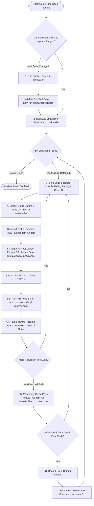

# Game Simulation Orchestrator

Orchestrates the game simulation, E2E pipeline, and Showdown 1:1 parity source code audit with a single goal: **make the game match what `@pkmn/sim` (Pokémon Showdown) says is correct.** Simulations and canonical Showdown code are the source of truth. `src/` must conform to them, never the reverse.

---

## 🚦 Paso 0: Protocolo de Diagnóstico y Reanudación de Estado (Physical First)

Whenever instructed to start, resume, or continue a simulation workflow (e.g. *"continua"*, *"sigue"*, *"reanudar"*, or after a context refresh):

### 1. Physical Log Synchronization First
- Locate the most recent physical progress log on disk:
  `scripts/e2e/results/simulation_progress_log_<YYYYMMDD>.md` (sorted by date).
- **Physical SSoT**: Prioritize this physical repository file over any memory state to restore execution progress, active suite status, and pending tasks.
- Synchronize/recreate the brain's internal `simulation_progress.md` artifact from this physical file before issuing any simulation command.

### 2. Checkpoint Inspection
- Read `scratch/e2e_checkpoints.json`.
- Identify:
  - `doc.master.suiteIndex` and `doc.master.suiteName`: current master sequence position.
  - `doc.suites[suiteKey].failedBatchIndex`: whether an intra-suite failure is actively being repaired.

### 3. Delimitation of Invocation Commands (Strict Semantics)

| Scenario | Command | Meaning & Rules |
|---|---|---|
| **A. Ordinary Resume** | `npm run sim:e2e` | Resumes from master cursor in `e2e_checkpoints.json`. **NEVER use `clean=true`**. |
| **B. Active Suite Resume** | `npm run sim:e2e filter=<suite>` | Resumes failing suite from `failedBatchIndex` (Step 6A). |
| **C. Suite Clean Pass (Paso 6B)** | `npm run sim:e2e filter=<suite> clean=true` | **STRICTLY RESERVED FOR REPAIRED SUITE**. Runs clean from case 1 in dual mode. |
| **D. Full Scratch Run** | `npm run sim:e2e clean=true` | Clears all checkpoints. **ONLY on explicit user request to start from zero**. |

> [!CAUTION]
> **PROHIBITION ON AD-HOC SUITE SELECTION DURING RESUME:**
> When the user says "continua" or "sigue", it is **STRICTLY FORBIDDEN** to pick arbitrary suites from `npm run sim:e2e:list` and run them with `clean=true`. Always run `npm run sim:e2e` natively to resume the master pipeline seamlessly.

---

## ⛔ 5 Hard Gates Inviolables (Zero Deviation)

1. **⛔ HARD GATE 1: NO PLAYWRIGHT BEFORE VITEST RED-TO-GREEN & NODE SUITE PASS**:
   - When ANY simulation fails, you **MUST FIRST** create an isolated static unit test in `tests/node/`, reproduce the failure in **RED**, fix `src/`, verify **GREEN**, and pass the entire Node regression suite (`npm run test:node`, 0 regressions).
   - Browser Playwright execution is forbidden until Step 6.
2. **⛔ HARD GATE 2: NO MASTER `npm run sim:e2e` DURING SINGLE-SUITE DEBUGGING**:
   - While investigating or fixing a suite, never run the master suite. Isolate execution strictly to the affected suite via `npm run sim:e2e filter=<suite_name>`.
3. **⛔ HARD GATE 3: `TEST_BATCH` IS BROWSER VERIFICATION (STEP 6), NEVER A UNIT TEST SUBSTITUTE**:
   - `TEST_BATCH` is an optional browser verification tool belonging exclusively to Step 6. It cannot replace the static Node reproduction test in `tests/node/`.
4. **⛔ HARD GATE 4: ZERO COMPATIBILITY FALLBACKS & SILENT CHOICE INTERVENTIONS**:
   - Replayer logic, workers, and battle runners MUST NOT intercept failed/disabled move choices with speculative fallbacks (`||`, `??`, default assignments). Fail fast and loudly (`throw new Error(...)`).
5. **⛔ HARD GATE 5: MANDATORY CLOSED-LOOP REPAIR & DUAL CLEAN ZERO PASS (PASO 6B)**:
   - A failure is an immediate trigger for the repair cycle: RED reproduction -> Fix `src/` -> GREEN -> Node regression -> Resume to end (6A) -> **Dual clean pass from zero on that suite (6B)**:
     1. `[6B 1/2 SQLite]`: Clean pass from Case #1 on SQLite.
     2. `[6B 2/2 PostgreSQL]`: Clean pass from Case #1 on PostgreSQL.
   - Advance to the next suite ONLY after 100% dual pass from case 1.

---

## 🔄 El Ciclo Canónico de 7 Pasos (Lifecycle Flow)

### Detailed Step Protocols
1. **Step 1: Fuzzer Execution & Regeneration** (`npm run sim:fuzzer` / `npm run sim:fuzzer:validate`):
   - Mandatory on clean runs or when battle engine logic (`src/logic/battle/`) changes.
2. **Step 2: E2E Simulation Execution** (`npm run sim:e2e`):
   - Executes dynamic sequential suites. Halts immediately on the first error.
3. **Step 3: Isolate Failing Suite and Case ID**:
   - Halt master run. Identify exact suite name, batch index, and case ID from failure logs.
4. **Step 4: Create Isolated RED Reproduction Test** (`tests/node/`):
   - Extract static case parameters (`seed`, teams, turn choice streams from `history`) into a static fixture or test file. Verify deterministic failure in **RED** via Vitest.
5. **Step 5: Fix Root Cause in `src/` & Harden Base Harness**:
   - Fix upstream root cause without fallbacks. Verify reproduction test turns **GREEN**.
6. **Step 5.5: Full Node Unit Regression Check** (`npm run test:node`):
   - Run entire Node test suite. Must report 100% GREEN (0 regressions) before browser testing.
7. **Step 6A: Fast-Forward Resume from Checkpoint**:
   - Run `npm run sim:e2e filter=<suite_name>` to resume from `failedBatchIndex` through end of suite.
8. **Step 6B: Mandatory Dual Clean Zero Intra-Suite Regression Pass**:
   - Run `npm run sim:e2e filter=<suite_name> clean=true`.
   - Must pass 100% from case 1 in both SQLite and PostgreSQL.
9. **Step 6C: Record Fix in Commit Ledger**:
   - Record the repaired bug in `simulation_progress.md` and mirror to physical log.
10. **Step 7: Full Master Resumption**:
    - Run `npm run sim:e2e` to advance to the next suite until all 58+ suites are certified.

---

## 📊 Progress Artifact Governance & Commit Ledger

Every simulation run maintains `simulation_progress.md` in the brain, mirrored to `scripts/e2e/results/simulation_progress_log_<YYYYMMDD>.md`:

### Dynamic Simulation Table
- Always generate via `npm run sim:e2e:table` (scans all `*.simulation.ts`, counts cases dynamically, sorts by complexity).

### Commit Ledger Mandates (Zero-Pollution)
- **Starts 100% Empty (0 rows)**: When initiating a simulation pass, the Commit Ledger MUST be empty.
- **Strictly Reserved for Active Simulation Failures**: Rows are added **IF AND ONLY IF** a simulation fails in this active run and is repaired through the 7-step cycle.
- **Prohibition on Historical Pollution**: Backfilling, pre-populating, or copying past manual features or bugs into the Commit Ledger is **STRICTLY FORBIDDEN**.
- **Preserved Intra-Run**: Once recorded after Step 6B, entries are preserved throughout the run until the final commit.

---

## 🔍 1:1 Showdown Parity Audit Tool (`npm run sim:audit`)

The parity audit compares canonical Pokémon Showdown source code in `external/pokemon-showdown-code/` against `src/` to detect and resolve real behavioral divergences (without fabricating false positives or using fallbacks):

### Audit Methodology
- **Diagnostic Suite**: Run `npm run sim:audit` (`scripts/maintenance/audit_showdown/run_audit_suite.ts`) to scan automated violations in tokens, FSM states, boosts, and formulas.
- **Two-Stage Mandate**:
  1. *Stage 1 (Investigation)*: Line-by-line inspection until listing ≥20 concrete suspects (*"Showdown does X but src/ does Y"*).
  2. *Stage 2 (RED Confirmation)*: Write and run a test for each suspect in `tests/unit/battle/parity/`. If it passes in GREEN on the first run, it is NOT a bug (discard). If it fails in **RED**, catalog in the 1:1 Master Table.
- **Absolute Prohibitions**: Zero cataloging without prior RED failure, strict prohibition on inventing bugs to fill quotas, prohibition on fallbacks (`||`, `??`), and zero naked strings for finite domains.
- Consult the full guide in [showdown_parity_audit_guide.md](./references/showdown_parity_audit_guide.md).

---

## 🏛️ Core Directives & Invariants

- **Strict 10s per Action Limit (`MAX_PER_ACTION_TIMEOUT_MS = 10000`)**: Input response window strictly capped at 10s. A timeout is NEVER a time shortage; it is an empirical bug in `src/`. Engine turn processing (`isProcessing.value`) resets inactivity watchdog.
- **Passive Joystick Law & 100% ID/UID Locators**: Simulators only react to explicit FSM readiness states. All elements located strictly by `#<id>` or `data-pokemon-uid="${uid}"`. Text/regex matching is forbidden. Official keyboard activation (`Enter`).
- **Typed Event Synchronization & Zero-Timers**: Timers (`setTimeout`, `sleep`) forbidden in UI. Synced exclusively via typed events (`battle-ready-for-input`, `GAME_UI_EVENTS`) coordinated with GSAP `onComplete`.
- **Universal GSAP Acceleration at 100x**: `gsap.globalTimeline.timeScale(100)` enforced in simulations.
- **Multi-Engine Parity & Serial Execution**: Dual driver model (SQLite in-memory WASM + PostgreSQL Docker). Drivers execute strictly in series: `[1/2 SQLite]` then `[2/2 PostgreSQL]`.
- **Port 5174 Isolation**: E2E simulations strictly use port 5174 (`npx kill-port 5174`).
- **Proactive Docker Auto-Start**: Automatically starts Docker if stopped when PostgreSQL runs.
- **Prohibition on Tautological Mocking**: Never mock the subsystem under test (`showdownWorkerClient.ts`, `@pkmn/sim`). Real engine parity is mandatory.
- **No-Test Mandate for Documentation**: Strictly forbidden to run `test` or `sim:e2e` when editing `.md` or skills. Use only `npm run audit:md`.

---

## 📚 Specialized Reference Modules Index (`references/`)

To consult complete technical schemas, command tables, and in-depth architectures without abbreviation or mechanical loss:

| Reference Module | Content & Governance | Link |
|---|---|---|
| **Directives & Invariants** | Timeout caps, passive joystick, `#id`/UID locators, `history` schema, Showdown legality, PP conservation, flee rules, visual `.toBeVisible()` assertions. | [simulation_directives_and_invariants.md](./references/simulation_directives_and_invariants.md) |
| **Fuzzer Architecture** | Layer 0 fuzzer, dependency tree, IPB lifecycle, cooperative heuristics, per-worker page pool, and 7-pillar reset standard (`WorkerSessionPool`). | [fuzzer_architecture_and_heuristics.md](./references/fuzzer_architecture_and_heuristics.md) |
| **CLI & Troubleshooting** | Complete NPM scripts dictionary (Layers 0–3), case filters (`TEST_CASE_ID`, `TEST_BATCH`), headless fast path, mass debugging, Docker auto-start, port 5174. | [cli_and_troubleshooting.md](./references/cli_and_troubleshooting.md) |
| **Testing Standards** | 3-tier protocol, anti-tautological mocking law, no-test mandate for docs, adaptive concurrency, test taxonomy, anti-fragmentation law, de-JSDOMization, GSAP kinematics. | [simulation_testing_standards.md](./references/simulation_testing_standards.md) |
| **Showdown Parity Audit** | Line-by-line comparison methodology with `external/pokemon-showdown-code/`, two-stage mandate (≥20 suspects -> RED confirmation), `npm run sim:audit` diagnostic suite, master bug table, and checklist. | [showdown_parity_audit_guide.md](./references/showdown_parity_audit_guide.md) |
