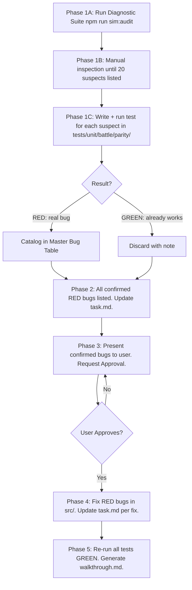

# Showdown 1:1 Parity Source Code Audit Guide

> **Scope & Authority**: This reference document governs the source code comparison methodology between official Pokémon Showdown source code in `external/pokemon-showdown-code/` and the project codebase (`src/`). Its purpose is finding and resolving **REAL** parity divergences — never inventing them.
>
> 🛑 **Parent Skill**: [game-simulation](../SKILL.md)

---

## 1. Absolute Prohibitions — Unrecoverable Errors

### PROHIBITION 1 — NEVER catalog a bug without a RED-failing test first
- A suspected divergence is **NOT a bug** until a unit test written for it **fails RED** when run with `npx vitest run`.
- The test must directly validate the **exact behavior** described in the Showdown canonical code — not a trivial assertion that passes for any input.
- If a test passes GREEN on the first run (before any `src/` modification), the behavior is **already correctly implemented**. It is NOT a bug. Do not catalog it.
- **NEVER** pre-catalog bugs based on suspicion and mark them GREEN "because the test passed". That is fabricating bugs.

### PROHIBITION 2 — NEVER fabricate bugs to fill a quota or mask errors with fallbacks
- There is **NO minimum quota** of bugs per audit run.
- It is **STRICTLY FORBIDDEN** to implement fallback values, default object returns, silent recovery adapters, or runtime auto-choice fallbacks when a missing property, asset, sprite, disabled move, or mapping error occurs. Intercepting choice rejections in `src/` to substitute default moves or call fallback agents is STRICTLY PROHIBITED. A missing value, coordinate, or invalid choice is a defect that MUST fail fast and loudly (`throw new Error(...)`). Adding a fallback to "make the build pass" or "make the test pass" masks bugs and is considered deliberate sabotage of system integrity.
- If the diagnostic suite and manual comparison find **0 real divergences**, the correct and honest output is:
  > *"✅ Full audit complete: 0 real divergences found. The codebase is in 1:1 parity with Pokémon Showdown."*
- Inventing entries, splitting trivially, or cataloging already-resolved behavior to look productive is **STRICTLY FORBIDDEN** and constitutes deliberate deception.

### PROHIBITION 2b — NEVER introduce or tolerate naked `string` for finite domain values
- It is **STRICTLY FORBIDDEN** to introduce or leave any field, parameter, or variable typed as `string` (or `string[]`) when its value belongs to a finite, known domain (e.g., Pokémon types, natures, weather mechanics, NPC archetypes, move categories, status effects, obtained methods).
- Every such domain MUST have a strict TypeScript type declared as a union type or derived via `as const` + `keyof` / `(typeof ARRAY)[number]`, and used at every call site. Passing the wrong domain value MUST produce a TypeScript compile error — if it doesn't, the type is wrong and must be fixed.
- During any audit, whenever a `string` field is found where a finite domain applies, it MUST be flagged as a type-safety defect and fixed by declaring the proper domain type, never by widening or adding `| string` to suppress errors.

### PROHIBITION 3 — NEVER overwrite `implementation_plan.md` or `task.md` with partial content
- It is **STRICTLY FORBIDDEN** to call `write_to_file` with `Overwrite: true` on these files if the new content does not contain ALL previously cataloged REAL bugs (`BUG-001` onwards).
- Before any write, read the current file in full with `view_file`.
- A bug remains in the plan until its test passes GREEN and is explicitly marked `FIXED ✅`.
- When adding new bugs: use append operations — NEVER replace the entire file with a partial subset.

### PROHIBITION 4 — NEVER skip updating `task.md` after each work phase
- After finishing any phase (test creation, cataloging, fixes), the agent **MUST IMMEDIATELY** update `task.md`.
- `task.md` uses: `[ ]` pending, `[/]` in progress, `[x]` completed.

### PROHIBITION 5 — NEVER truncate fuzzer battles artificially or maintain permanent cheats
- Fuzzer battles MUST run in two distinct phases: (1) Cheat-assisted testing (IPB) while moves/abilities are untested, followed immediately by (2) Natural unassisted combat completion as soon as all items in the batch are certified `PASS`.
- It is **STRICTLY FORBIDDEN** to introduce artificial `break` statements, early loop exits, or synthetic truncations when testing finishes.
- Cheats MUST be turned off once testing completes, and the battle MUST execute turn-by-turn naturally until `battle.ended === true` to produce clean, complete choice streams for Playwright E2E browser replays.

### PROHIBITION 6 — NEVER reconstruct lost content from scratch without reading the transcript first
- If content is lost, the MANDATORY recovery path is:
  `<appDataDir>/brain/<conversation-id>/.system_generated/logs/transcript.jsonl`

---

## 2. The Two-Stage Mandate: Investigate ≥20, Confirm with Tests

The audit has two distinct, sequential stages:

### Stage 1 — INVESTIGATE ≥20 suspects (mandatory depth)
- The agent MUST study at least **20 distinct candidate areas** through manual line-by-line comparison between `external/pokemon-showdown-code/` and `src/`. This is non-negotiable — it exists to force thorough inspection and prevent lazy single-bug reports.
- For each candidate, articulate the suspicion in one sentence:
  > *"Showdown does X at `external/sim/field.ts#L220` but src/ appears to do Y instead at `src/logic/battle/battleMath.ts#L180`."*
- A list of ≥20 suspects is the output of Stage 1. These are **unconfirmed** — they are hypotheses only.

### Stage 2 — CONFIRM each suspect with a test (gate to bug catalog)
For each of the ≥20 suspects, write a test and run it:

```
SUSPECT (from Stage 1)
       ↓
Add test describe block in tests/unit/battle/parity/
       ↓
npx vitest run tests/unit/battle/parity/
       ↓
RED (test fails)    ──→ Confirmed real bug → Catalog it
GREEN (test passes) ──→ Already working    → Discard. Do NOT catalog.
```

> [!IMPORTANT]
> **Domain File Placement for Parity Tests**:
> Do NOT create isolated single-bug `.spec.ts` files. Always append tests to the appropriate domain file in `tests/unit/battle/parity/`:
> - `showdown_protocol_tokens.spec.ts` (token parsing)
> - `showdown_volatiles_and_status.spec.ts` (status/volatiles)
> - `showdown_field_weather_terrain.spec.ts` (field/hazards/weather)
> - `showdown_stats_and_boosts.spec.ts` (stats/boosts/teras/megas)
> - `showdown_turn_flow_and_switches.spec.ts` (switches/turn order/items)
> - `showdown_bridge_historical_fixes.spec.ts` (bridge historical regressions)

The number of cataloged bugs = number of suspects that fail RED. This may be 0, 5, 10, or 20. All are valid outcomes depending on what the code actually shows.

---

## 3. Mandatory Source Inspection Procedure

Before writing any test, the agent MUST:
1. Read the **canonical Showdown behavior** in `external/pokemon-showdown-code/` for the suspected area.
2. Read the **project implementation** in `src/` for the same area.
3. Identify a **specific, concrete behavioral difference** — not naming, not comments, not style.
4. Articulate: *"Showdown does X but src/ does Y instead."*

Only after step 4 may the agent write a test.

### What counts as a real divergence
- A formula produces a **different numeric result** (wrong multiplier, wrong floor/ceil, missing factor).
- A Showdown protocol token or event is **silently ignored** in `src/`.
- A status/ability/item effect is **applied in the wrong order or missing entirely**.
- An FSM state transition in Showdown has **no equivalent** in `src/`.

### What does NOT count as a divergence
- `src/` already correctly implements the Showdown behavior (even if named differently).
- A test passes GREEN without code changes — the feature works.
- Code style, naming, or architectural differences that produce **identical results**.
- Behaviors confirmed working by the diagnostic suite tool outputs.

### Writing tests that actually detect bugs
- **Good parity test**: Calls the actual `src/` function under exact conditions where Showdown diverges, asserts the expected Showdown result explicitly (`expect(result).toBe(expectedShowdownValue)`), and fails RED before any fix.
- **Bad (useless) parity test**: Asserts loose conditions (`toBeGreaterThan(0)`), calls stubs or mocks instead of real `src/` logic, checks only that a function exists, or passes GREEN before any code change.

---

## 4. Mandatory Diagnostic Suite (`npm run sim:audit`)

```bash
npm run sim:audit
```

- Executes the full diagnostic scanner (`scripts/maintenance/audit_showdown/run_audit_suite.ts`).
- **If the suite reports violations** (non-empty arrays): each violation is a candidate. Write a test, confirm RED, then catalog.
- **If the suite reports zeros**: proceed to targeted manual comparison. If no RED-failing tests emerge: report 0 bugs found — that is correct and honest behavior.
- Diagnostic suite outputs are **secondary assistants** — they narrow the search space but do not constitute confirmed bugs by themselves.

---

## 5. Smart Bug Grouping Mandate

If multiple instances of the same root cause appear across different files (e.g., stat stage clamping in `battleMath.ts` AND `moveCalculator.ts`), **group them into ONE bug entry** with one unified test and fix. Splitting a single conceptual root cause into multiple entries to inflate counts is strictly forbidden.

---

## 6. 5-Step Deep Audit & Approval Workflow



### Phase Details
- **Phase 1**: Run `npm run sim:audit`, inspect `external/` vs `src/` to collect ≥20 suspects, write a test for each in `tests/unit/battle/parity/`, run with `npx vitest run`.
- **Phase 2**: Catalog ONLY suspects that fail RED into the Master 1:1 Bug Table. If 0 fail RED, report 0 divergences honestly.
- **Phase 3**: Present confirmed RED bugs to the user and **WAIT for explicit approval** before modifying any code in `src/`.
- **Phase 4**: Fix confirmed RED bugs in `src/`. Update `task.md` after each fix.
- **Phase 5**: Verify all dedicated tests turn GREEN, run full Node regression suite (`npm run test:node`), and generate `walkthrough.md`.

---

## 7. Mandatory Structure of the Cumulative Master 1:1 Bug Table

| Bug ID | Severity | Status | Canonical Showdown Code (`external/`) | Project File (`src/`) | Logic Discrepancy (confirmed by RED test) | Test File | Fix / State |
| :--- | :--- | :--- | :--- | :--- | :--- | :--- | :--- |
| `BUG-001` | `HIGH` | ✅ **GREEN** | `sim/sim/battle-stream.ts#L45` | `src/logic/battle/showdownBridgeCore.ts#L20` | Showdown does X, src/ does Y — confirmed RED | `tests/unit/battle/parity/showdown_protocol_tokens.spec.ts` | **FIXED**: explanation |
| `BUG-002` | `HIGH` | ❌ **RED** | `sim/sim/field.ts#L220` | `src/logic/battle/showdownBridgeField.ts#L220` | Showdown does X, src/ does Y — confirmed RED | `tests/unit/battle/parity/showdown_field_weather_terrain.spec.ts` | **PENDING**: solution |

---

## 8. Mandatory Audit Checklist

Before declaring any audit task completed, verify:
- [ ] Was the diagnostic suite `npm run sim:audit` run in Phase 1?
- [ ] Were `implementation_plan.md` and `task.md` read in full with `view_file` before any modification?
- [ ] **Stage 1**: Were at least **20 distinct candidate areas** investigated through manual line-by-line comparison between `external/` and `src/`?
- [ ] For EACH suspect: was the suspicion articulated as one concrete sentence before writing the test?
- [ ] **Stage 2**: Was a test written and run for EACH of the ≥20 suspects?
- [ ] Were GREEN-on-first-run tests explicitly **excluded** from the bug catalog?
- [ ] Was each cataloged bug confirmed by a RED-failing test result?
- [ ] Was the final summary reported honestly (e.g. `"Investigué N áreas. X bugs reales confirmados."`)?
- [ ] Were related root-cause bugs grouped into a single entry (smart grouping)?
- [ ] Was explicit user approval obtained before modifying `src/`?
- [ ] Did all dedicated tests pass GREEN after the fix?
- [ ] Was the full Node regression suite (`npm run test:node`) run to verify 0 regressions?
- [ ] Was the official `walkthrough.md` artifact generated after completing Phase 5?

---

## 9. Architectural Parity & Zero-Fallback Mandates

- **Fuzzer and Simulations Share Exact Same Code**: Headless fuzzer replayers (`fuzzer_case_replayer.ts`) and Playwright E2E browser simulations MUST import and execute the identical shared modules (`showdownBattleRunner.ts`).
- **Preserve & Audit Missing Game Animations & Visual FX**: Poké Vicio is a visual player driven by Showdown logs. It is strictly forbidden to disable or skip GSAP animations solely to make tests pass faster.
- **Zero-Fallback & No Hasty Patches**: Never prioritize speed over correctness. Showdown produces all valid choices and requests; if a choice is rejected, it indicates a state desynchronization or parsing defect. Diagnose and fix the root cause at the source.
