# Battle Mechanics Manual (Poké Vicio)

This manual documents the internal workings of the battle engine, focusing on logic, state machines, and procedural rules.

> [!NOTE]
> All mathematical formulas (Damage, Escape, Stats) have been centralized in the [Game Formulas Manual](../core/game_formulas_manual.md).

## 🏛️ Architecture: Seats vs. Team Slots

To support future expansions (Double Battles) and maintain deterministic transitions, the engine distinguishes between **Physical Positions (Seats)** and **Data Participants (Team Slots)**.

### 1. Seats (Physical Positions)

A **Seat** is a fixed position on the battlefield where a Pokémon is rendered and its interface is synchronized. The engine supports 4 seats:

- **Seat 1 (Player Side)**: Primary active position for the **Player**.
- **Seat 2 (Enemy Side)**: Primary active position for the **Enemy 1**.
- **Seat 3 (Player Side)**: Position for the **Ally** (active in 2vs2).
- **Seat 4 (Enemy Side)**: Position for the **Enemy 2** (active in 2vs2).

**Behavior & Visibility Rules:**

- **Current Support**: Currently, the game only supports 1v1 (Seat 1 vs Seat 2). Seats 3 and 4 are reserved for future 2vs2 development.
- **Empty State**: A seat is **Empty** if there is no active Pokémon from its associated Team Slot.
- **Selective Suppression (Pokémon & FX Only)**: If a seat is empty, only the **Pokémon sprite, its shadow, and associated visual effects** (Status particles, specific auras, or temporary filters) MUST be hidden.
- **Object Persistence**: Non-Pokémon elements (e.g., Poké Balls, energy beams, projectiles, field items) are **NOT** affected by seat-based invisibility. They must follow their own animation lifecycle regardless of seat occupancy.
- **Master Signal for HUDs**: Seat occupancy acts as the **trigger** for Combat HUD entry/exit animations, but the HUDs manage their own visibility independently of the Pokémon's suppression flag.
  - `Seat != Null` ➔ HUD triggers Entry animation.
  - `Seat == Null` ➔ HUD triggers Exit animation.

### 2. Team Slots (Data Participants)

Each Seat has an associated **Team Slot** that contains the party data for that participant.

- **Participant Link**: Each active participant (Player, Ally, Enemy 1, Enemy 2) occupies a seat and brings their own Team Slot.
- **Capacity**: A Team Slot can contain more than one Pokémon, with a **maximum of 6**.
- **Inactivity**: If a Team Slot is empty, it means there is no participant playing in that seat.
- **Wild Encounters**: Wild Pokémon are also considered participants and occupy an Enemy Team Slot (usually with 1 member).

### 3. Transition Matrix

| Event | Action on Seat | Action on Team Data |
| :--- | :--- | :--- |
| **New Battle** | `VACATE_ALL_SEATS` | Populate Team Slots |
| **Mid-Battle Switch** | `POKEMON_RECALL` -> `POKEMON_CALL` | No change to Team data |

---

## 🌪️ Weather Influence

### 1. Atmospheric Synchronization & Integrity Protocol

To prevent desynchronization between the Map's visual weather and the Combat Engine's mechanical effects, all weather interactions MUST pass through the `weatherMapper.ts` system and use the global state.

- **Single Source of Truth**: UI components (Grid, Tooltips) MUST consume weather data from `battleStore.state.weather` instead of local props or direct map state to ensure visual parity during combat transitions.
- **Centralized Mapping**: Environmental tokens (e.g., `heatwave`, `blizzard`, `storm`) are normalized to mechanical keys (`sun`, `hail`, `rain`, `clear`) via `getMechanicalWeather()`.
- **Standardized Blizzard**: The visual weather `blizzard` maps directly to mechanical weather `hail` (Granizo) to respect Gen 2-9 canonical standards.
- **Dry Storms**: `thunderstorm` is mapped to `clear` mechanical weather to prevent Fire-type penalization while maintaining its specific offensive boosts.
- **Status Move Exclusion**: Modifier indicators (auras, "Penalizado por..." text) MUST be suppressed for moves of category `status` (except specific cases like Solar Beam). Damage multipliers from weather/cycle DO NOT affect status moves; showing these indicators constitutes a false positive.
- **Integrity Guard**: If a weather token is NOT registered in the mapper, the system returns an `UNKNOWN` state.
  - **HUD Feedback**: Displays a `⚠️` warning icon to notify that the weather lacks combat effects.
  - **Dev Feedback**: Triggers a `[WeatherIntegrity]` warning in the console.
- **Mandatory Registry**: Any new weather added to `weather-tables.ts` MUST be added to `WEATHER_REGISTRY` in `weatherRegistry.ts`.
- **Map Persistence**: Battles inherit the current route's weather. If the weather is "permanent" (turns: -1), it remains active for the entire battle duration unless manually overridden.
- **Move Override**: Weather induced by moves (e.g., Rain Dance, Hail) lasts **5 turns** and takes absolute priority over the map weather.
- **Restoration**: Once a temporary weather effect expires, the system MUST restore the original map/route weather instead of clearing to "Clear".
- **Visual Mapping**: The `BattleArenaView` must prioritize `battleStore.state.weather`. Mappings: `sun` -> `heatwave`, `hail` -> `blizzard`.

### 2. Weather Effects Table

Refer to the [Weather Effects Table in the Game Formulas Manual](../core/game_formulas_manual.md#🌪️-weather-effects-table-gen-9-standard) for the specific damage and defensive multipliers.

---

## 🧪 Critical Battle Abilities

### 1. On Entering Battle (Entry)

- **Intimidate**: Lowers the opponent's Attack by one stage.
- **Trace**: Copies the opponent's ability upon entering.

### 2. Defensive and Status

- **Sturdy**: Allows surviving with 1 HP against a lethal hit if the user had 100% HP.
- **Natural Cure**: Heals status problems when withdrawn from combat.
- **Synchronize**: If the user receives a status condition, it is automatically passed back to the attacker.

### 3. Contact (30% Probability)

Activated when receiving moves that make contact. Since Gen 2 has no explicit contact metadata:

- **Gen 2 Rules**: Activated when receiving moves of **Physical Types** (`normal`, `fighting`, `flying`, `poison`, `ground`, `rock`, `bug`, `ghost`, `steel`).
- **Gen 4+ Rules**: Activated when receiving moves of the **Physical Category**.

The available contact abilities are:

- **Static**: Paralysis.
- **Poison Point**: Poison.
- **Flame Body**: Burn.
- **Effect Spore**: Randomly causes sleep, paralysis, or poison.

### 4. Special Offensive

---

## 🎬 Deterministic Animation Orchestration (GSAP Sync)

To ensure visual-logical parity, the battle engine follows a **Visual Block** protocol. The State Machine (FSM) is prohibited from advancing during critical animations.

### 1. The Animation Promise Bridge

All visual effects that represent a state change MUST return a Promise.

- **Implementation**: `await animations.triggerX()`
- **Supported Triggers**: `ENCOUNTER_ANIM`, `DAMAGE_SHAKE`, `FAINT_BLINK`, `CAPTURE_WOBBLE`, `REVEAL_COLORS`.

### 2. State Machine Interlocking

Certain FSM states are designated as "Visual-Dependent":

| FSM State | Visual Action | Post-Animation Logic |
| :--- | :--- | :--- |
| `ENCOUNTER_ANIM` | Jump & Silhouette Reveal | Unlock Move Selection |
| `EVAL_HP` | HP Bar Drain & Shake | Check for Faint |
| `RESOLVE_ENEMY_FAINT` | Faint Blink & Slide Down | Vacate Seat |
| `CATCH_PROCESS` | PokéBall Wobble | Trigger Catch Success/Fail |

### 3. CLI-First Testing

All animation triggers MUST be accessible via the `window.__VITE_DEBUG__.battle.animations` object. This allows automated verification of visual flows without physical GUI interaction.

- **Technician**: 1.5x power for moves with base power <= 60.
- **Guts**: 1.5x Physical Attack if the user has a status problem.
- **Thick Fat**: Reduces damage taken from Fire or Ice type by 50%. In Gen 2, this applies to moves of Fire/Ice types.
- **1/3 HP Boosters (1.5x)**: Blaze, Torrent, Overgrow, Swarm.

---

## 🩺 Status Conditions (Primary & Secondary)

The engine implements two layers of conditions that affect the Pokémon's performance and health.

### 1. Primary Status (Volatile/Non-Volatile)

Only ONE primary status can affect a Pokémon at a time (except in special modes):

- **Poison (PSN)**: Inflicts 1/8 of max HP damage at the end of each turn.
- **Badly Poisoned (TOX)**: Inflicts damage that increases each turn: starts at 1/16 of max HP on the first turn, and increases by 1/16 of max HP each subsequent turn (up to 15/16). When the Pokémon is withdrawn, it reverts to standard Poison.
- **Burn (BRN)**: Inflicts 1/8 of max HP damage at the end of each turn AND reduces Physical Attack (A) to 50%.
- **Paralysis (PAR)**: Reduces Speed to 25% AND has a **25% probability** of causing "Fully Paralyzed," skipping the turn.
- **Sleep (SLP)**: Prevents the Pokémon from attacking for 1 to 3 turns. Turn count is managed via `pokemon.sleepTurns`.
- **Freeze (FRZ)**: Prevents the Pokémon from attacking. At the start of each turn, there is a **20% probability** of thawing out.
- **Type Immunity (Status Moves)**: Unlike older generations, status moves (category `status`) MUST respect type immunities. A Normal-type status move (e.g., *Gruñido*) will have NO EFFECT on a Ghost-type Pokémon. This logic is handled in `calculateDamage` by evaluating effectiveness before returning the result.

### 2. Secondary Conditions (Stackable)

These can coexist with primary status and other secondary effects:

- **Confusion**: Lasts 2 to 5 turns. **FX**: 💫 floating particle + sprite wobble.
- **Attraction**: Activated by moves like *Attract*. **FX**: ❤️ floating hearts.
- **Leech Seed**: Drains HP each turn. **FX**: 🌱 growing plants.
- **Curse (Ghost)**: Drains 1/4 HP each turn. **FX**: 👻 floating ghost + dark aura.
- **Trapped**: Cannot escape. **FX**: ⛓️ chains + jitter.
- **Protection**: Avoids damage. **FX**: 🛡️ pulsing shield aura.
- **Endure**: Survives lethal hit. **FX**: 👊 pop-in fist.
- **Focus Energy**: Crit boost. **FX**: 🎯 spinning target + red aura.
- **Lock-On**: No miss. **FX**: 👁️ blinking eye.
- **Mist**: Prevents stat drops. **FX**: 🌫️ drifting white-blue aura. Rendered with high opacity (0.8) and Normal blend mode to ensure visibility on light backgrounds.
- **Curse**: This move has a **Dual Effect** based on the user's type.
  - **Ghost-type**: User sacrifices 50% max HP to curse the target (1/4 max HP damage per turn).
  - **Non-Ghost**: User gains +1 Atk, +1 Def, and -1 Speed.
- **Weather Debugging**: Debug menus MUST include all visual variants (Mist, Storm, Heatwave, Blizzard) to facilitate aesthetic testing of atmosphere layers, even if they map to the same mechanical weather.

### 3. Combat Loop Integration

- **Tick Logic**: Status damage and healing (Leech Seed) are processed in `battleStatus.ts` at the end of each round.
- **Skip Logic**: Conditions like Sleep, Freeze, Paralysis, Confusion, and Attraction are evaluated in `battleFlow.ts` within the `canAttack` function BEFORE move execution.
- **Immediate Faint Handling**: During multi-hit moves or standard damage, the engine MUST invoke `store.handleFaint(side)` immediately if the HP is <= 0.
- **Persistence Mandate (isFinishing)**: Throughout the fainting and replacement sequence, the `isFinishing` flag of the battle store MUST remain `true`. This prevents premature closing of the battle modal and ensures the player transitions correctly to `SEARCH_PHASE`.
- **One-Turn Volatile Cleanup**: Short-duration volatile states like `destiny_bond` and `snatch` must expire at the start of the user's next action to ensure they last exactly one turn cycle.
- **FSM Atomic Synchronization**: Every state transition in the FSM (especially during `INITIALIZING` and `SEARCH_PHASE`) **MUST** be strictly synchronized using `await`. Avoid synchronous state jumps that can bypass initialization logic, as this leads to engine deadlocks and visual freezes.

---

## 🔄 Pokémon Withdrawal & Switching (Reorder Team)

### 1. Manual Switching

- **Interaction Guard**: The switch action must be blocked if `isProcessing` or `isIntroAnimating` is true.
- **Logic Sequence**:
    1. Scan the team slot to find the **First Healthy Member** (HP > 0). Fainted members are ignored.
    2. If the target is already in the seat, skip to end.
    3. Invoke the `POKEMON_RECALL` modular protocol for the current occupant (if any).
    4. **Wait Timer**: Execute a mandatory delay of **0.5 seconds**.
    5. Swap the active reference in the store to the new healthy member.
    6. **Differential Reset**:
       - Clear stat stages and volatile status conditions.
       - PRESERVE field effects (Reflect, Spikes, etc.).
    7. Invoke the `POKEMON_CALL` modular protocol using the **cached shadow coordinates** of the entering member.
    8. **Entry Hazard Application**: Apply hazards (Spikes) at the end of `ENERGY_RELEASE`.

### 2. Coordinate Synchronization & Poké Ball Alignment

To ensure the Poké Ball and the shadow align perfectly during switching:

- **Reactive Anchor Sync**: The Poké Ball MUST calculate its position reactively based on the **shadow coordinates** of the target member. Do not use fixed values or the previous member's position.
- **Dynamic Anchor Calculation**: The Poké Ball impact must be calculated dynamically by adding the `shadow` offsets to the entity's base. This ensures the ball "touches" the ground/shadow regardless of the sprite's height (critical for flying species).
- **Immediate Cache Usage**: If a Pokémon has been scanned previously, inject its **feet and shadow** coordinates from the cache in the first frame to avoid visual jumps.
- **Component Integrity (Key Fix)**: The `BattleCombatant` component must use a `:key` based on the Pokémon's `uid`. This forces a clean recreation of the component during the switch, preventing the new Pokémon from inheriting stale coordinates from the previous one.

### 3. State Reactivity & HUD Integrity (Stages)

To ensure Vue 3 correctly tracks and displays field effects and stat changes, the system must follow strict initialization and reset protocols:

- **Reactive Property Pre-initialization**: All possible field effect properties (`lightScreen`, `reflect`, `safeguard`, `mist`, `spikes`) MUST be initialized with value `0` in the `playerStages` and `enemyStages` objects at the moment of their creation. Vue cannot reactively track properties added dynamically after the object is made reactive.
- **Full State Reset**: The `_startBattle` and `clearLogs` functions MUST explicitly reset these field properties along with the standard stat stages (`atk`, `def`, etc.) to prevent "state leakage" (e.g., starting a wild battle with a Reflect active from a previous Trainer battle).
- **Stage Attribution**: Every modification to a stage MUST trigger an `addLog` entry that includes the responsible Pokémon as the `source` to ensure the HUD correctly attributes the advantage/disadvantage.

### 4. 🖥️ UI & HUD Orchestration

To maintain immersion and visual focus, HUD elements follow a strict visibility protocol synchronized with the battle state.

#### Persistent General HUD

The **General HUD** (Move list, Chat, Player Shortcuts, Inventory access) MUST NEVER be hidden during the battle lifecycle. It remains persistent and visible to ensure the player always has access to tactical information and communication tools.

#### Animated Combat HUDs

The **Combat HUDs** (HP bars, Exp bars, Level, Name, Status icons for both sides) synchronize their state with the occupancy of the respective Seat. They handle their own visibility through GSAP animations (Entry/Exit) and are **never** hidden by the global Pokémon invisibility flag.

- **Seat Occupied**: HUD triggers its entry animation (Slide/Fade In) and remains interactive.
- **Seat Empty (Null)**: HUD triggers its exit animation (Slide/Fade Out).

#### Transition Discipline (The "Seat" Rule)

To prevent visual artifacts or "ghost" HUDs:

- **Recall/Faint**: The seat MUST NOT be vacated (`null`) until the withdrawal or faint animation is logically complete. This ensures the HUD remains visible with the Pokémon's snapshot data during the transition.
- **Call/Entry**: Setting the seat to a new Pokémon instance will immediately trigger the HUD's entry animation.

#### Data Visibility Hierarchy (The "Snapshot" Rule)

To ensure absolute continuity during proactive pre-generation and transitions, the Combat HUD MUST prioritize data display according to the following hierarchy:

1. **Capture Success**: Show a persistent snapshot of the caught Pokémon.
2. **Faint Animation**: Show a persistent snapshot of the defeated Pokémon until the `VOID` transition.
3. **Active/Search State**: Show the active combatant from the Team Slot.

### 2. State Mapping & Tooltips

- **Technical Diagnostic Interface**: To avoid overloading pixel art with debug elements, the system uses a minimalist administrative HUD.
- **Centralized Info Card**: All debug info (current Stats, Modifiers, UID) resides within the `BattleInfoCard` to prevent overlaps with sprites.
- **Technical Tooltip (❓)**: Stat visualization is activated via a technical help trigger (`?` index).
- **Admin Privilege Logic**: Access to these tools is automatically managed by detecting `DBRouter.isLocalMode()`.
- **Stat Attribution**: Stat changes must be clearly linked to the source combatant via the battle log to prevent UI ambiguity.

### 3. Rewards & Stabilization

1. **Post-Combat Transition**: Immediately after `ENEMY_DEFEAT` or `CATCH_SUCCESS`, transition to `REWARDS_PHASE`. Wait for the combat log queue to finish before any UI update to ensure visual stability. All visual traces, snapshots, and animation states of the Pokémon MUST be completely removed to prevent any graphical artifacts in the subsequent steps.
2. **Defeat Isolation Rule**: If the player is defeated (`lose`), bypass the transition to `SEARCH_PHASE` and transition directly to `EXIT_BATTLE` to prevent visual regressions (e.g., bushes appearing on defeat).
3. **Search Persistence**: During `PLAYER_FAINT_SEQ`, keep the enemy visible and hide encounter layers. Only show bushes if the battle was won or the enemy escaped via move logic.
4. **Reorder Team**: Perform team reordering in background during rewards calculation to optimize wait times.
5. **Single Recall Protocol**: During defeat or forced switches, the system MUST NOT trigger multiple `PLAY_WITHDRAW` events. If a Pokémon has already been fainted/recalled during `handleFaint`, any subsequent stabilization logic MUST skip the withdrawal animation to prevent "Double Recall" artifacts.

### 3. Forced Switching (Faint)

- **Manual Selector Override**: The system MUST NOT automatically send the next healthy Pokémon when the player's active Pokémon faints. It MUST set `uiStore.isBattleSwitchForced = true` to force manual selection via the UI, preserving tactical control.
- **Faint Priority**: If a Pokémon faints due to secondary effects (Recoil, Self-KO, Poison), the system MUST invoke `handleFaint(side)` immediately to trigger the replacement flow without waiting for the end of the turn cycle.

### 3. State Reactivity (Deep Watchers)

- **Identity Integrity**: Watching only the `species.id` is insufficient for battle transitions. Reactivity MUST be tied to the complete `activePokemon` object or a unique `battleInstanceId`.
- **Ground Recalculation**: Every new encounter (even with the same species) must trigger a fresh "Feet Detection" scan to prevent inheriting miscalculated ground-offsets from previous battles.
- **Orphan Shadow Cleanup**: When a combatant is replaced (switch) or captured, the system MUST explicitly hide the previous `shadowId`. Relying on component unmounting is insufficient for the centralized store; active tracking of the `lastShadowId` is mandatory to prevent "orphan shadows" on the battlefield.
- **Flying Species Exclusion**: Pokémon with "Flying Aesthetics" (`isFloating`) MUST NOT render environmental layers (bushes). The system must conditionally suppress the `visible` prop of `CombatGrass` based on the species' flight status to maintain visual logic.

### 5. Poké Ball Rendering (RENDER BALL) & Persistent Anchors

To prevent the Poké Ball from "jumping" during withdrawal and sending sequences:

- **Persistent Coordinate Storage**: The component or orchestrator in charge of the Poké Ball animation MUST store the Pokémon's **shadow coordinates** in a persistent internal state.
- **Vacuum Transition**: When a Pokémon leaves its seat (Vacate Seat), the Poké Ball MUST NOT reset its position to 0 or a default value. It MUST "remember" the last detected shadow coordinates of that seat to ensure the energy beam and the ball itself remain anchored to the physical point of departure.
- **State Integrity**: This coordinate snapshot MUST persist until the animation sequence (Recall/Call) is fully finalized, even if the `activePokemon` reference in the seat changes or becomes `null`.

## 🏗️ Rendering Pipeline Stabilization
  
To ensure flicker-free state transitions, the battle engine must enforce visual atomicity:

### 1. Parallel Preloading (Combat Prep)

Before any entry animation begins, the system MUST execute a `preloadCombatCoords` cycle (within the `ASYNC_THREAD`) that includes **ALL** team members.

- **Parallel Execution**: Use `Promise.all` to scan the **feet and shadow** points of the entire team simultaneously during the initialization phase.
- **Pre-loading Mandate**: `preloadCombatCoords` must be invoked BEFORE the `SEARCH_PHASE` to ensure anchor points are available at Frame 0, avoiding the "jump" or "teleport" effect.
- **Goal**: Ensures that shadows and Poké Balls are positioned correctly on their first visible frame, eliminating lag from asynchronous pixel scanning.

### 2. Shadow Ownership & Lock

A combatant "owns" its shadow via its `uid`.

- **Ownership Lock**: The shadow store MUST block redundant requests if a shadow with the same ID and sprite is already active.
- **Persistence Mandate**: Do NOT clear the shadow store during the transition from Search Phase to Encounter Phase. Reusing the detected coordinates from the grass phase is mandatory to eliminate the "coordinate jump".

## 📝 Combat Log Flow & Sync

To maintain perfect parity between the visual action (HP bars, particles) and the battle narrative:

### 1. Dynamic Batching

The Combat Log MUST use a **Batching Strategy** when the queue contains more than 3 pending events.

- **Congestion Level 1 (>3 messages)**: Process 2 messages per tick.
- **Congestion Level 2 (>6 messages)**: Process 3 messages per tick.
- **Burst Latency**: Reduce the delay between logs to **100ms** during batching (vs **350ms** in idle) to "catch up" with the battle state.

### 2. Log Cleanliness & Noise Suppression

To maintain a focused narrative, the combat log MUST suppress redundant or confusing information:

- **Status Move Damage**: Moves with `cat: 'status'` MUST NOT generate a "X received 0 damage" log entry. Their effects (stat changes, status conditions) are already logged independently.
- **Redundant Feedback**: Avoid logging numeric 0 damage for non-damaging tactical maneuvers (buffs/debuffs) to prevent cluttering the log queue during fast-paced turns.

### 2. Execution Order (Sync-First)

Logs must be added to the queue **BEFORE** triggering animations or pauses that block the turn flow.

- **Correct Sequence**: `addLog()` -> `updateHP()` -> `waitDelay()`.
- **Atomic State Reset**: To prevent "phantom animations", the system MUST reset `activeMove` and `attackerSide` to `null` before executing manual actions (Switch, Item) and at the end of each turn.
- **Sync Parity**: Logic delays MUST match CSS transition times exactly (e.g., 1.3s for `PLAY_FAINT`, 0.8s for `PLAY_SEND_OUT`).
- **Source Integrity**: Every log must include the `source` parameter (`p` for player, `e` for enemy) to ensure the HUD renders the correct avatar. Do not rely solely on global turn variables.

### 3. Iconography & Source Mapping

To ensure every log entry displays the correct sprite, the `addLog(msg, type, source)` method MUST receive a valid `source` identifier:

- **Pokémon (Mandatory)**: Pass the actual Pokémon instance/object. This is REQUIRED for all status effects and stat changes to enable automatic icon rendering. Failure to pass the source results in "anonymous" logs without sprites.
- **UID Priority**: The side detection logic MUST prioritize matching the source's `uid` against the player's team or the active enemy. Global flags like `attackerSide` should only be used as a fallback when no identity can be established from the source.
- **Centralized Formatting**: All log formatting logic is delegated to `battleLogger.ts`. This allows for independent unit testing and keeps the store logic focused on state management.
- **Player**: Pass the string `'player'` to show the player's current class avatar. This is MANDATORY for trainer-sourced actions like "Send out" or "Withdraw".
- **Enemy Trainer**: Pass the string `'enemy_trainer'` to show the rival's avatar.
- **Items**: Pass the Item name or ID (string). The system will resolve the item's sprite automatically.
- **Side Override**: Pass `'player'` or `'enemy'` as the 4th argument (`sideOverride`) to force a specific background tint, overriding the automatic detection logic.

### 4. Defensive Programming (Zero-Crash Policy)

The log processing engine handles diverse data types. To prevent runtime errors like `Cannot read properties of null (reading 'uid')`:

- **Null-Safety**: Always implement defensive checks when resolving the log's side or icon. Use `source && typeof source === 'object'` before accessing properties.
- **Array Validation**: When scanning the team for UID matches, ensure each member `p` is truthy before accessing `p.uid`.

### 1. The Generation Gate

To maintain combat focus, generation of new encounters must occur silently.

- **Animation Guard**: Background generation MUST NOT trigger any visual "emergence" or "bounce" animations on the current battlefield.
- **Implementation**: Entrance animations (`is-emerging`) must be explicitly gated by the `isSearching` phase.

- **Rule**: Never show encounter layers (Search Phase) until the encounter data is fully loaded and pre-calculated.

### 2. Team Data Architecture

To support seamless transitions and the "Search Phase" preview, the engine maintains party data for all participants:

- **Team Integrity**: Regardless of type, the engine MUST store the full party data to allow immediate HUD initialization and coordinate pre-calculation.
- **Encounter Types**:
  - `WILD`: Standard encounter with wild Pokémon (usually 1 member team, no trainer).
  - `TRAINER`: Combat against an NPC trainer (includes full party and trainer metadata).
  - `NPC`: Combat against generic route trainers or citizens.
  - `FISHING`: Special encounter triggered by water interaction. **MANDATORY**: This type triggers a specific **Fishing Minigame** before transitioning to the battle state.
  - `SPECIAL_EVENT`: Scripted encounters or boss battles with unique entry protocols.

### 4. Context Setup (Generation Parameters)

This section documents the **CONTEXT_SETUP** sub-machine, which handles the injection and validation of area-specific rules before any encounter is generated.

When the player enters a specific area (Route, Gym, Cave), the engine triggers this sequence:

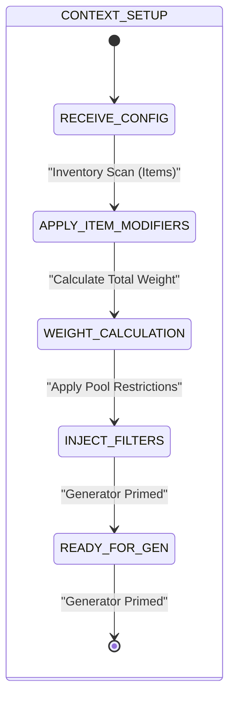
```mermaid
stateDiagram-v2
        state CONTEXT_SETUP {
            [*] --> RECEIVE_CONFIG
            RECEIVE_CONFIG --> APPLY_ITEM_MODIFIERS : "Inventory Scan (Items)"
            APPLY_ITEM_MODIFIERS --> WEIGHT_CALCULATION : "Calculate Total Weight"
            WEIGHT_CALCULATION --> INJECT_FILTERS : "Apply Pool Restrictions"
            INJECT_FILTERS --> READY_FOR_GEN : "Generator Primed"
            READY_FOR_GEN --> [*] : "Generator Primed"
        }
```

- **Generation Context Configuration** object dictates how team slots are populated:
  - **Encounter Probability Table**: A dictionary mapping `EncounterType` to its relative **Weight** (ponderated). The sum of weights may exceed 100 in case of active bonuses.
  - **Injected Filters**: Pool restrictions for levels and species.
  - **Persistence Mode (persistenceMode)**: Mandatory flag defining the post-rewards destination (`SINGLE` or `PERSISTENT`).
  - **Mode (1v1 / 2v2)**: Defines the number of active seats and participants.
- **Item Modifiers (Inventory Interaction)**: During `CONTEXT_SETUP`, the engine scans the player's inventory to apply bonuses or penalties to the encounter tables.
  - **Items**: Binoculars, Incenses, Fishing Rods, etc.
  - **Effect**: These items modify the weights or inject specific species into the pool before the generation phase begins.
- **Cleanup & Pre-prep**: At the end of `CONTEXT_SETUP`, the engine MUST:
    1. Execute `VACATE_ALL_SEATS`.
    2. Execute `PRELOAD_COORDS` for **Already Defined Teams** (Real Players / Allies).
- **Execution Rule**: The `generateEncounter()` logic MUST query the injected table before selecting the encounter parameters.
- **Backward Compatibility**: If NO configuration or table is provided, the engine defaults to **100% WILD** and **PERSISTENT** mode.

---

## 🔄 Battle Lifecycle & State Transitions

The combat engine follows a strictly phased lifecycle to ensure visual continuity and state integrity.

### 1. Global State Machine (High-Level)

The combat engine follows a strictly phased lifecycle. This high-level diagram shows the transitions between major sub-machines.

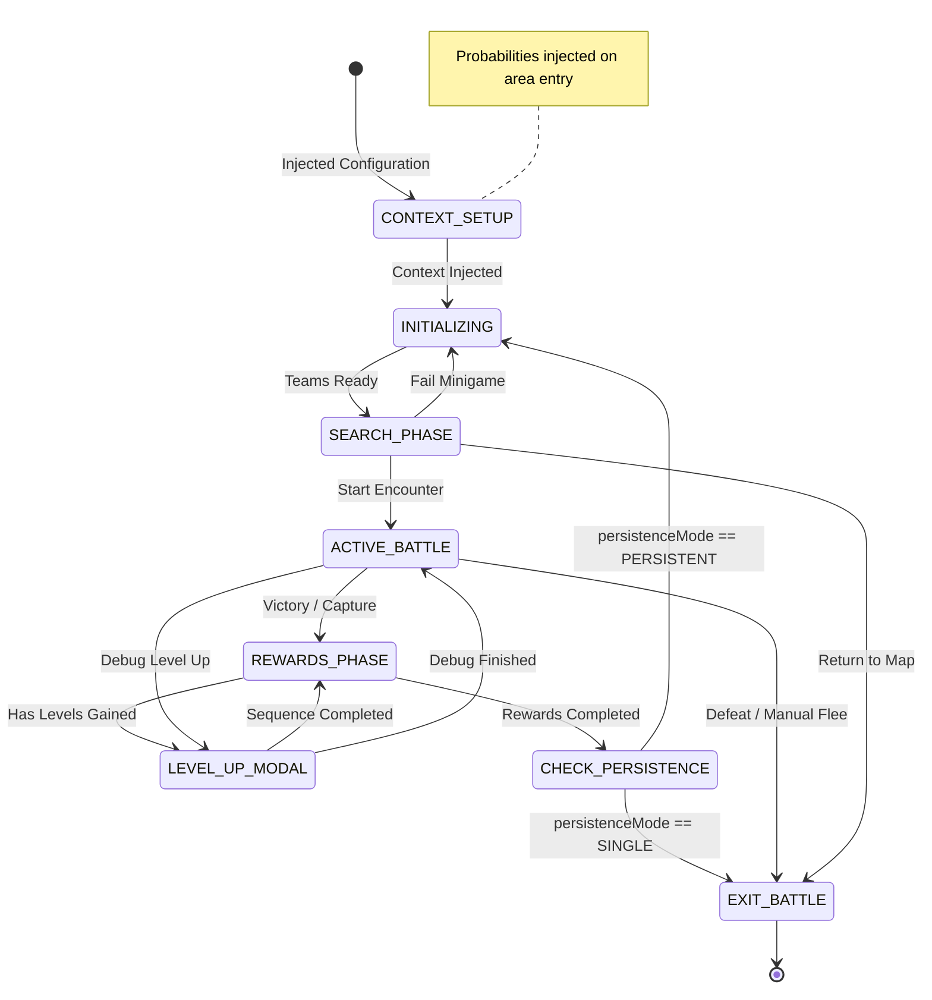
```mermaid
stateDiagram-v2
    [*] --> CONTEXT_SETUP : Injected Configuration
    CONTEXT_SETUP --> INITIALIZING : Context Injected
    
    INITIALIZING --> SEARCH_PHASE : Teams Ready
    
    REWARDS_PHASE --> LEVEL_UP_MODAL : Has Levels Gained
    LEVEL_UP_MODAL --> REWARDS_PHASE : Sequence Completed
    
    REWARDS_PHASE --> CHECK_PERSISTENCE : Rewards Completed
    
    state CHECK_PERSISTENCE <<choice>>
    CHECK_PERSISTENCE --> INITIALIZING : persistenceMode == PERSISTENT
    CHECK_PERSISTENCE --> EXIT_BATTLE : persistenceMode == SINGLE
    
    ACTIVE_BATTLE --> EXIT_BATTLE : Defeat / Manual Flee
    ACTIVE_BATTLE --> REWARDS_PHASE : Victory / Capture
    ACTIVE_BATTLE --> LEVEL_UP_MODAL : Debug Level Up
    LEVEL_UP_MODAL --> ACTIVE_BATTLE : Debug Finished
    
    SEARCH_PHASE --> ACTIVE_BATTLE : Start Encounter
    SEARCH_PHASE --> EXIT_BATTLE : Return to Map
    SEARCH_PHASE --> INITIALIZING : Fail Minigame
    
    EXIT_BATTLE --> [*]
    
    note left of CONTEXT_SETUP: Probabilities injected on area entry
```

### 2. Initialization Phase (Pre-Battle)

Handles dynamic data generation and coordinate pre-loading in an asynchronous "thread" to maintain 60 FPS performance.

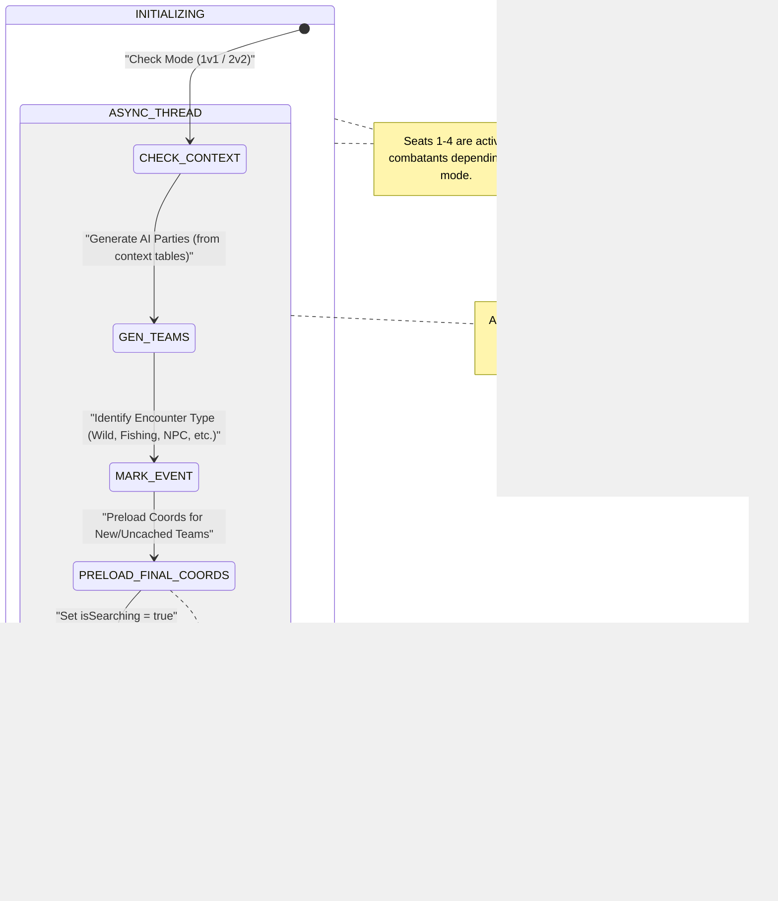
```mermaid
stateDiagram-v2
    state INITIALIZING {
        [*] --> CHECK_CONTEXT : "Check Mode (1v1 / 2v2)"
        
        state ASYNC_THREAD {
            CHECK_CONTEXT --> GEN_TEAMS : "Generate AI Parties (from context tables)"
            GEN_TEAMS --> MARK_EVENT : "Identify Encounter Type (Wild, Fishing, NPC, etc.)"
            MARK_EVENT --> PRELOAD_FINAL_COORDS : "Preload Coords for New/Uncached Teams"
            PRELOAD_FINAL_COORDS --> SET_SEARCH_FLAG : "Set isSearching = true"
            SET_SEARCH_FLAG --> [*]
        }
    }
    
    note right of ASYNC_THREAD: All generation logic occurs in a separate async process to protect FPS.
    note right of PRELOAD_FINAL_COORDS: Only scans newly generated members or those missing from cache. MUST pre-calculate both 'feet' and 'shadow' anchors (critical for flyers).
    note right of INITIALIZING: Seats 1-4 are active combatants depending on mode.
    note right of INITIALIZING: Team Slots hold the party data for each participant.
```

### 3. Active Battle Loop

The core interaction cycle. It manages user input, turn execution, and terminal sequences like fainting or capture.

```mermaid
stateDiagram-v2
    state ACTIVE_BATTLE {
        [*] --> WAIT_INPUT : "Intro / Encounter Anim Finished"
        
        state WAIT_INPUT {
            [*] --> [*] : "Unlock Control Panel"
        }
        
        WAIT_INPUT --> TURN_ENGINE : "↺ Action Selected / Block Control Panel"
        TURN_ENGINE --> WAIT_INPUT : "↺ Turn Finished / Unlock Control Panel"
        
        note right of TURN_ENGINE: Sub-machine handling turn queue and resolutions
        note right of APPLY_MOVE: await
        note right of EVAL_HP: await
    }
```

#### Turn Engine (Queue & Arbiter)

Manages action priorities and safely resolves double KOs without race conditions.

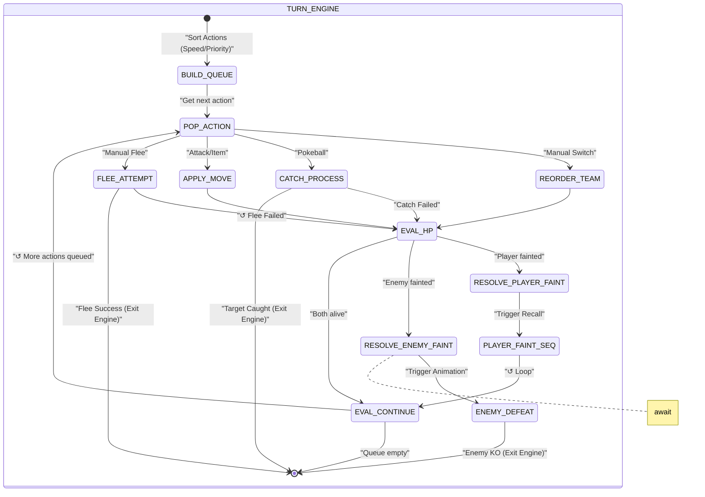
```mermaid
stateDiagram-v2
    state TURN_ENGINE {
        [*] --> BUILD_QUEUE: "Sort Actions (Speed/Priority)"
        BUILD_QUEUE --> POP_ACTION: "Get next action"
        
        POP_ACTION --> REORDER_TEAM: "Manual Switch"
        POP_ACTION --> CATCH_PROCESS: "Pokeball"
        POP_ACTION --> APPLY_MOVE: "Attack/Item"
        POP_ACTION --> FLEE_ATTEMPT: "Manual Flee"
        
        REORDER_TEAM --> EVAL_HP
        APPLY_MOVE --> EVAL_HP
        CATCH_PROCESS --> EVAL_HP: "Catch Failed"
        CATCH_PROCESS --> [*]: "Target Caught (Exit Engine)"
        
        FLEE_ATTEMPT --> EVAL_HP: "↺ Flee Failed"
        FLEE_ATTEMPT --> [*]: "Flee Success (Exit Engine)"
        
        state EVAL_HP <<choice>>
        EVAL_HP --> RESOLVE_PLAYER_FAINT: "Player fainted"
        EVAL_HP --> RESOLVE_ENEMY_FAINT: "Enemy fainted"
        EVAL_HP --> EVAL_CONTINUE: "Both alive"
        
        RESOLVE_PLAYER_FAINT --> PLAYER_FAINT_SEQ: "Trigger Recall"
        PLAYER_FAINT_SEQ --> EVAL_CONTINUE : "↺ Loop"
        
        RESOLVE_ENEMY_FAINT --> ENEMY_DEFEAT: "Trigger Animation"
        note right of RESOLVE_ENEMY_FAINT: await
        ENEMY_DEFEAT --> [*]: "Enemy KO (Exit Engine)"
        
        state EVAL_CONTINUE <<choice>>
        EVAL_CONTINUE --> POP_ACTION: "↺ More actions queued"
        EVAL_CONTINUE --> [*]: "Queue empty"
    }
```

#### Catch Process

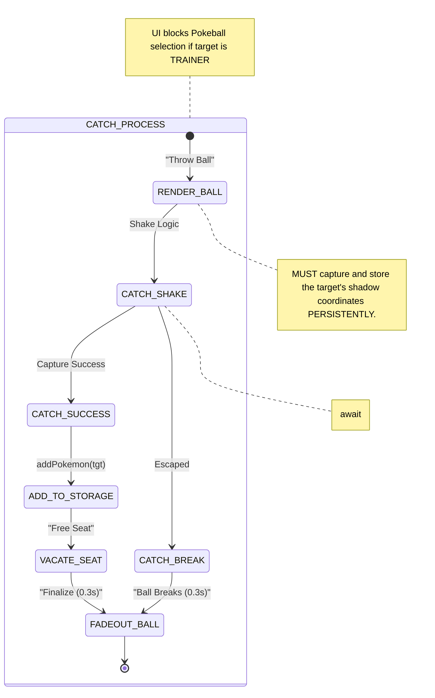
```mermaid
stateDiagram-v2
    state CATCH_PROCESS {
        [*] --> RENDER_BALL : "Throw Ball"
        RENDER_BALL --> CATCH_SHAKE : Shake Logic
        CATCH_SHAKE --> CATCH_BREAK : Escaped
        CATCH_SHAKE --> CATCH_SUCCESS : Capture Success
        CATCH_SUCCESS --> ADD_TO_STORAGE : addPokemon(tgt)
        ADD_TO_STORAGE --> VACATE_SEAT : "Free Seat"
        VACATE_SEAT --> FADEOUT_BALL : "Finalize (0.3s)"
        CATCH_BREAK --> FADEOUT_BALL : "Ball Breaks (0.3s)"
        FADEOUT_BALL --> [*]
        note right of RENDER_BALL: MUST capture and store the target's shadow coordinates PERSISTENTLY.
        note right of CATCH_SHAKE: await
    }
    note left of CATCH_PROCESS: UI blocks Pokeball selection if target is TRAINER
```

#### Enemy Faint Animation

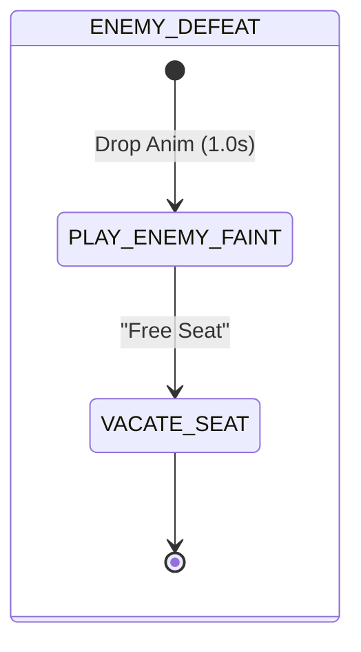
```mermaid
stateDiagram-v2
    state ENEMY_DEFEAT {
        [*] --> PLAY_ENEMY_FAINT : Drop Anim (1.0s)
        PLAY_ENEMY_FAINT --> VACATE_SEAT : "Free Seat"
        VACATE_SEAT --> [*]
    }
```

#### Escape Process

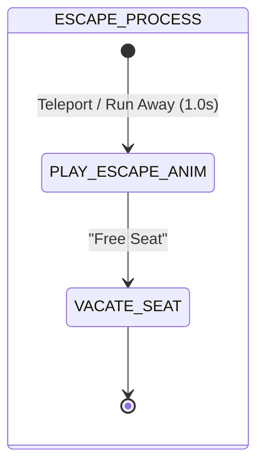
```mermaid
stateDiagram-v2
    state ESCAPE_PROCESS {
        [*] --> PLAY_ESCAPE_ANIM : Teleport / Run Away (1.0s)
        PLAY_ESCAPE_ANIM --> VACATE_SEAT : "Free Seat"
        VACATE_SEAT --> [*]
    }
```

### 4. Enemy Replacement Sequence

Handles the logic for switching between enemy team members after a knockout.

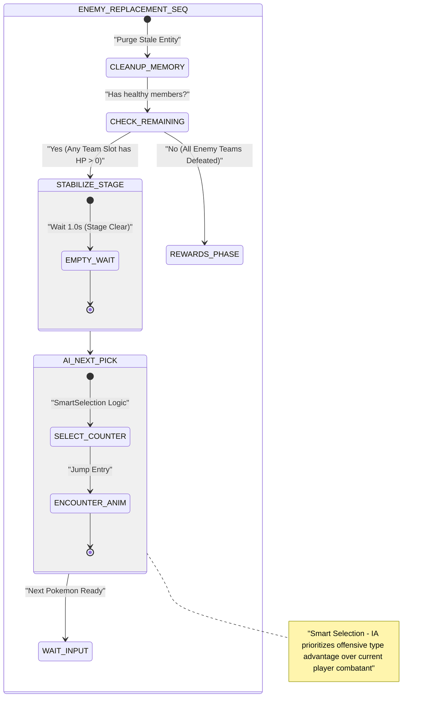
```mermaid
stateDiagram-v2
    state ENEMY_REPLACEMENT_SEQ {
        [*] --> CLEANUP_MEMORY: "Purge Stale Entity"
        CLEANUP_MEMORY --> CHECK_REMAINING: "Has healthy members?"
        
        state CHECK_REMAINING <<choice>>
        CHECK_REMAINING --> STABILIZE_STAGE: "Yes (Any Team Slot has HP > 0)"
        CHECK_REMAINING --> REWARDS_PHASE: "No (All Enemy Teams Defeated)"
        
        state STABILIZE_STAGE {
            [*] --> EMPTY_WAIT: "Wait 1.0s (Stage Clear)"
            EMPTY_WAIT --> [*]
        }
        
        STABILIZE_STAGE --> AI_NEXT_PICK
        
        state AI_NEXT_PICK {
            [*] --> SELECT_COUNTER: "SmartSelection Logic"
            SELECT_COUNTER --> ENCOUNTER_ANIM : "Jump Entry"
            ENCOUNTER_ANIM --> [*]
        }
        
        AI_NEXT_PICK --> WAIT_INPUT: "Next Pokemon Ready"
    }
    
    note right of AI_NEXT_PICK : "Smart Selection - IA prioritizes offensive type advantage over current player combatant"
```

### 5. Rewards Phase

Triggered after a victory or capture. It handles the reward distribution and team maintenance.

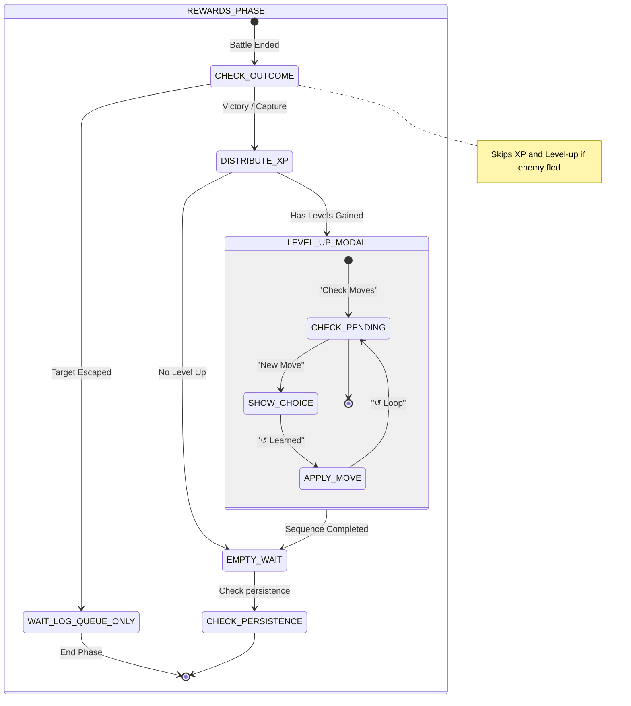
```mermaid
stateDiagram-v2
    state REWARDS_PHASE {
        [*] --> CHECK_OUTCOME : Battle Ended
        state CHECK_OUTCOME <<choice>>
        
        CHECK_OUTCOME --> DISTRIBUTE_XP : Victory / Capture
        CHECK_OUTCOME --> WAIT_LOG_QUEUE_ONLY : Target Escaped
        
        DISTRIBUTE_XP --> LEVEL_UP_MODAL : Has Levels Gained
        DISTRIBUTE_XP --> EMPTY_WAIT : No Level Up
        
        state LEVEL_UP_MODAL {
            [*] --> CHECK_PENDING: "Check Moves"
            CHECK_PENDING --> SHOW_CHOICE: "New Move"
            SHOW_CHOICE --> APPLY_MOVE: "↺ Learned"
            APPLY_MOVE --> CHECK_PENDING: "↺ Loop"
            CHECK_PENDING --> [*]
        }
        
        LEVEL_UP_MODAL --> EMPTY_WAIT : Sequence Completed
        WAIT_LOG_QUEUE_ONLY --> [*] : End Phase
        
        EMPTY_WAIT --> CHECK_PERSISTENCE : Check persistence
        state CHECK_PERSISTENCE <<choice>>
        CHECK_PERSISTENCE --> [*]
    }
    
    note right of CHECK_OUTCOME: Skips XP and Level-up if enemy fled
```

#### Experience Cap at Maximum Level

To maintain combat mechanics integrity, experience distribution during the `DISTRIBUTE_XP` phase is strictly capped:
- If a Pokémon has reached `MAX_POKEMON_LEVEL` (100), its `exp` is fixed to `0` and `expNeeded` is `Infinity`.
- The engine blocks any experience gain (`gained = 0`) for this Pokémon, preventing level-up notifications, triggers, or UI modal locks associated with level changes.

### 6. Search Phase (Persistent Mode)

Allows the player to find new encounters without closing the modal.

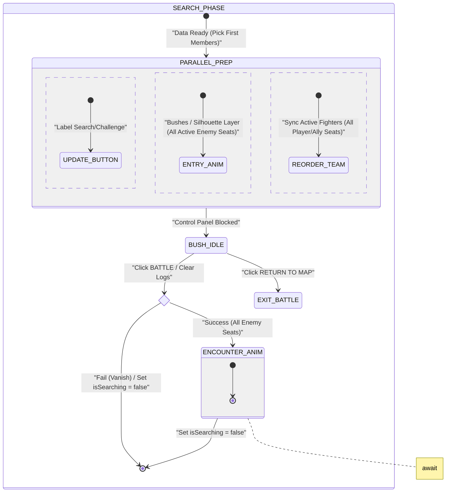
```mermaid
stateDiagram-v2
    state SEARCH_PHASE {
        [*] --> PARALLEL_PREP: "Data Ready (Pick First Members)"
        
        state PARALLEL_PREP {
            [*] --> UPDATE_BUTTON: "Label Search/Challenge"
            --
            [*] --> ENTRY_ANIM: "Bushes / Silhouette Layer (All Active Enemy Seats)"
            --
            [*] --> REORDER_TEAM: "Sync Active Fighters (All Player/Ally Seats)"
        }
        
        PARALLEL_PREP --> BUSH_IDLE : "Control Panel Blocked"
        
        state MINIGAME_CHECK <<choice>>
        BUSH_IDLE --> MINIGAME_CHECK : "Click BATTLE / Clear Logs"
        BUSH_IDLE --> EXIT_BATTLE : "Click RETURN TO MAP"
        
        MINIGAME_CHECK --> ENCOUNTER_ANIM : "Success (All Enemy Seats)"
        MINIGAME_CHECK --> [*] : "Fail (Vanish) / Set isSearching = false"
        
        state ENCOUNTER_ANIM {
            [*] --> [*]
        }
        note right of ENCOUNTER_ANIM: await
        ENCOUNTER_ANIM --> [*] : "Set isSearching = false"
    }
```

> [!NOTE]
> **Search Interface**: Replaces standard combat HUD with "Search Again" and "Return to Map" buttons during `BUSH_IDLE`.
>
> **Participation**: For new encounters, the engine automatically selects the **FIRST healthy Pokémon** from each participant's Team Slot. In 2vs2, both enemy seats (2 & 4) and player/ally seats (1 & 3) trigger parallel entry and sync sequences.

### 7. Modal Persistence & Lifecycle Rules

To ensure a seamless user experience, the combat modal follows strict persistence rules:

- **Single Instance Rule**: Once the combat modal is opened (via `FIRST_INTRO`), it MUST remain the active view throughout all subsequent states (`ACTIVE_BATTLE`, `REWARDS_PHASE`, `SEARCH_PHASE`).
- **No Visual Restarts**: Clicking "Search" in `SEARCH_PHASE` MUST NOT close and reopen the modal. It simply triggers the `ENCOUNTER_ANIM` transition and proceeds to a new `ACTIVE_BATTLE` cycle within the same component instance.
- **Terminal Exit Only**: The modal can ONLY be closed under two conditions:
    1. **Return to Map**: Explicitly clicking the "Return to Map" button during `SEARCH_PHASE` (triggers `EXIT_BATTLE`).
    2. **Fleeing**: Successfully escaping from a battle (triggers `EXIT_BATTLE` via the rewards/stabilization flow if no search is intended).
- **State Continuity**: Persistence of the modal ensures that reactive coordinates (`feetCache`) and camera settings remain stable between encounters, eliminating visual flickering.

### 8. Capture Timing Precision (Transition Protocol)

To maintain a cinematic feel, the post-capture sequence follows a strictly timed protocol synchronized with the rewards flow:

| Time | Event | Visual State |
| :--- | :--- | :--- |
| **0.0s** | `CATCH_SUCCESS` | Sparkles start. Poké Ball visible & shaking. Enemy Sprite HIDDEN. The caught Pokémon MUST be added to the team or box (`addPokemon`) BEFORE the rewards transition. |
| **Log Entry** | **Rewards Phase Start** | Sparkles end. Poké Ball despawns. All visual traces cleared. |
| **Variable** | **XP & Gold Sync** | Stage is COMPLETELY EMPTY. No sprites, no balls, no HUDs. Wait for log queue to empty. |
| **Next Step** | **Level Up Sequence** | Enter `LEVEL_UP_MODAL`. Stage remains in a clean state. |
| **Variable** | **Search Phase Trigger** | All selections cleared. `isSearching = true`. Transition to bushes starts. |

### 9. Capture Animation Fidelity

To maintain the "Search Phase" premium feel, certain animations MUST NOT be simplified or removed:

- **Poké Ball Wobble**: The physical balanceo of the ball during capture attempts is a core mechanical feedback and MUST be preserved in `BattleCombatant.vue` keyframes.
- **Persistent Anchor Storage**: During the catch sequence, the Poké Ball MUST capture and store the target's shadow coordinates PERSISTENTLY. This ensures that if the capture fails or succeeds, the ball remains anchored to the exact spot where the Pokémon was, preventing visual jumps during the "burst" or "success" FX.
- **Energy Shake/Blink**: The pulsing light effect inside the ball during the "shaking" phase must remain active to signify the capture struggle.
- **Sparkle Coordination**: Success particles MUST be synchronized with the exact frame the ball clicks shut to reinforce the success signal.

### 10. Player Faint Sequence (Trainer Recall)

Unlike wild Pokémon, owned Pokémon are never "left behind" on the battlefield. The sequence focuses on the Trainer's reaction and team management.

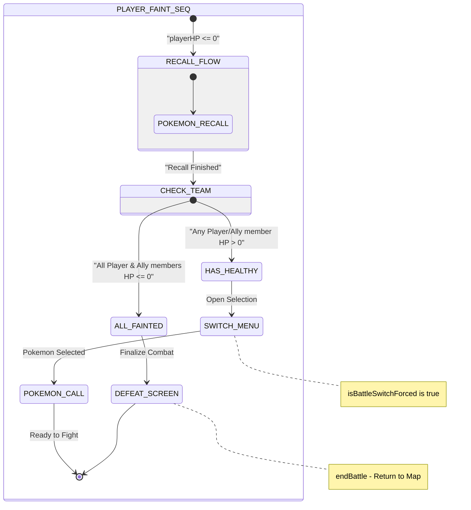
```mermaid
stateDiagram-v2
    state PLAYER_FAINT_SEQ {
        [*] --> RECALL_FLOW: "playerHP <= 0"
        
        state RECALL_FLOW {
            [*] --> POKEMON_RECALL
        }
        
        RECALL_FLOW --> CHECK_TEAM: "Recall Finished"
        
        state CHECK_TEAM {
            [*] --> HAS_HEALTHY: "Any Player/Ally member HP > 0"
            [*] --> ALL_FAINTED: "All Player & Ally members HP <= 0"
        }
        
        HAS_HEALTHY --> SWITCH_MENU : Open Selection
        note right of SWITCH_MENU: isBattleSwitchForced is true
        
        SWITCH_MENU --> POKEMON_CALL : Pokemon Selected
        POKEMON_CALL --> [*] : Ready to Fight
        
        ALL_FAINTED --> DEFEAT_SCREEN : Finalize Combat
        DEFEAT_SCREEN --> [*]
    }
    note right of DEFEAT_SCREEN: endBattle - Return to Map
```

### 11. Modular Animation Components

To ensure visual consistency, the sending and receiving of Pokémon follow these modular protocols.

#### Team Reordering / Manual Switch

Ensures the active combatant matches the **First Healthy Member** of the Team Slot (HP > 0), following the team's defined order. Fainted members are systematically ignored during automatic synchronization.

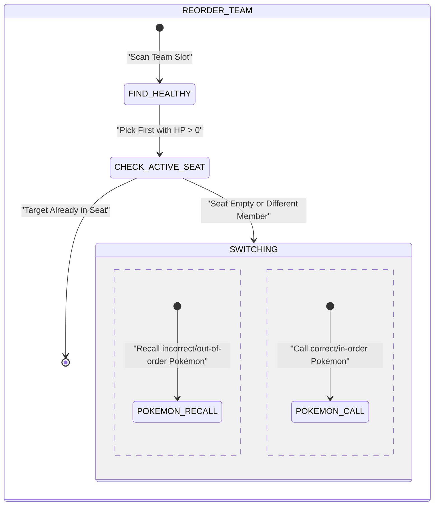
```mermaid
stateDiagram-v2
    state REORDER_TEAM {
        [*] --> FIND_HEALTHY : "Scan Team Slot"
        FIND_HEALTHY --> CHECK_ACTIVE_SEAT : "Pick First with HP > 0"
        
        state CHECK_ACTIVE_SEAT <<choice>>
        CHECK_ACTIVE_SEAT --> [*] : "Target Already in Seat"
        CHECK_ACTIVE_SEAT --> SWITCHING : "Seat Empty or Different Member"
        
        state SWITCHING {
            [*] --> POKEMON_RECALL : "Recall incorrect/out-of-order Pokémon"
            --
            [*] --> POKEMON_CALL : "Call correct/in-order Pokémon"
        }
    }
```

#### Pokémon Recall (Receiving)

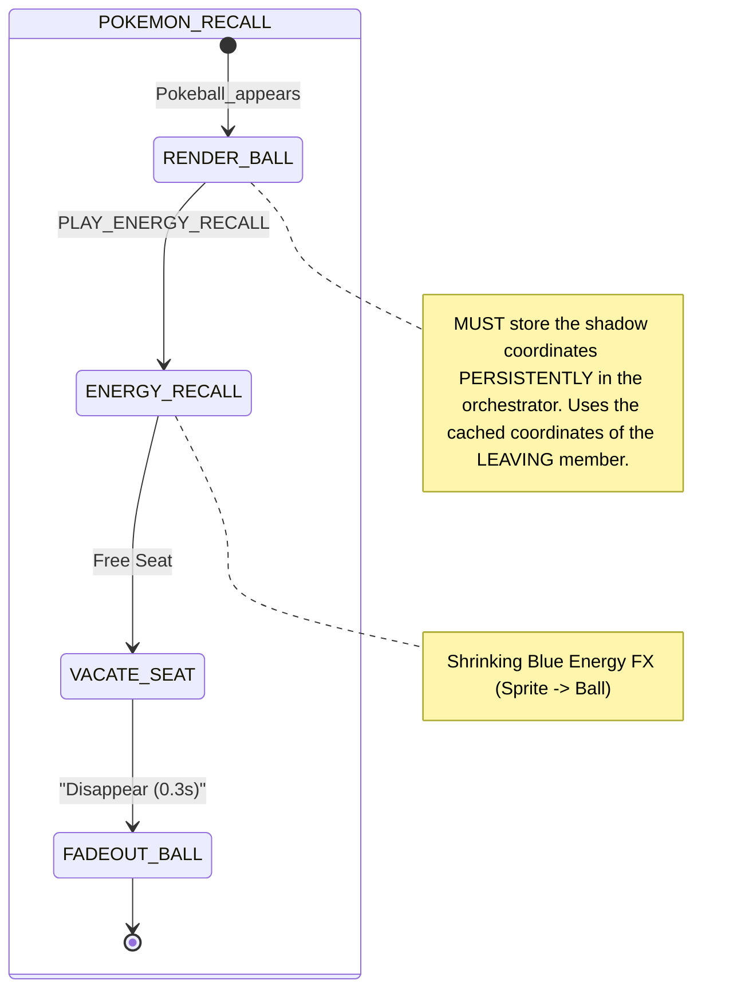
```mermaid
stateDiagram-v2
    state POKEMON_RECALL {
        [*] --> RENDER_BALL: Pokeball_appears
        RENDER_BALL --> ENERGY_RECALL: PLAY_ENERGY_RECALL
        ENERGY_RECALL --> VACATE_SEAT: Free Seat
        VACATE_SEAT --> FADEOUT_BALL: "Disappear (0.3s)"
        FADEOUT_BALL --> [*]
        
        note right of RENDER_BALL: MUST store the shadow coordinates PERSISTENTLY in the orchestrator. Uses the cached coordinates of the LEAVING member.
        note right of ENERGY_RECALL: Shrinking Blue Energy FX (Sprite -> Ball)
    }
```

#### Pokémon Call (Sending)

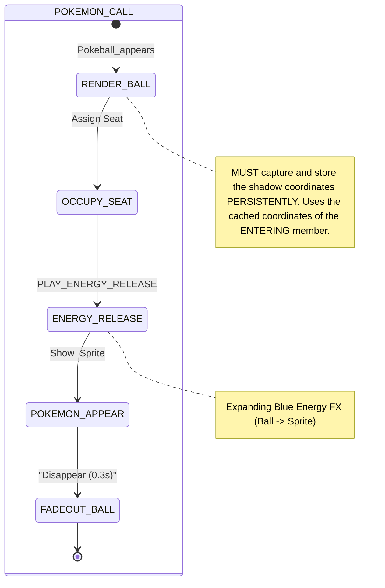
```mermaid
stateDiagram-v2
    state POKEMON_CALL {
        [*] --> RENDER_BALL: Pokeball_appears
        RENDER_BALL --> OCCUPY_SEAT: Assign Seat
        OCCUPY_SEAT --> ENERGY_RELEASE: PLAY_ENERGY_RELEASE
        ENERGY_RELEASE --> POKEMON_APPEAR: Show_Sprite
        POKEMON_APPEAR --> FADEOUT_BALL: "Disappear (0.3s)"
        FADEOUT_BALL --> [*]
        
        note right of RENDER_BALL: MUST capture and store the shadow coordinates PERSISTENTLY. Uses the cached coordinates of the ENTERING member.
        note right of ENERGY_RELEASE: Expanding Blue Energy FX (Ball -> Sprite)
    }
```

#### Entry Animation (Bushes)

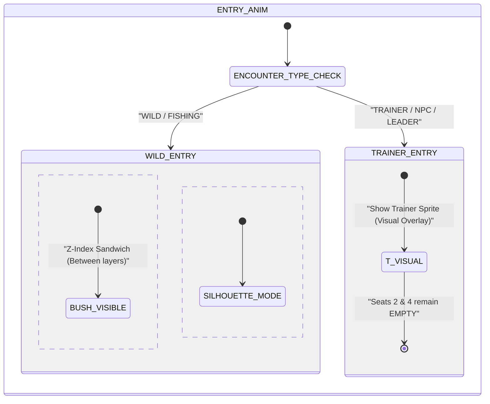
```mermaid
stateDiagram-v2
    state ENTRY_ANIM {
        [*] --> ENCOUNTER_TYPE_CHECK
        state ENCOUNTER_TYPE_CHECK <<choice>>
        
        ENCOUNTER_TYPE_CHECK --> WILD_ENTRY: "WILD / FISHING"
        ENCOUNTER_TYPE_CHECK --> TRAINER_ENTRY: "TRAINER / NPC / LEADER"
        
        state TRAINER_ENTRY {
            [*] --> T_VISUAL: "Show Trainer Sprite (Visual Overlay)"
            T_VISUAL --> [*]: "Seats 2 & 4 remain EMPTY"
        }
        
        state WILD_ENTRY {
            [*] --> BUSH_VISIBLE: "Z-Index Sandwich (Between layers)"
            --
            [*] --> SILHOUETTE_MODE
        }
    }
```

#### Encounter Animation (Jump)

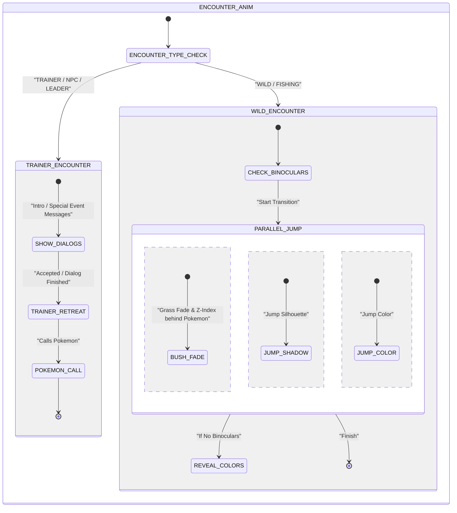
```mermaid
stateDiagram-v2
    state ENCOUNTER_ANIM {
        [*] --> ENCOUNTER_TYPE_CHECK
        state ENCOUNTER_TYPE_CHECK <<choice>>
        
        ENCOUNTER_TYPE_CHECK --> TRAINER_ENCOUNTER: "TRAINER / NPC / LEADER"
        ENCOUNTER_TYPE_CHECK --> WILD_ENCOUNTER: "WILD / FISHING"

        state TRAINER_ENCOUNTER {
            [*] --> SHOW_DIALOGS: "Intro / Special Event Messages"
            SHOW_DIALOGS --> TRAINER_RETREAT: "Accepted / Dialog Finished"
            TRAINER_RETREAT --> POKEMON_CALL: "Calls Pokemon"
            POKEMON_CALL --> [*]
        }

        state WILD_ENCOUNTER {
            [*] --> CHECK_BINOCULARS
            state CHECK_BINOCULARS <<choice>>
            
            CHECK_BINOCULARS --> PARALLEL_JUMP: "Start Transition"

            state PARALLEL_JUMP {
                [*] --> BUSH_FADE: "Grass Fade & Z-Index behind Pokemon"
                --
                [*] --> JUMP_SHADOW: "Jump Silhouette"
                --
                [*] --> JUMP_COLOR: "Jump Color"
            }
            
            PARALLEL_JUMP --> REVEAL_COLORS: "If No Binoculars"
            PARALLEL_JUMP --> [*]: "Finish"
        }
    }
```

### 12. Exit Procedures

The **EXIT_BATTLE** sub-machine ensures the system returns to the map state without leaving reactive leftovers. It handles defeat-screen interactions and direct map returns. Flee confirmations are handled by the Vue UI layer prior to triggering this state.

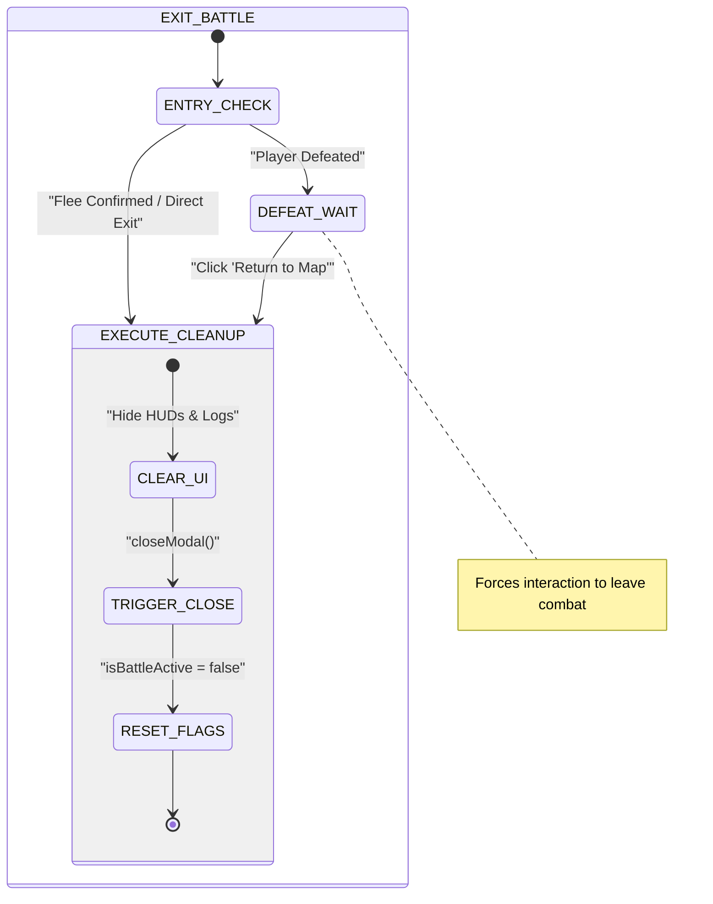
```mermaid
stateDiagram-v2
    state EXIT_BATTLE {
        [*] --> ENTRY_CHECK
        
        state ENTRY_CHECK <<choice>>
        ENTRY_CHECK --> DEFEAT_WAIT: "Player Defeated"
        ENTRY_CHECK --> EXECUTE_CLEANUP: "Flee Confirmed / Direct Exit"
        
        DEFEAT_WAIT --> EXECUTE_CLEANUP: "Click 'Return to Map'"
        note right of DEFEAT_WAIT: Forces interaction to leave combat
        
        state EXECUTE_CLEANUP {
            [*] --> CLEAR_UI: "Hide HUDs & Logs"
            CLEAR_UI --> TRIGGER_CLOSE: "closeModal()"
            TRIGGER_CLOSE --> RESET_FLAGS: "isBattleActive = false"
            RESET_FLAGS --> [*]
        }
    }
```

- **Search (Loop)**: Resets `over` state, clears old logs, but **persists** the camera and ground coordinates to avoid jumps.
- **Return to Map**: Triggers the `EXIT_BATTLE` sequence. The `isBattleActive` flag MUST be cleared last to ensure all components can unmount cleanly without trying to read stale battle data.

## 🧹 State Hygiene & Phantom Animations

To prevent "Phantom Animations" (e.g., a Pokémon performing a Dash when using an item because it remembers the last attack performed):

1. **Active Move Reset**: References to `activeMove` and `attackerSide` **MUST** be reset to `null` immediately after finishing a turn and at the start of each battle (`_startBattle`).
2. **Turn Atomicity**: No animation state from the previous turn should persist in the next action. This includes clearing `activeMove` before processing item usage or Pokémon swaps.
3. **Shadow Visibility Reset**: When starting an encounter, the shadow's opacity must be explicitly reset to prevent shadows from previous battles from appearing before the entry animation.

## ⚙️ Action Registry & Engine Expansion

The battle engine uses a decoupled architecture where move effects are mapped to executable logic via the `ActionRegistry`.

- **Action Dispatching Order**: The engine must follow a strict sequential order:
    1. **Dynamic Interception**: Moves like Metronome or Mirror Move are resolved BEFORE damage calculation.
    2. **Primary Damage**: Calculation and application of HP.
    3. **Post-Action Effects**: Execution of Recoil, Drain, and Self-KO (Explosion) consuming the registered `lastDamage`.
- **Modular Implementation**: Logic for new effects should be grouped by type:
  - `statActions.ts`: For all stage modifiers (Atk, Def, etc.).
  - `fieldActions.ts`: For side-based effects (Screens, Weather, Hazards).
  - `statusActions.ts`: For primary status conditions (Burn, Sleep, etc.).
  - `specialActions.ts`: For unique mechanics (Transform, Roar, Metronome).
- **Source Propagation**: All action functions MUST receive and propagate the `src` and `tgt` objects to the `addLogFn` to maintain the visual link between the action and the combatant's sprite.
- **Data Integrity (Move Sync)**: Moves in the player's team may have stale metadata. Before processing an effect, the engine MUST verify/sync the `effect` property from the `pokemonDataProvider` if it is missing or null.
- **Battle Context (Team Access)**: Actions that force switches (e.g., *Roar*, *Whirlwind*) or involve team data MUST have access to `activeBattle.playerTeam`. This team reference is injected during battle initialization.
- **Technical Debugging Standard**:
  - **Technical Logs**: Internal dispatching details, target resolution, and technical blocks (e.g., "Stat already at -6") MUST use `console.log` or `console.warn` instead of the combat log.
  - **Game Logs**: Only "gameplay-relevant" failures (e.g., "Clear Body prevented the drop", "Type immunity") should be added to the user-facing `addLog`.
- **Modular Stat Validation**: Functions like `checkInmunity` MUST receive `tgtStages` to validate technical limits (-6/+6) and trigger the appropriate console warnings.
- **Relative Effects (Recoil/Drain)**: Effects that depend on damage dealt (e.g., `drain_50`, `recoil_25`) MUST consume `battleCtx.lastDamage` from the combat context to calculate the final healing or recoil amount.

## 🏃 Escape & Withdrawal Actions

### 1. Teleport (Gen 8+ Parity)

The Teleport move follows specific logic based on the battle context to maintain competitive balance and team integrity:

- **Wild or Trainer Combat (Relevo / Siguiente Pokémon)**:
  - If the Pokémon that uses Teleport has more healthy teammates left in its party, it acts as a withdrawal (the Pokémon retreats immediately and the next healthy member is sent out).
- **Terminal Case (Ultimo Pokémon)**:
  - If the Pokémon that uses Teleport is the LAST healthy member of its party, the battle ends immediately. The sequence transitions to the `REWARDS_PHASE` or `EXIT_BATTLE` depending on the perspective.

When a Pokémon successfully flees or switches via Teleport:

1. The active combatant is withdrawn.
2. If there are healthy members left, the `POKEMON_CALL` sequence sends out the next available Pokémon.
3. If no healthy members remain, the system terminates the battle loop and exits safely.

*Note: Manual Fleeing (via Run Button) triggers `EXIT_BATTLE` directly and closes the modal, returning the player to the map. In wild battles, if the player chooses to run, the system must evaluate the escape chance based on the current generation formulas.*

## 📈 Level Up & Move Learning

### 1. Rewards Distribution Phase

During the `REWARDS_PHASE` (1.0s transition), the system processes asynchronous calculations:

- **XP Processing**: XP gained is calculated and applied to team members.
- **Level Detection**: If the new XP exceeds the current level threshold, the Pokémon levels up.
- **Gold Distribution**: Gold earned is added to the player's balance.

### 2. Move Learner Modal

If after processing the level it is detected that the Pokémon has moves pending to learn (defined in its progression table):

1. **Modal Trigger**: The system transitions to the `LEVEL_UP_MODAL` state immediately after the `REWARDS_PHASE`.
2. **User Choice**:
    - If the Pokémon has < 4 moves: It is learned automatically or confirmation is requested.
    - If the Pokémon has 4 moves: The player MUST choose a move to forget or cancel the new learning.
3. **Recursive Check**: Since a Pokémon can level up several times at once (or learn multiple moves in the same level), the system must perform a recursive check within the `LEVEL_UP_MODAL`:
    - If there are more pending moves -> Re-open modal with the next move.
    - If there are no more moves -> Transition to `SEARCH_PHASE`.

### 3. State Integrity

- **HUD Visibility**: During move learning, combat HUDs must remain hidden to avoid visual overlaps.
- **Enemy Visibility**: The enemy Pokémon MUST remain hidden throughout the entire Move Selection process. The transition to the Search Phase (Bushes) only occurs after all move selections are finalized.
- **isBattleActive**: This flag MUST remain `true` during the entire learning process to prevent the battle modal from closing prematurely and returning the player to the map before having managed their team.

## 🛡️ Engine Safety & Callbacks

### 1. Robust Option Destructuring

When implementing or modifying core logic functions that accept an `options` object (like `getEffectiveSpeed`), follow the **Fallback Pattern** to prevent runtime crashes:

- **Rule**: NEVER destructure without a fallback to the global/imported version of the function.
- **Implementation**:

  ```javascript
  import { globalFn } from '../utils';
  
  export function coreLogic(data, options = {}) {
    const fn = options.fn || globalFn; // Safe fallback
    return fn(data);
  }
  ```

- **Why**: Prevents `TypeError: fn is not a function` when the function is called from turn-logic or debug-tools that may pass incomplete option objects.

---

## 📝 Advanced Log Attribution

### 1. Trainer vs Pokémon Source

To ensure every log entry displays the correct sprite/avatar:

- **Trainer Actions**: Logs for trainer actions (e.g., "Send out", "Switch", "Withdraw") MUST use the literal string `'player'` or `'enemy_trainer'` as the `source`.
- **FORBIDDEN**: Do NOT pass the Pokémon object as the source for trainer-only logs, as it would incorrectly show the Pokémon's avatar instead of the human trainer's.
- **Side Override**: Pass `'player'` or `'enemy'` as the 4th argument (`sideOverride`) to `addLog` to force a specific background tint, overriding the automatic detection logic based on UID.

---

## 🎣 Capture System Synchronization

### 1. Mandatory Environmental Context

Every call to `calculateCatchRate` MUST receive an enriched `ctx` object from the battle store:

- **`weather`**: Inject the current map weather or the temporary battle weather.
- **`cycle`**: Inject the time cycle (`mapStore.currentCycle`) to respect time-based locks (e.g., debugging at night during noon).

### 2. Environmental Multipliers (2026 Audit)

Refer to the [Capture Multipliers in the Game Formulas Manual](../core/game_formulas_manual.md) for environmental bonuses (Dusk Ball, Net Ball).

### 3. Turn Counter (Timer Ball)

The `turnCount` is a live state. It MUST be explicitly incremented in `applyEndTurnEffects` of the battle store. It should never be incremented before end-turn effects (poison, weather, etc.) have been processed, to maintain visual parity with the UI.

---

## 🎣 Capture Mechanics & Data Integrity

To ensure capture difficulty aligns with official game standards and species identity:

### 1. Species-Specific Catch Rates

- **Database Mandate**: Every Pokémon species in `pokemonDB.ts` MUST have an explicit `catchRate` property (values 3 to 255).
- **Zero-Fallback Policy**: The battle engine MUST NOT use hardcoded magic numbers (e.g., `|| 45`) for capture rates.
- **Diagnostic Safety**: If a Pokémon is encountered without a `catchRate`, the system MUST use a safe fallback (`?? 45`) AND trigger a `console.warn` to notify developers of the data gap.

### 2. Capture Probability Formula

Refer to the [Capture Formula section in the Game Formulas Manual](../core/game_formulas_manual.md) for technical details on Gen 3/4 Math.

### 3. Visual & Interface Definitions

To prevent implementation ambiguity, we distinguish between two core interface layers:

- **Combat HUD**: The high-fidelity information cards showing Pokémon HP, Status, Level, and EXP. Visibility is derived from **Seat Occupancy** (Master Signal).
- **Control Panel (Move-Panel)**: The bottom orchestration area containing Move Grid, Quick Team, and Quick Bag. It is covered by the **Search Overlay** during navigation phases.

#### Information Disclosure Rules (Binoculars Protocol)

To maintain search tension, Pokémon data disclosure is restricted during the initial encounter phase:

| State / Substate | Requirement | Data Display |
| :--- | :--- | :--- |
| `ENTRY_ANIM`, `BUSH_IDLE`, `SILHOUETTE_MODE` | None | Scrambled (`?`) |
| `ENTRY_ANIM`, `BUSH_IDLE`, `SILHOUETTE_MODE` | `inventory.binoculars > 0` | Full Data |
| **All Other States** | None | Full Data |

> [!IMPORTANT]
> This rule applies globally to the `Combat HUD` component and must be evaluated reactively against the player's inventory and the current FSM substate.

#### 3.2.4 Control de Efectos Visuales (FX) en Combate

El sistema de combate utiliza el componente centralizado `PVSpriteFX` para gestionar capas visuales (Shiny, Guardian, Estados). Se aplican las siguientes reglas de visibilidad:

- **Modo Silueta (isSilhouette: true)**:
  - FUERZA el **Modo Simplificado** (`isSimplified: true`).
  - OCULTA todos los efectos visuales (Shiny sparkles, Guardian aura, partículas de estado) para mantener la integridad visual de la fase de descubrimiento.
- **Modo Revelado (isSilhouette: false)**:
  - DESACTIVA el Modo Simplificado (a menos que existan otras restricciones de rendimiento).
  - RESTAURA la visibilidad de todos los FX activos.
- **Supresión por FSM**: Ciertos estados de la máquina de estados pueden suprimir temporalmente los FX mediante la prop `suppressFX` en `BattleCombatant`.

### 4. Verification Protocol

- **Mocked Randomness**: Use `vi.spyOn(Math, 'random').mockReturnValue(X)` in unit tests to verify that Pokémon are caught/escaped at specific mathematical thresholds.

### 5. Safe Context Destructuring

- **Context Unpacking**: In special action handlers like `teleport` or `roar`, always destructure or check the `battleCtx` safely. Use fallbacks such as `battleCtx.activeBattle || battleCtx` to avoid accessing properties on undefined objects.

- **Weather-Aware Moves**: Move modifiers (boosted or penalized) for complex conditions (like Thunder or Hurricane under Rain/Sun) MUST be perfectly aligned across the battle moves grid and the hovering tooltips to maintain clear informational transparency.

---

## 🛠️ Debug & Simulation Protocol

To facilitate mechanical verification without causing visual desynchronization:

### 1. Reactive Debug Synchronization

All administrative and debug controls (e.g., Shiny/Guardian toggles, Camera Zoom, Guides) MUST be synchronized directly with the global `BattleStore` state.

- **FORBIDDEN**: Using local `ref()` or `reactive()` for buttons that control global engine features.
- **MANDATORY**: Any UI interaction that modifies the debug environment MUST update the corresponding flag in the store. This ensures that the UI always represents the actual state of the engine.

### 2. Camera & Viewport Management

Camera settings (zoom levels, visual guides) are considered persistent battle states.

- **State Persistence**: The `BattleStore` acts as the source of truth for the camera's zoom factor and guide visibility. This prevents the camera from resetting to default values when switching between UI panels or re-mounting the arena.

### 3. Log Area & UI Separation

The combat log container MUST remain isolated from administrative controls.

- **Overflow Integrity**: Debug buttons MUST be positioned outside the log's scrolling viewport. This prevents the "log-animation-clash" where incoming messages cause the entire control panel to scroll or shift unexpectedly.

### 4. Bidirectional Engine Translation and Parity Sync

To maintain strict competitive integrity inside the combat engine while offering a localized premium UI experience:
- **Bidirectional Worker Translation**: When utilizing an engine written in English (e.g., `@pkmn/sim`) alongside a Spanish interface, you MUST implement deterministic bidirectional translator maps (such as `NATURE_MAP_ES_TO_EN` / `ABILITY_MAP_ES_TO_EN` and their dynamic inversions) inside the Web Worker thread (`ShowdownWorker.ts`).
- **Translation Execution Flow**: Translate all Spanish user choices (types, moves, abilities, natures) to their corresponding English keys before submitting them to the simulator. Conversely, intercept all outputs and status frames from the simulator and translate them back to Spanish before propagating them to the Pinia store and the reactive HUD cards. This ensures perfect mathematical stat modifiers (+10%/-10% nature boosts, STAB calculations) apply correctly inside the simulator engine without causing UI leaks.

---

## 🏛️ Battle Engine Integrity (FSM)

To ensure stability and 1:1 parity between visual execution and state flow:

- **Documentation Parity**: The code MUST remain a 1:1 implementation of the Mermaid diagrams in `battle_mechanics_manual.md`.
- **Deterministic Flow**: Avoid naked `setTimeout` calls in combat logic. Initialization sequences and FSM state transitions MUST be strictly synchronized with `await animations.triggerX()` or GSAP promises to prevent engine deadlocks and race conditions. Hardcoded timers for animation waiting are forbidden.
- **Visual Completion**: FSM states representing visual actions (Damage, Faint, Catch) MUST wait for the corresponding GSAP promise resolution.
- **Mandatory Audit**: Run `validate_fsm_diagrams.ts`, `validate_fsm_implementation.ts`, and `validate_fsm_flow_parity.ts` (or `npm run validate:fsm`) before every commit that touches battle logic. Zero critical errors are allowed.
- **Substate Parity**: All sub-states defined in `battleStateMachine.ts` MUST be actively used in logic or UI. Obsolete or orphaned states (e.g., `REORDER_TEAM`) must be removed to maintain a clean FSM audit and prevent architectural drift.

---

## 📝 Lessons Learned: Weather & Stat Upgrades

- **Dynamic Weather Name Resolution**: Always resolve weather names using `weather.visual || weather.type` to match global visual table overrides (e.g. `OLA FRÍO` vs `GRANIZO`) instead of hardcoding raw mechanical keys.
- **Minimum Climate Damage**: Force a minimum of `1 HP` on climate damage formulas using `Math.max(1, Math.floor(maxHp / 16))` to prevent confusing `0 HP` or `-0 HP` logs for low-level Pokémon.
- **Stat Parsing Regular Expression**: Include numbers and underscores in regex patterns mapping stage adjustments (e.g., `/stat_(up|down)_(self|enemy)_([a-z0-9_]+)/`) to avoid truncating specific stats like `spe_2` into `SPE_`.
- **Computed Rendering Optimization**: Avoid accessing direct database or metadata providers (like `pokemonDataProvider`) directly inside Vue template loops. Cache all resolved lookups in `<script setup>` using `computed` properties.


