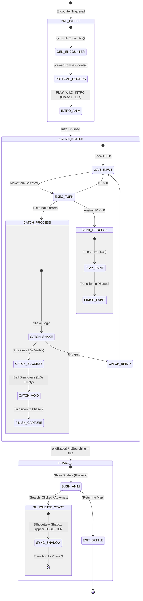

# Battle Mechanics Manual (Poké Vicio)

This manual documents the internal workings of the battle engine, from damage calculation to special abilities.

## ⚔️ Damage Calculation (Gen 4+)

### 1. Base Damage Formula

```text
Damage = floor(((2 * Level / 5 + 2) * Power * A / D) / 50) + 2
```

- **A**: Attack or Sp. Attack (reduced to 50% if the attacker is burned and the move is physical).
- **D**: Defense or Sp. Defense.

### 2. Final Multipliers

`Final Damage = floor(Damage * STAB * Ability * Effectiveness * Random * Critical * Weather * Item)`

- **STAB**: 1.5x (or 2.0x with **Adaptability** ability).
- **Effectiveness**: 0x, 0.25x, 0.5x, 1x, 2x, 4x.
- **Random**: Variation between **0.85 and 1.0**.
- **Critical**: 2.0x. Base probability 6% (12% with **Zoom Lens**, 25% after **Focus Energy**). Immune against **Shell Armor** or **Battle Armor**.

---

## 🌪️ Weather Influence

- **Sun**: 1.5x Fire Damage, 0.5x Water Damage.
- **Rain**: 1.5x Water Damage, 0.5x Fire Damage.

### 1. Atmospheric Synchronization & Integrity Protocol

To prevent desynchronization between the Map's visual weather and the Combat Engine's mechanical effects, all weather interactions MUST pass through the `weatherMapper.js` system and use the global state.

- **Single Source of Truth**: UI components (Grid, Tooltips) MUST consume weather data from `battleStore.state.weather` instead of local props or direct map state to ensure visual parity during combat transitions.
- **Centralized Mapping**: Environmental tokens (e.g., `heatwave`, `blizzard`, `storm`) are normalized to mechanical keys (`sun`, `hail`, `rain`) via `getMechanicalWeather()`.
- **Status Move Exclusion**: Modifier indicators (auras, "Penalizado por..." text) MUST be suppressed for moves of category `status` (except specific cases like Solar Beam). Damage multipliers from weather/cycle DO NOT affect status moves; showing these indicators constitutes a false positive.
- **Integrity Guard**: If a weather token is NOT registered in the mapper, the system returns an `UNKNOWN` state.
  - **HUD Feedback**: Displays a `⚠️` warning icon to notify that the weather lacks combat effects.
  - **Dev Feedback**: Triggers a `[WeatherIntegrity]` warning in the console.
- **Mandatory Registry**: Any new weather added to `weather-tables.js` MUST be added to `MAP_TO_MECHANICAL` and `WEATHER_UI_METADATA` in `weatherMapper.js`.
- **Map Persistence**: Battles inherit the current route's weather. If the weather is "permanent" (turns: -1), it persists for the entire battle unless overridden.
- **Move Override**: Weather induced by moves (e.g., Rain Dance, Hail) lasts **5 turns** and takes absolute priority over the map weather.
- **Restoration**: Once a temporary weather effect expires, the system MUST restore the original map/route weather instead of clearing to "Clear".
- **Visual Mapping**: The `BattleArenaView` must prioritize `battleStore.state.weather`. Mappings: `sun` -> `heatwave`, `hail` -> `blizzard`.

### 2. Weather Effects Table (Gen 9 Standard)

| Weather | Damage Boost | Damage Reduction | Defensive Boost | Residual Damage | Special Effects |
| :--- | :--- | :--- | :--- | :--- | :--- |
| **Sun** | Fire (1.5x) | Water (0.5x) | - | - | Solar Beam (No charge), Synthesis (66%), Thunder (50% Acc) |
| **Rain** | Water (1.5x) | Fire (0.5x) | - | - | Thunder/Hurricane (100% Acc), Synthesis (25%) |
| **Sandstorm** | - | - | Rock (1.5x SpD) | 1/16 HP (Non-Rock/Ground/Steel) | Solar Beam (50% Pow), Synthesis (25%) |
| **Snow** | - | - | Ice (1.5x Def) | **NONE** | Blizzard (100% Acc), Synthesis (25%), Solar Beam (50% Pow) |
| **Hail** | - | - | - | 1/16 HP (Non-Ice) | Blizzard (100% Acc), Synthesis (25%), Solar Beam (50% Pow) |
| **Fog** | - | - | - | - | **Accuracy: 60% (All moves)**, Solar Beam (50% Pow), Synthesis (25%) |
| **Blizzard** | - | - | Ice (1.5x Def) | 1/16 HP (Non-Ice) | Aggressive Snow/Hail hybrid. Blizzard (100% Acc) |

---

## 🧪 Critical Battle Abilities

### 1. On Entering Battle (Entry)

- **Intimidate**: Lowers the opponent's Attack by one stage.
- **Trace**: Copies the opponent's ability upon entering.

### 2. Defensive and Status

- **Sturdy**: Allows surviving with 1 HP against a lethal hit if the user had 100% HP.
- **Natural Cure**: Heals status problems when withdrawn from combat.
- **Synchronize**: If the user receives a status condition, it is automatically passed back to the attacker.

### 3. Contact (30% Probability)

Activated when receiving movements of the **Physical** category:

- **Static**: Paralysis.
- **Poison Point**: Poison.
- **Flame Body**: Burn.
- **Effect Spore**: Randomly causes sleep, paralysis, or poison.

### 4. Special Offensive

- **Technician**: 1.5x power for moves with base power <= 60.
- **Guts**: 1.5x Physical Attack if the user has a status problem.
- **Thick Fat**: Reduces damage taken from Fire or Ice type by 50%.
- **1/3 HP Boosters (1.5x)**: Blaze, Torrent, Overgrow, Swarm.

---

## 🩺 Status Conditions (Primary & Secondary)

The engine implements two layers of conditions that affect the Pokémon's performance and health.

### 1. Primary Status (Volatile/Non-Volatile)

Only ONE primary status can affect a Pokémon at a time (except in special modes):

- **Poison (PSN)**: Inflicts 1/8 of max HP damage at the end of each turn.
- **Burn (BRN)**: Inflicts 1/8 of max HP damage at the end of each turn AND reduces Physical Attack (A) to 50%.
- **Paralysis (PAR)**: Reduces Speed to 25% AND has a **25% probability** of causing "Fully Paralyzed," skipping the turn.
- **Sleep (SLP)**: Prevents the Pokémon from attacking for 1 to 3 turns. Turn count is managed via `pokemon.sleepTurns`.
- **Freeze (FRZ)**: Prevents the Pokémon from attacking. At the start of each turn, there is a **20% probability** of thawing out.
- **Type Immunity (Status Moves)**: Unlike older generations, status moves (category `status`) MUST respect type immunities. A Normal-type status move (e.g., *Gruñido*) will have NO EFFECT on a Ghost-type Pokémon. This logic is handled in `calculateDamage` by evaluating effectiveness before returning the result.

### 2. Secondary Conditions (Stackable)

These can coexist with primary status and other secondary effects:

- **Confusion**: Lasts 2 to 5 turns. **FX**: 💫 floating particle + sprite wobble.
- **Attraction**: Activated by moves like *Attract*. **FX**: ❤️ floating hearts.
- **Leech Seed**: Drains HP each turn. **FX**: 🌱 growing plants.
- **Curse (Ghost)**: Drains 1/4 HP each turn. **FX**: 👻 floating ghost + dark aura.
- **Trapped**: Cannot escape. **FX**: ⛓️ chains + jitter.
- **Protection**: Avoids damage. **FX**: 🛡️ pulsing shield aura.
- **Endure**: Survives lethal hit. **FX**: 👊 pop-in fist.
- **Focus Energy**: Crit boost. **FX**: 🎯 spinning target + red aura.
- **Lock-On**: No miss. **FX**: 👁️ blinking eye.
- **Mist/Neblina**: Prevents stat drops. **FX**: 🌫️ drifting white-blue aura. Rendered with high opacity (0.8) and Normal blend mode to ensure visibility on light backgrounds.
- **Curse (Maldición)**: This move has a **Dual Effect** based on the user's type.
  - **Ghost-type**: User sacrifices 50% max HP to curse the target (1/4 max HP damage per turn).
  - **Non-Ghost**: User gains +1 Atk, +1 Def, and -1 Speed.
- **Weather Debugging**: Debug menus MUST include all visual variants (Mist, Storm, Heatwave, Blizzard) to facilitate aesthetic testing of atmosphere layers, even if they map to the same mechanical weather.

### 3. Combat Loop Integration

- **Tick Logic**: Status damage and healing (Leech Seed) are processed in `battleStatus.js` at the end of each round.
- **Skip Logic**: Conditions like Sleep, Freeze, Paralysis, Confusion, and Attraction are evaluated in `battleFlow.js` within the `canAttack` function BEFORE move execution.
- **Immediate Faint Handling**: Durante movimientos de múltiples golpes o daño estándar, el motor DEBE invocar `store.handleFaint(side)` inmediatamente si la HP llega a 0.
- **Persistence Mandate (isFinishing)**: Durante toda la secuencia de debilitamiento y reemplazo, el flag `isFinishing` del store de batalla DEBE mantenerse en `true`. Esto bloquea el cierre prematuro del modal de combate y garantiza que el jugador transite correctamente hacia la Fase 2 (Búsqueda) o hacia la selección de un nuevo Pokémon.
- **One-Turn Volatile Cleanup**: Estados volátiles de corta duración como `destiny_bond` (Mismodestino) y `snatch` (Robo) deben expirar al inicio de la siguiente acción del usuario para garantizar que solo duren exactamente un ciclo de turno.

---

## 🔄 Pokemon Withdrawal & Switching

### 1. Manual Switching

- **Interaction Guard**: The switch action must be blocked if `isProcessing` or `isIntroAnimating` is true.
- **Logic Sequence**:
    1. Check if `oldPoke.hp > 0`. If true, emit `PLAY_WITHDRAW` and wait for the **Standard Transition Duration**.
    2. Swap the active player reference in the store.
    3. **Differential Reset**: Limpiar Stages de estadísticas (`atk`, `def`, `spa`, `spd`, `spe`, `acc`, `eva`) pero PRESERVAR efectos de campo (`reflect`, `lightScreen`, `spikes`, `mist`).
    4. Emit `PLAY_SEND_OUT` y esperar a que termine la animación.
    5. **Entry Hazard Application**: Aplicar daño de entrada (ej: Púas) inmediatamente después de que el nuevo Pokémon toque el suelo.
    6. Execute entry abilities (e.g., Intimidate).

### 2. Coordinate Synchronization & Poké Ball Alignment

Para garantizar que la Poké Ball y la sombra coincidan milimétricamente durante el intercambio:

- **Reactive Anchor Sync**: La Poké Ball DEBE calcular su posición (`left`, `top`) basándose reactivamente en los puntos `feetX` y `feetY` del `shadowStore`. No usar valores fijos (ej: 90%) si hay datos del sprite disponibles.
- **Immediate Cache Usage**: Si un Pokémon ya ha sido escaneado previamente, el sistema debe inyectar sus coordenadas desde el `feetCache` en el primer frame de la animación para evitar saltos visuales.
- **Component Integrity (Key Fix)**: El componente `BattleCombatant` debe usar una `:key` basada en el `uid` del Pokémon. Esto fuerza una recreación limpia del componente durante el cambio, evitando que el nuevo Pokémon herede coordenadas "stale" del anterior.

### 3. State Reactivity & HUD Integrity (Stages)

To ensure Vue 3 correctly tracks and displays field effects and stat changes, the system must follow strict initialization and reset protocols:

- **Reactive Property Pre-initialization**: All possible field effect properties (`lightScreen`, `reflect`, `safeguard`, `mist`, `spikes`) MUST be initialized with value `0` in the `playerStages` and `enemyStages` objects at the moment of their creation. Vue cannot reactively track properties added dynamically after the object is made reactive.
- **Full State Reset**: The `_startBattle` and `clearLogs` functions MUST explicitly reset these field properties along with the standard stat stages (`atk`, `def`, etc.) to prevent "state leakage" (e.g., starting a wild battle with a Reflect active from a previous Trainer battle).
- **Stage Attribution**: Every modification to a stage MUST trigger an `addLog` entry that includes the responsible Pokémon as the `source` to ensure the HUD correctly attributes the advantage/disadvantage.

### 2. Forced Switching (Faint)

- **Manual Selector Override**: The system MUST NOT automatically send the next healthy Pokémon when the player's active Pokémon faints. It MUST set `uiStore.isBattleSwitchForced = true` to force manual selection via the UI, preserving tactical control.
- **Faint Priority**: If a Pokémon faints due to secondary effects (Recoil, Self-KO, Poison), the system MUST invoke `handleFaint(side)` immediately to trigger the replacement flow without waiting for the end of the turn cycle.

### 3. State Reactivity (Deep Watchers)

- **Identity Integrity**: Watching only the `species.id` is insufficient for battle transitions. Reactivity MUST be tied to the complete `activePokemon` object or a unique `battleInstanceId`.
- **Ground Recalculation**: Every new encounter (even with the same species) must trigger a fresh "Feet Detection" scan to prevent inheriting miscalculated ground-offsets from previous battles.
- **Orphan Shadow Cleanup**: When a combatant is replaced (switch) or captured, the system MUST explicitly hide the previous `shadowId`. Relying on component unmounting is insufficient for the centralized store; active tracking of the `lastShadowId` is mandatory to prevent "orphan shadows" on the battlefield.
- **Flying Species Exclusion**: Pokémon with "Flying Aesthetics" (`isFloating`) MUST NOT render environmental layers (bushes). The system must conditionally suppress the `visible` prop of `CombatGrass` based on the species' flight status to maintain visual logic.

## 🏗️ Rendering Pipeline Stabilization
  
To ensure flicker-free state transitions, the battle engine must enforce visual atomicity:

### 1. Parallel Preloading (Combat Prep)

Antes de que comience cualquier animación de entrada, el sistema DEBE ejecutar un ciclo de `preloadCombatCoords` que incluya a **TODOS** los integrantes de los equipos (jugador y rival).

- **Parallel Execution**: Usar `Promise.all` para escanear los puntos de pies de todo el equipo simultáneamente durante el montaje de la arena.
- **Goal**: Garantiza que las sombras y Poké Balls estén posicionadas correctamente en su primer frame visible, eliminando el lag del escaneo de píxeles asíncrono.

### 2. Shadow Ownership & Lock

A combatant "owns" its shadow via its `uid`.

- **Ownership Lock**: The shadow store MUST block redundant requests if a shadow with the same ID and sprite is already active.
- **Persistence Mandate**: Do NOT clear the shadow store during the transition from Search (Phase 2) to Battle (Phase 3). Reusing the detected coordinates from the grass phase is mandatory to eliminate the "Phase 3 jump".

## 📝 Combat Log Flow & Sync

To maintain perfect parity between the visual action (HP bars, particles) and the battle narrative:

### 1. Dynamic Batching

The Combat Log MUST use a **Batching Strategy** when the queue contains more than 3 pending events.

- **Congestion Level 1 (>3 messages)**: Process 2 messages per tick.
- **Congestion Level 2 (>6 messages)**: Process 3 messages per tick.
- **Burst Latency**: Reduce the delay between logs to **100ms** during batching (vs **350ms** in idle) to "catch up" with the battle state.

### 2. Log Cleanliness & Noise Suppression

To maintain a focused narrative, the combat log MUST suppress redundant or confusing information:

- **Status Move Damage**: Moves with `cat: 'status'` MUST NOT generate a "X received 0 damage" log entry. Their effects (stat changes, status conditions) are already logged independently.
- **Redundant Feedback**: Avoid logging numeric 0 damage for non-damaging tactical maneuvers (buffs/debuffs) to prevent cluttering the log queue during fast-paced turns.

### 2. Execution Order (Sync-First)

Logs must be added to the queue **BEFORE** triggering animations or pauses that block the turn flow.

- **Correct Sequence**: `addLog()` -> `updateHP()` -> `waitDelay()`.
- **Atomic State Reset**: To prevent "phantom animations", the system MUST reset `activeMove` and `attackerSide` to `null` before executing manual actions (Switch, Item) and at the end of each turn.
- **Sync Parity**: Logic delays MUST match CSS transition times exactly (e.g., 1.3s for `PLAY_FAINT`, 0.8s for `PLAY_SEND_OUT`).
- **Source Integrity**: Todo log debe incluir el parámetro `source` (`p` para player, `e` para enemigo) para asegurar que el HUD renderice el avatar correcto. No confiar solo en variables globales de turno.

### 3. Iconography & Source Mapping

To ensure every log entry displays the correct sprite, the `addLog(msg, type, source)` method MUST receive a valid `source` identifier:

- **Pokémon (Mandatory)**: Pass the actual Pokémon instance/object. This is REQUIRED for all status effects and stat changes to enable automatic icon rendering. Failure to pass the source results in "anonymous" logs without sprites.
- **UID Priority**: The side detection logic MUST prioritize matching the source's `uid` against the player's team or the active enemy. Global flags like `attackerSide` should only be used as a fallback when no identity can be established from the source.
- **Centralized Formatting**: All log formatting logic is delegated to `battleLogger.js`. This allows for independent unit testing and keeps the store logic focused on state management.
- **Player**: Pass the string `'player'` to show the player's current class avatar. This is MANDATORY for trainer-sourced actions like "Send out" or "Withdraw".
- **Enemy Trainer**: Pass the string `'enemy_trainer'` to show the rival's avatar.
- **Items**: Pass the Item name or ID (string). The system will resolve the item's sprite automatically.
- **Side Override**: Pass `'player'` or `'enemy'` as the 4th argument (`sideOverride`) to force a specific background tint, overriding the automatic detection logic.

### 4. Defensive Programming (Zero-Crash Policy)

The log processing engine handles diverse data types. To prevent runtime errors like `Cannot read properties of null (reading 'uid')`:

- **Null-Safety**: Always implement defensive checks when resolving the log's side or icon. Use `source && typeof source === 'object'` before accessing properties.
- **Array Validation**: When scanning the team for UID matches, ensure each member `p` is truthy before accessing `p.uid`.

## 📡 Encounter Lifecycle & Proactive Pre-generation

To ensure absolute visual continuity and eliminate latency between encounters, the system uses proactive pre-generation in the background.

### 1. The Proactive Generation Gate

To maintain combat focus, pre-generation of the *next* encounter must occur silently while the *current* battle is active.

- **Animation Guard**: Background pre-generation MUST NOT trigger any visual "emergence" or "bounce" animations on the current battlefield.
- **Implementation**: Entrance animations (`is-emerging`) must be explicitly gated by the `isSearching` phase. If `isSearching` is false (active combat), the pre-generated Pokémon must remain static and hidden until the transition phase begins.

### 2. Visual Synchronization (Bushes & Shadows)

The environmental "sandwich" (CombatGrass) and ground anchors must only be revealed when the underlying data is fully ready.

- **Rule**: Never show encounter layers (Stage 2) until the `upcomingPokemon` data is fully loaded and pre-calculated.
- **Faint Continuity**: During the transition from Stage 1 (Faint) to Stage 2 (Bushes), the system must wait for the definitive death animation to complete (1.3s) before allowing the next encounter's environment to appear.

## 🔄 Battle Lifecycle & State Transitions

The combat engine follows a strictly phased lifecycle to ensure visual continuity and state integrity.

### 1. Global State Machine



### 2. Capture Timing Precision (The "2.0s Rule")

To maintain a cinematic feel, the capture success sequence follows a non-negotiable timing protocol:

| Time | Event | Visual State |
| :--- | :--- | :--- |
| **0.0s** | `CATCH_SUCCESS` | Sparkles start. Poké Ball visible & shaking. Enemy Sprite HIDDEN. |
| **1.0s** | **Midpoint** | Sparkles end. Poké Ball despawns. |
| **1.0s - 2.0s** | **The Void** | Stage is COMPLETELY EMPTY. No sprites, no balls, no HUDs. |
| **2.0s** | **Phase 2 Trigger** | `isSearching = true`. Transition to bushes starts. |

### 4. Capture Animation Fidelity

To maintain the "Fase 2" premium feel, certain animations MUST NOT be simplified or removed:

- **Poké Ball Wobble**: The physical balanceo of the ball during capture attempts is a core mechanical feedback and MUST be preserved in `BattleCombatant.vue` keyframes.
- **Energy Shake/Blink**: The pulsing light effect inside the ball during the "shaking" phase must remain active to signify the capture struggle.
- **Sparkle Coordination**: Success particles MUST be synchronized with the exact frame the ball clicks shut to reinforce the success signal.

### 3. Exit Procedures

- **Search (Loop)**: Resets `over` state, clears old logs, but **persists** the camera and ground coordinates to avoid jumps.
- **Return to Map**: Triggers `closeModal`. The `isBattleActive` flag MUST be cleared last to ensure all components can unmount cleanly without trying to read stale battle data.

## 🧹 State Hygiene & Phantom Animations

To prevent "Phantom Animations" (e.g., a Pokémon performing a Dash when using an item because it remembers the last attack performed):

1. **Active Move Reset**: References to `activeMove` and `attackerSide` **MUST** be reset to `null` immediately after finishing a turn and at the start of each battle (`_startBattle`).
2. **Turn Atomicity**: No animation state from the previous turn should persist in the next action. This includes clearing `activeMove` before processing item usage or Pokémon swaps.
3. **Shadow Visibility Reset**: When starting an encounter, the shadow's opacity must be explicitly reset to prevent shadows from previous battles from appearing before the entry animation.

## ⚙️ Action Registry & Engine Expansion

The battle engine uses a decoupled architecture where move effects are mapped to executable logic via the `ActionRegistry`.

- **Action Dispatching Order**: El motor debe seguir un orden secuencial estricto:
    1. **Dynamic Interception**: Movimientos como Metrónomo o Espejo se resuelven ANTES del cálculo de daño.
    2. **Primary Damage**: Cálculo y aplicación de HP.
    3. **Post-Action Effects**: Ejecución de Recoil, Drenado y Auto-KO (Explosión) consumiendo el `lastDamage` registrado.
- **Modular Implementation**: Logic for new effects should be grouped by type:
  - `statActions.js`: For all stage modifiers (Atk, Def, etc.).
  - `fieldActions.js`: For side-based effects (Screens, Weather, Hazards).
  - `statusActions.js`: For primary status conditions (Burn, Sleep, etc.).
  - `specialActions.js`: For unique mechanics (Transform, Roar, Metronome).
- **Source Propagation**: All action functions MUST receive and propagate the `src` and `tgt` objects to the `addLogFn` to maintain the visual link between the action and the combatant's sprite.
- **Data Integrity (Move Sync)**: Moves in the player's team may have stale metadata. Before processing an effect, the engine MUST verify/sync the `effect` property from the `pokemonDataProvider` if it is missing or null.
- **Battle Context (Team Access)**: Actions that force switches (e.g., *Roar*, *Whirlwind*) or involve team data MUST have access to `activeBattle.playerTeam`. This team reference is injected during battle initialization.
- **Technical Debugging Standard**:
  - **Technical Logs**: Internal dispatching details, target resolution, and technical blocks (e.g., "Stat already at -6") MUST use `console.log` or `console.warn` instead of the combat log.
  - **Game Logs**: Only "gameplay-relevant" failures (e.g., "Clear Body prevented the drop", "Type immunity") should be added to the user-facing `addLog`.
- **Modular Stat Validation**: Functions like `checkInmunity` MUST receive `tgtStages` to validate technical limits (-6/+6) and trigger the appropriate console warnings.
- **Relative Effects (Recoil/Drain)**: Effects that depend on damage dealt (e.g., `drain_50`, `recoil_25`) MUST consume `battleCtx.lastDamage` from the combat context to calculate the final healing or recoil amount.

## 🏃 Escape & Withdrawal Actions

### 1. Teleport (Gen 8+ Parity)

The Teleport move follows specific logic based on the battle context to maintain competitive balance:

- **Wild Battles**: The Pokémon escapes immediately. The battle ends calling `endBattle(false, true)`.
- **Trainer Battles (Enemy)**:
  - If the Pokémon has teammates alive, it performs a **Withdrawal** (Gen 8 style) and a replacement is sent out immediately.
  - If it is the LAST Pokémon in the trainer's party, the battle ends as the trainer retreats/flees.
- **Player (Safe Design)**: For security and UI simplicity, Teleport is currently restricted to failing if the player has more Pokémon, preventing potential state desynchronization in the switch-menu.

## 🛡️ Engine Safety & Callbacks

### 1. Robust Option Destructuring

When implementing or modifying core logic functions that accept an `options` object (like `getEffectiveSpeed`), follow the **Fallback Pattern** to prevent runtime crashes:

- **Rule**: NEVER destructure without a fallback to the global/imported version of the function.
- **Implementation**:

  ```javascript
  import { globalFn } from '../utils';
  
  export function coreLogic(data, options = {}) {
    const fn = options.fn || globalFn; // Safe fallback
    return fn(data);
  }
  ```

- **Why**: Prevents `TypeError: fn is not a function` when the function is called from turn-logic or debug-tools that may pass incomplete option objects.

---

## 📝 Advanced Log Attribution

### 1. Trainer vs Pokémon Source

To ensure every log entry displays the correct sprite/avatar:

- **Trainer Actions**: Logs for trainer actions (e.g., "Send out", "Switch", "Withdraw") MUST use the literal string `'player'` or `'enemy_trainer'` as the `source`.
- **FORBIDDEN**: Do NOT pass the Pokémon object as the source for trainer-only logs, as it would incorrectly show the Pokémon's avatar instead of the human trainer's.
- **Side Override**: Pass `'player'` or `'enemy'` as the 4th argument (`sideOverride`) to `addLog` to force a specific background tint, overriding the automatic detection logic based on UID.

---

## 🎣 Capture System Synchronization

To ensure all Poké Balls comply with their official formulas and respond to the environment:

### 1. Mandatory Environmental Context

Every call to `calculateCatchRate` MUST receive an enriched `ctx` object from the battle store:

- **`weather`**: Inject the current map weather or the temporary battle weather.
- **`cycle`**: Inject the time cycle (`mapStore.currentCycle`) to respect time-based locks (e.g., debugging at night during noon).

### 2. Environmental Multipliers (2026 Audit)

- **Dusk Ball**: MUST apply its multiplier (x3.0) if `isNight || isCave || isFog` is met. Fog is considered a low-visibility environment compatible with this ball.
- **Net Ball**: In addition to Water/Bug types, it MUST apply a bonus (x3.5) if the weather is `rain` or `storm`.

### 3. Turn Counter (Timer Ball)

The `turnCount` is a live state. It MUST be explicitly incremented in `applyEndTurnEffects` of the battle store. It should never be incremented before end-turn effects (poison, weather, etc.) have been processed, to maintain visual parity with the UI.
