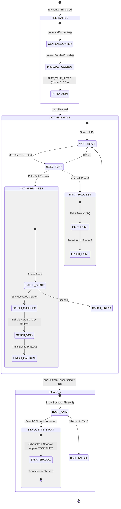

# Battle Mechanics Manual (Poké Vicio)

This manual documents the internal workings of the battle engine, from damage calculation to special abilities.

## ⚔️ Damage Calculation (Gen 4+)

### 1. Base Damage Formula

```text
Damage = floor(((2 * Level / 5 + 2) * Power * A / D) / 50) + 2
```

- **A**: Attack or Sp. Attack (reduced to 50% if the attacker is burned and the move is physical).
- **D**: Defense or Sp. Defense.

### 2. Final Multipliers

`Final Damage = floor(Damage * STAB * Ability * Effectiveness * Random * Critical * Weather * Item)`

- **STAB**: 1.5x (or 2.0x with **Adaptability** ability).
- **Effectiveness**: 0x, 0.25x, 0.5x, 1x, 2x, 4x.
- **Random**: Variation between **0.85 and 1.0**.
- **Critical**: 2.0x. Base probability 6% (12% with **Zoom Lens**, 25% after **Focus Energy**). Immune against **Shell Armor** or **Battle Armor**.

---

## 🌪️ Weather Influence

- **Sun**: 1.5x Fire Damage, 0.5x Water Damage.
- **Rain**: 1.5x Water Damage, 0.5x Fire Damage.

---

## 🧪 Critical Battle Abilities

### 1. On Entering Battle (Entry)

- **Intimidate**: Lowers the opponent's Attack by one stage.
- **Trace**: Copies the opponent's ability upon entering.

### 2. Defensive and Status

- **Sturdy**: Allows surviving with 1 HP against a lethal hit if the user had 100% HP.
- **Natural Cure**: Heals status problems when withdrawn from combat.
- **Synchronize**: If the user receives a status condition, it is automatically passed back to the attacker.

### 3. Contact (30% Probability)

Activated when receiving movements of the **Physical** category:

- **Static**: Paralysis.
- **Poison Point**: Poison.
- **Flame Body**: Burn.
- **Effect Spore**: Randomly causes sleep, paralysis, or poison.

### 4. Special Offensive

- **Technician**: 1.5x power for moves with base power <= 60.
- **Guts**: 1.5x Physical Attack if the user has a status problem.
- **Thick Fat**: Reduces damage taken from Fire or Ice type by 50%.
- **1/3 HP Boosters (1.5x)**: Blaze, Torrent, Overgrow, Swarm.

---

## 🏃 Speed and Priority

- **Paralysis**: Reduces actual speed to 50%.
- **Weather and Ability (2x Speed)**:
  - **Chlorophyll**: During Morning/Day.
  - **Swift Swim**: During Evening/Night.
- **Run Away**: 2x Speed if the user has a status problem.

---

## 🔄 Pokemon Withdrawal & Switching

### 1. Manual Switching

- **Interaction Guard**: The switch action must be blocked if `isProcessing` or `isIntroAnimating` is true.
- **Logic Sequence**:
    1. Check if `oldPoke.hp > 0`. If true, emit `PLAY_WITHDRAW` and wait for the **Standard Transition Duration** (matched to CSS).
    2. Swap the active player reference in the store.
    3. Reset attribute stages (atk, def, etc.) to 0.
    4. Emit `PLAY_SEND_OUT` and wait for the **Standard Transition Duration**.
    5. Execute entry abilities (e.g., Intimidate).

### 2. Forced Switching (Faint)

- When a Pokémon's HP reaches 0, the `PLAY_FAINT` animation must trigger first.
- The `PLAY_WITHDRAW` animation is SKIPPED during a forced switch because the Pokémon is already fainted/invisible.
- The UI MUST set `uiStore.isBattleSwitchForced = true` to prevent the user from taking other actions until a replacement is chosen.

### 3. State Reactivity (Deep Watchers)

- **Identity Integrity**: Watching only the `species.id` is insufficient for battle transitions. Reactivity MUST be tied to the complete `activePokemon` object or a unique `battleInstanceId`.
- **Ground Recalculation**: Every new encounter (even with the same species) must trigger a fresh "Feet Detection" scan to prevent inheriting miscalculated ground-offsets from previous battles.
- **Orphan Shadow Cleanup**: When a combatant is replaced (switch) or captured, the system MUST explicitly hide the previous `shadowId`. Relying on component unmounting is insufficient for the centralized store; active tracking of the `lastShadowId` is mandatory to prevent "orphan shadows" on the battlefield.
- **Flying Species Exclusion**: Pokémon with "Flying Aesthetics" (`isFloating`) MUST NOT render environmental layers (bushes). The system must conditionally suppress the `visible` prop of `CombatGrass` based on the species' flight status to maintain visual logic.

## 🏗️ Rendering Pipeline Stabilization
  
To ensure flicker-free state transitions, the battle engine must enforce visual atomicity:

### 1. The Preloading Phase (Intro)

Before any intro animation (Phases 1-3) starts, the system MUST execute a `preloadCombatCoords` cycle. This cycle performs a silent, synchronous scan for feet-anchors of all participants.

- **Goal**: Guarantees that shadows and bushes are positioned at their final coordinates on the very first visible frame.

### 2. Shadow Ownership & Lock

A combatant "owns" its shadow via its `uid`.

- **Ownership Lock**: The shadow store MUST block redundant requests if a shadow with the same ID and sprite is already active.
- **Persistence Mandate**: Do NOT clear the shadow store during the transition from Search (Phase 2) to Battle (Phase 3). Reusing the detected coordinates from the grass phase is mandatory to eliminate the "Phase 3 jump".

## 📝 Combat Log Flow & Sync

To maintain perfect parity between the visual action (HP bars, particles) and the battle narrative:

### 1. Dynamic Batching

The Combat Log MUST use a **Batching Strategy** when the queue contains more than 3 pending events.

- **Congestion Level 1 (>3 messages)**: Process 2 messages per tick.
- **Congestion Level 2 (>6 messages)**: Process 3 messages per tick.
- **Burst Latency**: Reduce the delay between logs to **100ms** during batching (vs **350ms** in idle) to "catch up" with the battle state.

### 2. Execution Order (Sync-First)

Logs must be added to the queue **BEFORE** triggering animations or pauses that block the turn flow.

- **Correct Sequence**: `addLog()` -> `updateHP()` -> `waitDelay()`.
- **Why**: This allows the log's batching engine to start rendering the text while the HP bar animation is still playing, making the action feel responsive y synchronized.

### 3. Iconography & Source Mapping

To ensure every log entry displays the correct sprite, the `addLog(msg, type, source)` method MUST receive a valid `source` identifier:

- **Pokémon**: Pass the actual Pokémon instance/object. The system will resolve its sprite and check its team membership for side-based background tinting.
- **Player**: Pass the string `'player'` to show the player's current class avatar.
- **Enemy Trainer**: Pass the string `'enemy_trainer'` to show the rival's avatar.
- **Items**: Pass the Item name or ID (string). The system will resolve the item's sprite automatically.
- **Side Override**: Pass `'player'` or `'enemy'` as the 4th argument (`sideOverride`) to force a specific background tint, overriding the automatic detection logic.

### 4. Defensive Programming (Zero-Crash Policy)

The log processing engine handles diverse data types. To prevent runtime errors like `Cannot read properties of null (reading 'uid')`:

- **Null-Safety**: Always implement defensive checks when resolving the log's side or icon. Use `source && typeof source === 'object'` before accessing properties.
- **Array Validation**: When scanning the team for UID matches, ensure each member `p` is truthy before accessing `p.uid`.

## 📡 Encounter Lifecycle & Proactive Pre-generation

To ensure absolute visual continuity and eliminate latency between encounters, the system uses proactive pre-generation in the background.

### 1. The Proactive Generation Gate

To maintain combat focus, pre-generation of the *next* encounter must occur silently while the *current* battle is active.

- **Animation Guard**: Background pre-generation MUST NOT trigger any visual "emergence" or "bounce" animations on the current battlefield.
- **Implementation**: Entrance animations (`is-emerging`) must be explicitly gated by the `isSearching` phase. If `isSearching` is false (active combat), the pre-generated Pokémon must remain static and hidden until the transition phase begins.

### 2. Visual Synchronization (Bushes & Shadows)

The environmental "sandwich" (CombatGrass) and ground anchors must only be revealed when the underlying data is fully ready.

- **Rule**: Never show encounter layers (Stage 2) until the `upcomingPokemon` data is fully loaded and pre-calculated.
- **Faint Continuity**: During the transition from Stage 1 (Faint) to Stage 2 (Bushes), the system must wait for the definitive death animation to complete (1.3s) before allowing the next encounter's environment to appear.

## 🔄 Battle Lifecycle & State Transitions

The combat engine follows a strictly phased lifecycle to ensure visual continuity and state integrity.

### 1. Global State Machine



### 2. Capture Timing Precision (The "2.0s Rule")

To maintain a cinematic feel, the capture success sequence follows a non-negotiable timing protocol:

| Time | Event | Visual State |
| :--- | :--- | :--- |
| **0.0s** | `CATCH_SUCCESS` | Sparkles start. Poké Ball visible & shaking. Enemy Sprite HIDDEN. |
| **1.0s** | **Midpoint** | Sparkles end. Poké Ball despawns. |
| **1.0s - 2.0s** | **The Void** | Stage is COMPLETELY EMPTY. No sprites, no balls, no HUDs. |
| **2.0s** | **Phase 2 Trigger** | `isSearching = true`. Transition to bushes starts. |

### 3. Exit Procedures

- **Search (Loop)**: Resets `over` state, clears old logs, but **persists** the camera and ground coordinates to avoid jumps.
- **Return to Map**: Triggers `closeModal`. The `isBattleActive` flag MUST be cleared last to ensure all components can unmount cleanly without trying to read stale battle data.

## 🧹 State Hygiene & Phantom Animations

To prevent "Phantom Animations" (e.g., a Pokémon performing a Dash when using an item because it remembers the last attack performed):

1. **Active Move Reset**: References to `activeMove` and `attackerSide` **MUST** be reset to `null` immediately after finishing a turn and at the start of each battle (`_startBattle`).
2. **Turn Atomicity**: No animation state from the previous turn should persist in the next action. This includes clearing `activeMove` before processing item usage or Pokémon swaps.
3. **Shadow Visibility Reset**: When starting an encounter, the shadow's opacity must be explicitly reset to prevent shadows from previous battles from appearing before the entry animation.
