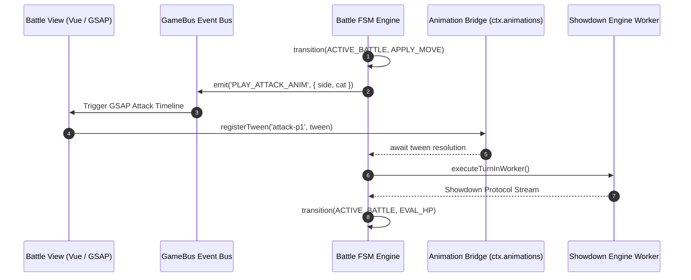
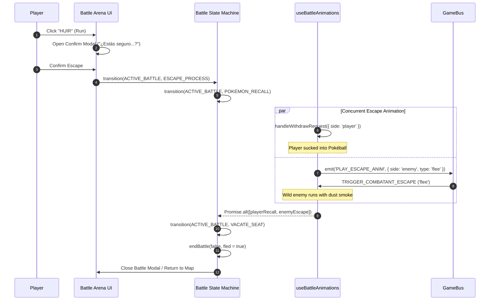
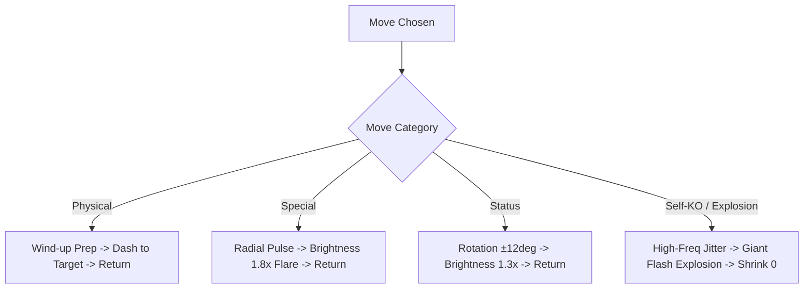
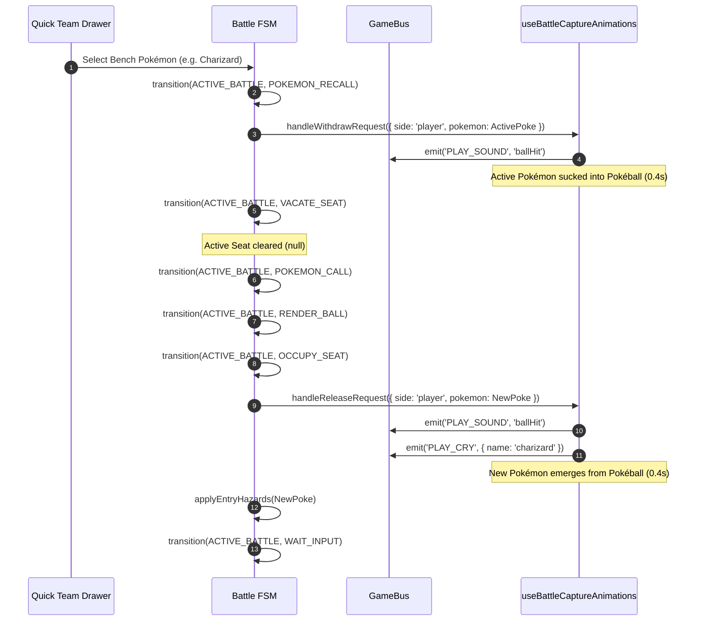
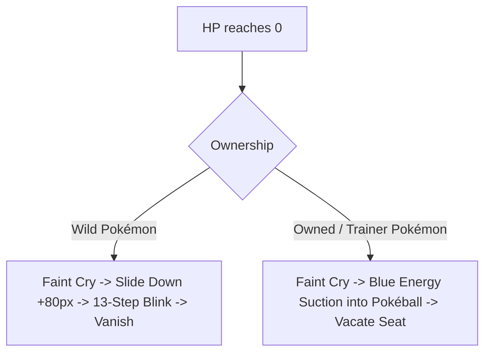
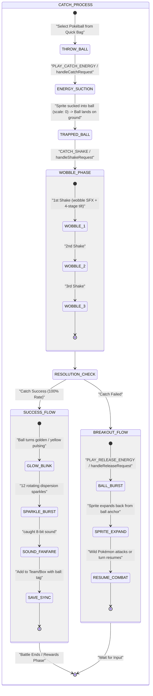

# Battle Animations & State Orchestration: QA Manual Testing Guide

This technical guide provides a comprehensive, rigorous quality assurance (QA) protocol for manually verifying **100% of all combat animations, state transitions, expulsion physics, switch workflows, escape sequences, attack reactions, and capture flows** in Poké Vicio.

---

## 🏛️ 1. Architectural Foundations & Verification Model

All combat visuals in Poké Vicio follow strict architectural standards governed by the project's **Hybrid Retro-Modern** identity.

### 1.1 GSAP-Exclusive Engine & Zero-Timer Mandate

- **Strict GSAP Exclusivity**: All visual tweens, camera shifts, sprite transformations, and particle emitters are driven exclusively by GSAP timelines (`gsap.timeline`, `gsap.to`, `gsap.fromTo`). Manual CSS `@keyframes` or native browser timers (`setTimeout`, `setInterval`) for visual flow are strictly prohibited.
- **The Animation Promise Bridge (`ctx.animations`)**: The Finite State Machine (FSM) is interlocked with GSAP animations. The orchestrator awaits typed promises returned by `useBattleAnimations.ts` / `useBattleCaptureAnimations.ts` via `awaitAnimation(timeline)` before committing state transitions.
- **Seat Model & Selective Suppression**:
  - The battlefield manages 4 physical seats: `seat1` (Player active), `seat2` (Enemy 1 active), `seat3` (Ally active - 2v2 reserved), `seat4` (Enemy 2 active - 2v2 reserved).
  - When a seat is empty (`null`), the Pokémon sprite, ground shadow, and status particles are suppressed. Non-Pokémon entities (Poké Balls, projectiles) follow their own decoupled lifecycles.
- **Coordinate Pre-Calculation & Shadow Synchronization**:
  - Every combatant sprite has its feet anchor (`feetX`, `feetY`), ground line (`groundY`, `localGroundY`), and shadow scale pre-cached before becoming visible to eliminate 1-frame position jumping.



### 1.2 Debug Access & Verification Tools

QA testers can inspect and trigger all states through three synchronized interfaces:

1. **In-Game Debug Trigger Row**: Click the bottom floating **DEBUG (🕹️)**, **EFECTOS (✨)**, **TIEMPO (⌛)**, or **SPAWN (🎲)** buttons in `BattleDebugTools.vue`.
2. **Browser Console Bridge (`window.__VITE_DEBUG__`)**: Direct console execution exposed in development builds (`npm run dev`).
3. **Event Bus Injections (`gameBus.emit`)**: Direct event firing via the global `gameBus`.

---

## 🌪️ 2. Forced Switches (Phazing), Expulsions & Pivots

### 2.1 Mechanical Taxonomy: Phazing (`|drag|`) vs. Pivots (`|switch|`)

The battle engine differentiates between two distinct switch categories:

1. **Involuntary Expulsion / Phazing (`|drag|`)**:
   - Triggered on the **target** of phazing moves (*Whirlwind*, *Roar*, *Dragon Tail*, *Circle Throw*) or items (*Red Card*).
   - The victim executes an involuntary expulsion animation (`whirlwind`, `flee`, `knockback`) without returning to a Poké Ball.
   - The replacement Pokémon is dragged into the seat involuntarily (`¡[Pokémon] fue arrastrado al campo!`).
2. **Voluntary Pivot / Self-Switch (`|switch|`)**:
   - Triggered on the **user** of pivot moves (*U-turn*, *Volt Switch*, *Flip Turn*, *Parting Shot*, *Chilly Reception*, *Shed Tail*, *Baton Pass*, *Teleport*) or items (*Eject Button*, *Eject Pack*).
   - The user executes a controlled Poké Ball recall (`handleWithdrawRequest`).
   - The replacement Pokémon is deployed normally via Poké Ball launch (`POKEMON_CALL` -> `RENDER_BALL` -> `handleReleaseRequest`).

```mermaid
stateDiagram-v2
    state FORCED_SWITCH_SEQ {
        [*] --> DETECT_TRIGGER : "Showdown Log: |drag| or forced |switch|"

        state DETECT_TRIGGER <<choice>>
        DETECT_TRIGGER --> PHAZING_EJECTION : "type == 'drag' (Whirlwind, Roar, Dragon Tail)"
        DETECT_TRIGGER --> VOLUNTARY_WITHDRAW : "type == 'switch' (U-turn, Baton Pass, Regular Switch)"

        state PHAZING_EJECTION {
            [*] --> RESOLVE_MOVE_ANIM : "getForcedExitConfig(moveId)"
            RESOLVE_MOVE_ANIM --> PLAY_EXPULSION_ANIM : "Trigger 'whirlwind' | 'flee' | 'teleport' | 'knockback'"
            PLAY_EXPULSION_ANIM --> AWAIT_EXPULSION_TWEEN : "awaitTween('escape-${side}')"
            AWAIT_EXPULSION_TWEEN --> VACATE_SEAT : "exitingPokemon = null, Free Seat"
            VACATE_SEAT --> [*]
        }

        state VOLUNTARY_WITHDRAW {
            [*] --> POKEMON_RECALL : "animState = 'catching' (Pokéball Recall)"
            POKEMON_RECALL --> AWAIT_RECALL_TWEEN : "awaitTween('${side}-${uid}')"
            AWAIT_RECALL_TWEEN --> VACATE_SEAT_VOLUNTARY : "Free Seat"
            VACATE_SEAT_VOLUNTARY --> [*]
        }

        PHAZING_EJECTION --> INCOMING_POKEMON_CALL : "Slot Vacated"
        VOLUNTARY_WITHDRAW --> INCOMING_POKEMON_CALL : "Slot Vacated"

        state INCOMING_POKEMON_CALL {
            [*] --> CHECK_SEAT_OWNER
            state CHECK_SEAT_OWNER <<choice>>
            CHECK_SEAT_OWNER --> TRAINER_OR_DRAG_CALL : "isTrainer OR isForcedDrag"
            CHECK_SEAT_OWNER --> PLAYER_MANUAL_MENU : "isPlayer Voluntary / Revive"

            state TRAINER_OR_DRAG_CALL {
                [*] --> LOG_ENTRANCE : "Log: '¡[Trainer] envía a [Pokémon]!' or '¡[Pokémon] fue arrastrado!'"
                LOG_ENTRANCE --> POKEMON_CALL : "FSM -> POKEMON_CALL"
                POKEMON_CALL --> RENDER_BALL : "FSM -> RENDER_BALL"
                RENDER_BALL --> OCCUPY_SEAT : "FSM -> OCCUPY_SEAT (Assign active combatant)"
                OCCUPY_SEAT --> HANDLE_RELEASE_ANIM : "handleReleaseRequest({ side, pokemon })"
                HANDLE_RELEASE_ANIM --> AWAIT_RELEASE_TWEEN : "awaitTween('${side}-${targetUid}')"
                AWAIT_RELEASE_TWEEN --> APPLY_HAZARDS : "applyEntryHazards(target)"
                APPLY_HAZARDS --> [*]
            }

            state PLAYER_MANUAL_MENU {
                [*] --> OPEN_SWITCH_MENU : "isBattleSwitchForced = true, FSM -> SWITCH_MENU"
                OPEN_SWITCH_MENU --> [*]
            }

            TRAINER_OR_DRAG_CALL --> [*]
        }

        INCOMING_POKEMON_CALL --> [*] : "Combatant Active & Ready"
    }
```



### 2.2 Forced Exit Animation Types & GSAP Keyframes

Defined in [`forcedSwitchRegistry.ts`](file:///c:/Users/franc/Trabajo/Juegos/Pokemon-Online/src/logic/battle/helpers/forcedSwitchRegistry.ts) and [`useBattleCombatantState.ts`](file:///c:/Users/franc/Trabajo/Juegos/Pokemon-Online/src/components/battle/useBattleCombatantState.ts):

| Animation Type (`BattleEscapeType`) | GSAP Kinematics & Physics | Duration | Audio Cue | Target State Result |
| :--- | :--- | :--- | :--- | :--- |
| **`whirlwind`** | 720° rotation (`rotation: 720`), upward lift (`y: -180px`), lateral ejection (`x: ±200px`), shrink (`scale: 0.1`, `opacity: 0`, `ease: 'power2.in'`). | `0.55s` | `flee` | Seat vacated, sprite cleared. |
| **`flee`** | Dense smoke particle burst (`30` particles with upward drift) + high-velocity horizontal slide (`x: ±120px`, `scale: 0.7`, `opacity: 0`, `ease: 'power2.in'`). | `0.50s` | `flee` | Seat vacated, particles fade out. |
| **`knockback`** | Impact shake + elastic backward shove (`x: ±120px`, `scale: 0.5`, `opacity: 0`, `ease: 'back.in(1.7)'`). | `0.35s` | `damage` | Seat vacated, sprite cleared. |
| **`teleport`** | Vertical stretch (`scaleY: 2.0`, `scaleX: 0.1`), extreme brightness flare (`filter: brightness(3) contrast(1.5)`), fade out (`opacity: 0`, `ease: 'power3.in'`). | `0.40s` | `flee` | Seat vacated, filters cleared. |
| **`withdraw`** | Centered Poké Ball suction: blue energy filter (`#pixel-energy-optimized`), coordinate shrink to ball anchor (`scale: 0`, `ease: 'power2.inOut'`). | `0.40s` | `ballHit` | Trapped in ball, seat vacated. |

### 2.3 Comprehensive Move & Item Mapping Matrix

| Trigger Name | Trigger ID | Category | Exit Target | Animation Type | Localized Expulsion Combat Log |
| :--- | :--- | :--- | :--- | :--- | :--- |
| **Whirlwind** (*Remolino*) | `whirlwind` | Move (Phazing) | Target | `whirlwind` | `¡[Pokémon] fue expulsado por el remolino!` |
| **Roar** (*Rugido*) | `roar` | Move (Phazing) | Target | `flee` | `¡[Pokémon] huyó asustado por el rugido!` |
| **Dragon Tail** (*Cola Dragón*) | `dragontail` | Move (Phazing) | Target | `knockback` | `¡[Pokémon] fue arrojado fuera por la cola dragón!` |
| **Circle Throw** (*Llave Giro*) | `circlethrow` | Move (Phazing) | Target | `knockback` | `¡[Pokémon] fue lanzado fuera del combate!` |
| **Teleport** (*Teletransporte*) | `teleport` | Move (Pivot/Flee) | User | `teleport` | `¡[Pokémon] se teletransportó lejos!` |
| **U-turn** (*Ida y Vuelta*) | `uturn` | Move (Pivot) | User | `withdraw` | `¡[Pokémon] dio media vuelta y regresó!` |
| **Volt Switch** (*Voltiocambio*) | `voltswitch` | Move (Pivot) | User | `withdraw` | `¡[Pokémon] cambió de posición con un chispazo!` |
| **Flip Turn** (*Viraje*) | `flipturn` | Move (Pivot) | User | `withdraw` | `¡[Pokémon] viró ágilmente y regresó!` |
| **Parting Shot** (*Última Palabra*) | `partingshot` | Move (Pivot) | User | `withdraw` | `¡[Pokémon] se retira tras su última palabra!` |
| **Chilly Reception** (*Chiste Helado*) | `chillyreception` | Move (Pivot) | User | `withdraw` | `¡[Pokémon] dejó el campo tras su chiste helado!` |
| **Shed Tail** (*Cola Descarrilada*) | `shedtail` | Move (Pivot) | User | `withdraw` | `¡[Pokémon] mudó su cola y regresó!` |
| **Baton Pass** (*Relevo*) | `batonpass` | Move (Pivot) | User | `withdraw` | `¡[Pokémon] pasa el relevo!` |
| **Red Card** (*Tarjeta Roja*) | `redcard` | Item (Phazing) | Attacker | `knockback` | `¡La Tarjeta Roja expulsó a [Pokémon]!` |
| **Eject Button** (*Botón Escape*) | `ejectbutton` | Item (Pivot) | Holder | `withdraw` | `¡El Botón Escape activó la retirada de [Pokémon]!` |
| **Eject Pack** (*Mochila Escape*) | `ejectpack` | Item (Pivot) | Holder | `withdraw` | `¡La Mochila Escape activó la retirada de [Pokémon]!` |

### 2.4 Special Failure Case: Empty Bench (0 Alive Pokémon)

When a forced switch move targets a Pokémon whose trainer has **no eligible benched Pokémon** (all other members are fainted, or 1v1 wild encounter):

1. **Status Phazing Moves (Whirlwind / Roar)**:
   - The move fails completely in Showdown (`|-fail|`).
   - The UI outputs: `¡Pero falló!` (or `No tuvo efecto`).
   - **Visual Verification**: The active Pokémon remains stationary on the battlefield; **NO** exit animation plays, and **NO** seat vacation occurs.
2. **Damage Phazing Moves (Dragon Tail / Circle Throw)**:
   - The move deals physical damage normally; damage shake (`PLAY_DAMAGE`) and HP bar reduction execute.
   - The forced switch effect fails silently without throwing an expulsion event.
   - **Visual Verification**: The Pokémon takes damage and stays in battle.

### 2.5 QA Step-by-Step Reproduction Guide

#### Test Case 2.5.1: Enemy Whirlwind on Player (Player has healthy bench)

1. Enter a Trainer Battle with a party of 3 living Pokémon.
2. Execute an enemy move or use the console to trigger Whirlwind on player:

   ```javascript
   // Simulate Whirlwind expulsion on player
   window.__VITE_DEBUG__.triggerAnim('escape_flee', 'player', { type: 'whirlwind' })
   ```

3. **Verify**:
   - Player sprite performs a 720° rotation spiral lifting upward and to the left (`x: -200px, y: -180px, scale: 0.1`).
   - Sound `flee` plays.
   - Log displays: `¡[PlayerPoke] fue expulsado por el remolino!`.
   - Incoming Pokémon is dragged out with `¡[NextPoke] fue arrastrado al campo!`, rendering the Poké Ball and releasing the sprite.

#### Test Case 2.5.2: Player Dragon Tail on Enemy Trainer (Enemy has bench)

1. In a Trainer battle against an opponent with 2+ Pokémon, select **Cola Dragón** (*Dragon Tail*).
2. **Verify**:
   - Damage shake (`PLAY_DAMAGE`) executes on the enemy sprite.
   - Enemy sprite performs knockback recoil (`x: +120px, scale: 0.5, ease: 'back.in(1.7)'`).
   - Log outputs: `¡[EnemyPoke] fue arrojado fuera por la cola dragón!`.
   - Enemy trainer automatically calls the next Pokémon: `¡[Trainer] envía a [NextPoke]!`.

#### Test Case 2.5.3: Whirlwind Against Empty Bench (Failure Verification)

1. Fight a wild Pokémon or a Trainer down to their last Pokémon.
2. Use **Remolino** (*Whirlwind*) or **Rugido** (*Roar*).
3. **Verify**:
   - Log outputs: `¡Pero falló!`.
   - Target does NOT move, shake, or disappear.
   - Turn finishes and control returns to `WAIT_INPUT`.

---

## 🏃 3. Flee (Huida) and Teleport Mechanics

### 3.1 Player Flee Workflow & Calculation

When the player clicks **HUIR** in a wild encounter:

1. **Pre-Combat Check**: If fleeing during the encounter intro/search phase (`isPreCombat`), escape is 100% guaranteed.
2. **In-Combat Speed Formula**: Evaluated in `calculateEscapeChance` ([`battleFormulas.ts`](file:///c:/Users/franc/Trabajo/Juegos/Pokemon-Online/src/logic/battle/battleFormulas.ts)):
   - If player Speed $\ge$ wild enemy Speed $\rightarrow$ **100% Guaranteed**.
   - If player has `Run Away` ability, holds `Smoke Ball` / `Poké Doll`, or is `Ghost` type $\rightarrow$ **100% Guaranteed**.
   - Otherwise, calculates chance: $F = \frac{\text{PlayerSpeed} \times 128}{\text{EnemySpeed}} + 30 \times \text{Attempts}$.



### 3.2 Parallel Flee Execution Standard

- **Player Sprite**: Recalls into its Poké Ball via `handleWithdrawRequest({ side: 'player' })` using the blue suction energy effect. Player Pokémon **NEVER** play dust smoke or run-off animations.
- **Wild Enemy Sprite**: Emits dust particles and slides horizontally off-screen (`x: +120px, opacity: 0`) via `TRIGGER_COMBATANT_ESCAPE` with `type: 'flee'`.
- **Synchronization**: Handled via `Promise.all([playerRecallPromise, enemyEscapePromise])` in [`battleFlee.ts`](file:///c:/Users/franc/Trabajo/Juegos/Pokemon-Online/src/logic/battle/battleFlee.ts). Neither sprite disappears abruptly before both animations resolve.

### 3.3 Failed Flee & Enemy Counter-Attack

If the escape check fails:

1. Log outputs: `¡No pudiste escapar!`.
2. Enemy cry plays (`PLAY_CRY`).
3. State transitions to `BUILD_QUEUE` $\rightarrow$ `POP_ACTION` $\rightarrow$ `APPLY_MOVE`.
4. Enemy AI selects and executes a move against the defenseless player.
5. If player survives: FSM returns cleanly to `WAIT_INPUT`.
6. If player HP reaches 0: FSM transitions to `PLAYER_FAINT_SEQ`.

### 3.4 Teleport (*Teletransporte*) Mechanics

- **Wild Encounters (e.g. Abra)**:
  - Abra uses Teleport on Turn 1.
  - Executes `teleport` GSAP tween: vertical stretch (`scaleY: 2.0`, `scaleX: 0.1`), brightness spike (`brightness(3)`), and instant escape.
  - Log outputs: `¡Abra se teletransportó lejos!`. Battle ends as wild escape.
- **Trainer Battles (Gen 8+ Pivot Parity)**:
  - If trainer has healthy Pokémon on bench: Teleport triggers a voluntary switch (`handleWithdrawRequest`), recalling the user and prompting/sending the next Pokémon.
  - If user is the last standing Pokémon: Battle ends as an immediate escape/resolution.

### 3.5 QA Step-by-Step Reproduction Guide

#### Test Case 3.5.1: Successful Wild Escape (Parallel Animation)

1. Start a wild encounter in Route 1 (`npm run dev` -> Map -> Grass).
2. Click **HUIR** -> Confirm.
3. **Verify**:
   - Player Pokémon is sucked into its Poké Ball with blue energy beam and `ballHit` SFX.
   - Wild Pokémon creates 30 dust particles and dashes rightward with `flee` SFX.
   - Both animations run simultaneously without frame drops.
   - Arena fades out smoothly back to the route map.

#### Test Case 3.5.2: Failed Flee & Counter-Attack

1. Using debug console, lower player Speed or set enemy Speed high:

   ```javascript
   window.__VITE_DEBUG__.setStatStage('player', 'spe', -6)
   window.__VITE_DEBUG__.setStatStage('enemy', 'spe', 6)
   ```

2. Attempt to flee until failure triggers.
3. **Verify**:
   - Log outputs `¡No pudiste escapar!`.
   - Enemy immediately attacks; damage animation plays on player.
   - Move selection HUD is restored once the enemy attack finishes.

#### Test Case 3.5.3: Teleport Animation Direct Inspection

1. In any battle, execute via console:

   ```javascript
   window.__VITE_DEBUG__.triggerAnim('escape_teleport', 'enemy')
   ```

2. **Verify**:
   - Sprite vertically stretches (`scaleY: 2.0`, `scaleX: 0.1`) while glowing bright white (`brightness(3)`).
   - Audio `flee` plays.
   - Sprite fades to 0 opacity in exactly `0.40s` with ease `power3.in`.

---

## ⚔️ 4. Attacks, Impact Reactions & Visual FX

### 4.1 Move Category Normalization & GSAP Timelines

Defined in [`combatantActionAnims.ts`](file:///c:/Users/franc/Trabajo/Juegos/Pokemon-Online/src/components/battle/helpers/combatantActionAnims.ts):

| Move Category | Visual Kinematics | Target Transform & Filters | Duration |
| :--- | :--- | :--- | :--- |
| **Physical (`atk-physical`)** | Vector dash towards target | Prep: `x: nx * 10px, y: ny * 10px` (0.12s) \| Dash: `x: nx * 40px, y: ny * 40px, scale: 1.15` (0.14s) \| Return: `x: 0, y: 0, scale: 1` (0.18s) | `0.44s` |
| **Special (`atk-special`)** | Radial pulse & brightness flare | `x: nx * 8px, y: ny * 8px, scale: 1.15` \| `filter: Brightness(1.8)` \| Yoyo repeat: 1, `ease: 'power2.out'` | `0.30s` |
| **Status (`atk-status`)** | Lateral rotation wobble | `rotation: ±12deg, scale: 1.1` \| `filter: Brightness(1.3)` \| Yoyo repeat: 1, `ease: 'power2.out'` | `0.40s` |
| **Self-KO (`selfKO` / Explosion)** | High-frequency shake + flash explosion | 1. 6-cycle random jitter `±6px` \| 2. Expand `scale: 1.6, Brightness(3), Drop-Shadow(20px #ffaa00)` (0.2s) \| 3. Collapse `scale: 0, opacity: 0, Brightness(5)` (0.15s) | `0.55s` |



### 4.2 Impact Reactions, Damage Shakes & Healing

1. **Damage Shake (`PLAY_DAMAGE`)**:
   - Triggered when taking damage.
   - Sprite shakes horizontally `x: ±8px` with 5 rapid cycles while flashing opacity (0 -> 1 -> 0 -> 1).
2. **Damage Blink (`PLAY_BLINK`)**:
   - Triggered on status damage (Poison / Burn tick).
   - Plays `statusDamage` SFX + brightness pulse `Brightness(1.8), Hue-Rotate(10deg)`.
3. **Recoil Rebound (`PLAY_RECOIL`)**:
   - Triggered on moves with recoil (*Take Down*, *Double-Edge*, *Brave Bird*) or *Life Orb*.
   - Shoves attacker backwards (`x: -15px, y: 10px` for player; `x: +15px, y: -10px` for enemy) in `0.10s`, then snaps back with `back.out(1.7)` in `0.25s`.
4. **Healing (`PLAY_HEAL`)**:
   - Triggered on Potions, *Synthesis*, *Recover*, *Giga Drain*.
   - Plays `heal` chime, lifts sprite `y: -15px`, scales `scale: 1.15`, applies glowing magenta/emerald tint (`brightness(1.4) sepia(0.8) hue-rotate(300deg)`), then smoothly restores in `0.60s`.

### 4.3 Persistent Status Tints & Particle Layers

- **Burn (`brn`)**: Orange pulsing aura (`Drop-Shadow(0 0 10px #ff4500) Brightness(1.4)`).
- **Poison (`psn` / `tox`)**: Purple tint (`Drop-Shadow(0 0 10px #9400d3)`).
- **Paralysis (`par`)**: Golden glow (`#ffd700`) + rapid micro-jitter.
- **Freeze (`frz`)**: Cyan ice crystals (`#00ffff`) + **Static Mode** (idle floating animation is completely frozen).
- **Sleep (`slp`)**: Darkened sprite + floating `Zzz` emojis.
- **Confusion (`confused`)**: Giant 40px `💫` orbital particle + wobble motion.

### 4.4 QA Step-by-Step Reproduction Guide

#### Test Case 4.4.1: Attack Categories Inspection via Debug Panel

1. Open **EFECTOS (✨)** tab from the bottom debug bar.
2. In **FX DE ATAQUES (SPRITE)**, test each category on both Player and Enemy:
   - Click **FÍSICO (⚔️)**: Sprite dashes forward towards the opponent and snaps back.
   - Click **ESPECIAL (🔮)**: Sprite pulses outward and flashes bright.
   - Click **ESTADO (🧪)**: Sprite rotates ±12° with a soft glow.
   - Click **EXPLOSIÓN (💥)**: Sprite shakes violently, expands into an orange flash, and vanishes.
   - Click **RETROCESO (🔙)**: Sprite is pushed backward and rebounds elastically.

#### Test Case 4.4.2: Healing Animation Verification

1. Execute via console:

   ```javascript
   window.__VITE_DEBUG__.triggerAnim('heal', 'player')
   ```

2. **Verify**:
   - Player sprite lifts up `-15px`, glows with a vibrant green/magenta aura, and descends smoothly.
   - Sound `heal` plays synchronously.

---

## 🔄 5. Normal Switches & Deployment (Switch & Send-Out)

### 5.1 Voluntary Switch Sequence



### 5.2 Wild Pokémon Emergence Lifecycle

1. **Initial Search (`WILD_ENTRY`)**: Grass bushes are visible (`CombatGrass.vue`). Enemy Pokémon is rendered as a solid black silhouette (`silhouetteOpacity: 0` $\rightarrow$ `1` over `0.4s`).
2. **Parabolic Jump (`ENCOUNTER_ANIM`)**: Total duration `1.1s` (1100ms).
   - Pokémon performs an emergence jump from the grass.
   - At the `550ms` mark (`isWildSilhouetteHalfway`), silhouette begins fading to full colors.
   - Grass layer transitions behind the Pokémon (`z-index` handoff).
3. **Shiny Chime Synchronization**: If the Pokémon is Shiny (`isShiny: true`), `PLAY_SOUND: 'shiny'` is dispatched **strictly at the completion of the reveal**, coinciding with the shiny star sparkles.

### 5.3 NPC Trainer Visual Lifecycle (4-Phase FSM)

1. **Entrance & Dialogue (`entering` $\rightarrow$ `idle`)**:
   - Trainer sprite slides from off-screen right (`x: 150%`) to center stage (`p2Pos`, `x: 0%`) using `back.out(1.2)`.
   - Trainer remains at center stage during dialogue presentation with speech bubble.
2. **Combat Confirmation & Background Retreat (`retreating` $\rightarrow$ `standing`)**:
   - When player clicks **LUCHAR**, speech bubble fades out.
   - `triggerTrainerRetreat()` moves trainer to background coordinate (`x: +300px, y: -80px, scale: 0.8`) with `power2.inOut` (`0.8s`).
   - Standing trainer remains in background during the entire battle.
3. **Pokémon Send-Out (`POKEMON_CALL`)**:
   - Trainer throws Poké Ball; Pokémon emerges via `handleReleaseRequest`.
4. **Battle Conclusion & Off-Camera Exit (`exiting`)**:
   - Upon defeat or exit, trainer slides off-screen right (`x: +=600px`, `0.8s`). Team Rocket trainers play `flee` sound and rapid escape.

### 5.4 QA Step-by-Step Reproduction Guide

#### Test Case 5.4.1: Wild Silhouette Reveal & Jump

1. Enter a wild encounter.
2. Observe the emergence:
   - Black silhouette jumps out of grass bushes.
   - At peak of jump, colors fade in.
   - Upon landing, nameplate and HP bars slide in.

#### Test Case 5.4.2: Trainer Slide, Retreat, and Send-Out Parity

1. Initiate battle with a Trainer / Leader.
2. **Verify**:
   - Trainer slides to center stage with greeting dialogue.
   - Clicking "LUCHAR" makes the trainer smoothly retreat to the background position (`scale: 0.8`).
   - Poké Ball appears on the field and releases the opponent's first Pokémon.

---

## 💀 6. Fainting & Defeat Sequences

### 6.1 Wild vs. Owned Faint Visual Divergence

Defined in [`battleFaintSequence.ts`](file:///c:/Users/franc/Trabajo/Juegos/Pokemon-Online/src/logic/battle/battleFaintSequence.ts) & [`useBattleCaptureAnimations.ts`](file:///c:/Users/franc/Trabajo/Juegos/Pokemon-Online/src/composables/battle/useBattleCaptureAnimations.ts):

- **Wild Pokémon Defeat (`ENEMY_DEFEAT`)**:
  - Plays faint cry (`PLAY_CRY: { isFaint: true }`).
  - Drops downward (`y: +80px`, `COMBATANT_FAINT_DURATION_SEC: 0.8s`, `ease: 'power2.in'`).
  - Executes 13-step transparency blink sequence (`0.05s` to `0.98s`).
  - Ground shadow is instantly hidden (`display: 'none'`).
- **Owned / Trainer Pokémon Defeat (`POKEMON_RECALL`)**:
  - Plays faint cry + `ballHit` sound.
  - Sucked into Poké Ball using `energy-catching` suction.
  - Never drops downward or blinks out like a wild entity.



### 6.2 Forced Switch Drawer & Whiteout Flow

1. **Player Has Healthy Pokémon**:
   - Player faints and returns to ball.
   - Quick Team drawer opens automatically (`SWITCH_MENU`).
   - Fainted Pokémon slots are greyed out with `0 fnt` indicator.
   - Selecting a healthy Pokémon deploys it to the field and resumes turn.
2. **Player Has 0 Healthy Pokémon (Whiteout / Defeat)**:
   - FSM transitions to `ALL_FAINTED` $\rightarrow$ `DEFEAT_SCREEN`.
   - Log outputs: `¡No te quedan Pokémon sanos!`.
   - Derrota audio plays (`defeat`).
   - UI locks until player clicks **VOLVER AL MAPA**.

### 6.3 Double KO (Simultaneous Faint) Resolution

When both combatants faint on the same turn (e.g. *Explosion*, *Destiny Bond*, *Life Orb* / Recoil):

1. **Resolution Order**:
   - The primary trigger faints first (e.g. Explosion user faints, then target faints from damage).
   - In recoil / Destiny Bond, the target faints first, then the recoil/Destiny Bond victim faints.
2. **Bench Evaluation**:
   - If one side has benched Pokémon and the other has none: The side with remaining Pokémon wins.
   - If neither side has remaining Pokémon: Showdown protocol winner declaration takes precedence (`active.winnerResult`). If player loses all, Whiteout screen displays.

---

## 📦 7. Pokéball Catch Process

### 7.1 Capture Sequence Lifecycle



### 7.2 Wobble Kinematics & Sparkle Burst

- **Wobble Motion (`handleShakeRequest`)**:
  - Tilt angles: `rotation: -15deg` $\rightarrow$ `+15deg` $\rightarrow$ `-10deg` $\rightarrow$ `+10deg` $\rightarrow$ `0deg`.
  - Dispatches `wobble` 8-bit sound on each shake.
  - Ball blinks with yellow brightness flash (`Brightness(1.8), Hue-Rotate(10deg)`).
- **Successful Catch Celebration (`playCatchCelebration`)**:
  - Ball locks with golden breathing glow (`Brightness(1.8) Sepia(0.5) Hue-Rotate(45deg)`).
  - Spawns **12 parabolic dispersion sparkles** rotating up to 720° over `1.5s`.
  - Fanfare sound `caught` plays.
  - Pokémon save tag is updated with canonical ball ID (e.g. `ball:ultraball`).

### 7.3 QA Step-by-Step Reproduction Guide

#### Test Case 7.3.1: Catch Sequence Step-by-Step Verification

1. Open **EFECTOS (✨)** -> **FASES DE CAPTURA**:
   - Click **FASE 1: RAYO ATRAPAR (📥)**: Enemy Pokémon is sucked into the Poké Ball on the ground.
   - Click **FASE 2: SACUDIDA (🫨)**: Poké Ball wobbles with 4-stage tilt and `wobble` audio.
   - Click **FASE 3: ÉXITO (🌟)**: Poké Ball pulses golden, 12 sparkling stars disperse, and victory chime plays.
   - Click **FALLA: ESCAPAR (📤)**: Poké Ball bursts open and Pokémon re-emerges.

---

## 📋 8. Master QA Manual Verification Matrix

| Test ID | System / Feature | Test Scenario | Preconditions | Trigger / Debug Command | Expected Visual & Audio Output | Associated FSM States | Pass/Fail Criteria |
| :--- | :--- | :--- | :--- | :--- | :--- | :--- | :--- |
| **QA-FS-01** | Forced Switch | Enemy Whirlwind on Player | Player has 2+ alive Pokémon | `triggerAnim('escape_flee', 'player', { type: 'whirlwind' })` | 720° spiral upward ejection, `flee` sound, incoming Pokémon dragged out | `PLAY_ESCAPE_ANIM` $\rightarrow$ `POKEMON_CALL` | 0 position jumps, log matches |
| **QA-FS-02** | Forced Switch | Dragon Tail on Enemy Trainer | Enemy Trainer has bench | Execute move **Cola Dragón** | Heavy knockback recoil, `damage` sound, next Pokémon deployed | `PLAY_DAMAGE` $\rightarrow$ `POKEMON_CALL` | Enemy seat smoothly swapped |
| **QA-FS-03** | Forced Switch | Whirlwind on Empty Bench | Target is last Pokémon alive | Execute **Remolino** | Log shows `¡Pero falló!`, target remains stationary | `ACTIVE_BATTLE` $\rightarrow$ `WAIT_INPUT` | Move fails, 0 visual exit |
| **QA-FL-01** | Flee System | Wild Flee (Player Faster) | Wild encounter, Player Spe $\ge$ Enemy Spe | Click **HUIR** -> Confirm | Player recalled to ball, Enemy flees with dust particles in parallel | `ESCAPE_PROCESS` $\rightarrow$ `POKEMON_RECALL` | Parallel resolution, 0 frame drops |
| **QA-FL-02** | Flee System | Wild Flee (Failed Escape) | Player Spe < Enemy Spe | Click **HUIR** -> Confirm | Log `¡No pudiste escapar!`, enemy counter-attacks, turn restores | `ESCAPE_PROCESS` $\rightarrow$ `APPLY_MOVE` | Input restored if player survives |
| **QA-FL-03** | Flee System | Teleport Escape (Abra) | Encounter with Abra | Abra executes **Teletransporte** | Vertical stretch (`scaleY: 2.0`) + brightness flare, instant escape | `PLAY_ESCAPE_ANIM` (teleport) | Clean exit without faint slide |
| **QA-AT-01** | Attack FX | Physical Attack Dash | Any active battle | Click **FÍSICO (⚔️)** in debug | Forward dash towards target (`nx * 40px`), pulse scale, elastic return | `PLAY_ATTACK_ANIM` (physical) | Trajectory points to target |
| **QA-AT-02** | Attack FX | Special Attack Pulse | Any active battle | Click **ESPECIAL (🔮)** in debug | Radial expansion pulse `scale: 1.15` + brightness flare `1.8x` | `PLAY_ATTACK_ANIM` (special) | Sprite pulses in place |
| **QA-AT-03** | Attack FX | Status Attack Wobble | Any active battle | Click **ESTADO (🧪)** in debug | Lateral rotation tilt ±12° + brightness glow | `PLAY_ATTACK_ANIM` (status) | Smooth rotation, no clipping |
| **QA-AT-04** | Attack FX | Explosion / Self-KO | Any active battle | Click **EXPLOSIÓN (💥)** in debug | Violent jitter, giant orange flash `1.6x`, shrink to 0 | `PLAY_ATTACK_ANIM` (selfKO) | Explodes and resets cleanly |
| **QA-AT-05** | Attack FX | Recoil Pushback | Any active battle | Click **RETROCESO (🔙)** in debug | Attacker shoved backwards `15px`, elastic snapback `back.out(1.7)` | `PLAY_RECOIL` | Elastic bounce without lag |
| **QA-AT-06** | Status FX | Freeze Static Mode | Any active battle | Set status **CONGELADO (🧊)** | Cyan crystal aura + idle floating animation frozen completely | `STATUS_FLASH` | 0 floating movement when frozen |
| **QA-SW-01** | Switch Flow | Voluntary Player Switch | Party has 2+ Pokémon | Switch Pokémon in Quick Team | Outgoing recalled into ball $\rightarrow$ Incoming released from ball | `POKEMON_RECALL` $\rightarrow$ `POKEMON_CALL` | Seamless coordinate handoff |
| **QA-SW-02** | Switch Flow | Wild Emergence Jump | Start wild battle | Search grass in map | Silhouette jumps out of bush $\rightarrow$ reveals color at 50% jump peak | `WILD_ENTRY` $\rightarrow$ `ENCOUNTER_ANIM` | Bush behind sprite on landing |
| **QA-SW-03** | Switch Flow | Trainer Presentation & Retreat | Start Trainer battle | Challenge NPC Trainer | Slide from right $\rightarrow$ dialogue $\rightarrow$ retreat to background `scale: 0.8` | `TRAINER_ENTRY` $\rightarrow$ `T_RETREAT` | Standing trainer visible in BG |
| **QA-FA-01** | Faint System | Wild Faint Slide Down | Wild battle | Reduce wild enemy HP to 0 | Faint cry $\rightarrow$ drop down `+80px` $\rightarrow$ 13-step blink $\rightarrow$ vanish | `ENEMY_DEFEAT` $\rightarrow$ `PLAY_ENEMY_FAINT` | Shadow vanishes on faint |
| **QA-FA-02** | Faint System | Player Faint & Whiteout | Player last Pokémon at 0 HP | Reduce player HP to 0 | Faint cry $\rightarrow$ Pokéball recall $\rightarrow$ Defeat Screen modal | `PLAYER_FAINT_SEQ` $\rightarrow$ `DEFEAT_SCREEN` | Defeat audio, safe map return |
| **QA-FA-03** | Faint System | Double KO Resolution | Both Pokémon faint at once | Explosion or Destiny Bond KO | Primary faints first $\rightarrow$ Secondary faints $\rightarrow$ Bench checked | `PLAYER_FAINT_SEQ` / `ENEMY_REPLACEMENT` | Winner declared without hang |
| **QA-CA-01** | Catch System | Full Catch Celebration | Wild encounter | Throw Master Ball or Debug Success | Suction $\rightarrow$ 3 Wobbles $\rightarrow$ Golden pulse + 12 rotating stars | `CATCH_PROCESS` $\rightarrow$ `CATCH_SUCCESS` | Saved with correct `ball:` tag |
| **QA-CA-02** | Catch System | Catch Breakout / Escape | Wild encounter | Throw regular Poké Ball on full HP | Suction $\rightarrow$ 1-2 Wobbles $\rightarrow$ Ball bursts $\rightarrow$ Pokémon re-emerges | `CATCH_PROCESS` $\rightarrow$ `PLAY_RELEASE_ENERGY` | Turn continues smoothly |
