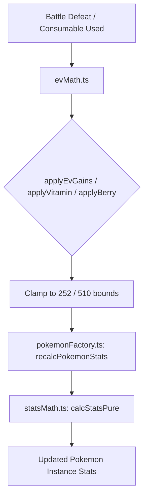

# EV Mechanics Manual

> **Scope**: Comprehensive reference for Effort Value (EV) mathematics, training items, consumables, battle yield distribution, stat recalculation, and Showdown/fuzzer integration across Poké Vicio.
> **Sources of Truth**:
> - [`src/logic/pokemon/evMath.ts`](file:///home/franco/Trabajos/PokeBorrador/src/logic/pokemon/evMath.ts) (Pure mathematical formulas & limits)
> - [`src/data/pokemon/evYields.ts`](file:///home/franco/Trabajos/PokeBorrador/src/data/pokemon/evYields.ts) (Canonical species yield catalog)
> - [Stat Mechanics](./stats.md) (Formulas, IVs, Level & Nature scaling)
> - [EVs & Natures: Mathematical Approach](./evs-natures-and-math.md) (Theory of addition vs multiplication)
> - Pokémon Showdown source at `external/pokemon-showdown-code/`.

---

## 1. 🏛️ Core EV Limits & Rules

In Poké Vicio, Effort Values follow modern Gen 8/9 canonical rules:

| Constant | Value | Description |
| :--- | :--- | :--- |
| `MAX_TOTAL_EVS` | `510` | Maximum combined EV investment across all 6 stats for a single Pokémon. |
| `MAX_STAT_EVS` | `252` | Maximum EV investment in any single stat (Gen 6+ standard; 63 additional stat points at Lv 100). |
| `MIN_STAT_EVS` | `0` | Minimum EV investment in any stat. |

### Real-Time Stat Recalculation & Level 100 Rule
- **Instantaneous Recalculation**: Whenever EVs change (via battle yield, vitamin, mochi, feather, or berry), `recalcPokemonStats(pokemon)` is invoked immediately.
- **Level 100 Compatibility**: In accordance with Gen 5+ mechanics, Pokémon at Level 100 **still accumulate EVs from battles and consumables** and receive instant stat updates without requiring the legacy "box trick".

---

## 2. 🏋️ Training Modifiers & Multipliers

EV gains from defeating opponent Pokémon in battle can be boosted through held items and infection states:

| Item / State | ID / Key | Effect on Battle EV Gains |
| :--- | :--- | :--- |
| **Macho Brace** | `machobrace` | Multiplies all base EV gains by **x2**. |
| **Power Weight** | `powerweight` | Grants a flat **+8 HP EVs** in addition to defeat yields. |
| **Power Bracer** | `powerbracer` | Grants a flat **+8 Attack EVs** in addition to defeat yields. |
| **Power Belt** | `powerbelt` | Grants a flat **+8 Defense EVs** in addition to defeat yields. |
| **Power Lens** | `powerlens` | Grants a flat **+8 Sp. Atk EVs** in addition to defeat yields. |
| **Power Band** | `powerband` | Grants a flat **+8 Sp. Def EVs** in addition to defeat yields. |
| **Power Anklet** | `poweranklet` | Grants a flat **+8 Speed EVs** in addition to defeat yields. |
| **Pokérus** | `pokerus: 'infected'` | Multiplies all battle EV gains (including Power Item bonuses) by **x2**. |

> [!NOTE]
> **Multiplicative Stacking**: Pokérus stacks multiplicatively with training items:
> - `Pokérus + Macho Brace`: Base yield x 4.
> - `Pokérus + Power Item`: (Base Yield + 8) x 2.

---

## 3. 💊 Consumable Items, Mochis & Berries

Consumables allow direct adjustment of EVs from the inventory (`src/logic/items/itemEffectHandlers.ts`):

### EV Enhancers
- **Vitamins (+10 EVs)**: `hpup`, `protein`, `iron`, `calcium`, `zinc`, `carbos`.
  - *Gen 8+ Rule*: Vitamins can be used up to the full `MAX_STAT_EVS` (252) cap; they are no longer restricted to the legacy 100-EV ceiling.
- **Mochis (+10 EVs)**: `healthmochi`, `musclemochi`, `resistmochi`, `geniusmochi`, `clevermochi`, `swiftmochi`.
- **Feathers / Wings (+1 EV)**: `healthfeather`/`healthwing`, `musclefeather`/`musclewing`, `resistfeather`/`resistwing`, `geniusfeather`/`geniuswing`, `cleverfeather`/`cleverwing`, `swiftfeather`/`swiftwing`. Excellent for fine-tuning competitive spreads.

### EV Reduction & Reset
- **EV-Reducing Berries (-10 EVs & +Friendship)**:
  - `pomegberry` (HP), `kelpsyberry` (Atk), `qualotberry` (Def), `hondewberry` (SpA), `grepaberry` (SpD), `tamatoberry` (Spe).
  - Reduces the given stat by 10 EVs (clamped to 0) and increases friendship by +10 up to 255.
- **Fresh-Start Mochi (`freshstartmochi`)**:
  - Resets all 6 stats' EVs to `0` in a single transaction via `resetAllEvs()`.

---

## 4. ⚔️ Battle Rewards & Distribution Flow

Battle EV gains are orchestrated by `processEvGain()` in [`src/logic/battle/battleRewards.ts`](file:///home/franco/Trabajos/PokeBorrador/src/logic/battle/battleRewards.ts) and executed in [`rewardsDistributor.ts`](file:///home/franco/Trabajos/PokeBorrador/src/logic/battle/rewardsDistributor.ts):

1. **Eligible Recipients**:
   - Any Pokémon that actively entered combat (`participantsSet.has(p.uid)`).
   - Any benched team Pokémon holding `expshare`.
2. **Yield Lookup**:
   - Retrieves base species yield from `pokemonDataProvider.getEvYield(enemySpecies)` ([`evYields.ts`](file:///home/franco/Trabajos/PokeBorrador/src/data/pokemon/evYields.ts)).
3. **Calculation & Clamping**:
   - `applyEvGains(currentEvs, baseYield, heldItem, hasPokerus)` applies modifiers and clamps within single-stat (252) and total (510) limits.
4. **Recalculation & Logging**:
   - If `totalGained > 0`, invokes `recalcPokemonStats(p)` and emits an in-game action log in Spanish (e.g. `¡Pikachu ganó +2 ATQ, +1 VEL (EVs)!`).

---

## 5. 🤖 Agent Rules for Simulators & Fuzzers

### DO NOT pass pre-calculated `stats` to `@pkmn/sim` PokemonSets

When calling `Battle.setPlayer()` in `@pkmn/sim`, **do not include a `stats` field** in the `PokemonSet`. Showdown computes all stats (including HP) natively from `evs`, `ivs`, `level`, `nature`, and the species' base stats.

```typescript
// ❌ WRONG — stats.hp will be undefined, causing Pokémon to start at 0 HP
return {
  species: 'Arcanine',
  evs: { hp: 252, atk: 128, ... },
  stats: calcStatsPure(...), // hp: undefined → instant faint on turn 0
} as PokemonSet;

// ✅ CORRECT — let Showdown calculate from EVs/IVs/level
return {
  species: 'Arcanine',
  evs: { hp: 252, atk: 128, def: 64, spa: 0, spd: 0, spe: 64 },
  ivs: { hp: 31, atk: 31, def: 31, spa: 31, spd: 31, spe: 31 },
  level: 100,
  nature: 'adamant',
} as PokemonSet;
```

> **Root Cause**: `calcStatsPure()` returns `{ maxHp, atk, def, spa, spd, spe }`. Showdown expects raw EVs and generates its own internal battle stats object. Injecting custom stat blocks breaks Showdown HP initialization.

### Valid EV spreads for fuzzer-generated teams

The fuzzer (`fuzzer_ai_team_generator.ts`) uses these standard test spreads (each totaling 508 EVs):

| Pokémon Category | Test EV Spread |
| :--- | :--- |
| **Physical Attacker** (`atk >= spa`) | `{ hp: 252, atk: 128, def: 64, spa: 0, spd: 0, spe: 64 }` |
| **Special Attacker** (`spa > atk`) | `{ hp: 252, atk: 0, def: 0, spa: 128, spd: 64, spe: 64 }` |

*The 252 HP investment is intentional to guarantee durable 20–60 turn simulations for comprehensive mechanics fuzzing.*

### Self-KO and extreme-recoil moves must be excluded from fuzzer generation

Moves filtered from fuzzer movesets (preventing trivial 1-turn self-faints):
- **Self-Faint**: `selfdestruct`, `explosion`, `mistyexplosion`, `healingwish`, `lunardance`, `memento`, `perishsong`, `destinybond`, `finalgambit`.
- **Extreme Recoil (≥33% HP)**: `headsmash`, `volttackle`, `flareblitz`, `woodhammer`, `doubleedge`, `bravebird`, `takedown`.

---

## 6. 🛠️ Code Module Architecture



- [`src/logic/pokemon/evMath.ts`](file:///home/franco/Trabajos/PokeBorrador/src/logic/pokemon/evMath.ts): Pure math engine for EV limits, yield modifications, items application, and EV-to-IV bonus conversion.
- [`src/logic/pokemon/pokemonUtils.ts`](file:///home/franco/Trabajos/PokeBorrador/src/logic/pokemon/pokemonUtils.ts): Canonical Single Source of Truth for Total Power (`calculateTotalPower`).
- [`src/logic/pokemon/statsMath.ts`](file:///home/franco/Trabajos/PokeBorrador/src/logic/pokemon/statsMath.ts): Canonical stat formula calculation.
- [`src/logic/pokemon/pokemonFactory.ts`](file:///home/franco/Trabajos/PokeBorrador/src/logic/pokemon/pokemonFactory.ts): Instance creation and stat recalculation triggers.
- [`src/logic/items/itemEffectHandlers.ts`](file:///home/franco/Trabajos/PokeBorrador/src/logic/items/itemEffectHandlers.ts): Inventory item dispatchers for EV consumables.
- [`src/logic/battle/battleRewards.ts`](file:///home/franco/Trabajos/PokeBorrador/src/logic/battle/battleRewards.ts): Battle reward processing and EV yield distribution.

---

## 7. 📊 Total Power (TOT) EV Contribution

Effort Values directly contribute to the **Total Power (`TOT`)** metric displayed on Pokémon cards, menus, and sorting filters:

- **Stat Ratio**: Every 4 EVs in a single stat grant 1 effective stat point ($\lfloor \text{EV} / 4 \rfloor$), mathematically identical to 1 genetic IV point at Lv 100.
- **Maximum EV Bonus**: A fully trained Pokémon ($510$ EVs, e.g. $252 / 252 / 4$) gains $\lfloor 252/4 \rfloor + \lfloor 252/4 \rfloor + \lfloor 4/4 \rfloor = 63 + 63 + 1 = +127$ points of Total Power.
- **SSoT Implementation**: Calculated via `calculateEvBonusIvs(pokemon.evs)` from `src/logic/pokemon/evMath.ts` inside `calculateTotalPower(pokemon)` in `src/logic/pokemon/pokemonUtils.ts`.

