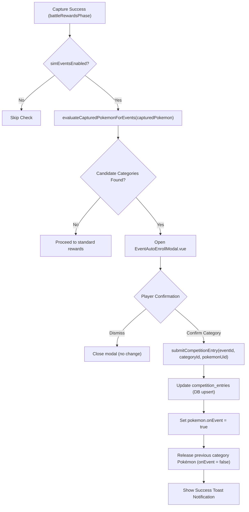
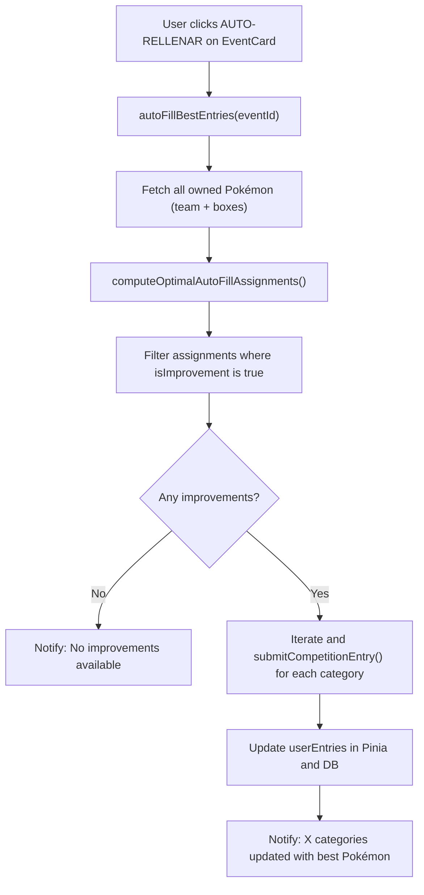

# Event System & Tournament Manual (Poké Vicio)

> **Scope & Authority**: This manual defines the architecture, authoring procedures, artwork standards, and reward integrity rules for all world events, scheduled competitions, seasonal ranked themes, and promotional tournaments in Poké Vicio.
> **Sources of Truth**:
> - Event Engine: `src/logic/events/eventEngine.ts`
> - Seasonal Themes & Ranked Data: `src/data/system/rankedData.ts`
> - Enabled Pokémon Whitelist: `src/data/system/constants.ts` (`ENABLED_POKEMON_IDS`)
> - Asset Pipeline: [`../technical/asset_service_manual.md`](../technical/asset_service_manual.md)
> - Database Schemas: `database/schemas/db_events_schema.sql`

---

## 1. 🎨 Event Artwork, Banners & Illustration Standards

### Mandatory Enabled Pokémon Species Whitelist for Event Artwork
Any artwork, event banner, tournament illustration, or UI promotional visual generated or added to the repository MUST strictly and exclusively depict Pokémon from the official enabled species whitelist:
- **Canonical Source**: `ENABLED_POKEMON_IDS` / `isEnabledPokemonId` in `src/data/system/constants.ts`.
- **Allowed Species Scope**: Original Kanto Pokédex (#001–#151: Bulbasaur through Mew), the 8 official baby Pokémon (`pichu`, `cleffa`, `igglybuff`, `togepi`, `tyrogue`, `smoochum`, `elekid`, `magby`), and Castform weather variants (`castform`, `castform-sunny`, `castform-rainy`, `castform-snowy`).
- **Strict Prohibition on Non-Whitelisted Species**: Generating AI image prompts or featuring unreleased generations or unapproved custom forms (e.g. Lucario, Garchomp, Greninja, Metagross, Tyranitar, Darkrai, Blaziken, Mimikyu, or non-canonical concepts like Mewtwo Armored) in event banners, artwork, or tournament visuals is **STRICTLY FORBIDDEN**.

### Mandatory Spanish Typography Mandate (Strict Prohibition on English Artwork Text)
Whenever promotional artwork, event banners, tournament illustrations, or stadium posters contain burned-in typography, logos, titles, slogans, banners, or venue signage, **ALL TEXT MUST BE STRICTLY AND EXCLUSIVELY IN SPANISH** (e.g. `"TORNEO FRONTERA JOHTO-KANTO"`, `"GRAN FINAL DE LA LIGA POKÉMON"`, `"CONCURSO DE CAZA DE BICHOS"`). Burning English text or slogans into illustrations or promotional artwork is **STRICTLY FORBIDDEN**, as it conflicts with the game's Spanish-localized UI and player immersion.

### Zero Hardcoded Dates on Event Artwork
When generating, editing, or importing event banner illustrations into `_raw-assets/public/assets/ui/events/`, images **MUST NEVER** contain burned-in calendar dates, specific years (e.g. 2024, 2025, 2026), days of the week, timeslots, fixed hours, or aspect ratio watermarks (`16:9`). Event banners must remain completely timeless and reusable across recurring seasons. All scheduling and countdown timers are rendered dynamically via Vue UI components.

### Canonical Asset Ingestion Pipeline
1. Generate or import raw lossless images into `_raw-assets/public/assets/ui/events/` (e.g. `tournament_monotype_full.png`).
2. Verify visual composition: ensure 100% of featured Pokémon belong to `ENABLED_POKEMON_IDS`, any embedded typography is strictly in Spanish, and no calendar dates, years, or timeslots are burned into the graphic.
3. Run the official WebP conversion pipeline: `npm run assets:convert`.
4. The converted WebP file will be emitted into `public/assets/ui/events/<name>.webp` and registered in `dist/` and `src/` asset catalogs.

---

## 2. 🎁 Seasonal Rewards & Tournament Prizes

### Strict Reward Species Legality
All seasonal theme rewards, ranked milestone prizes, tournament trophy Pokémon, and UI preview cards MUST strictly award enabled species from `ENABLED_POKEMON_IDS`. Inventing or offering unreleased or non-existent Pokémon species as prizes is strictly prohibited.

### Guaranteed IV Scaling Standards
Seasonal rewards awarded for high competitive rank adhere to guaranteed IV scaling:
- **Diamante Tier Reward**: Guaranteed minimum of 3 perfect IVs (31) at level 50 (`guaranteedMaxIvs: 3`).
- **Maestro Tier Reward**: Guaranteed minimum of 4 perfect IVs (31) at level 50 (`guaranteedMaxIvs: 4`).
- IV generation uses `generateGuaranteedIvs(count)` in `src/logic/pokemon/pokemonMath.ts`.

---

## 3. ⚙️ Event Engine Lifecycle & Busy Pokémon Protocol

### Lifecycle States
1. **Upcoming**: Event is registered in `world_events` with `start_time > NOW()`. Visible in `WorldEventsUpcomingSchedule.vue`.
2. **Active**: `start_time <= NOW() <= end_time`. Players can enroll Pokémon meeting event category criteria.
3. **Completed / Evaluation**: Automated evaluation via `fn_award_event_automated` generates awards in `event_awards`.

### Busy Pokémon Protection (`onEvent: true`)
- Enrolled Pokémon receive the busy flag `onEvent: true` and visual badge `🏆 EN EVENTO` via `getPokemonVisualBadges()`.
- While marked `onEvent: true`, Pokémon are strictly protected: release, trading, GTS publishing, and Black Market selling are blocked.
- **Liberation**: Claiming (`claimAward`) or discarding (`discardAward`) awards resets `onEvent: false` via `healStuckEventPokemon`.

---

## 4. 🏆 Sub-Competition Transparency, Semantic Icons & Responsive Badges

### Concrete Direction Mandate (Zero Ambiguous Slashes)
All competition sub-categories must always evaluate and display their concrete direction (`'min'` or `'max'`). Displaying ambiguous slashes (`"Mayor/Menor Peso"`, `"Mayor/Menor Altura"`) or internal group flavor names in user-facing podiums, claim banners, or history cards is **STRICTLY PROHIBITED**. The system must resolve exact labels (e.g. `"Menor Peso"`, `"Mayor Altura"`) via `getSubCompTitle(eventId, subComp)`.

### Canonical Metric Semantic Icons
Every competition metric has a designated semantic icon:
- **Weight**: `⚖️` (Scale)
- **Height**: `📏` (Ruler)
- **IVs**: `🧬` (DNA)
- **Friendship**: `💖` (Sparkling Heart)
- **Level**: `⭐` (Star)
Hardcoding generic icons (such as DNA `🧬` for physical dimensions) across category chips or preview cards is strictly forbidden.

### Award Title & Category Pill Separation
Pending awards in banners and claim lists must display the clean event name as the title, while the concrete sub-competition won is specified exclusively by the category pill and icon (e.g. `"Gran Concurso Abierto del Sábado"` + `[ ⚖️ Menor Peso ]`), strictly avoiding duplicating the sub-competition name between the title text and the category pill.

### Responsive Badge Boundary Containment
Containers pairing title text and enrollment badges (e.g. `🏆 CATEGORÍAS EN JUEGO` and `[✓ 3 Inscriptos]`) must enforce `box-sizing: border-box; width: 100%;` and `flex-wrap: wrap;` with compact typography to guarantee zero overflow across responsive card grid columns (minmax ~280px).

---

## 5. ⚡ Post-Capture Auto-Enrollment & Home Greedy Auto-Fill Flow

### 1. Post-Capture Eligibility & Auto-Enrollment Prompt
When any Pokémon is successfully captured (`activeBattle.isCapture === true`), the rewards phase invokes `eventStore.checkCaptureAndPrompt(capturedPokemon)`.
If `simEventsEnabled` is active and the captured Pokémon beats the player's recorded score in any active competition category:
1. `evaluateCapturedPokemonForEvents()` compares the Pokémon against all active sub-competitions (`total_ivs`, `weight` [max/min], `height` [max/min], `level`, `friendship`, `stat_iv`).
2. If one or more categories improve the player's record, `EventAutoEnrollModal.vue` is opened.
3. The player can choose which category to enroll into or dismiss.
4. Confirming calls `eventStore.submitCompetitionEntry(...)` which persists the entry, marks `pokemon.onEvent = true`, and releases any previously enrolled Pokémon for that category.

### 2. Home Screen & Event Card Greedy Auto-Fill (`[⚡ AUTO-RELLENAR]`)
Every active competition card displays a `[⚡ AUTO-RELLENAR]` button (`#event-auto-fill-btn-${event.id}`) in both `HomeEventsSection.vue` and `WorldEventsModal.vue`.
Clicking the button executes `eventStore.autoFillBestEntries(eventId)`:
1. Gathers all user Pokémon (`team` + `boxes`).
2. Computes the optimal category assignment via `computeOptimalAutoFillAssignments(event, pokemonList, userEntries)` using greedy optimization.
3. Guarantees zero cross-enrollment duplication: each Pokémon can only be enrolled in one category per event.
4. Auto-submits only assignments that strictly improve current scores or fill empty slots.

