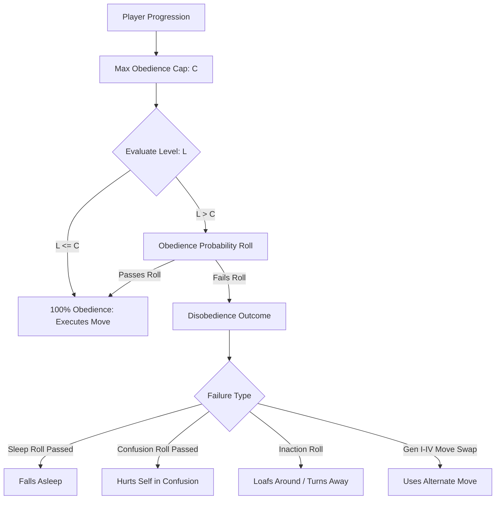
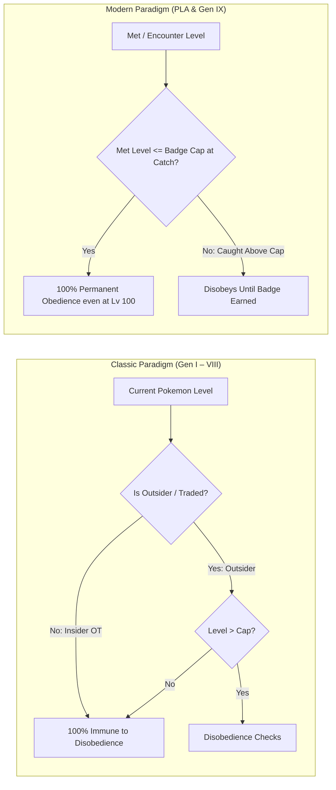
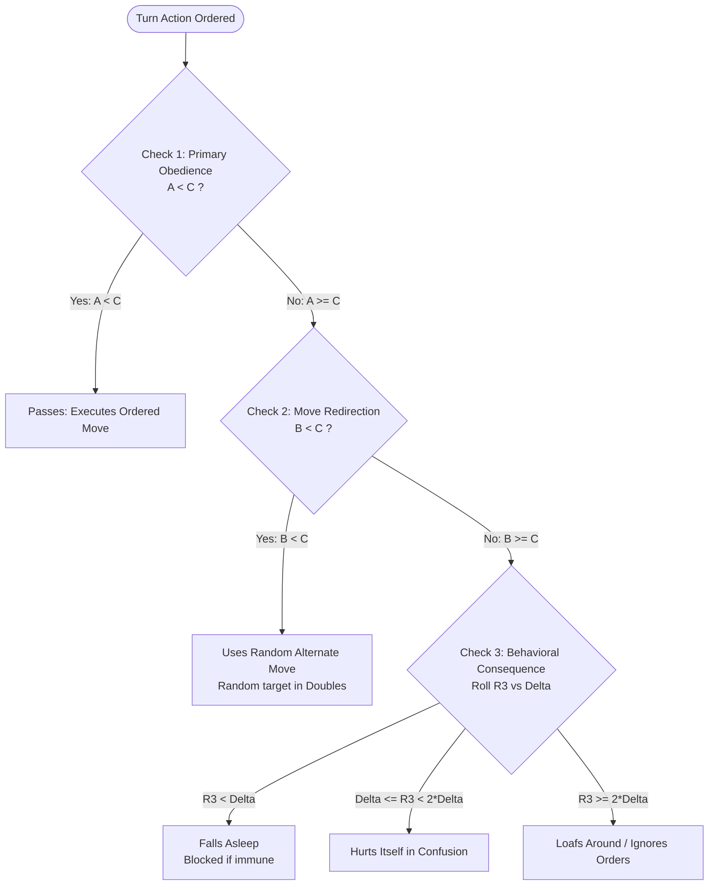
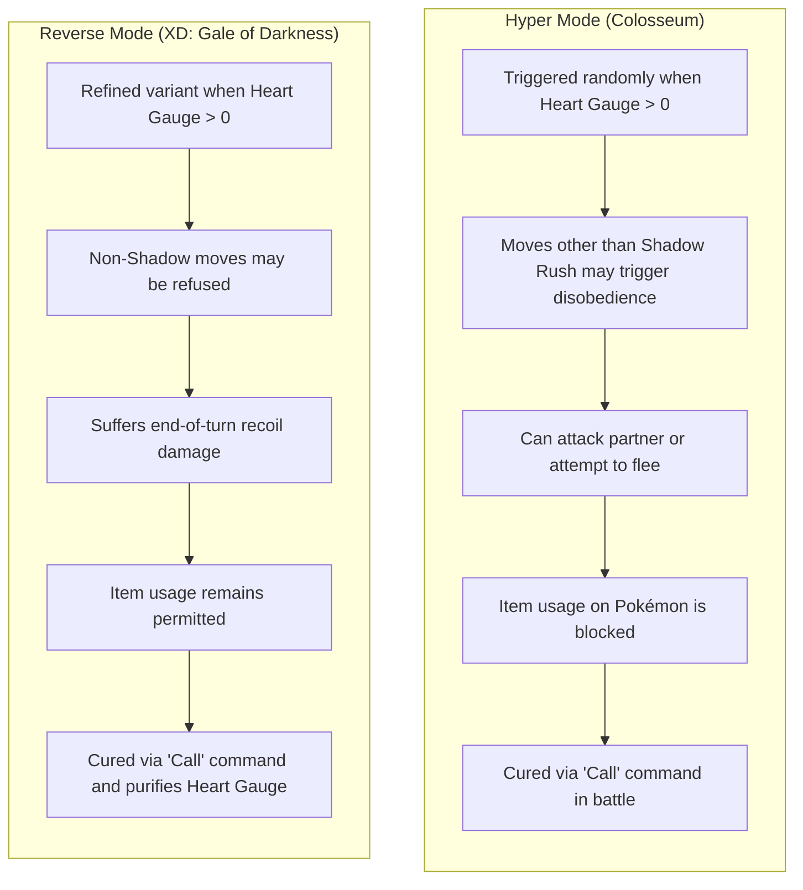

# Pokémon Obedience & Level Cap Mechanics Manual (Gen I – IX & Poké Vicio)

> **Scope & Authority**: This manual serves as the canonical Single Source of Truth (SSoT) for the **Obedience** (*Obediencia*) mechanic across all mainline Pokémon generations (Generation I through Generation IX, spin-offs *Colosseum*, *XD: Gale of Darkness*, and *Legends: Arceus/Z-A*), as well as the engine architecture blueprint for Poké Vicio.
> **Related Systems**:
> - Gym Progression & Badges: [`gym_system_manual.md`](gym_system_manual.md)
> - Mathematical Formulas: [`../core/game_formulas_manual.md`](../core/game_formulas_manual.md)
> - Capture Rate Formulas & Badge Penalty ($BP$): [`capturing_manual.md`](capturing_manual.md)
> - Battle Mechanics & Combat Loop: [`../battle/battle_mechanics_manual.md`](../battle/battle_mechanics_manual.md)
> - Friendship Mechanics (Zero-Impact Isolation): [`friendship_mechanics_manual.md`](friendship_mechanics_manual.md)

---

## 1. 🧭 Executive Summary & Core Paradigm Shifts



### The Two Historic Paradigms



| Dimension | Classic Paradigm (Gen I – VIII) | Modern Paradigm (PLA & Gen IX) |
| :--- | :--- | :--- |
| **Evaluated Parameter** | Current Pokémon Level ($L_{\text{current}}$) | Met / Encounter Level ($L_{\text{met}}$) |
| **Insider Pokémon (Matching OT)** | 100% immune to disobedience; can reach Lv 100 without badges. | Evaluated against badge cap at time of capture. |
| **Trained Pokémon** | Can reach high levels safely if obtained at low level. | Stays obedient forever if met level $\le$ badge cap when caught. |
| **Overleveled Wild Captures** | Obeyed unconditionally once caught if player was OT. | Disobeys if caught above the current badge cap. |
| **Traded Outsiders** | Disobeyed whenever current level exceeded badge cap. | Disobeys if original met/received level exceeded badge cap. |

> [!IMPORTANT]
> **Friendship Isolation Principle**: Friendship / Happiness has **EXACTLY ZERO EFFECT** on obedience checks across all generations. A Pokémon with maximum Friendship (`255`) will still disobey if its applicable level exceeds the player's obedience cap. Obedience is governed strictly by Trainer Progression milestones.

---

## 2. 📊 Generational Progression & Obedience Caps

The threshold of maximum obedience level scales according to regional progression milestones:

### 1. Generation I – IV (Kanto, Johto, Hoenn, Sinnoh)
In Gens I–IV, the cap traditionally increased every 2 badges (or by total badge count in Sinnoh and *Let's Go*):

| Progress Milestone | Obedience Level Cap ($C$) | Notes |
| :--- | :---: | :--- |
| **0 Badges** | **Lv 10** | Default starting cap for traded Pokémon. |
| **2 Badges** | **Lv 30** | Cascade Badge (Kanto) / Hive Badge (Johto) / Knuckle Badge (Hoenn) / Forest Badge (Sinnoh). |
| **4 Badges** | **Lv 50** | Rainbow Badge (Kanto) / Fog Badge (Johto) / Heat Badge (Hoenn) / Fen Badge (Sinnoh). |
| **6 Badges** | **Lv 70** | Marsh Badge (Kanto) / Mineral Badge (Johto) / Feather Badge (Hoenn) / Mine Badge (Sinnoh). |
| **8 Badges** | **Lv 100** | Earth Badge / Rising Badge / Mind Badge / Beacon Badge (All levels obey). |

### 2. Generation V – VIII (Unova, Kalos, Galar)
In Gens V–VIII, the cap scales continuously with every individual badge obtained:

| Badges Acquired | Obedience Level Cap ($C$) | Typical Regional Progression |
| :---: | :---: | :--- |
| **0 Badges** | **Lv 20** | Base starting cap. |
| **1 Badge** | **Lv 25 – Lv 30** | Trio / Basic / Bug / Grass Gyms. |
| **2 Badges** | **Lv 30 – Lv 35** | Basic / Toxic / Cliff / Water Gyms. |
| **3 Badges** | **Lv 35 – Lv 40** | Insect / Castelia / Rumble / Fire Gyms. |
| **4 Badges** | **Lv 45 – Lv 50** | Bolt / Nimbasa / Plant / Fighting/Ghost Gyms. |
| **5 Badges** | **Lv 55 – Lv 60** | Quake / Driftveil / Voltage / Fairy Gyms. |
| **6 Badges** | **Lv 65 – Lv 70** | Jet / Mistralton / Fairy / Rock/Ice Gyms. |
| **7 Badges** | **Lv 75 – Lv 80** | Freeze / Legend / Psychic / Dark Gyms. |
| **8 Badges** | **Lv 100** | Dragon / Wave / Iceberg / Dragon Gyms (All levels obey). |

### 3. Generation VII: Alola Island Challenge Stamps
Alola replaces Gym Badges with Grand Trial Stamps:

| Grand Trial Milestone | Obedience Level Cap ($C$) |
| :--- | :---: |
| **No Stamps** | **Lv 20** |
| **Melemele Island Grand Trial** (Hala) | **Lv 35** |
| **Akala Island Grand Trial** (Olivia) | **Lv 50** |
| **Ula'ula Island Grand Trial** (Nanu) | **Lv 65** |
| **Poni Island Grand Trial** (Hapu) | **Lv 80** |
| **Pokémon League Champion** | **Lv 100** (All levels obey) |

### 4. Hisui (*Pokémon Legends: Arceus*) — Galaxy Team Ranks
In Hisui, obedience scales with Galaxy Expedition Team Star Member Ranks:

| Galaxy Rank | Research Points Required | Obedience Level Cap ($C$) |
| :--- | :---: | :---: |
| **0 Stars** (No Rank) | 0 pts | **Lv 10** |
| **First Star** (1★) | 500 pts | **Lv 20** |
| **Second Star** (2★) | 1,800 pts | **Lv 30** |
| **Third Star** (3★) | 3,500 pts | **Lv 40** |
| **Fourth Star** (4★) | 6,000 pts | **Lv 50** |
| **Fifth Star** (5★) | 8,500 pts | **Lv 65** |
| **Sixth Star** (6★) | 11,000 pts | **Lv 80** |
| **Seventh Star or higher** (7★ – 10★) | $\ge 15,000\text{ pts}$ | **Lv 100** (All levels obey) |

### 5. Lumiose (*Pokémon Legends: Z-A*) — Z-A Royale Ranks
In the Z-A Royale progression system:

| Z-A Royale Tier | Obedience Level Cap ($C$) |
| :--- | :---: |
| **Rank Z** (Entry) | **Lv 20** |
| **Ranks Y through V** | **Lv 25 to Lv 40+** (Linear scaling per tier) |
| **Rank A** (Champion) | **Lv 100** (All levels obey) |

### 6. Generation IX: Paldea Gym Badges (*Scarlet & Violet*)
Evaluated strictly against the Pokémon's **Met Level** ($L_{\text{met}}$):

| Badges Acquired | Obedience Level Cap ($C$) | Wild Capture Penalty Applies Above |
| :---: | :---: | :---: |
| **0 Badges** | **Lv 20** | Level 20 |
| **1 Badge** | **Lv 25** | Level 25 |
| **2 Badges** | **Lv 30** | Level 30 |
| **3 Badges** | **Lv 35** | Level 35 |
| **4 Badges** | **Lv 40** | Level 40 |
| **5 Badges** | **Lv 45** | Level 45 |
| **6 Badges** | **Lv 50** | Level 50 |
| **7 Badges** | **Lv 55** | Level 55 |
| **8 Badges** | **Lv 100** | Level 100 (No penalties) |

### 7. Poké Vicio Canonical Progression Matrix
Poké Vicio implements the canonical Kanto progression with smooth 10-level increments:

| # | Badge Name | Gym Leader | City / Location | Poké Vicio Obedience Cap ($C$) |
| :-: | :--- | :--- | :--- | :---: |
| **0** | *No Badges* | — | Pallet / Viridian | **Lv 20** |
| **1** | **Boulder Badge** (Roca) | Brock | Pewter City (`pewter_city`) | **Lv 30** |
| **2** | **Cascade Badge** (Cascada) | Misty | Cerulean City (`cerulean_city`) | **Lv 40** |
| **3** | **Thunder Badge** (Trueno) | Lt. Surge | Vermilion City (`vermilion_city`) | **Lv 50** |
| **4** | **Rainbow Badge** (Arcoíris) | Erika | Celadon City (`celadon_city`) | **Lv 60** |
| **5** | **Soul Badge** (Alma) | Koga | Fuchsia City (`fuchsia_city`) | **Lv 70** |
| **6** | **Marsh Badge** (Pantano) | Sabrina | Saffron City (`saffron_city`) | **Lv 80** |
| **7** | **Volcano Badge** (Volcán) | Blaine | Cinnabar Island (`cinnabar_island`) | **Lv 90** |
| **8** | **Earth Badge** (Tierra) | Giovanni | Viridian City (`viridian_city`) | **Lv 100** (Full Mastery) |

---

## 3. 🧮 Algorithmic Architecture & Mathematical Foundations

When a trainer orders a move for a Pokémon whose applicable level $L$ exceeds the trainer's obedience cap $C$ ($L > C$), the combat engine executes a deterministic pseudo-random evaluation sequence.

```
Definitions:
  L = Pokémon Evaluation Level (Current level in Gen 1-8 outsider, Met Level in Gen 9 / PLA)
  C = Trainer's current obedience level cap
  Δ = L - C (Level Gap, always > 0 when checking)
```

---

### Phase A: Generation I – IV Classic Hierarchical Funnel

In Generations I through IV, the algorithm executes up to 3 sequential random rolls:



#### 1. Primary Obedience Check
1. Generate pseudo-random integer $R_1 \in [0, 255]$.
2. Compute intermediate integer value:
   $$A = \left\lfloor \frac{(L + C) \times R_1}{256} \right\rfloor$$
3. Evaluation:
   - If $A < C$: **Passes check** $\implies$ Pokémon obeys and uses the selected move normally.
   - If $A \ge C$: **Fails check** $\implies$ Pokémon enters the disobedience resolution pipeline.

$$\text{Probability of Obeying (Gen I–IV)}: P(\text{obey}) = \frac{C}{L + C}$$

#### 2. Move Redirection Evaluation
If Check 1 fails:
1. Generate pseudo-random integer $R_2 \in [0, 255]$.
2. Compute:
   $$B = \left\lfloor \frac{(L + C) \times R_2}{256} \right\rfloor$$
3. Evaluation:
   - If $B < C$: Pokémon **ignores the ordered move** and randomly selects one of its **other 3 moves** (or other available moves in its current learnset).
     - The move executes even if it has $0\text{ PP}$.
     - $1\text{ PP}$ is deducted from the move *originally ordered* by the player.
     - In Double Battles (Gen III–IV): Target is randomized among all active combatants on the field (including its own ally!).
   - If $B \ge C$: Pokémon completely refuses to execute any attack.

#### 3. Consequence Determination (Inaction, Sleep, or Confusion Damage)
If $B \ge C$:
1. Calculate level gap $\Delta = L - C$.
2. Generate pseudo-random integer $R_3 \in [0, 255]$.
3. Apply tiered outcome:
   - **Sleep Induction**: If $R_3 < \Delta$:
     - If Pokémon possesses sleep immunities (*Vital Spirit*, *Insomnia*, *Comatose*, active *Uproar*, or *Electric/Misty Terrain*), sleep is blocked and the Pokémon loafs instead.
     - Otherwise, the Pokémon immediately falls asleep (standard sleep counter assigned).
   - **Confusion Self-Damage**: If $\Delta \le R_3 < 2\Delta$ (i.e. $R_3 - \Delta < \Delta$):
     - Pokémon inflicts damage to itself calculated via standard confusion self-hit formula (40 BP typeless Physical hit).
   - **Passive Inaction**: If $R_3 \ge 2\Delta$:
     - Pokémon skips its turn displaying an inaction message (*loafing around*, *turned away*, *won't obey*, or *pretended not to notice*).

---

### Phase B: Generation V – IX Modernized Quadratic Curve

Starting in Generation V (*Black & White*), Game Freak streamlined the algorithm:
1. **Removed Move Redirection**: Disobedient Pokémon no longer execute alternate moves or attack teammates (preventing multi-target combat desynchronizations in Triple / Rotation / Tera Raid formats).
2. **Steeper Disobedience Curve**: The primary obedience probability was made quadratic to heavily penalize severe level gaps.

$$\text{Probability of Obeying (Gen V+)}: P(\text{obey}) \approx \left(\frac{C}{L + C}\right)^2$$

#### Algorithmic Formulation
1. Roll $R_1 \in [0, 255]$. If $\lfloor (L + C) \times R_1 / 256 \rfloor \ge C$, fail immediately.
2. Roll $R_2 \in [0, 255]$. If $\lfloor (L + C) \times R_2 / 256 \rfloor \ge C$, fail.
3. If both rolls pass, the Pokémon obeys.

#### Comparison of Obedience Probabilities
For a Level 100 Pokémon ($L = 100$) used with 0 Badges ($C = 10$ in Gen IV, $C = 20$ in Gen IX):

| Scenario | Obedience Cap ($C$) | Pokémon Level ($L$) | Gen I–IV Formula ($P$) | Gen V–IX Formula ($P$) |
| :--- | :---: | :---: | :---: | :---: |
| **Extreme Overlevel** | $10$ | $100$ | $\frac{10}{110} \approx \mathbf{9.09\%}$ | $\left(\frac{10}{110}\right)^2 \approx \mathbf{0.82\%}$ |
| **Standard Overlevel (0 Badges)** | $20$ | $50$ | $\frac{20}{70} \approx \mathbf{28.57\%}$ | $\left(\frac{20}{70}\right)^2 \approx \mathbf{8.16\%}$ |
| **Moderate Overlevel** | $50$ | $60$ | $\frac{50}{110} \approx \mathbf{45.45\%}$ | $\left(\frac{50}{110}\right)^2 \approx \mathbf{20.66\%}$ |
| **Slight Overlevel** | $70$ | $75$ | $\frac{70}{145} \approx \mathbf{48.27\%}$ | $\left(\frac{70}{145}\right)^2 \approx \mathbf{23.30\%}$ |

---

## 4. 💬 Dialogue Strings & Behavioral Manifestations

The combat log and battle UI communicate disobedience states through standardized strings:

| English Message | Localized Spanish Message | Behavioral Outcome | Active Generations |
| :--- | :--- | :--- | :--- |
| `"[POKEMON] used [MOVE] instead!"` | `"[POKEMON] usó [MOVE] en su lugar!"` | Uses random alternative move. | Gen I, Gen II |
| `"[POKEMON] ignored orders!"` | `"[POKEMON] ignoró las órdenes!"` | Total turn inaction. | Gen I, Gen II, Gen IV |
| `"[POKEMON] is loafing around!"` | `"[POKEMON] está holgazaneando!"` | Inaction / Slacking. | Gen I – IX (All) |
| `"[POKEMON] turned away!"` | `"[POKEMON] se dio la vuelta!"` | Inaction / Ignores Trainer. | Gen I – IX (All) |
| `"[POKEMON] won't obey!"` | `"[POKEMON] no quiere obedecer!"` | Explicit command rejection. | Gen I – IX (All) |
| `"[POKEMON] pretended not to notice!"` | `"[POKEMON] fingió no darse cuenta!"` | Inaction / Feigned ignorance. | Gen III – IX |
| `"[POKEMON] began to nap!"` | `"[POKEMON] se puso a dormir!"` | Falls asleep mid-battle. | Gen I – IX (All) |
| `"[POKEMON] won't obey! It hurt itself in its confusion!"` | `"[POKEMON] no obedece! Está tan confuso que se hirió a sí mismo!"` | Inflicts confusion self-damage. | Gen I – IX (All) |
| `"[POKEMON] ignored orders while asleep!"` | `"[POKEMON] ignoró las órdenes mientras dormía!"` | Fails *Snore* / *Sleep Talk*. | Gen III – V |
| `"[POKEMON] ignored orders and kept sleeping!"` | `"[POKEMON] ignoró las órdenes y siguió durmiendo!"` | Fails *Snore* / *Sleep Talk*. | Gen VI – IX |

### Overworld Manifestations (*Let's Go* Auto-Battle)
In Generation IX (*Scarlet & Violet*), disobedience extends directly to real-time overworld exploration:
- When deployed in **Auto-Battle Mode** (*Let's Go feature*), a disobedient Pokémon ($L_{\text{met}} > C$) refuses to engage wild encounters.
- It displays a **broken blue heart emoticon bubble** (`💔`) over its sprite/model, plays a refusal chirp, and retreats back to the trainer.

---

## 5. 🛡️ Special Rules, Anti-Cheat, & Exempt Scenarios

### 1. The Fateful Encounter Anti-Cheat Lock (Gen III Mew & Deoxys)
In *FireRed, LeafGreen, Emerald, Colosseum*, and *XD: Gale of Darkness*:
- Mythical Pokémon **Mew** and **Deoxys** contain an internal binary flag: `fatefulEncounter` (*Obedience Bit*).
- If generated via memory-editing devices (Action Replay, GameShark) without this bit active, the engine flags the creature as illegitimate.
- **Sanction**: The Pokémon **UNCONDITIONALLY DISOBEYS** every battle command, regardless of whether the player holds all 8 Badges or is the Original Trainer. In addition, trading is locked.

### 2. Shadow Pokémon: Hyper Mode & Reverse Mode
In the Orre region titles (*Colosseum* & *XD: Gale of Darkness*), Shadow Pokémon exhibit unique disobedience mechanics independent of level or badges:



| Feature / Dynamic | Hyper Mode (*Pokémon Colosseum*) | Reverse Mode (*Pokémon XD: Gale of Darkness*) |
| :--- | :--- | :--- |
| **Trigger Condition** | Random chance in battle while Heart Gauge > 0. | Refined random trigger while Heart Gauge > 0. |
| **Command Restrictions** | Disobeys if ordered any move other than *Shadow Rush*. | Non-Shadow moves may be refused. |
| **Erratic Behaviors** | May attack ally Pokémon or attempt to flee battle. | Refuses command; inflicts recoil self-damage each turn. |
| **Item Interaction** | Bag item usage on Pokémon is completely blocked. | Bag items can still be used on the Pokémon. |
| **Recovery Method** | Selecting the battle command **"Call"** (*Llamar*). | Selecting **"Call"** (*Llamar*) (also purifies Heart Gauge). |

### 3. Environments Exempt from Obedience Checks (100% Guaranteed Obedience)
To maintain competitive integrity and prevent frustration in cooperative play, the following modes bypass obedience checks:

| Exempt Environment / Feature | Behavior | Engine Rationale |
| :--- | :---: | :--- |
| **Multiplayer PvP (Link Battles)** | **100% Guaranteed** | Guarantees balanced eSports & tournament play. |
| **Battle Tower / Frontier / Subway / Maison / Tree** | **100% Guaranteed** | Competitive battle facility parity. |
| **Max Raid Battles & Tera Raid Battles** | **100% Guaranteed** | Prevents griefing and failure in cooperative PvE. |
| **Synchro Machine Mode (Gen IX DLC)** | **Direct Player Control** | The player directly controls the creature's locomotion and attacks. |

### 4. Special Move Interactions
- **Multi-Turn Moves** (*Bide, Thrash, Outrage, Petal Dance, Rollout, Ice Ball*):
  - The obedience check is executed **ONLY ON TURN 1** (the initiation turn).
  - If the initial check passes, subsequent locked turns execute automatically without re-checking obedience.
- **Rage (*Furia*)**:
  - If a Pokémon using *Rage* disobeys on a subsequent turn, all accumulated Attack stage bonuses from *Rage* are permanently cleared.
- **Sleep-Activated Moves** (*Snore, Sleep Talk*):
  - If an overleveled Pokémon is ordered to use *Snore* or *Sleep Talk* while asleep, failing the check outputs `"[POKEMON] ignored orders and kept sleeping!"`.

### 5. Wild Capture Penalty ($BP$) & Met Level Persistence Synergy
The obedience cap acts as a dual gatekeeper across both wild capturing and in-battle command execution:
1. **In-Battle Capture Penalty ($BP$)**: If a target wild Pokémon's level $L_{\text{wild}}$ exceeds the trainer's current badge cap $C$ ($L_{\text{wild}} > C$), the base capture formula applies an exponential penalty:
   $$BP = 0.8^{\text{missing badges}}$$
   *(See [`capturing_manual.md`](capturing_manual.md) for the complete capture rate formula).*
2. **Atomic Met Level Assignment**: Upon successful capture, the engine permanently records `metLevel = wildPokemon.level` in the Pokémon's persistence schema.
3. **Continuous Cap Check**: As long as the player's current badge cap $C < \text{metLevel}$, the Pokémon remains subject to disobedience checks in battle. As soon as the player acquires the necessary Gym Badge ($C \ge \text{metLevel}$), the creature obeys 100% unconditionally for all remaining levels up to Level 100.

---

## 6. 🏗️ Poké Vicio Engine Blueprint & Architecture

For future implementation in Poké Vicio, the obedience subsystem MUST adhere to Domain-Type-First standards, DBRouter persistence contracts, and event-driven combat execution.

### 1. Domain Types Contract (`src/types/pokemon.ts` or `src/types/battle.ts`)

```typescript
export type ObedienceBehavior =
  | 'obey'
  | 'loafing'
  | 'turned_away'
  | 'wont_obey'
  | 'pretended_not_to_notice'
  | 'fell_asleep'
  | 'hurt_self_in_confusion'
  | 'used_other_move';

export interface ObedienceCheckResult {
  readonly obeys: boolean;
  readonly behavior: ObedienceBehavior;
  readonly replacementMoveIndex?: number;
  readonly messageKey: string;
}

export interface TrainerProgressionCap {
  readonly badgeCount: number;
  readonly maxObedienceLevel: number;
}

/**
 * Persistence fields required for obedience evaluation in Pokemon schema
 */
export interface PokemonObedienceData {
  readonly level: number;
  readonly metLevel: number;
  readonly originalTrainerId: string;
  readonly isOutsider?: boolean;
  readonly fatefulEncounter?: boolean;
}
```

### 2. Pure Calculation Function (`src/logic/battleFormulas.ts`)

```typescript
/**
 * Evaluates obedience for a Pokémon action in combat.
 * Uses modern Gen IX Met Level logic for caught Pokémon or current level for traded outsiders.
 */
export function calculateObedienceCheck(
  pokemonLevel: number,
  metLevel: number,
  isOutsider: boolean,
  trainerObedienceCap: number,
  randomRoll1: number = Math.random(),
  randomRoll2: number = Math.random(),
  randomRoll3: number = Math.random()
): ObedienceCheckResult {
  // 1. Determine evaluation level (Modern Met Level paradigm)
  const evalLevel = isOutsider ? pokemonLevel : metLevel;

  // 2. If evaluation level is within cap, 100% obedience guaranteed
  if (evalLevel <= trainerObedienceCap) {
    return { obeys: true, behavior: 'obey', messageKey: 'battle.log.obey' };
  }

  // 3. Modern Quadratic Probability Roll
  const cap = trainerObedienceCap;
  const sum = evalLevel + cap;
  const pass1 = Math.floor((sum * Math.floor(randomRoll1 * 256)) / 256) < cap;
  const pass2 = Math.floor((sum * Math.floor(randomRoll2 * 256)) / 256) < cap;

  if (pass1 && pass2) {
    return { obeys: true, behavior: 'obey', messageKey: 'battle.log.obey' };
  }

  // 4. Determine Disobedience Outcome
  const delta = evalLevel - cap;
  const roll3Byte = Math.floor(randomRoll3 * 256);

  if (roll3Byte < delta) {
    return { obeys: false, behavior: 'fell_asleep', messageKey: 'battle.log.disobey_nap' };
  }

  if (roll3Byte < delta * 2) {
    return { obeys: false, behavior: 'hurt_self_in_confusion', messageKey: 'battle.log.disobey_confusion' };
  }

  // Passive Inaction Variations
  const loafBehaviors: readonly ObedienceBehavior[] = [
    'loafing',
    'turned_away',
    'wont_obey',
    'pretended_not_to_notice',
  ];
  const chosenBehavior = loafBehaviors[Math.floor(randomRoll1 * loafBehaviors.length)] ?? 'loafing';

  return {
    obeys: false,
    behavior: chosenBehavior,
    messageKey: `battle.log.disobey_${chosenBehavior}`,
  };
}
```

### 3. Combat Loop Integration Points
- **Pre-Move Hook**: Invoked in the battle engine worker immediately prior to executing the chosen move.
- **PP Deduction**: If the Pokémon disobeys due to confusion, sleep, or loafing, PP is **NOT** deducted in Gen V+ rules.
- **Showdown Bridge**: The `showdownBridge` logs disobedient behavior with full Spanish translation keys.
- **Visual Feedback**: The battle arena triggers GSAP camera shake and thought bubble animations (`v-gsap`) when a Pokémon loafs or falls asleep from disobedience.
