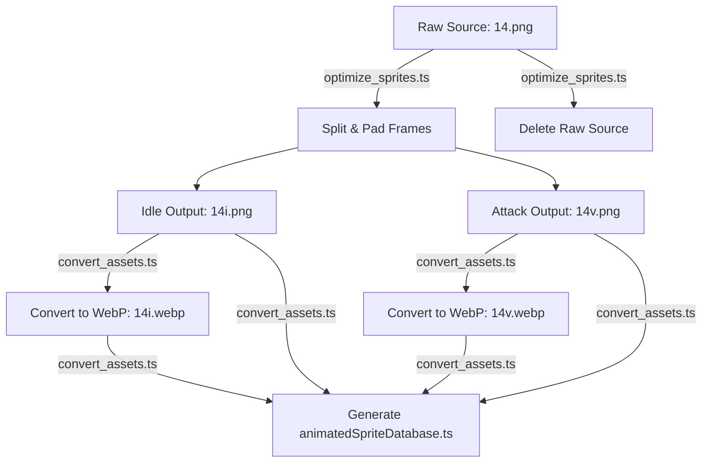

# Animated Sprites Manual

This document details the architecture, naming conventions, optimization procedures, and runtime resolution for the Pokémon Animated Sprites system.

---

## 1. Directory Structure & Lifecycle

Animated sprites exist in two states: raw sources (used for authoring/development) and optimized web-ready assets.

### Directory Layout

```text
_raw-assets/public/assets/sprites/pokemon/animated/
├── Front/                  <-- Raw Front sheets (e.g., 215_1_f.png) and outputs (215i_1_f.png, 215v_1_f.png)
├── Back/                   <-- Raw Back sheets
├── Front shiny/            <-- Raw Front Shiny sheets
└── Back shiny/             <-- Raw Back Shiny sheets

public/assets/sprites/pokemon/animated/
└── [Front|Back|...]/*.webp <-- Final optimized lossy/lossless WebP spritesheets (mirrored from outputs)
```

### The Sprites Pipeline Lifecycle



---

## 2. Naming Conventions & Suffix Analysis

### Raw Source Naming

Raw sheets must be named using the Pokémon's national Pokédex ID followed by a gender/form suffix:

- `{pokemonId}.png` (e.g., `14.png`)
- `{pokemonId}_{variant}.png` (e.g., `201_3.png`)
- `{pokemonId}_{gender}.png` (e.g., `41_f.png`, `14f.png`, `14m.png`)
- `{pokemonId}_{variant}_{gender}.png` (e.g., `215_1_f.png`, `215_2_m.png`)

> [!WARNING]
> Raw suffixes always start with an underscore (`_`) or represent explicit gender symbols (`f`, `m`). They must **never** start with `i`, `v`, or `a`.

### Output Naming

The optimization script splits sheets into two functional states:

- **Idle State (`i`)**: `{pokemonId}i{suffix}.png` (e.g., `14i.png`, `215i_1_f.png`)
- **Variation/Attack State (`v`)**: `{pokemonId}v{suffix}.png` (e.g., `215v_1_f.png`)

---

## 3. Sprite Optimization & Segmentation

The script `scripts/optimize_sprites.ts` automates spritesheet analysis by comparing individual frame pixel buffers (using `sharp` raw buffers).

### Segmentation Algorithm

1. **Cycle Detection**: Compares frame buffers with a similarity threshold. Finds repeating loops of frames to determine the **Idle** animation range.
2. **Attack Extraction**: Any frames outside the detected idle loop are isolated. If an attack animation exceeds 2 frames, it is extracted as a separate **Variation (`v`)** sheet.
3. **Double Processing Guard**: The processing worker checks the file suffix. If it starts with `i`, `v`, or `a`, it is immediately ignored. This prevents infinite conversion loops (e.g., re-processing `14i.png` into `14ii.png`).
4. **Source Deletion**: The raw source spritesheet (e.g., `14.png`) is unlinked immediately after splitting to prevent the WebP pipeline from compiling un-suffixed fallbacks.

### Frame Padding Spec

To avoid subpixel texture bleeding and rendering seams in Phaser/WebGL when sprites are scaled:

- Each frame is extracted as a square (`height × height`).
- A transparent border of **1px** is added to all four sides (`top`, `bottom`, `left`, `right`).
- The resulting spritesheet has frames of size `original_size + 2`.

---

## 4. Metadata & Database Generation

During `npm run assets:convert` (run by `scripts/convert_assets.ts`), all processed `i` and `v` spritesheets are converted to **lossless WebP** and scanned to compile the metadata registry in [animatedSpriteDatabase.ts](../../../../../src/data/pokemon/animatedSpriteDatabase.ts).

### Database Schema

Each sprite entry yields:

- `frames`: Total frames count in the horizontal strip.
- `size`: Frame dimensions (including the +2px padding).
- `feetY` / `feetX`: Ground anchoring coordinates [0-1] calculated using transparency boundary boxes of the first frame.
- `bodyH` / `bodyW`: Visible body height and width ratios [0-1].
- `bodyRadius`: Collision/scale radius.

```typescript
export interface AnimatedSpriteData {
  readonly frames: number;
  readonly size: number;
  readonly feetY: number;
  readonly feetX: number;
  readonly bodyH: number;
  readonly bodyW: number;
  readonly bodyRadius: number;
}
```
