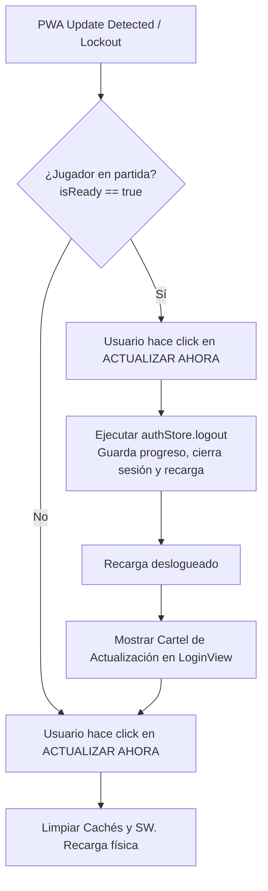
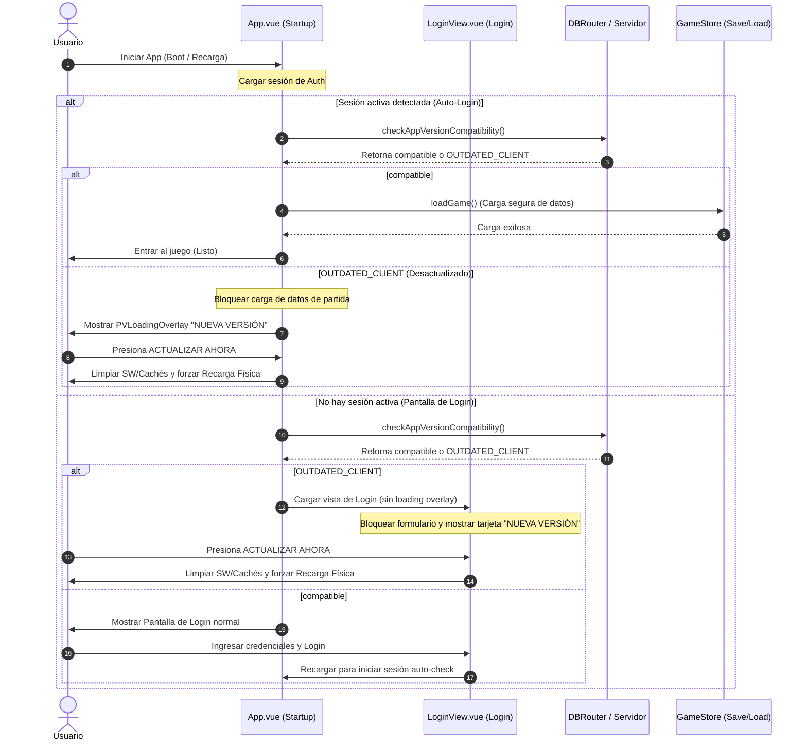

# Save System and Synchronization Manual

This manual ensures the integrity of player data and compatibility between game versions (Supabase + SQLite).

## 🛡️ Persistence Golden Rules

### 1. Backward Compatibility

When adding properties to `INITIAL_STATE` (`src/stores/game.ts`), old saves will have `undefined`.

- **Mandatory**: Use fallbacks: `state.newFeature = state.newFeature || defaultValue;`.
- **Migrations**: If you change the format of a critical data point, implement a migration block in the store's initialization.

### 2. Save Protocol (Upsert)

Saving in Supabase (`game_saves`) overwrites the entire JSON.

- **Defense**: NEVER overwrite with an empty state. Always verify the `_saveLoaded` flag before allowing `saveGame()`.
- **Save Race**: The `DBRouter` makes local saving (SQLite/IndexedDB) compete with the cloud. Data with the most recent timestamp is always preferred.

### 3. "Real Index" Integrity

NEVER trust indices passed from the UI (which may be filtered or sorted).

- **Pattern**: Always look for the element in the original Store array using its `UID` before applying a mutation.

### 4. Safe Storage (Privacy Resilience)

Direct access to `localStorage` or `sessionStorage` can throw `SecurityError` if blocked by the browser's "Tracking Prevention" or strict privacy settings.

- **Mandatory**: NEVER use `localStorage` directly. ALWAYS use the `safeStorage` helper (`src/logic/utils/storage.ts`).
- **Graceful Failure**: If storage is blocked, the system should return `null` and allow the application to continue in "Volatile Mode" instead of crashing.
- **Boot Privacy**: During `checkSession`, skip cloud validation if `sessionMode` is `offline` to prevent unnecessary storage access triggers and browser warnings.

### 5. Database Isolation for Guest Profiles

Guest or local test user IDs (such as `local_user` or any ID starting with `local_`) must be strictly isolated to prevent API errors when the frontend operates in `'online'` mode.

- **Bypass Remote Operations**: Bypass all remote writes (RPC triggers, profile updates) and remote save loading for guest IDs, routing them entirely through offline storage engines (OPFS/LocalStorage) to prevent `400 Bad Request` or Postgres exceptions.

### 6. Origin Private File System (OPFS) Safe Reads

When reading files from OPFS (e.g., local saves or SQLite binary storage):

- **Creation Flag**: When opening a file for reading, ALWAYS set `{ create: false }` in `getFileHandle`. Using `{ create: true }` on a missing file creates an empty 0-byte file, causing subsequent JSON parsers to crash with `Unexpected end of JSON input`.
- **Zero-Byte & NotFound Handling**: Gracefully handle `NotFoundError` and files with `size === 0` by returning `null` or default state instead of throwing exceptions.

---

## 🏗️ Data Architecture (DBRouter)

### Triple Parity Synchronization

If you modify the database schema, you MUST maintain parity across all layers:

1. **Local Migration**: Create the SQL file in `database/migrations/`.
2. **Logic Manifest**: Run `scripts/generate_migrations.ts` to update `src/logic/db/migrations_data.ts`.
3. **Absolute Schema**: Update the corresponding SQL file in `database/schemas/` to reflect the final state.
4. **SQLite Schema**: Update `TABLES_SCHEMA` in `src/logic/db/schema.ts` for fresh offline initializations.

## 🆔 UID Integrity (Anti-Cloning)

- **Uniqueness**: No pair of Pokémon can share the same **Unique ID (UID)** between the team and the box.
- **Detection**: If duplicates are detected in v1 accounts, they are sanitized. In v2+ accounts, a critical inconsistency activates the **Rollback Protocol**.

---

## 🔑 Login & Authentication Lifecycle

### 1. Atomic Auth Cleanup

Accessing the `/login` route MUST trigger an immediate, synchronous cleanup of local session state (clearing `authStore` and `gameStore` memory) before any data loading begins.

- **WHY**: Prevents authenticated state from interfering with the login view and ensures the "Loading Gate" remains open for the user.
- **Autologin Isolation**: Accessing `/login` or completing a database import reload MUST invoke a deep logout (`authStore.logout()`) rather than a partial local cleanup. This completely terminates Supabase online sessions and registers the `block_autologin` flag, preventing browser initialization from automatically logging back in.

### 2. Tab Conflicts (Last-In-Wins)

Each browser tab generates a unique `SessionID`:

- **Conflict Detection**: If a change in the `current_session_id` of the DB is detected from another tab, the current instance MUST immediately disable write permissions to prevent data corruption.
- **Notification**: The `session-conflict` event must be triggered to warn the user.

---

## ⚙️ Version Compatibility Locks & PWA Updates

### Secuencia de Inicio (Boot), Validación de Versión y Login

### 1. Outdated Client Lockout Guard (`OUTDATED_CLIENT`)

- **Rule**: It is STRICTLY FORBIDDEN to invoke `gameStore.save()` or any database persistence methods when the application is blocked on a compatibility lockout screen (such as startup loading checks where `gameStore.isReady === false` or version check returns `OUTDATED_CLIENT`).
- **Data Safety**: Overwriting saves from an uninitialized or older codebase into a newer server schema will cause critical data loss. The update handler must directly unregister service workers, purge cache storage, and trigger a physical page reload.

### 2. Development Mode Bypass

- **Rule**: In development mode (`import.meta.env.DEV`), client-server compatibility checks must be ignored/bypassed. This avoids developer lockout in local testing environments when the database version has advanced beyond the client's current build version tag.

### 3. The "Logout-Before-Update" Protocol

- **Implementation**: If a service worker update is requested while the user is actively playing (`gameStore.isReady === true`), the system MUST NOT perform a background save directly from the updater. Instead, the update click triggers `authStore.logout()`, which handles saving the player's progress dynamically and safely before logging out and reloading.
- **Manual Enforcement**: Every reload step redirects the user to the update card if still outdated, requiring explicit click interaction. Silent/automatic reloads are strictly forbidden.

---

## 🔄 Advanced Synchronization

### 1. Delta Merge (Post-Battle)

If the player receives an external update (e.g., an accepted trade) while in battle:

- **Deferral**: The system queues external changes to avoid corrupting the active fight.
- **Merge**: After the battle, the client downloads the "truth" from the server and applies the results (EXP, Gold) earned locally on top of that new state.

### 2. The 60-Second Principle

To optimize performance and server load:

- **Local Cache**: Minor changes accumulate locally and are synchronized every 60 seconds.
- **Critical Events**: Actions such as winning a badge, catching a legendary, or performing a trade force an immediate atomic save.
- **Pre-Action Flush**: Before any social action, a save is forced to ensure that the local state matches the server.

### 3. Concurrency Protection (Locking)

- **Early Locking**: The concurrency lock (`_isSaving = true`) must be acquired synchronously at the very beginning of the `saveGame` function before any asynchronous yield (such as GZIP compression or OPFS file writes).
- **WHY**: Preventing overlapping async runs is critical during rapid-succession saves (e.g., fast combat action transitions). It ensures that concurrent save calls return `null` immediately and do not proceed with duplicate expected database/save IDs, avoiding out-of-sync conflict toasts.
- **Cleanup**: Always wrap the entire save logic in a `try...finally` block to guarantee the `_isSaving` flag is reset to `false`.

---

## 🏗️ Store Architecture Integrity

### 1. Pinia Action Destructuring

When adding actions to store modules (e.g., `pokemonActions.ts`, `trainerActions.ts`), they MUST be explicitly destructured in the root store file (e.g., `src/stores/game.ts`) to be exposed to the rest of the application.

- **Defense**: Failure to destructure new actions will result in a `ReferenceError` when attempting to call them from components or other stores.

### 2. Consolidated Logic (Tagging Case)

Business logic that affects both **Team** and **Box** contexts (e.g., toggling favorite tags, nicknames) MUST be centralized in a root store action instead of being duplicated or fragmented in specialized stores.

- **WHY**: Ensures data consistency regardless of the Pokémon's current location and simplifies UI interaction handlers.

### 3. Visual State and Deep Watch Synchronization

To avoid infinite reactive feedback loops or blocked visual states when Pinia stores mirror their state to the global game state (`gameStore.state.chats`) for persistence:

- **Visual State Isolation**: Ephemeral layout or visual toggles (like `isCollapsed`) should not be aggressively overwritten on every active sync.
- **Initialization Flag**: Use an initialization flag (e.g., `isInitialized`) to apply startup defaults (like forcing chat windows to start collapsed) only during the initial state loading.
- **Preserve Active State**: During live synchronization or deep watches, reference the current runtime state of the reactive store proxy (e.g., `privateChats[id].isCollapsed`) instead of resetting it to static defaults, preserving active user interactions.
- **Temporal Dead Zone Avoidance**: When declaring reactive variables that are referenced by sync helpers during initialization, declare them empty first and populate them afterwards to avoid `ReferenceError` temporal dead zone crashes.

---

## 🛡️ Administrative Security

### 1. Debug Panel (LocalDebugPanel.vue)

- **Online Mode**: Access strictly limited to accounts with the `admin` role. It must not render (`v-if`) if the check fails.
- **Auto-Ban Protocol**: Any unauthorized attempt to call administrative CLI commands in an online session triggers the `is_banned: true` flag in the database and forces a logout.

### 2. Emergency Commands

- `factoryResetLocal()`: Total purge of local storage.
- `forceSyncCloud()`: Ignores the 60s throttle and pushes the current state to the cloud.

---

## 🏥 Data Self-Healing

Pokémon created by debug tools or legacy systems may lack critical properties (`power`, `type`, `pp`).

- **Mandatory**: Implement "Self-Healing" logic at centralization points (e.g., `recalcPokemonStats` in `pokemonFactory.ts`) to fill in missing data from `MOVE_DATA`.
- **Level & Experience Cap**: Sanitization must enforce `MAX_POKEMON_LEVEL = 100`. If a Pokémon's level exceeds 100, it must be adjusted to 100. If it is exactly 100, its `exp` must be reset to `0` and `expNeeded` set to `Infinity`. If it is below 100 but `exp` is equal to or greater than `expNeeded`, `exp` must be clamped to `expNeeded - 1` to prevent corrupted states.
- **Infinity JSON Serialization**: Because `JSON.stringify(Infinity)` serializes to `null`, `expNeeded` values mapped to `Infinity` for level 100 Pokémon will load as `null` or `0` from databases. The self-healing checker MUST silently restore these to `Infinity` without emitting warnings or triggering self-healing logs.

---

## 📶 Mobile Resilience (Connection Timeouts)

Mobile browsers frequently suspend inactive tabs and silently drop network connections.

- **Explicit Timeouts**: Operations involving cloud fetches (such as loading game saves) MUST implement a strict timeout (e.g., 8 seconds using `Promise.race`) to avoid permanent loading hangs.
- **Network Awareness**: Before forcing a page reload on timeout, verify `navigator.onLine`. If offline, wait for the `online` event before retrying.
- **Staggered Autologin Retry Strategy**: During initial page load (`checkSession` / `getSession`), remote self-hosted servers (like Docker or NAS instances) may be in a "cold" state, causing the initial fetch request to experience high latency or temporary network/gateway errors (e.g., 502/503). To prevent silent session drops and unnecessary redirects to the login screen, implement a two-step staggered retry mechanism:
  1. **Attempt 1 (5s Ping)**: Run the first check with a short 5-second timeout to act as a "wake-up" call for the cold containers.
  2. **Intermediary Delay (1.5s)**: Wait for 1.5 seconds to allow backend services to fully initialize.
  3. **Attempt 2 (15s Fetch)**: Execute the final fetch with a longer 15-second timeout.
  This allows cold boots to resolve transparently without returning to `/login`, while maintaining instantaneous (200ms) loads when the server is already active.

---

## 🛡️ Asynchronous Object Integrity (Async Exit Guards)

Functions that involve `await` or `setTimeout` (especially in battle or menu transitions) MUST NOT assume that the base store object (e.g., `activeBattle.value`) still exists after the promise resolves.

- **Mandatory Guard**: Every `await` MUST be followed by a null-check: `if (!activeBattle.value) return;`.
- **Race Prevention**: Transitions between game phases (Map -> Battle -> Map) nullify critical objects. Any asynchronous logic "floating" from the previous phase MUST exit immediately if it detects its parent object has been destroyed to prevent `Cannot read properties of null` crashes.
