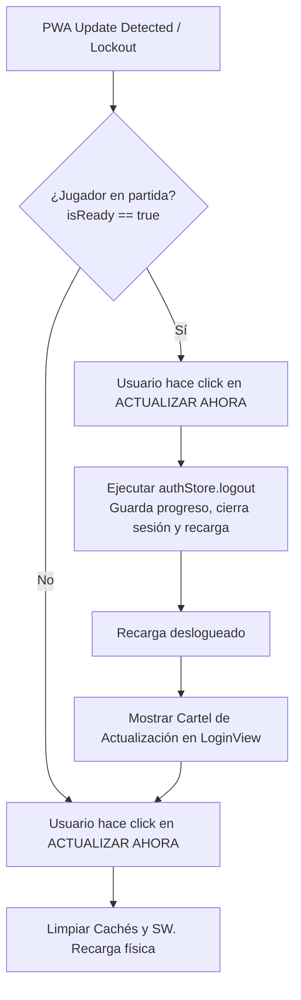
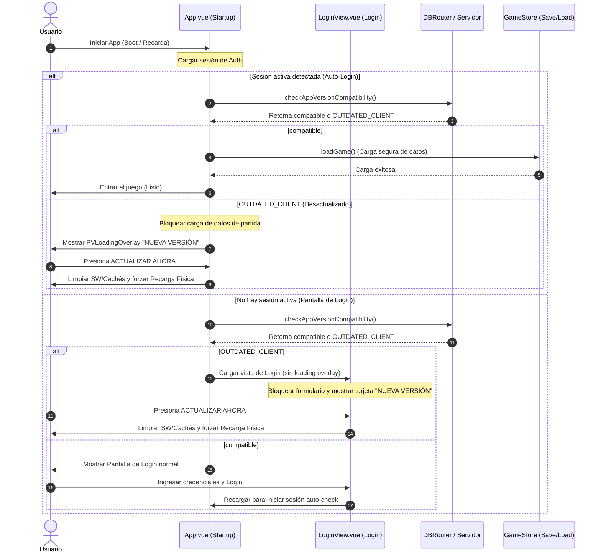

# Save System and Synchronization Manual

> **Scope & Authority**: This manual is the **Single Source of Truth (SSoT) for the save system architecture**, detailing save state serialization (`saveSerializer.ts`), deserialization (`saveSanitizer.ts`), Valibot schema validation, safe storage helpers, and guest user isolation.
>
> 🛑 **Domain Boundaries & Redirection**:
> - For general database governance and Save Shield policies ➔ See [Database & Persistence Rules](../rules/database_and_persistence.md).
> - For DBRouter online/offline routing logic ➔ See [DBRouter Manual](./dbrouter_manual.md).
> - For in-flight active combat serialization ➔ See [Battle Persistence & Anti-Cheat Manual](../battle/battle_persistence_and_anti_cheat_manual.md).

---

## 🛡️ Persistence Golden Rules

### 1. Static Schema Migrations (Zero Runtime Fallback Mandate)

When adding or evolving properties in the save state schema (`game_saves` in SQLite and Supabase):

- **Static SQL Migrations (Mandatory)**: All missing properties, schema extensions, and structural evolutions MUST be backfilled strictly via static SQL migration files in `database/migrations/` (`.sqlite.sql` and `.sql`).
- **Zero Runtime Fallback Prohibition**: Dynamic runtime patching, fallback defaults (such as `state.prop = state.prop || default` or Valibot `fallback()`), or ad-hoc data synthesis (`normalizeData`) in application code are strictly forbidden.
- **Save Shield Validation Lock**: If save schema validation fails, persistence is locked (`saveBlocked = true`) until state validates cleanly against canonical contracts.
- **Debug Mode Save Permissiveness**: When debug mode is active (`window.__VITE_DEBUG__` or URL parameter `debug`), `validateAndSanitize` in `saveSanitizer.ts` evaluates `checkPokemonLegality` with `{ allowUnreleased: true }` and `validatePokemon(p, true)`. Unreleased species in debug sessions persist cleanly to local SQLite saves without being marked as illegal.

### 2. Save Protocol (Upsert)

Saving in Supabase (`game_saves`) overwrites the entire JSON.

- **Defense**: NEVER overwrite with an empty state. Always verify the `_saveLoaded` flag before allowing `saveGame()`.
- **Save Race**: The `DBRouter` makes local saving (SQLite/IndexedDB) compete with the cloud. Data with the most recent timestamp is always preferred.

### 3. "Real Index" Integrity

NEVER trust indices passed from the UI (which may be filtered or sorted).

- **Pattern**: Always look for the element in the original Store array using its `UID` before applying a mutation.

### 4. Safe Storage (Privacy Resilience)

Direct access to `localStorage` or `sessionStorage` can throw `SecurityError` if blocked by the browser's "Tracking Prevention" or strict privacy settings.

- **Mandatory**: NEVER use `localStorage` directly. ALWAYS use the `safeStorage` helper (`src/logic/utils/storage.ts`).
- **Graceful Failure**: If storage is blocked, the system should return `null` and allow the application to continue in "Volatile Mode" instead of crashing.
- **Boot Privacy**: During `checkSession`, skip cloud validation if `sessionMode` is `offline` to prevent unnecessary storage access triggers and browser warnings.

### 5. Database Isolation for Guest Profiles

Guest or local test user IDs (such as `local_user` or any ID starting with `local_`) must be strictly isolated to prevent API errors when the frontend operates in `'online'` mode.

- **Bypass Remote Operations**: Bypass all remote writes (RPC triggers, profile updates) and remote save loading for guest IDs, routing them entirely through offline storage engines (OPFS/LocalStorage) to prevent `400 Bad Request` or Postgres exceptions.

### 6. Origin Private File System (OPFS) Safe Reads

When reading files from OPFS (e.g., local saves or SQLite binary storage):

- **Creation Flag**: When opening a file for reading, ALWAYS set `{ create: false }` in `getFileHandle`. Using `{ create: true }` on a missing file creates an empty 0-byte file, causing subsequent JSON parsers to crash with `Unexpected end of JSON input`.
- **Zero-Byte & NotFound Handling**: Gracefully handle `NotFoundError` and files with `size === 0` by returning `null` or default state instead of throwing exceptions.
- **Domain + Port Sandbox Isolation**: Browser databases (LocalStorage, IndexedDB, OPFS) are strictly isolated by `Protocol + Domain + Port`. In local dev, if Vite falls back to a different port (e.g., `5174` because `5173` is occupied), a blank database state will load. Always verify the active browser address before running DB restore operations.

### 7. Database Migration Concurrency Lock

When applying SQL migrations that update user save progress or profiles in Supabase:

- **ID Rotation**: You MUST always update and rotate the `last_save_id` of all affected players in `game_saves` to a new random UUID (e.g. `UPDATE public.game_saves SET last_save_id = gen_random_uuid();`).
- **Why**: This forces players currently online to fail their next auto-save attempt with `OUT_OF_SYNC`. The client-side engine will capture this error, fetch the fresh migrated state from the database, and reload/hydrate the memory without losing player progress. This prevents active client tabs from silently overwriting server-side migrations.

---

## 🏗️ Data Architecture (DBRouter)

### Triple Parity Synchronization

If you modify the database schema, you MUST maintain parity across all layers:

1. **Local Migration**: Create the SQL file in `database/migrations/`.
2. **Logic Manifest**: Run `npm run database:generate-migrations` to update `src/logic/db/migrations_data.ts`.
3. **Absolute Schema**: Update the corresponding SQL file in `database/schemas/` to reflect the final state.
4. **SQLite Schema**: Update `TABLES_SCHEMA` in `src/logic/db/schema.ts` for fresh offline initializations.

## 🆔 UID Integrity (Anti-Cloning)

- **Uniqueness**: No pair of Pokémon can share the same **Unique ID (UID)** between the team and the box.
- **Detection**: If duplicates are detected in v1 accounts, they are sanitized. In v2+ accounts, a critical inconsistency activates the **Rollback Protocol**.

---

## 🔑 Login & Authentication Lifecycle

### 1. Atomic Auth Cleanup

Accessing the `/login` route MUST trigger an immediate, synchronous cleanup of local session state (clearing `authStore` and `gameStore` memory) before any data loading begins.

- **WHY**: Prevents authenticated state from interfering with the login view and ensures the "Loading Gate" remains open for the user.
- **Autologin Isolation**: Accessing `/login` or completing a database import reload MUST invoke a deep logout (`authStore.logout()`) rather than a partial local cleanup. This completely terminates Supabase online sessions and registers the `block_autologin` flag, preventing browser initialization from automatically logging back in.

### 2. Tab Conflicts (Last-In-Wins)

Each browser tab generates a unique `SessionID`:

- **Conflict Detection**: If a change in the `current_session_id` of the DB is detected from another tab, the current instance MUST immediately disable write permissions to prevent data corruption.
- **Notification**: The `session-conflict` event must be triggered to warn the user.

---

## ⚙️ Version Compatibility Locks & PWA Updates

### Secuencia de Inicio (Boot), Validación de Versión y Login

### 1. Outdated Client Lockout Guard (`OUTDATED_CLIENT`)

- **Rule**: It is STRICTLY FORBIDDEN to invoke `gameStore.save()` or any database persistence methods when the application is blocked on a compatibility lockout screen (such as startup loading checks where `gameStore.isReady === false` or version check returns `OUTDATED_CLIENT`).
- **Data Safety**: Overwriting saves from an uninitialized or older codebase into a newer server schema will cause critical data loss. The update handler must directly unregister service workers, purge cache storage, and trigger a physical page reload.

### 2. Development Mode Bypass

- **Rule**: In development mode (`import.meta.env.DEV`), client-server compatibility checks must be ignored/bypassed. This avoids developer lockout in local testing environments when the database version has advanced beyond the client's current build version tag.

### 3. The "Logout-Before-Update" Protocol

- **Implementation**: If a service worker update is requested while the user is actively playing (`gameStore.isReady === true`), the system MUST NOT perform a background save directly from the updater, nor should it allow the user to trigger the installation/update directly from inside the active game session (to prevent session or save data corruption). Instead, the system displays a blocking loading overlay presenting only a "CERRAR SESIÓN" (Logout) button. Clicking this button triggers `handleLogout()`, which safely persists all player progress, clears session flags, and logs the user out. Once redirected to the login screen, the user will be presented with the PWA update prompt inline to trigger the update safely.
- **Manual Enforcement**: Every reload step redirects the user to the update card if still outdated, requiring explicit click interaction. Silent/automatic reloads are strictly forbidden.

---

## 🔄 Advanced Synchronization

### 1. Delta Merge (Post-Battle)

If the player receives an external update (e.g., an accepted trade) while in battle:

- **Deferral**: The system queues external changes to avoid corrupting the active fight.
- **Merge**: After the battle, the client downloads the "truth" from the server and applies the results (EXP, Gold) earned locally on top of that new state.

### 2. The 60-Second Principle

To optimize performance and server load:

- **Local Cache**: Minor changes accumulate locally and are synchronized every 60 seconds.
- **Critical Events**: Actions such as winning a badge, catching a legendary, or performing a trade force an immediate atomic save.
- **Pre-Action Flush**: Before any social action, a save is forced to ensure that the local state matches the server.

### 3. Concurrency Protection (Locking)

- **Early Locking**: The concurrency lock (`_isSaving = true`) must be acquired synchronously at the very beginning of the `saveGame` function before any asynchronous yield (such as GZIP compression or OPFS file writes).
- **WHY**: Preventing overlapping async runs is critical during rapid-succession saves (e.g., fast combat action transitions). It ensures that concurrent save calls return `null` immediately and do not proceed with duplicate expected database/save IDs, avoiding out-of-sync conflict toasts.
- **Cleanup**: Always wrap the entire save logic in a `try...finally` block to guarantee the `_isSaving` flag is reset to `false`.

---

## 🏗️ Store Architecture Integrity

### 1. Pinia Action Destructuring

When adding actions to store modules (e.g., `pokemonActions.ts`, `trainerActions.ts`), they MUST be explicitly destructured in the root store file (e.g., `src/stores/game.ts`) to be exposed to the rest of the application.

- **Defense**: Failure to destructure new actions will result in a `ReferenceError` when attempting to call them from components or other stores.

### 2. Consolidated Logic (Tagging Case)

Business logic that affects both **Team** and **Box** contexts (e.g., toggling favorite tags, nicknames) MUST be centralized in a root store action instead of being duplicated or fragmented in specialized stores.

- **WHY**: Ensures data consistency regardless of the Pokémon's current location and simplifies UI interaction handlers.

### 3. Visual State and Deep Watch Synchronization

To avoid infinite reactive feedback loops or blocked visual states when Pinia stores mirror their state to the global game state (`gameStore.state.chats`) for persistence:

- **Visual State Isolation**: Ephemeral layout or visual toggles (like `isCollapsed`) should not be aggressively overwritten on every active sync.
- **Initialization Flag**: Use an initialization flag (e.g., `isInitialized`) to apply startup defaults (like forcing chat windows to start collapsed) only during the initial state loading.
- **Preserve Active State**: During live synchronization or deep watches, reference the current runtime state of the reactive store proxy (e.g., `privateChats[id].isCollapsed`) instead of resetting it to static defaults, preserving active user interactions.
- **Temporal Dead Zone Avoidance**: When declaring reactive variables that are referenced by sync helpers during initialization, declare them empty first and populate them afterwards to avoid `ReferenceError` temporal dead zone crashes.

### 4. F5 Refresh Persistence & Serialization

When introducing new reactive properties in the main `GameState` that dictate timer offsets, cooldowns, or state triggers:

- Register the property in the `SaveData` interface.
- Map it inside the returned payload of `serializeState()` in `saveService.ts`.
- Backfill a clean default (e.g., `0` or `null`) inside `normalizeData()` of `loadService.ts` to ensure compatibility for users loading older profiles.

### 5. Runtime Schema Validation (Valibot)

When validating the savefile structure using Valibot:

- **Hybrid Schema Validation**: Critical fields (such as `id` and `uid` on Pokémon or basic account IDs) MUST be strictly validated. If critical properties are missing or corrupted, the validation must fail and trigger the rollback/error handler. Secondary/optional fields (like `isShiny`, `friendship`, or new features) MUST utilize Valibot's `fallback()` or `optional()` methods to assign safe default values gracefully instead of failing the entire load/save operation.
- **Auto-Save Validation Throttling**: Because checking large arrays of box Pokémon can cause CPU overhead, deep Valibot validation of the box/team array MUST be skipped during periodic 60-second auto-saves if the state is not marked as "dirty" (i.e., no changes were made to the boxes or team since the last successful validation). Full validation must always be executed during initial load (`loadBestSave`) and on critical manual saves (e.g., trades, badge acquisition).

---

## 🛡️ Administrative Security

### 1. Debug Panel (LocalDebugPanel.vue)

- **Online Mode**: Access strictly limited to accounts with the `admin` role. It must not render (`v-if`) if the check fails.
- **Auto-Ban Protocol**: Any unauthorized attempt to call administrative CLI commands in an online session triggers the `is_banned: true` flag in the database and forces a logout.

### 2. Emergency Commands

- `factoryResetLocal()`: Total purge of local storage.
- `forceSyncCloud()`: Ignores the 60s throttle and pushes the current state to the cloud.

---

## 🛡️ Data Validation & Loud Failure Protocol

Pokémon and game state loaded from database profiles or local storage must strictly conform to modern schema contracts.

- **Strict Fail-Fast Mandate**: Silent "Self-Healing" or dynamic patching of missing/corrupted data (stats, items, moves) at runtime is **STRICTLY FORBIDDEN**. If a save or Pokémon structure fails validation during load or save, the engine MUST throw an explicit, descriptive `Error` immediately, abort the save/load operation, and prevent overwriting valid data.
- **Level & Experience Cap**: Validation must verify against `MAX_POKEMON_LEVEL` (centralized in `src/data/system/constants.ts`). If a Pokémon's level exceeds `MAX_POKEMON_LEVEL` or contains corrupted negative experience, validation MUST fail loudly.
- **Infinity JSON Serialization**: Because `JSON.stringify(Infinity)` serializes to `null`, `expNeeded` values mapped to `Infinity` for `MAX_POKEMON_LEVEL` Pokémon load as `null` or `0` from databases. The validation layer acknowledges `null`/`0` on `MAX_POKEMON_LEVEL` Pokémon as `Infinity` without treating it as data corruption.
- **Legacy Schema Migrations**: Schema structural updates (e.g. migrating legacy egg properties or entity ID formats) MUST be handled exclusively via versioned migration pipelines during data load (`normalizeData`), prior to strict schema validation.

---

## 📶 Mobile Resilience (Connection Timeouts)

Mobile browsers frequently suspend inactive tabs and silently drop network connections.

- **Explicit Timeouts**: Operations involving cloud fetches (such as loading game saves) MUST implement a strict timeout (e.g., 8 seconds using `Promise.race`) to avoid permanent loading hangs.
- **Network Awareness**: Before forcing a page reload on timeout, verify `navigator.onLine`. If offline, wait for the `online` event before retrying.
- **Staggered Autologin Retry Strategy**: During initial page load (`checkSession` / `getSession`), remote self-hosted servers (like Docker or NAS instances) may be in a "cold" state, causing the initial fetch request to experience high latency or temporary network/gateway errors (e.g., 502/503). To prevent silent session drops and unnecessary redirects to the login screen, implement a two-step staggered retry mechanism:
  1. **Attempt 1 (5s Ping)**: Run the first check with a short 5-second timeout to act as a "wake-up" call for the cold containers.
  2. **Intermediary Delay (1.5s)**: Wait for 1.5 seconds to allow backend services to fully initialize.
  3. **Attempt 2 (15s Fetch)**: Execute the final fetch with a longer 15-second timeout.
  This allows cold boots to resolve transparently without returning to `/login`, while maintaining instantaneous (200ms) loads when the server is already active.
- **Suspended Mobile Tab Wakeup & PWA Version Synchronization**:
  1. **Visibility Change Detection (`App.vue`)**: The application MUST listen to `visibilitychange` events and check `version.json` whenever the document returns to `visible` on mobile devices. If a newer deployment version is detected while the tab was suspended, the system immediately presents the `PVLoadingOverlay` with the **NUEVA VERSIÓN: CERRAR SESIÓN Y ACTUALIZAR** prompt before stale chunk fetches fail.
  2. **Dynamic Chunk Loading Failure Capture (`router.onError`)**: Vue Router MUST capture `Failed to fetch dynamically imported module` errors via `router.onError` and emit `PWA_NEED_REFRESH` to trigger the PWA update flow rather than crashing into an unhandled blank screen.
  3. **Offline Fallback Reset Action (`index.html`)**: The static offline error screen in `index.html` MUST provide both a cache-busting `REINTENTAR` button and a dedicated `VOLVER AL LOGIN / ACTUALIZAR` button (`forceLoginAndFreshUpdate()`). This button purges `sessionStorage`, `localStorage` auth keys, deletes obsolete `CacheStorage` buckets, commands Service Workers with `SKIP_WAITING` and `update()`, and redirects with a timestamp cachebuster to `/login` to download fresh assets cleanly.

---

## 🛡️ Asynchronous Object Integrity (Async Exit Guards)

Functions that involve `await` or `setTimeout` (especially in battle or menu transitions) MUST NOT assume that the base store object (e.g., `activeBattle.value`) still exists after the promise resolves.

- **Mandatory Guard**: Every `await` MUST be followed by a null-check: `if (!activeBattle.value) return;`.
- **Race Prevention**: Transitions between game phases (Map -> Battle -> Map) nullify critical objects. Any asynchronous logic "floating" from the previous phase MUST exit immediately if it detects its parent object has been destroyed to prevent `Cannot read properties of null` crashes.

---

## 🐉 Daily Guardian Lockout & Test Isolation

### 1. Lockout Persistence
- **State Registry**: To prevent defeated or captured guardians from reappearing on map interfaces and wild encounter tables, the lockout state MUST be stored within the player save state `gameStore.state.guardianCaptures` as a map of coordinates/IDs to date strings (e.g., `{ 'mapId_x_y': 'YYYY-MM-DD' }`).
- **Offline Parity**: Storing this inside the client-side game state ensures that lockout calculations are instant, work offline, survive page reloads, and synchronize automatically with the cloud using the standard save upsert pipeline.

### 2. Pinia Test Isolation
- **Pure Logic Guards**: When accessing global stores or reactive states from pure TypeScript logic files (e.g., combat mechanics, weather calculations, or encounter helpers), ALWAYS verify if Pinia is initialized by checking `getActivePinia()`.
- **Reference Pattern**: If `getActivePinia()` returns a falsy value (meaning the code is running inside an isolated node unit test rather than a browser/Vue context), bypass store access or return default fallback values. This prevents tests from crashing with `Pinia not initialized` errors.

