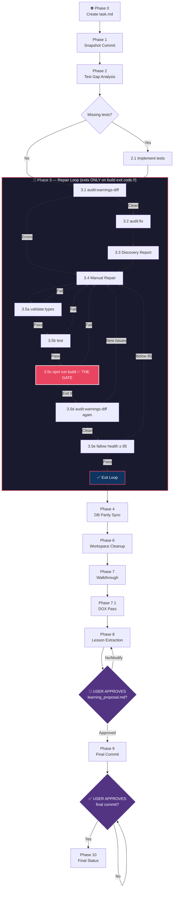

# Safe Commit Workflow: Poké Vicio Edition

> [!IMPORTANT]
> **PROMPT-DRIVEN TRIGGER ONLY**: Activate when the user explicitly requests a commit or push. Do NOT activate for automatic agent-internal saves or background operations.

---

## ⚡ Sequential Execution Contract

This workflow is a **strict state machine**, not a checklist. Each step produces output that the next step consumes. Before making any tool call, internalize these rules:

| Rule | What it means |
|------|---------------|
| **One command per turn** | Issue one tool call, read its output, then decide the next step. Never batch. |
| **Read before continuing** | "I ran it" ≠ "I verified the result." Read every output before proceeding. |
| **No optional steps** | Every step in the sequence is mandatory unless it has an explicit skip condition. |
| **Update `task.md` after every tool call** | Not after every phase — after every single command. |
| **Errors halt immediately** | Non-zero exit code or unexpected output = STOP, fix, re-run. Never continue past a failure. |

> [!CAUTION]
> The most common failure mode is batching commands or skipping output verification. The cost is committing broken code into **permanent, irreversible** git history.

---

## Workflow Overview



> [!IMPORTANT]
> **IMMUTABLE STEPS**: Every node in this diagram is mandatory. You may add sub-tasks for complex features, but deleting or skipping original phases is FORBIDDEN.
>
> **Living Proof of Progress**: After completing each phase, mark it `[x]` in `task.md` AND include a checklist snippet in your response as visual proof.

---

## Phase 0: Mandatory Artifact Creation

> [!CAUTION]
> This is the absolute first thing you do — before `git status`, before any npm command, before anything.

**Step 0.1** — Create `task.md`

Call `write_to_file` with `ArtifactMetadata` to write `<appDataDir>/brain/<conversation-id>/task.md`.

> [!IMPORTANT]
> **MANDATORY TEMPLATE PARITY**: You MUST use the exact structure and content from [task-template.md](./references/task-template.md) to initialize `task.md`. Creating custom, ad-hoc, or incomplete task checklists is STRICTLY FORBIDDEN.

Write the full checklist for Phases 0–10 with all sub-items, all marked `[ ]`. This is the single source of truth — without it there is no way to verify which steps actually ran.

**Step 0.2** — Note the scratch path

The scratch directory is `<appDataDir>/brain/<conversation-id>/scratch/`. All temporary report files go here.

**✓ Completion gate**: Mark Phase 0 `[x]` in `task.md`. Include the updated checklist snippet in your response. Only then proceed to Phase 1.

---

## Phase 1: Initial Snapshot Commit

This commit is recovery insurance. If Phase 3 repairs accidentally corrupt a file, `git diff HEAD~1` shows exactly what changed. Without this commit, an auto-fix could silently overwrite your creative logic.

> [!IMPORTANT]
> **SNAPSHOT HEALTH EXEMPTION**: Phase 1 is a recovery snapshot, not the final safety gate. If `npx fallow health --score` reports a score below the project minimum of 85 during Step 1.4, record that value as `BASELINE_HEALTH` and continue with the snapshot commit. Do not block, refactor, or repair in Phase 1 because the snapshot exists specifically to protect the pre-repair state. The 85 minimum is enforced later in Phase 3.5e, after audits, fixes, tests, and build verification run.

**Step 1.1** — `git status`
- Identify all modified, untracked, and deleted files.
- Record the file list in `task.md`.

**Step 1.2** — `git diff`
- Read the full diff output.
- Confirm you understand what changed in every file before proceeding.

**Step 1.3** — AGENTS.md chain review
- For each modified file, walk from the repo root and `view_file` every `AGENTS.md` along the path.
- If any local contract is contradicted, resolve it before committing.

**Step 1.4** — `npx fallow health --score`
- Read and record the score as `BASELINE_HEALTH = <score>` in `task.md`.
- This number is required for the Phase 3.5e comparison. Do not proceed without recording it.
- If the score is below 85, write `snapshot baseline below final gate` in `task.md` and continue. This is the only allowed Fallow health exemption, and it applies only before the Phase 1 snapshot commit.

**Step 1.5** — Compose the commit message
- Use the Elegant Protocol (see [commit-standards.md](./references/commit-standards.md)).
- Derive the message from the actual `git diff` read in Step 1.2, not from memory.

**Step 1.6** — `git add .` (MANDATORY `.` — SELECTIVE `git add <file>` IS STRICTLY FORBIDDEN)
> [!CAUTION]
> **ZERO SELECTIVE ADD RULE**: You MUST execute `git add .` to capture 100% of modified, untracked, and deleted files in the working directory. Selecting individual files or ignoring untracked files is STRICTLY FORBIDDEN. Partial staging leaves untracked work unprotected against corruption during Phase 3 auto-fixes.

**Step 1.7** — `git commit -m "<message>"` → verify commit was created successfully

**✓ Completion gate**: Mark Phase 1 `[x]` in `task.md`. Show snippet. Only then proceed to Phase 2.

---

## Phase 2: Test Gap Analysis

For each file from Step 1.1, ask: **"Does this file contain non-trivial logic?"** (conditionals, computations, or state mutations).

| In-scope (needs tests) | Out-of-scope (tests don't apply) |
|---|---|
| `src/logic/` | `src/components/` declarative templates |
| `src/stores/` | `src/views/` (E2E territory) |
| `src/composables/` with embedded logic | `src/data/` static databases |
| `src/utils/`, `src/helpers/` | `src/types/` TypeScript-only files |

**Step 2.1** — For each in-scope file, check if a corresponding test exists in `tests/unit/` or `tests/node/`.

- If new non-trivial logic has no test: add a mandatory **SUB-TASK** in `task.md` and implement the test before Phase 3.

**✓ Completion gate**: Mark Phase 2 `[x]` in `task.md`. Show snippet. Only then proceed to Phase 3.

---

## Phase 3: Active Verification Cycle — The Repair Loop

> [!CAUTION]
> **THE BUILD GATE IS THE ONLY EXIT FROM THIS PHASE.**
>
> `npm run build` returning **exit code 0** is the sole exit condition. Passing type-checks alone, tests alone, or lint alone is NOT sufficient. If the build fails for any reason — even after types and tests pass — you remain inside the loop. Return to Step 3.4, fix the build failure, and restart from Step 3.5a.

> [!IMPORTANT]
> **NO VALIDATION EXEMPTIONS**: Every sub-step is mandatory for every commit, including trivial single-token changes.

### Step 3.1 — `npm run audit:warnings-diff`

This is the primary gatekeeper. It reports all project-wide errors and new warnings in modified files vs `origin/main`.

1. Run the command and wait for it to complete.
2. Read the full output.
3. Record the result in `task.md`.

**If errors found** → skip 3.2 and 3.3, go directly to Step 3.4.
**If clean** → proceed to Step 3.2.

> [!TIP]
> The audit engine supports powerful CLI flags (passed after `--`) to triage failures efficiently:
> - `--rule="<partial-name>"` — filter to a single rule (e.g. `--rule="mágico"` for magic-number errors only).
> - `--summary` — show a compact rule-count + top-files table instead of the full listing. **Always use this first to avoid terminal floods.**
> - `--top=N` / `-t N` — control the number of offending files shown (default 15; use `--top=30` for broader sweeps).
> - `--json` / `-j` — emit structured JSON output, pipeable into scripts or `jq` for programmatic processing.
> - `--errors-only` — suppress warnings; print only hard errors.
>
> **Quick investigation recipe:** `npm run audit -- --rule="<rule>" --summary --top=30`

### Step 3.2 — `npm run audit:fix`

Auto-repairs easy fixes (viewport tags, `node:` prefixes, ESM extensions).

1. Run the command and wait for it to complete.
2. Read the output and note which fixes were applied.
3. Update `task.md` with applied repairs.

Proceed to Step 3.3.

### Step 3.3 — Autonomous Repair Discovery

> [!NOTE]
> This step's output is the mandatory work order for Step 3.4. Unread issues become unrepaired issues.

**Step 3.3a** — Read the warnings report

Use `view_file` on `scratch/warnings_diff_report.txt` (or `.json`). Extract every listed issue.

**Step 3.3b** — Run and read the Fallow report

```bash
npx fallow audit --changed-since origin/main > scratch/fallow_report.txt
```

Then `view_file` on `scratch/fallow_report.txt`. Extract all dead code, unused exports, duplication, and complexity findings.

**Step 3.3c** — Write the Technical Debt Report

Write a section in your response titled **"Technical Debt Report"** enumerating ALL issues from 3.3a and 3.3b. If there are zero issues, write "Technical Debt Report: 0 issues found." Either way, the report must appear before proceeding.

Update `task.md` with the total issue count.

### Step 3.4 — Manual Repair Phase

Fix each issue from the Technical Debt Report one at a time:

1. Edit the source file.
2. Append the fix description to `task.md` under "Repairs applied".
3. After completing all fixes in this batch, proceed to Step 3.5a — do NOT skip it even if you believe the build is already clean.

> **Escalation** — pause and ask the user only if:
> - Multiple valid architectural solutions exist with non-obvious tradeoffs
> - Business or gameplay requirements are ambiguous
> - Product direction requires explicit approval
>
> Otherwise continue autonomously.

### Step 3.5a — `npm run validate:types`

1. Run the command and wait for completion.
2. Read the full output.

> [!CAUTION]
> **STRICT SUB-STEP GATE**: If TypeScript errors exist, you MUST STOP immediately and fix the TypeScript errors in the source code right now. Re-run `npm run validate:types` until it passes cleanly. **Do NOT proceed to Step 3.5b (tests) while TypeScript errors exist.**

**If TypeScript errors exist** → record them in `task.md`, fix them, and re-run Step 3.5a.
**If clean (0 errors)** → update `task.md` with `types: ✅`. Proceed to Step 3.5b.

### Step 3.5b — `npm run test`

1. Run the command and wait for completion.
2. Read the full output.

> [!CAUTION]
> **STRICT SUB-STEP GATE**: If any unit/node/integration test fails, you MUST STOP immediately and fix the failing tests in the source code right now. Re-run `npm run test` until all tests pass cleanly. **Do NOT proceed to Step 3.5c (build) while test failures exist.**

**If any test fails** → record the failing tests in `task.md`, fix them, and re-run Step 3.5b.
**If all pass** → update `task.md` with `tests: ✅`. Proceed to Step 3.5c.

### Step 3.5c — `npm run build` ← THE BUILD GATE 🔒

> [!CAUTION]
> Do not issue any other tool call while the build is running. Wait for it to fully complete. This is the only gate that unlocks Phase 4.

1. Run the command.
2. Wait for it to fully complete — do NOT issue any other tool call in the meantime.
3. Read the exit code and full output.

> [!CAUTION]
> **STRICT SUB-STEP GATE**: If exit code ≠ 0 or build errors exist, you MUST STOP immediately, fix the build/compilation errors in the source code right now, and re-run `npm run validate:types` and `npm run build`. **Do NOT proceed to Step 3.5d while build errors exist.**

**If exit code ≠ 0 or build errors exist** → record under "Build failures" in `task.md`, fix the errors, and re-run validation. You are still inside the loop. Do NOT proceed to 3.5d.
**If exit code = 0 and no errors** → update `task.md` with `build: ✅ (exit 0)`. Proceed to Step 3.5d.

### Step 3.5d — `npm run audit:warnings-diff` (re-validation)

Repairs can introduce new warnings. This re-run confirms the loop's output is clean.

1. Run the command and wait for completion.
2. Read the full output.

**If any errors or new warnings** → the repair cycle introduced regressions. Record them in `task.md`, return to Step 3.4.
**If 0 errors, 0 new warnings** → update `task.md` with `post-repair audit: ✅`. Proceed to Step 3.5e.

### Step 3.5e — `npm run fallow:health` (or `node ./node_modules/fallow/bin/fallow health --score`)

1. Run the command and wait for completion.
2. Read the score.

The score MUST be **≥ `BASELINE_HEALTH`** (recorded in Step 1.4) AND **≥ 85**.

**If below 85 or regressed** → run `npm run fallow -- health --targets --hotspots`, record a refactoring sub-plan in `task.md`, perform the refactors, restart from Step 3.5a.
**If valid** → update `task.md` with `health: ✅ score=<N>`.

**✅ Loop exited.** Mark Phase 3 `[x]` in `task.md` with all sub-scores recorded. Show snippet. Only then proceed to Phase 4.

---

## Phase 4: Database Triple Parity Sync

> **Skip condition**: no database schema changes were made (verify from Step 1.2 diff output).

If the schema changed:

1. Verify SQL migration exists in `database/migrations/`.
2. Verify `src/logic/db/migrations_data.ts` was regenerated by the Vite plugin.
3. Verify `database/schemas/` is updated.
4. Verify the WASM SQLite engine is initialized with the new delta.

**✓ Completion gate**: Mark Phase 4 `[x]` in `task.md` (or note "skipped — no DB changes"). Only then proceed to Phase 6.

---

## Phase 5: Failure Recovery

If any phase check failed and you fixed the cause, restart Phase 3 entirely — a lint repair might break a build or introduce a SASS trap.

> [!IMPORTANT]
> After any correction, update `task.md` with the remaining steps. Do not stop until Phase 3 returns 100% success on all sub-steps.

---

## Phase 6: Workspace Cleanup

1. Run `git status` — verify no untracked temp files, logs, or reports appear in the project root or source directories.
2. Delete all generated report files from `scratch/` (audit reports, fallow reports, etc.).

> **NEVER delete `requirements.txt` in the root.**

**✓ Completion gate**: Mark Phase 6 `[x]` in `task.md`. Only then proceed to Phase 7.

---

## Phase 7: Walkthrough Generation

Call `write_to_file` to create or update `<appDataDir>/brain/<conversation-id>/walkthrough.md` with `ArtifactMetadata` (`UserFacing: true`).

- **Content**: changes made, files affected, verification results (build ✅, tests ✅, health score).
- **Evidence**: embed any screenshots or recordings produced during the session.

**✓ Completion gate**: Mark Phase 7 `[x]` in `task.md`. Only then proceed to Phase 7.1.

---

## Phase 7.1: DOX Maintenance (The DOX Pass)

1. Load and follow the [dox-navigator](../dox-navigator/SKILL.md) skill.
2. For each modified file (list from Step 1.1), `view_file` the nearest `AGENTS.md` in its folder tree.
3. If changes modified any purpose, rules, contracts, or configurations, update that `AGENTS.md`.
4. If any new directory with an `AGENTS.md` was created, add it to its parent's Child DOX Index.
5. Run `npm run audit` — must report **0 errors** in the `DOX (AGENTS.md) Integrity` category. If errors exist: fix and re-run.

**✓ Completion gate**: Mark Phase 7.1 `[x]` in `task.md`. Only then proceed to Phase 8.

---

## Phase 8: Lessons Extraction & 🛑 Hard Stop

> [!CAUTION]
> **PRE-LESSON GATE**: Before anything in this phase, call `view_file` on `task.md` and confirm Phases 0, 1, 2, 3, 4, 6, 7, and 7.1 are ALL marked `[x]`. If even one phase has an unresolved item, abort Phase 8, return to that phase, and resolve it. Generating a lesson proposal while phases are incomplete is a CRITICAL VIOLATION.

**Step 8.1** — Load and follow the [/learn-with-docs](../learn-with-docs/SKILL.md) skill to extract lessons. This is mandatory — do NOT ask the user whether to run it.

**Step 8.2** — Call `write_to_file` to create `<appDataDir>/brain/<conversation-id>/learning_proposal.md` with `ArtifactMetadata` (`UserFacing: true`, `RequestFeedback: true`, detailed multi-line `Summary`). Never save it in `scratch/` or inside the repo.

**Step 8.3** — Call `ask_question` to present the lesson proposal with Approve / Reject-Modify options.

> [!CAUTION]
> **🛑 ABSOLUTE HARD STOP AFTER STEP 8.3**: Stop calling tools immediately after `ask_question`. Do not execute `git commit`, `git add`, or any file edits in the same turn. Do not proceed to Phase 9. Wait for the user's response.

---

## Phase 9: Lesson Approval & Final Commit

This phase begins **only after** the user explicitly approves the lesson proposal from Phase 8.

1. Persist approved lessons into their respective `AGENTS.md` files as proposed.
2. Call `ask_question` to request explicit user approval for the final optimization commit.
3. Run `git status` — only DOX documentation updates and final build artifacts should remain.
4. `git add .`
5. Commit with header `docs(agents):` or `refactor(audit):`.

**✓ Completion gate**: Mark Phase 9 `[x]` in `task.md`. Only then proceed to Phase 10.

---

## Phase 10: Final Status & Instructions

Notify the user that both commits (Snapshot + Optimization) were successfully created.

> [!IMPORTANT]
> **MANUAL PUSH MANDATE**: You are FORBIDDEN from executing `git push`. Inform the user the repository is clean and to push manually when ready.

Display this block at the end of your response:

```bash
# Push changes to remote
git push origin main

# Update database on a specific server
npm run servers:db:update -- --server=<profile>

# Update database on all configured servers
npm run servers:db:update -- --all
```

Mark Phase 10 `[x]` in `task.md`. Workflow complete.

---

## Commit Message Standards

See [commit-standards.md](./references/commit-standards.md) for the full Elegant Protocol, dual-commit strategy, gold standard example, and forbidden patterns.

**Quick reference — forbidden patterns:**

- Single-word messages (`commit`, `update`, `fix`).
- No bulleted list when 2+ files changed.
- Vague descriptions without the technical "what".
- Messages written from memory instead of the actual `git diff`.

---

## Anti-Shortcut Policy

- **No Phase-Jumping**: Phases 9–10 cannot execute if any of Phases 0–8 have unresolved `task.md` items.
- **Missing Tests Prohibition**: Committing with identified missing tests from Phase 2 that aren't implemented is FORBIDDEN.
- **Fallow Health Gate**: Creating the Phase 1 snapshot commit with health < 85 is allowed only as recovery insurance after recording `BASELINE_HEALTH`. Exiting Phase 3 or creating the final commit with health < 85 remains a critical violation.
- **Fallow Bypass Prohibition**: Modifying `.fallowrc.json` to bypass Fallow errors instead of fixing them at the source is STRICTLY FORBIDDEN.
- **Selective Git Add Prohibition**: Staging individual files via `git add <file>` during Phase 1 is STRICTLY FORBIDDEN. You MUST always execute `git add .` to snapshot the entire workspace before proceeding to Phase 2.
- **Safe Array Swaps**: Always verify indexed array elements are not `undefined` before value swaps in strict TypeScript (`noUncheckedIndexedAccess`).
