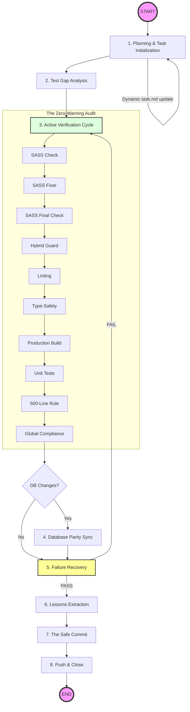

# Safe Commit Workflow: Poké Vicio Edition

## Triggering

> [!IMPORTANT]
> **PROMPT-DRIVEN TRIGGER**: This skill MUST be used whenever the user explicitly asks to commit or push changes (e.g., "commit", "push", "git commit", "upload changes"). It MUST NOT be used for automatic agent internal saves or background operations unless the user initiates the command.

This skill ensures that NO BROKEN OR MESSY CODE is ever committed. It leverages the project's internal validation scripts (SASS Traps, Hybrid Detection) and standard linting/testing to guarantee a production-ready state.

## Execution Steps

### Workflow Overview

> [!IMPORTANT]
> **IMMUTABLE STEPS**: You MUST follow every step in this diagram. You are allowed to add intermediate sub-tasks for complex features, but you are FORBIDDEN from deleting or skipping any original design steps.

### 1. Planning & Task Initialization

Before writing any code or finalizing changes, analyze the work done.

- Create or update `task.md` in the agent's private directory. This file is your **source of truth**; use it to track every granular step.
- **Dynamic Updates**: If you discover new complex problems during the process, you MUST immediately add them as new items to `task.md` to ensure no requirement is forgotten.
- Verify that every change aligns with the **Hybrid Retro-Modern** identity.

### 2. Test Gap Analysis

Review all modified files in `src/logic/`.

- Identify any new logic (battle calculations, move effects, evolution logic) that lacks corresponding tests in `tests/unit/`.
- **MANDATORY**: Create or update Vitest files to ensure logic is verified.

### 3. Active Verification Cycle (The "Zero-Warning" Audit)

You MUST run these commands and fix EVERY issue until a clean pass is achieved.

- **SASS Integrity Check**: `python3 .agents/skills/project-standards/scripts/check_sass_traps.py` (Identify existing traps).
- **SASS Auto-Fix**: `python3 .agents/skills/project-standards/scripts/fix_sass_traps.py` (Run this to resolve common interpolation issues if the check fails).
- **SASS Integrity Final**: `python3 .agents/skills/project-standards/scripts/check_sass_traps.py` (Ensure 100% compliance after fixing).
- **Hybrid Guard**: `python3 .agents/skills/project-standards/scripts/detect_hybrid_patterns.py`.
- **Linting**: `npm run lint` (Must return 0 errors and 0 warnings).
- **Type-Safety**: `npx vue-tsc --noEmit` (Crucial for detecting broken props or reactive refs).
- **Production Build**: `npm run build` (Ensures Vite can compile the project).
- **Unit Tests**: `npm run test` (MANDATORY: All tests must pass. If a single test fails, the commit process must stop).
- **Modularity Check**: Audit files for the **500-line rule**. If any file you touched exceeds this limit, you MUST refactor it now (Exceptions: Data-heavy definition files/pseudo-databases).
- **Global Compliance**: Verify absolute adherence to all rules in @/project-standards, including Hybrid identity and Navigation Hub references.

### 4. Database Triple Parity Sync

If the database schema has changed:

1. Verify the SQL migration exists in `database/migrations/`.
2. Verify the Vite plugin has regenerated `src/logic/db/migrations_data.js`.
3. Verify the absolute schema in `database/schemas/` is updated.
4. **Local Sync**: If testing locally, ensure the WASM SQLite engine is initialized correctly with the new delta.

### 5. Failure Recovery & Workflow Projection

- If any check fails, fix the issue and **RE-START Step 3**. A fix for a lint error might break a build or introduce a SASS trap.
- > [!CAUTION]
  > **STOP ON FAILURE**: If something does not work or a test fails, you MUST fix it immediately. It is forbidden to proceed to the next step or attempt the commit if the verification cycle is not perfect.
- > [!IMPORTANT]
  > **WORKFLOW PROJECTION**: After any fix, you MUST explicitly update `task.md` and list the REMAINING steps. Do not stop until the verification cycle returns 100% success and all tasks are completed.

### 6. Lessons Extraction (MANDATORY)

Run @/extract-lessons to capture patterns (e.g., a new SASS trick or a Phaser optimization).

- **Continuity Guard**: After analysis, proceed immediately to the commit phase.

### 7. The Safe Commit

1. `git status` to verify all files (including docs and `.agents/skills/` updates) are staged.
2. `git add .`
3. Commit with a message following conventional standards (`feat:`, `fix:`, `refactor:`, `docs:`).

### 8. Push & Close

Push changes and notify the user.

## Commit Message Standards

- Be descriptive: `feat(battle): add burn effect calculation and unit tests`
- Reference completed tasks from `task.md`.

## Example Recovery Strategy

**Correct Behavior after a fix:**
"Fixed lowercase filter collision in `MapCard.vue`.
**Workflow Projection**:

1. [ ] Re-run `check_sass_traps.py` (Step 3).
2. [ ] Run `npm run build` to verify compilation.
3. [ ] Extract lessons.
4. [ ] Git commit & push."
