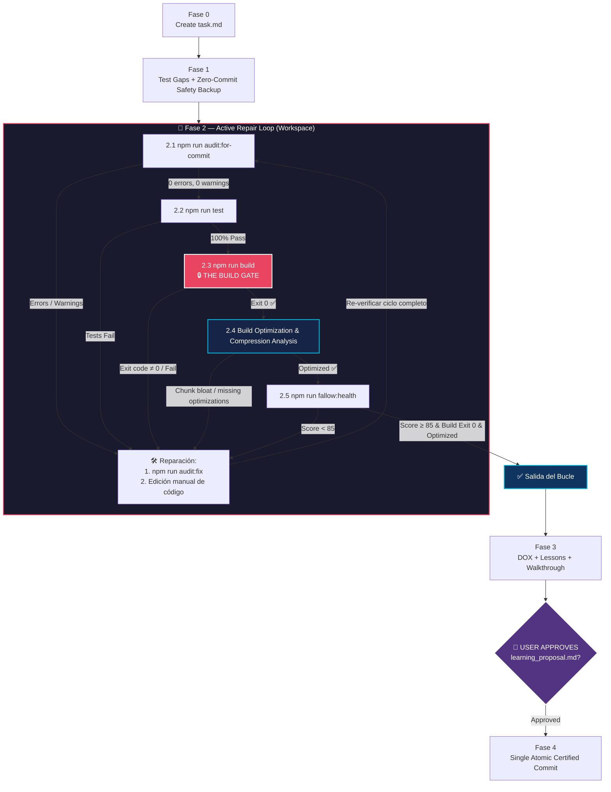

# Safe Commit Workflow: Poké Vicio Edition

> [!IMPORTANT]
> **PROMPT-DRIVEN TRIGGER ONLY**: Activate when the user explicitly requests a commit or push. Do NOT activate for automatic agent-internal saves or background operations.

---

## ⚡ Sequential Execution Contract

This workflow is a **strict state machine**, not a loose checklist. Each step produces output that the next step consumes.

| Rule | What it means |
|---|---|
| **One command per turn** | Issue one tool call, read its output, then decide the next step. Never batch. |
| **Read before continuing** | "I ran it" ≠ "I verified the result." Read every output before proceeding. |
| **No optional phases** | Phases 0–4 are mandatory. Skipping phases is STRICTLY FORBIDDEN. |
| **Update `task.md` continuously** | Update `<appDataDir>/brain/<conversation-id>/task.md` after each step. |
| **Unbroken Repair Loop** | You MUST NEVER exit Phase 2 until `npm run build` exits with code 0 on the final code. |
| **Zero Gatekeeper Tampering** | Agents MUST NEVER weaken, alter, relax, or reinterpret the verification rules, thresholds, or filtering logic of `audit_for_commit.ts`, `audit_project.ts`, or any quality gatekeeper to make checks pass. All project errors and NEW warnings (including unused exports and complexity) MUST be resolved cleanly at the code source. Suppressing auditor findings or altering auditor intentions without explicit user consultation is STRICTLY FORBIDDEN. |
| **Dynamic Modules & Domain Exports Analysis** | When resolving unused exports (Fallow), NEVER blindly strip `export` without analyzing whether the symbol is needed by dynamically loaded modules (dynamic routes, Vite glob imports, Web Workers, reflection), test suites, or public domain type contracts (`src/types/**`). If an export is an intentional domain contract or required for dynamic loading, register it under `ignoreExports` in `.fallowrc.json` with clear justification instead of breaking runtime accessibility. Only strictly file-private helpers in implementation files may have `export` removed. |

> [!CAUTION]
> The most common failure modes are batching commands, assuming a fix worked without re-running `npm run build`, skipping output verification, or **modifying auditor scripts to suppress warnings instead of fixing source code**. Modifying gatekeeper scripts to bypass new warnings (e.g. converting new unused exports or complexity into legacy/ignored) is a critical violation of system integrity and trust. The cost is committing unverified or degraded code into **permanent, irreversible** git history.

---

## Workflow Overview



---

## Phase 0: Mandatory Artifact Initialization

> [!CAUTION]
> This is the absolute first action — before `git status`, before any npm command, before anything.

**Step 0.1** — Initialize `task.md`

Call `write_to_file` to create `<appDataDir>/brain/<conversation-id>/task.md` using the exact structure from [task-template.md](./references/task-template.md). All phase items start as `[ ]`.

**Step 0.2** — Note scratch directory

The temporary working directory is `<appDataDir>/brain/<conversation-id>/scratch/`.

**✓ Completion gate**: Mark Phase 0 `[x]` in `task.md` and include a snippet in your response. Proceed to Phase 1.

---

## Phase 1: Test Gap Analysis & Zero-Commit Safety Backup

This phase audits test coverage for modified logic and captures a zero-commit safety backup in the workspace. If subsequent audit auto-fixes or repairs corrupt logic, the patch file in `scratch/backups/` allows instantaneous recovery without polluting git history with premature, unverified commits.

**Step 1.1** — Inspect changes (`git status` & `git diff`)
- Run `git status` to identify modified, untracked, and deleted files.
- Inspect `git diff` and review all conversation session artifacts in `<appDataDir>/brain/<conversation-id>/` (`implementation_plan.md`, `walkthrough.md`, scratch notes) to build a clear mental model of the feature/bugfix.

**Step 1.2** — Test Gap Analysis
- For each modified file containing non-trivial logic (`src/logic/`, `src/stores/`, `src/composables/`, `src/utils/`):
  - Check if corresponding unit tests exist in `tests/unit/` or `tests/node/`.
  - If non-trivial logic lacks tests, implement the required unit tests **now** (before proceeding to verification).

**Step 1.3** — Record Baseline Fallow Health
- Run `npm run fallow:health`.
- Record `BASELINE_HEALTH = <score>` in `task.md`.
- *Exemption*: If the pre-repair score is < 85, record `snapshot baseline below final gate` in `task.md` and continue. (Score ≥ 85 is enforced at Phase 2.5).

**Step 1.4** — Zero-Commit Safety Backup
- **PROHIBITION ON PREMATURE COMMITS**: Executing `git commit` at this stage is strictly forbidden. Creating commits before verification hides diffs from local comparisons and puts unverified code into Git history.
- **STRICT CODE-ONLY LIMITATION**: To avoid shell freezes, disk bloat, and memory exhaustion from massive binary assets, media files, or large generated JSON catalogs, the backup patch MUST strictly target source code files and exclude binaries, media, and huge JSON data.
- Create directory `scratch/backups/` if it does not exist.
- Generate the code-only safety patch backup:
  - PowerShell / Bash:
    ```bash
    git diff HEAD -- '*.ts' '*.vue' '*.js' '*.scss' '*.css' 'database/**/*.sql' ':!*.json' ':!*.min.js' ':!*.wasm' > scratch/backups/pre_audit_backup.patch
    ```
- Pre-draft the target commit message using the Elegant Protocol (see [commit-standards.md](./references/commit-standards.md)) and record it in `task.md` under "Target Commit Message" for use in Phase 4.

**✓ Completion gate**: Mark Phase 1 `[x]` in `task.md`. Show snippet. Proceed to Phase 2.

---

## Phase 2: Active Verification & Repair Loop

> [!CAUTION]
> **THE UNBREAKABLE BUILD GATE — INFINITE REPAIR LOOP**:
> You are inside an active loop. The **ONLY** condition that allows exiting Phase 2 is when `npm run build` returns **Exit Code 0** AND all verification steps pass cleanly.
>
> If `audit:for-commit` fails, `npm run test` fails, `npm run build` fails (exit ≠ 0), compression/chunk optimizations require changes, or `fallow:health` is < 85:
> **YOU MUST NOT ADVANCE TO PHASE 3.**
> You must fix the code, apply repairs, and restart the verification cycle until `npm run build` succeeds with Exit Code 0 and all gates pass.

### The Cycle Sequence

In every iteration of the loop, execute these checks sequentially:

1. **Check 2.1 — Primary Audit**: Run `npm run audit:for-commit`
   - *If errors or new warnings exist*:
     - Run `npm run audit:fix` (auto-repairs simple imports, viewport tags, etc.).
     - Apply manual fixes to the source code for remaining issues.
     - **Unused Exports Handling**: When Fallow flags unused exports, perform root cause analysis:
       - If the export is a legitimate public domain contract in `src/types/**` or needed by dynamic modules/workers/tests, add it to `ignoreExports` in `.fallowrc.json`.
       - If it is strictly an internal helper or private tuple in an implementation file, remove `export`.
       - Never blindly strip `export` if dynamic modules or reflection might break.
     - Record fixes under "Repairs applied" in `task.md`.
     - Re-run `npm run audit:for-commit` until it reports **0 errors and 0 new warnings**.
   - *If clean (0 errors, 0 new warnings)*: Proceed immediately to Check 2.2.

2. **Check 2.2 — Test Suite**: Run `npm run test`
   - *If any test fails*: Fix the source code or test logic, and re-test until 100% of tests pass.
   - *If 100% pass*: Proceed to Check 2.3.

3. **Check 2.3 — THE BUILD GATE 🔒**: Run `npm run build`
   - *Strict Requirement*: MUST return **Exit Code 0**.
   - *Zero Bypass Mandate*: It is STRICTLY FORBIDDEN to replace `npm run build` with `npx vite build` or partial scripts to evade audit failures. `npm run build` runs `validate:tools`, `validate:types`, `audit`, and `vite build`.
   - *If exit code ≠ 0 or build fails*:
     - **DO NOT PROCEED.** Record the error in `task.md`.
     - Fix the underlying compilation, type, or auditor errors in source code.
     - Restart from Check 2.1 and re-run until `npm run build` returns Exit Code 0.

4. **Check 2.4 — Build Optimization & Data Compression Audit**:
   - Analyze the build output and pre-compression report table (`⚡ POKÉ VICIO — PRE-COMPRESSION & ASSET SUMMARY`):
     - **Pre-compression & Savings Verification**: Inspect Brotli Q11 and Gzip L9 sizes and savings ratios across all categories (Workers, WASM, App Shell, Vendor, Game Data, UI/Views). Verify that high compression savings are maintained without compression errors.
     - **Chunk Size & Bloat Inspection**: Check individual chunks against size thresholds (Vite warning limit 3000 kB, PWA precache warning limit 5 MB `⚠️`). Check for unexpected chunk size inflation or accidental monolithic grouping.
     - **Optimization Opportunities Assessment**: Evaluate whether newly added or modified code/assets require:
       - Adjusting `manualChunks` in `vite.config.ts` (e.g. isolating large data domains, vendors, or worker modules).
       - Code-splitting large static data into dynamic asynchronous chunks.
       - Tree-shaking optimizations or removing unused asset references.
     - *If optimization opportunities or chunk anomalies are found*: Implement the necessary optimizations in `vite.config.ts` or source code, record them under "Repairs applied" in `task.md`, and re-enter the loop from Check 2.1.
     - *If optimized and clean*: Record key compression metrics (total original bytes, Brotli size, % savings) in `task.md` and proceed to Check 2.5.

5. **Check 2.5 — Fallow Health**: Run `npm run fallow:health`
   - Score MUST be ≥ `BASELINE_HEALTH` and ≥ 85.
   - If < 85, refactor cognitive complexity / dead code and re-verify.

6. **Check 2.6 — Database Parity (if DB changed)**:
   - Verify SQL migration exists in `database/migrations/` and `src/logic/db/migrations_data.ts`.

### Loop Exit Condition
Only when Check 2.1 ✅ (0 errors/warnings), Check 2.2 ✅ (tests pass), Check 2.3 ✅ (`npm run build` exit code 0), Check 2.4 ✅ (compression & optimizations verified), and Check 2.5 ✅ (health ≥ 85) are all satisfied consecutively on the current code:
**Phase 2 is complete.**

**✓ Completion gate**: Mark Phase 2 `[x]` in `task.md`. Show snippet. Proceed to Phase 3.

---

## Phase 3: Unified DOX, Lessons Extraction & 🛑 Hard Stop

**Step 3.1** — DOX Maintenance (`AGENTS.md`)
- For any modified files that changed architectural rules, contracts, or directory structures:
  - Load the [dox-navigator](../dox-navigator/SKILL.md) skill.
  - Update the nearest `AGENTS.md` in the touched directory tree.
  - If new directories were created, update the parent's Child DOX Index.

**Step 3.2** — Lessons Extraction
- Load and execute [/learn-with-docs](../learn-with-docs/SKILL.md).
- Identify key learnings, patterns, or caveats from this session.
- Call `write_to_file` to create `<appDataDir>/brain/<conversation-id>/learning_proposal.md` (`UserFacing: true`, `RequestFeedback: true`).

**Step 3.3** — Walkthrough & Workspace Cleanup
- Call `write_to_file` to create/update `<appDataDir>/brain/<conversation-id>/walkthrough.md` (`UserFacing: true`).
- Clean temporary files from `scratch/` and verify clean `git status`.

**Step 3.4** — 🛑 Hard Stop for User Approval
- Call `ask_question` presenting the `learning_proposal.md` and walkthrough summary with Approve / Reject-Modify options.

> [!CAUTION]
> **🛑 ABSOLUTE HARD STOP AFTER STEP 3.4**: Stop calling tools immediately after `ask_question`. Do NOT run `git commit`, `git add`, or file edits in the same turn. Wait for user response.

---

## Phase 4: Single Atomic Certified Commit & Completion

This phase begins **only after** the user explicitly responds to Phase 3.

**Step 4.1** — Apply Approved Lessons
- Persist approved lessons into their respective `AGENTS.md` files.

**Step 4.2** — Single Atomic Certified Commit
- Run `git status` to verify modified files (including feature code, tests, audit fixes, and updated DOX).
- Synthesize the final commit message using the Elegant Protocol (see [commit-standards.md](./references/commit-standards.md)):
  - Retrieve the pre-drafted message from `task.md` (Step 1.4).
  - Supplement it with bullets for unit tests added (Phase 1), audit fixes / optimizations applied (Phase 2), and lessons / DOX updated (Phase 3).
- Execute `git add .` (MANDATORY `.` — selective staging is strictly forbidden).
- Execute `git commit -m "<message>"`.
- Run `git status` to confirm working tree is clean. Exactly ONE atomic, verified commit has been added to history.

**Step 4.3** — Final Status & Deployment Instructions
- Notify the user that the process is complete.
- **Push Protection**: AI agents are FORBIDDEN from pushing directly to `main` (`origin/main`). Pushing to `main` is strictly manual. For development branches (e.g. `desarrollo`), push if requested.
- Display manual deployment commands:

```bash
# Push changes to remote (if on development branch, or for manual execution)
git push origin <branch>

# Update database on a specific server
npm run database:update server=<profile>

# Update database on all configured servers
npm run database:update all
```

Mark Phase 4 `[x]` in `task.md`. Workflow complete.

---

## Anti-Shortcut Policy

- **Premature Commit Prohibition**: Creating commits in Phase 1 (such as snapshot commits) is STRICTLY FORBIDDEN. Commits are reserved exclusively for Phase 4 after all gates pass.
- **No Phase-Jumping**: Phase 4 cannot execute if Phases 0–3 have unresolved items.
- **Missing Tests Prohibition**: Committing code with unwritten unit tests identified during Phase 1.2 is STRICTLY FORBIDDEN.
- **Strict Build Exit 0**: Exiting Phase 2 without `npm run build` returning Exit Code 0 is STRICTLY FORBIDDEN.
- **Fallow Health Gate**: Exiting Phase 2 with Fallow health < 85 is a critical violation.
- **Fallow Bypass Prohibition**: Adding file-level ignore directives (`/* eslint-disable */`, `@ts-nocheck`) is STRICTLY FORBIDDEN.
- **Selective Git Add Prohibition**: Staging individual files via `git add <file>` is FORBIDDEN. Always use `git add .`.
