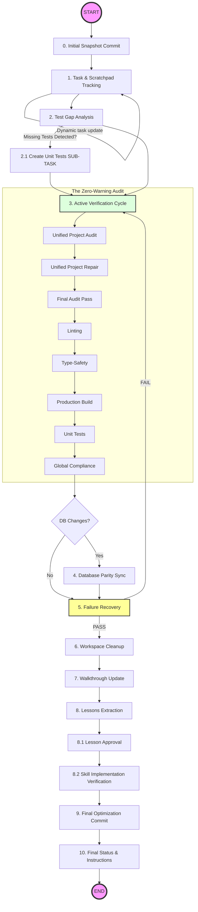

# Safe Commit Workflow: Poké Vicio Edition

## Triggering

> [!IMPORTANT]
> **PROMPT-DRIVEN TRIGGER**: This skill MUST be used whenever the user explicitly asks to commit or push changes (e.g., "commit", "push", "git commit", "upload changes"). It MUST NOT be used for automatic agent internal saves or background operations unless the user initiates the command.

This skill ensures that NO BROKEN OR MESSY CODE is ever committed. It leverages the project's internal validation scripts (SASS Traps, Hybrid Detection) and standard linting/testing to guarantee a production-ready state.

## Execution Steps

### Workflow Overview



> [!IMPORTANT]
>
> - **IMMUTABLE STEPS**: You MUST follow every step in this diagram. You are allowed to add intermediate sub-tasks for complex features, but you are FORBIDDEN from deleting or skipping any original design steps.
> - **Incremental Update & Visual Proof**: Keep the **task** and **scratchpad** updated **phase by phase**. After updating the **task**, you MUST include a small snippet of the updated checklist in your response to the USER as visual proof of progress. **Advancing without updating the source of truth is a violation of project standards.**

### 0. Initial Snapshot Commit (CRITICAL)

BEFORE touching any files or starting the verification cycle, you MUST perform an initial commit to safeguard the current state.

1. `git status` to check changes.
2. `git add .`
3. **Commit Message**: Use the "Elegant Protocol" (Step 148) to describe the work performed so far.
4. **Why**: This ensures that even if an automated repair tool or linter modifies files, your original logic is preserved in the history and can be easily diffed.

### 1. Task & Scratchpad Tracking (MANDATORY)

Before making any significant changes or finalizing tasks, maximum traceability of the process MUST be guaranteed using only the **task** and **scratchpad** artifacts.

- **Rigor in Tracking**: Create a **NEW task** artifact. This is the **absolute source of truth**; it must record every granular step from scratch, avoiding inheriting tasks from previous sessions.
- **Scratchpad Usage**: Use the **scratchpad** artifact for temporary notes, log captures, and intermediate data processing.
- **Documented Closure**: Always update `walkthrough.md` with evidence (screenshots, test logs) to close the technical rigor cycle.
- Verify that every change aligns with the **Hybrid Retro-Modern** identity.

### 2. Test Gap Analysis

Review all modified files in `src/logic/`.

- Identify any new logic (battle calculations, move effects, evolution logic) that lacks corresponding tests in `tests/unit/`.
- **ABSOLUTE MANDATORY SUB-TASK**: If any modified file in `src/logic/` lacks unit tests, you **MUST** implement them immediately. There is no "worthy" exception; any logic change requires a corresponding test to ensure zero regressions. Add this as a high-priority **SUB-TASK** in the **task**.
- **NEVER FORGET**: While adding tests, the general objective of committing clean, verified code must remain the priority.

### 3. Active Verification Cycle (The "Zero-Warning" Audit)

You MUST run these commands and fix EVERY issue until a clean pass is achieved.

> [!IMPORTANT]
> **Pre-existing Warnings**: If the audit (Lint, Types, SASS) reveals warnings or errors in files you did not modify, you ARE RESPONSIBLE for fixing them before committing. A "Safe Commit" means a 100% clean repository state, not just for your changes.

**THE MANDATORY CHAIN (Execution Order):**

1. `npm run validate:types`
2. `npm run validate:sql` (CRITICAL: Verifies migration syntax against SQLite)
3. **Items Integrity**: `npm run validate:items` (Auditoría de integridad de base de datos de objetos)
4. **FSM Audit**: `npm run fsm:audit` (Auditoría de estados de batalla contra diagramas Mermaid)
5. **Standard Repair**: `npm run audit:fix` (Corrección automática de Viewports y filtros SASS)
6. **Linting**: `npm run lint`
7. **Unit Tests**: `npm run test`
8. **Production Build**: `npm run build`

### 4. Database Triple Parity Sync

If the database schema has changed:

1. Verify the SQL migration exists in `database/migrations/`.
2. Verify the Vite plugin has regenerated `src/logic/db/migrations_data.ts`.
3. Verify the absolute schema in `database/schemas/` is updated.
4. **Local Sync**: If testing locally, ensure the WASM SQLite engine is initialized correctly with the new delta.

### 5. Failure Recovery & Workflow Projection

- If any check fails, fix the issue and **RE-START Step 3**. A fix for a lint error might break a build or introduce a SASS trap.
- > [!CAUTION]
  > **STOP ON FAILURE**: If something does not work or a test fails, you MUST fix it immediately. It is forbidden to proceed to the next step or attempt the commit if the verification cycle is not perfect.
- > [!IMPORTANT]
  > **WORKFLOW PROJECTION & PROGRESS UPDATE**: After any correction, test creation, or **upon finalizing a logical phase**, you MUST explicitly update the **task** and list the REMAINING steps. Do not stop until the verification cycle returns 100% success and all tasks (including newly discovered sub-tasks) are completed.

### 6. Workspace Cleanup (MANDATORY)

Before extracting lessons or committing, you MUST delete all temporary artifacts created during the development or verification process.

- Delete all files and content in the **scratchpad** that are no longer needed.
- Delete any ad-hoc test files (e.g., `test_output.txt`, `tmp_log.tson`) created in the root or subdirectories.
- **Audit Cleanup**: Delete all `.txt` files related to auditing (generally containing `_audit_` in the name, like `audit_results.txt` or `gpu_audit_results.txt`). **CRITICAL: NEVER delete `requirements.txt` in the root.**
- Ensure `git status` does not show untracked temporary files that should not be in the repository.

### 7. Walkthrough Generation (MANDATORY)

Before extracting lessons, you MUST create or update the `walkthrough.md` artifact.

- **Content**: Summarize the changes made, the files affected, and the verification results.
- **Evidence**: Embed any relevant screenshots or recordings produced during the task.

### 8. Lessons Extraction (LOCAL)

Run **@/extract-lessons** to capture patterns (e.g., a new SASS trick or a CSS/GSAP optimization). This is a **local documentation task** and MUST NOT involve a browser subagent.

- **Lesson Approval Mandatory & Hard Stop**: After **@/extract-lessons** presents the lesson mapping table, you MUST **STOP** immediately. This approval step is exclusively for validating the new knowledge/lessons to be persisted. You are FORBIDDEN from calling any other tool (especially `git` or `write_to_file`) until the user provides explicit approval of these lessons.
- **NEVER COMMIT BLINDLY**: It is strictly forbidden to proceed to Step 8.2 without explicit user confirmation of the extracted lessons plan.
- **Mental State Check**: Before requesting approval, read the **task** one last time to ensure every single sub-item is marked as `[x]`.

### 8.2. Skill Implementation Verification (HARD STOP)

After the lessons are distributed and the skill files are updated by `@/extract-lessons` (via Phase 3), you MUST perform a second verification.

1. **Self-Review**: Read the modified `SKILL.md` files to ensure the content matches the approved plan.
2. **User Approval Mandatory**: You MUST explicitly ask the user: "Are the changes applied to the skills correct?".
3. **Hard Stop**: You are FORBIDDEN from proceeding to Step 9 until the user provides an explicit "Yes" or approval of the final file content.

### 9. Final Optimization Commit

After the user approves the final skill implementation in Step 8.2, you MUST perform a second and final commit capturing the optimizations and fixes from the audit cycle.

1. `git status` to verify staged changes (only audit-related diffs should remain).
2. `git add .`
3. **Commit Message (The Optimization Log)**: The header should use `refactor(audit):` or `fix(lint):`. The body MUST focus **ONLY** on the technical optimizations, linting fixes, and SASS repairs performed during Step 3.
4. **Example**: `refactor(audit): resolve SASS traps and 12 linting warnings in BattleHUD`.

### 10. Final Status & Instructions

Notify the user that the commits (Snapshot and Optimization) have been successfully created.

- **MANUAL PUSH MANDATE**: You are FORBIDDEN from executing `git push`. You MUST inform the user that the local repository is clean and updated, and they should perform the `push` manually when ready.
- **WIP Audit Documentation**: If the commit is partial or part of an ongoing migration, it is acceptable to commit even with audit failures (SASS, Aesthetics, Length), provided they are explicitly listed in the commit message as "Pending Migrations". This allows work to be synchronized without being blocked by pre-existing technical debt, maintaining traceability.

## Commit Message Standards (The Elegant Protocol)

Commit messages MUST NOT be terse. They MUST provide a clear, technical chronicle of the "what", "why", and "how" to maintain the project's high-rigor history.

### 0. Source of Truth

- **MANDATORY**: Use the current **task** and `walkthrough.md` as the primary sources for the commit message. A commit message that ignores the granular steps recorded in these artifacts is considered a failure.

### 1. Dual-Commit Strategy

- **The Snapshot (Phase 0)**: Its purpose is to capture creative/logical work. It MUST use the "Elegant Protocol" (Header + Body with bullets) to explain the "what" and "why" of the user's changes.
- **The Optimization Log (Phase 9)**: Its purpose is to document technical cleanup. It must be concise and list only audit repairs (linting, build fixes, SASS repairs).

### 2. Structure Requirement (The Elegant Protocol)

### 2. Master Example (The Gold Standard)

```text
feat(battle): optimize silhouette rendering and sync wild encounter timing

- Migrated silhouette filter from feFlood to feColorMatrix for improved GPU performance.
- Reduced wild Pokémon emergence Phase 1 duration from 2.2s to 1.1s for faster gameplay.
- Synchronized isWildSilhouetteHalfway trigger at 550ms with the sprite jump animation.
- Implemented isFloating metadata check to automatically hide ground grass bushes for flying species.
- Refactored useBattleAnimations.ts to centralize encounter phase constants.
```

### 3. Forbidden Patterns

- Single-word messages (e.g., `commit`, `update`, `fix`).
- Messages without a bulleted list for changes involving 2+ files.
- Vague descriptions like "minor changes" without specifying the technical "what".

## Example Recovery Strategy

**Correct Behavior after a fix:**
"Fixed lowercase filter collision in `MapCard.vue`.
**Workflow Projection**:

1. [ ] Re-run `audit_project.py` (Step 3).
2. [ ] Run `npm run build` to verify compilation.
3. [ ] Workspace Cleanup (Step 6).
4. [ ] Extract lessons (Step 7).
5. [ ] **Wait for Lesson Approval** (Step 8.1).
6. [ ] **Wait for Skill Implementation Verification** (Step 8.2).
7. [ ] Final Optimization Commit (Step 9).
"

### 11. Rigor Enforcement (Anti-Shortcut Rule)

- **No Phase-Jumping**: It is strictly forbidden to execute steps 9 or 10 if steps 1-8 are not fully documented and checked in the **task**.
- **Test Implementation Check**: You are FORBIDDEN from committing if there are identified "Missing Tests" in Step 2 that haven't been implemented and marked as `[x]`.
- **Contextual Review**: Before each tool call in the verification cycle, ask yourself: "Is my task updated with the result of the *previous* tool call?". If not, update it first.
