# Safe Commit Workflow: Poké Vicio Edition

> [!IMPORTANT] **PROMPT-DRIVEN TRIGGER ONLY**: Activate when the user explicitly requests a commit or push. Do NOT activate for automatic agent-internal saves or background operations.

This skill ensures that NO BROKEN OR MESSY CODE is ever committed. It leverages the project's internal validation scripts (SASS Traps, Hybrid Detection) and standard linting/testing to guarantee a production-ready state.

## Execution Steps

### Workflow Overview

```mermaid
graph TD
    Start((START)) --> Snapshot[0. Initial Snapshot Commit]
    Snapshot --> Tracking[1. Task & Scratchpad Tracking]
    Tracking --> |"Dynamic task update"| Tracking
    Tracking --> GapAnalysis[2. Test Gap Analysis]
    GapAnalysis --> MissingTests{Missing Tests?}

    MissingTests -->|Yes| CreateTests[2.1 Create Unit Tests SUB-TASK]
    MissingTests -->|No| Verification

    CreateTests --> Verification

    subgraph "The Zero-Warning Audit"
        Verification[3. Active Verification Cycle] --> DiffAudit[3.1 Warnings & Errors Diff Audit]
        DiffAudit --> AutoFix[3.2 Automatic Repair Pass]
        AutoFix --> Discovery[3.3 Autonomous Repair Discovery]
        Discovery --> ManualFix[3.4 Manual Repair Phase]
        ManualFix --> FinalAudit[3.5 Final Validation Pass]

        FinalAudit --> Types[Type-Safety]
        Types --> Build[Production Build]
        Build --> UnitTests[Unit Tests]
        UnitTests --> HealthScore[Health Score Check]
    end

    HealthScore --> ValidationGate{Validation Successful?}

    ValidationGate -->|No| Verification

    ValidationGate -->|Yes| HealthCompare{Health Score Regressed?}

    HealthCompare -->|Yes| Verification

    HealthCompare -->|No| DBCheck{DB Changes?}

    DBCheck -->|Yes| DBSync[4. Database Parity Sync]
    DBCheck -->|No| Recovery[5. Failure Recovery]

    DBSync --> Recovery

    Recovery --> Cleanup[6. Workspace Cleanup]
    Cleanup --> Walkthrough[7. Walkthrough Generation]
    Walkthrough --> DoxPass[7.1 DOX Update & Pass]
    DoxPass --> Lessons[8. Lessons Extraction]
    Lessons --> LessonApproval[8.1 Lesson Approval]

    LessonApproval -->|Rejected| Lessons
    LessonApproval -->|Approved| SkillVerification[8.2 Skill Verification]

    SkillVerification -->|Rejected| Lessons
    SkillVerification -->|Approved| Commit[9. Final Optimization Commit]
    Commit --> Notify[10. Final Status & Instructions]
    Notify --> End((END))

    style Start fill:#f9f,stroke:#333,stroke-width:4px
    style End fill:#f9f,stroke:#333,stroke-width:4px
    style Recovery fill:#ff9,stroke:#333,stroke-width:2px
    style Verification fill:#dfd,stroke:#333,stroke-width:2px
```



> [!IMPORTANT]
>
> - **IMMUTABLE STEPS**: You MUST follow every step in this diagram. You are allowed to add intermediate sub-tasks for complex features, but you are FORBIDDEN from deleting or skipping any original design steps.
> - **Incremental Update & Visual Proof**: Keep the **task** and **scratchpad** updated **phase by phase**. After updating the **task**, you MUST include a small snippet of the updated checklist in your response to the USER as visual proof of progress. **Advancing without updating the source of truth is a violation of project standards.**

### 0. Initial Snapshot Commit (CRITICAL)

BEFORE touching any files or starting the verification cycle, you MUST perform an initial commit to safeguard the current state.

1. **Analyze Diff and Status**: Run `git status` and `git diff` to analyze ALL modified and untracked files in the workspace since the last commit. You MUST NOT rely solely on the current conversation context.
2. **AGENTS.md Chain Review**: Identify every file you modified. For each one, walk the path from the repo root and read every `AGENTS.md` found along the route. Confirm that the changes do not contradict any local contract (the closest `AGENTS.md` controls). If a contradiction is found, resolve it before committing.
3. **Initial Project Health**: Run `npx fallow health --score` to capture and record the starting health score of the project before any modifications, to compare with the final score at Step 3.5.
4. **Comprehensive Message**: Review every modified file's diff to understand the changes made, including those from previous sessions or manual edits.
5. `git add .`
6. **Commit Message**: Use the "Elegant Protocol" (see [commit-standards.md](./references/commit-standards.md)) to describe the work performed. The message MUST capture all changes across all modified files since the last commit, not just those from the current conversation.
7. **Why**: This ensures that even if an automated repair tool modifies files, your original logic is preserved in history and can be easily diffed.

### 1. Task & Scratchpad Tracking (MANDATORY)

Before making any significant changes or finalizing tasks, maximum traceability of the process MUST be guaranteed using only the **task** and **scratchpad** artifacts.

- **Rigor in Tracking**: Create a **NEW task** artifact. This is the **absolute source of truth**; it must record every granular step from scratch, avoiding inheriting tasks from previous sessions.
- **Scratchpad Usage**: Use the **scratchpad** artifact for temporary notes, log captures, and intermediate data processing.
- **Documented Closure**: Create or update `walkthrough.md` at Step 7 with evidence to close the technical rigor cycle.
- Verify that every change aligns with the **Hybrid Retro-Modern** identity.

### 2. Test Gap Analysis

For each modified file, ask: **"Does this file contain non-trivial logic?"** — functions with conditionals, computations, or state mutations. If yes, it needs test coverage.

**In-scope** (almost always): `src/logic/`, `src/stores/`, `src/composables/` with embedded logic, `src/utils/` and `src/helpers/` with pure functions.

**Out-of-scope** (unit tests don't apply): `src/components/` declarative templates, `src/views/` (E2E territory), `src/data/` static databases, `src/types/` TypeScript-only files.

- **ABSOLUTE MANDATORY SUB-TASK**: If any in-scope modified file contains new non-trivial logic without a corresponding test in `tests/unit/` or `tests/node/`, you **MUST** implement those tests immediately. There are no exceptions. Add this as a high-priority **SUB-TASK** in the **task**.
- **NEVER FORGET**: While adding tests, the general objective of committing clean, verified code must remain the priority.

### 3. Active Verification Cycle (The "Zero-Warning" Audit)

You MUST run the warnings-diff gatekeeper tool and fix EVERY issue until a clean pass is achieved.

> [!IMPORTANT] **NO VALIDATION EXEMPTIONS**: Every single step of the validation pipeline is STRICTLY MANDATORY. Under no circumstances (including "trivial" or minor single-token changes) may the agent skip any step, especially the production build (`npm run build`), type check, linting, tests, or audit.
> [!IMPORTANT] **Zero-Error Mandate for the Entire Project**: The final repository state MUST have exactly ZERO errors (including typescript, compilation, linting, build, SASS, GPU, items, database, etc.) across the entire project. The agent is STRICTLY REQUIRED to autonomously diagnose, fix, and repair ALL project-wide errors before committing.
> [!IMPORTANT] **Zero-Warning Mandate for Files Modified Since last Push (`origin/main`)**: Every single file containing local changes compared to GitHub's `origin/main` MUST have all its warnings resolved. You may ONLY ignore a warning in a modified file if that exact warning already existed in the version of the file on `origin/main`.

**THE MANDATORY AUDIT PIPELINE:**

1. **Warnings & Errors Diff Audit**: `npm run audit:warnings-diff`
   - **CRITICAL**: This is the primary gatekeeper. It checks for all project errors and new warnings in modified files compared to `origin/main`.
   - **MUST RETURN ZERO ISSUES**: You are strictly forbidden from committing if `npm run audit:warnings-diff` reports any errors or new warnings.

2. **Automatic Repair**: `npm run audit:fix`
   - Run this to handle easy fixes (Viewports, Node prefixes, ESM extensions).

3. **Autonomous Repair Discovery (THE REPORT)**:
   - Use `view_file` on `scratch/warnings_diff_report.txt` or `scratch/warnings_diff_report.json` to analyze the warnings/errors.
   - Run `npx fallow audit --changed-since origin/main > scratch/fallow_report.txt` and use `view_file` to analyze the report. Ensure no new dead code, unused exports, duplication, or excessive complexity is introduced.
   - **MANDATORY**: List all issues, new warnings, project errors, and Fallow recommendations in your response as a "Technical Debt Report" before proceeding to repair them.

4. **Manual Repair Phase**:
   - Fix each identified issue autonomously in the code.
   - All project-wide errors and all new warnings in modified files MUST be fixed.

### Escalation Policy

The AI MUST continue autonomously unless one of the following conditions occurs:
- Multiple valid architectural solutions exist.
- Business requirements are unclear.
- Gameplay behaviour is ambiguous.
- Product direction requires explicit approval.

Only under these conditions may the AI request user intervention.

5. **Final Validation Pass**:
   - `npm run validate:types`
   - `npm run test`
   - `npm run build` (enforces audit:full internally and compiles the application)
   - Re-run `npm run audit:warnings-diff` to verify that everything is 100% clean (0 errors, 0 new warnings).
   - **Health Regression Check**: Run `npx fallow health --score` and compare with the starting score from Step 0.3. If regressed, identify the complexity hotspots introduced by your changes, refactor them, and re-run until the score is equal to or greater than the baseline.

### 4. Database Triple Parity Sync

If the database schema has changed:

1. Verify the SQL migration exists in `database/migrations/`.
2. Verify the Vite plugin has regenerated `src/logic/db/migrations_data.ts`.
3. Verify the absolute schema in `database/schemas/` is updated.
4. **Local Sync**: Ensure the WASM SQLite engine is initialized correctly with the new delta.

### 5. Failure Recovery & Workflow Projection

- If any check fails, fix the issue and **RE-START Step 3**. A fix for a lint error might break a build or introduce a SASS trap.

> [!CAUTION] **STOP ON FAILURE**: If something does not work or a test fails, you MUST fix it immediately. It is forbidden to proceed to the next step or attempt the commit if the verification cycle is not perfect.
> [!IMPORTANT] **WORKFLOW PROJECTION & PROGRESS UPDATE**: After any correction, test creation, or upon finalizing a logical phase, you MUST explicitly update the **task** and list the REMAINING steps. Do not stop until the verification cycle returns 100% success and all tasks are completed.

### 6. Workspace Cleanup (MANDATORY)

Before extracting lessons or committing, clean up all temporary artifacts.

- **Scratch Mandate Adherence**: Verify that any temporary files, debug outputs, text reports, or summaries were written exclusively to the `scratch/` directory.
- Delete all files and content in the **scratchpad** that are no longer needed.
- Delete all generated report files from `scratch/` (e.g., `scratch/audit_report.txt`, `scratch/fallow_report.txt`, etc.). **CRITICAL: NEVER delete `requirements.txt` in the root.**
- Ensure `git status` does not show untracked temporary files, logs, or report files in the project root or source directories.

### 7. Walkthrough Generation (MANDATORY)

Create or update the `walkthrough.md` artifact.

- **Content**: Summarize the changes made, the files affected, and the verification results.
- **Evidence**: Embed any relevant screenshots or recordings produced during the task.

### 7.1 DOX Maintenance (The DOX Pass) (MANDATORY)

Before proceeding to lessons extraction, you MUST perform a complete DOX check:

1. **Verify Changed Paths**: Review all modified files against their corresponding `AGENTS.md` files in their folder tree.
2. **Update Contracts and Content**: If the changes modified any purpose, rules, contracts, parameters, or configurations, update the nearest owning `AGENTS.md` to reflect these updates.
3. **Index Refresh**: If any new directory with an `AGENTS.md` file was created, add it to its parent's `Child DOX Index`.
4. **Run DOX Audit**: Verify that `npm run audit` runs successfully and reports 0 errors in the `DOX (AGENTS.md) Integrity` category. Any DOX errors must be fixed before proceeding.

### 8. Lessons Extraction (LOCAL) 🛑

Trigger the official **/learn** workflow directly. When generating the mandatory `learning_proposal.md` artifact (with `request_feedback = true` in metadata) outlining the classification, rationale, and precise text additions/diffs:
1. **Target File Language**: You MUST write the proposed updates or additions using the native/dominant language of each target file or skill being updated.
2. **User Explanations**: All descriptions, justifications, and explanations in the artifact and communication directed to the user MUST be written in Spanish.
3. **Precise Location Targeting**: Do NOT place lessons arbitrarily. Carefully analyze the project's DOX structure (the multiple `AGENTS.md` files in subdirectories), reference manuals under `@/project-standards`, and specific local skills. You MUST target the most specific and logical file or section that owns the topic of the lesson, rather than dumping everything in root files.

This is a **local documentation task** and MUST NOT involve a browser subagent.

> [!CAUTION] **🛑 LESSON PROPOSAL APPROVAL — HARD STOP**: Once the `learning_proposal.md` artifact is created, you MUST **STOP** immediately. You are FORBIDDEN from calling any other tool (especially `git` or making further file edits) until the user provides explicit approval of the proposed lessons. This stop is about validating *what knowledge to persist*, not about the code itself.

- **NEVER COMMIT BLINDLY**: It is strictly forbidden to proceed to Step 9 without explicit user confirmation of the learning proposal.
- **Mental State Check**: Before requesting approval, read the **task** one last time to ensure every single sub-item is marked as `[x]`.

### 9. Final Optimization Commit

After the user approves the learning proposal in Step 8, perform a second and final commit.

1. `git status` to verify staged changes (only audit-related diffs should remain).
2. `git add .`
3. **Commit Message (The Optimization Log)**: Use `refactor(audit):` or `fix(lint):` as header. The body MUST focus **ONLY** on the technical optimizations, linting fixes, and SASS repairs performed during Step 3.
4. **Example**: `refactor(audit): resolve SASS traps and 12 linting warnings in BattleHUD`.

### 10. Final Status & Instructions

Notify the user that both commits (Snapshot and Optimization) have been successfully created.

- **MANUAL PUSH MANDATE**: You are FORBIDDEN from executing `git push`. Inform the user that the local repository is clean and they should push manually when ready.
- **Zero Audit Failures**: Under NO circumstances are audit failures (SASS, Aesthetics, Length, FSM, Types, Lint) allowed in any commit.
- **DATABASE & REMOTE SYNCHRONIZATION ALERT**: Display a prominent warning at the very end of your response informing the user they must push and update the database schemas on the servers. Provide these commands:

  ```bash
  # Push changes to remote
  git push origin main

  # Update database on a specific server
  npm run servers:db:update -- --server=<profile>

  # Update database on all configured servers
  npm run servers:db:update -- --all
  ```

---

## Commit Message Standards

See [commit-standards.md](./references/commit-standards.md) for the full Elegant Protocol, the dual-commit strategy, the gold standard example, and the list of forbidden patterns.

**Quick reference — forbidden patterns:**

- Single-word messages (`commit`, `update`, `fix`).
- Messages without a bulleted list for changes involving 2+ files.
- Vague descriptions like "minor changes" without specifying the technical "what".

---

## Example Recovery Strategy

**Correct behavior after a fix:** "Fixed lowercase filter collision in `MapCard.vue`. **Workflow Projection**:

1. [ ] Re-run `npm run audit:full` (Step 3).
2. [ ] Run `npm run build` to verify compilation (Step 3.5).
3. [ ] Workspace Cleanup (Step 6).
4. [ ] Walkthrough Generation (Step 7).
5. [ ] DOX Maintenance & Audit (Step 7.1).
6. [ ] Extract lessons (Step 8). **Wait for 🛑 Lesson Approval**.
7. [ ] **Wait for ✅ Skill Implementation Verification** (Step 8.2).
8. [ ] Final Optimization Commit (Step 9)."

---

## ⚠️ Anti-Shortcut Policy

- **No Phase-Jumping**: It is strictly forbidden to execute Steps 9 or 10 if Steps 1–8 are not fully documented and checked in the **task**.
- **Test Implementation Check**: You are FORBIDDEN from committing if there are identified "Missing Tests" in Step 2 that haven't been implemented and marked as `[x]`.
- **Contextual Review**: Before each tool call in the verification cycle, ask yourself: "Is my task updated with the result of the *previous* tool call?". If not, update it first.
- **Fallow Bypass Prohibition (`.fallowrc.json`)**: It is STRICTLY FORBIDDEN to modify `.fallowrc.json` (such as adding ignored dependencies, files, or exports) solely to bypass Fallow errors in order to pass the commit gate. Every single error must be properly FIXED in the source code, regardless of the time or delay required. Shortcuts or configuration bypasses are forbidden. **Concrete example of a valid fix**: If Fallow reports `Export no usado: 'getCombatAI'`, check if the export is genuinely public API. If the function is only used within the same file, remove the `export` keyword — do NOT add it to `ignoreExports`.
- **Safe Array Swaps (noUncheckedIndexedAccess)**: In strict TypeScript environments, indexing elements inside arrays (e.g. `arr[idx]`) can return `undefined`. Always verify that indexed elements are not undefined before performing values swaps or reassignments to prevent compiler errors.
