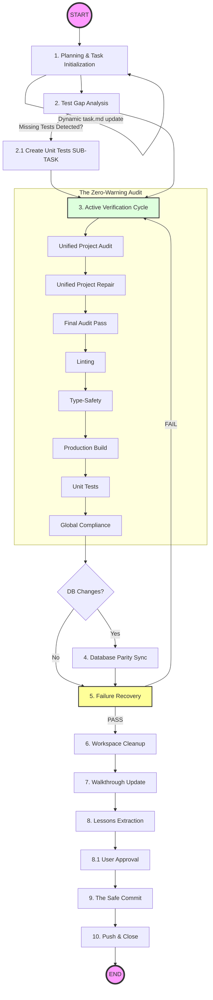

# Safe Commit Workflow: Poké Vicio Edition

## Triggering

> [!IMPORTANT]
> **PROMPT-DRIVEN TRIGGER**: This skill MUST be used whenever the user explicitly asks to commit or push changes (e.g., "commit", "push", "git commit", "upload changes"). It MUST NOT be used for automatic agent internal saves or background operations unless the user initiates the command.

This skill ensures that NO BROKEN OR MESSY CODE is ever committed. It leverages the project's internal validation scripts (SASS Traps, Hybrid Detection) and standard linting/testing to guarantee a production-ready state.

## Execution Steps

### Workflow Overview



> [!IMPORTANT]
> **IMMUTABLE STEPS**: You MUST follow every step in this diagram. You are allowed to add intermediate sub-tasks for complex features, but you are FORBIDDEN from deleting or skipping any original design steps.

### 1. Planificación y Trazabilidad (MANDATORY)

Antes de realizar cualquier cambio significativo o finalizar tareas, se DEBE garantizar la máxima trazabilidad del proceso.

- **Mandatory Planning**: Crear el artefacto `implementation_plan.md` detallando la arquitectura y el plan de verificación. **DETENERSE** y esperar la aprobación explícita del usuario ("ok") antes de proceder.
- **Rigor en el Seguimiento**: Crear o actualizar `task.md`. Este archivo es la **fuente de verdad absoluta**; debe registrar cada paso granular, incluyendo descubrimientos y sub-tareas imprevistas.
- **Cierre Documentado**: Actualizar siempre `walkthrough.md` con evidencia (capturas, logs de tests) para cerrar el ciclo de rigor técnico.
- Verificar que cada cambio se alinee con la identidad **Hybrid Retro-Modern**.

### 2. Test Gap Analysis

Review all modified files in `src/logic/`.

- Identify any new logic (battle calculations, move effects, evolution logic) that lacks corresponding tests in `tests/unit/`.
- **MANDATORY SUB-TASK**: If a module or file lacks critical unit tests and it is "worthy" (worth the effort for stability), you MUST create a new unit test. Add this as a **SUB-TASK** in `task.md` immediately.
- **NEVER FORGET**: While adding tests, the general objective of committing clean, verified code must remain the priority.

### 3. Active Verification Cycle (The "Zero-Warning" Audit)

You MUST run these commands and fix EVERY issue until a clean pass is achieved.

> [!IMPORTANT]
> **Pre-existing Warnings**: If the audit (Lint, Types, SASS) reveals warnings or errors in files you did not modify, you ARE RESPONSIBLE for fixing them before committing. A "Safe Commit" means a 100% clean repository state, not just for your changes.

- **Unified Project Audit**: `python3 .agents/skills/project-standards/scripts/audit_project.py` (Runs SASS, Hybrid, GPU, Length, and Redundancy checks).
- **Unified Project Repair**: `python3 .agents/skills/project-standards/scripts/repair_project.py` (Run this to resolve automated issues if the audit fails).
- **Linting**: `npm run lint` (Must return 0 errors and 0 warnings).
- **Type-Safety**: `npx vue-tsc --noEmit` (Crucial for detecting broken props or reactive refs).
- **Production Build**: `npm run build` (Ensures Vite can compile the project).
- **Unit Tests**: `npm run test` (MANDATORY: All tests must pass).
- **Global Compliance**: Verify absolute adherence to all rules in @/project-standards, including Hybrid identity and Navigation Hub references.

### 4. Database Triple Parity Sync

If the database schema has changed:

1. Verify the SQL migration exists in `database/migrations/`.
2. Verify the Vite plugin has regenerated `src/logic/db/migrations_data.js`.
3. Verify the absolute schema in `database/schemas/` is updated.
4. **Local Sync**: If testing locally, ensure the WASM SQLite engine is initialized correctly with the new delta.

### 5. Failure Recovery & Workflow Projection

- If any check fails, fix the issue and **RE-START Step 3**. A fix for a lint error might break a build or introduce a SASS trap.
- > [!CAUTION]
  > **STOP ON FAILURE**: If something does not work or a test fails, you MUST fix it immediately. It is forbidden to proceed to the next step or attempt the commit if the verification cycle is not perfect.
- > [!IMPORTANT]
  > **WORKFLOW PROJECTION**: After any fix or test creation, you MUST explicitly update `task.md` and list the REMAINING steps. Do not stop until the verification cycle returns 100% success and all tasks (including newly discovered sub-tasks) are completed.

### 6. Workspace Cleanup (MANDATORY)

Before extracting lessons or committing, you MUST delete all temporary artifacts created during the development or verification process.

- Delete files in `<appDataDir>/brain/<conversation-id>/scratch/` if they are no longer needed.
- Delete any ad-hoc test files (e.g., `test_output.txt`, `tmp_log.json`) created in the root or subdirectories.
- **Audit Cleanup**: Delete all `.txt` files related to auditing (generally containing `_audit_` in the name, like `audit_results.txt` or `gpu_audit_results.txt`). **CRITICAL: NEVER delete `requirements.txt` in the root.**
- Ensure `git status` does not show untracked temporary files that should not be in the repository.

### 7. Walkthrough Generation (MANDATORY)

Before extracting lessons, you MUST create or update the `walkthrough.md` artifact.

- **Content**: Summarize the changes made, the files affected, and the verification results.
- **Evidence**: Embed any relevant screenshots or recordings produced during the task.

### 8. Lessons Extraction (LOCAL)

Run **@/extract-lessons** to capture patterns (e.g., a new SASS trick or a Phaser optimization). This is a **local documentation task** and MUST NOT involve a browser subagent.

- **Feedback Mandatory**: After @/extract-lessons presents the lesson mapping table, you MUST stop and wait for the user to approve the changes.
- **NEVER COMMIT BLINDLY**: It is strictly forbidden to proceed to Step 9 without explicit user confirmation of the extracted lessons.

### 9. The Safe Commit

1. `git status` to verify all files (including docs, `.agents/skills/` updates, and artifacts) are staged.
2. `git add .`
3. Commit with a message following conventional standards (`feat:`, `fix:`, `refactor:`, `docs:`).

### 10. Push & Close

Push changes and notify the user.

## Commit Message Standards (The Elegant Protocol)

Commit messages MUST NOT be terse. They MUST provide a clear, technical chronicle of the "what", "why", and "how" to maintain the project's high-rigor history.

### 0. Source of Truth

- **MANDATORY**: Use the current `task.md` and `walkthrough.md` as the primary sources for the commit message. A commit message that ignores the granular steps recorded in these artifacts is considered a failure.

### 1. Structure Requirement

- **Header**: Conventional Commit format (`type(scope): description`) in lowercase, summary of the main impact.
- **Body**: A blank line followed by a detailed, bulleted list (`-`) of specific technical changes.
- **Audit Milestone**: Mention the specific results of the "Zero-Warning Audit" (e.g., "Pass 27 Reach", "0 colisiones de redundancia").
- **Verification Metrics**: Explicitly state the number of unit tests passed and build status (e.g., "Verified via 243 unit tests and production build pass").

### 2. Master Example (The Gold Standard)

```text
docs(standards): modernize add-pokemon skill and enforce Zero-Warning culture

- Updated add-pokemon SKILL.md with CLI-First protocols and interactive hatching details.
- Refactored fetch_pokemon.js for path parity with SECONDARY_TYPES and POKEMON_ABILITIES.
- Hardened safe-commit and project-standards with new governance rules.
- Resolved pre-existing lint warnings in debug and modal components to achieve Zero-Warning state.
- Verified system stability via full build and 240 unit tests (100% pass).
```

### 3. Forbidden Patterns

- Single-word messages (e.g., `commit`, `update`, `fix`).
- Messages without a bulleted list for changes involving 2+ files.
- Omitting the verification results (build/tests).

## Example Recovery Strategy

**Correct Behavior after a fix:**
"Fixed lowercase filter collision in `MapCard.vue`.
**Workflow Projection**:

1. [ ] Re-run `audit_project.py` (Step 3).
2. [ ] Run `npm run build` to verify compilation.
3. [ ] Workspace Cleanup (Step 6).
4. [ ] Extract lessons (Step 7).
5. [ ] **Wait for User Approval** (Step 7.1).
6. [ ] Git commit & push (Step 8).
"
