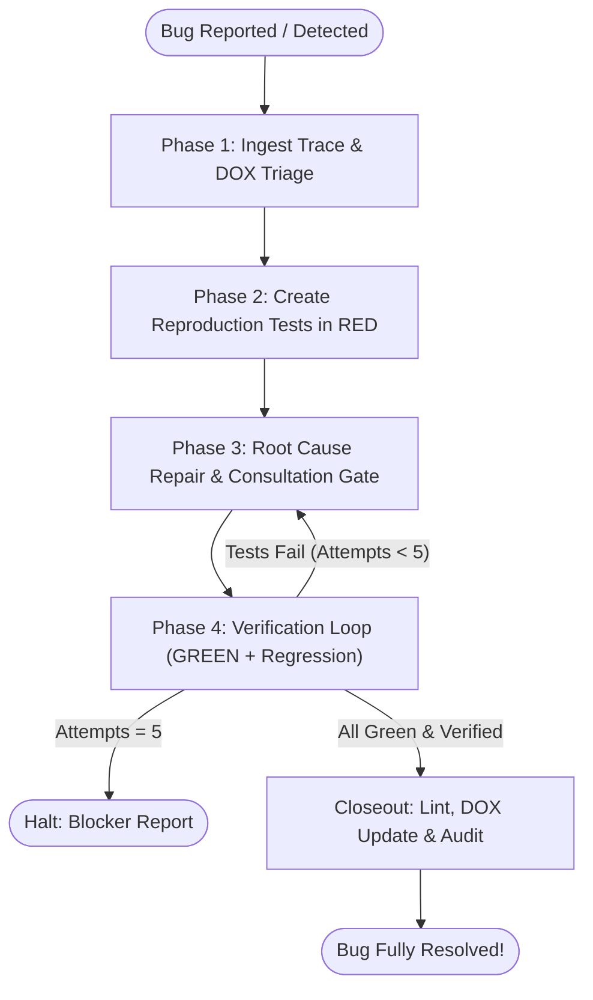

# Systematic Debugging

> **The Single Source of Truth for Evidence-Based Troubleshooting & Reactive Bug Fixing.**
> Simulations and tests are the proof of correctness. `src/` must conform to them, never the reverse.

---

## ⛔ INVIOLABLE DEBUGGING GATES (ZERO DEVIATION)

1. **⛔ GATE 1: PROHIBITION ON EDITING `src/` BEFORE RED REPRODUCTION**:
   - It is STRICTLY FORBIDDEN to modify `src/` or apply speculative patches before creating an isolated reproduction test in `tests/node/` or `tests/unit/` and observing a deterministic failure in **RED**.
2. **⛔ GATE 2: ZERO RUNTIME FALLBACKS & SILENT CATCH BLOCKS**:
   - Never mask bugs with default fallbacks (`||`, `??`, dummy derivations) or silent catches (`.catch(() => true)`).
   - System logic MUST fail fast and loudly (`throw new Error(...)`) so root causes can be diagnosed at the source.
3. **⛔ GATE 3: IMMUTABLE STATIC FIXTURES ONLY**:
   - Reproduction tests MUST extract and inline static fixture data (or use a dedicated static fixture file).
   - Querying mutable live fuzzer files (`fuzzer_certified_cases.json`) dynamically is strictly prohibited.
4. **⛔ GATE 4: MAXIMUM 5-ITERATION CAP**:
   - The repair loop is strictly capped at 5 attempts. If a bug resists repair after 5 attempts, execution MUST halt with a structured blocker report.
5. **⛔ GATE 5: DUAL DATABASE PARITY & MULTI-ENGINE VERIFICATION GATE**:
   - Whenever a bug touches persistence, SQL queries, schemas, database migrations, RPCs, DBRouter, store serialization/rehydration, or any data storage functionality, and the project supports multiple database engines (e.g. SQLite and PostgreSQL):
     - Reproduction tests in Tier 1 (Unit) and Tier 2 (Integrity) MUST NOT test only a single engine. They MUST run and assert identical behavior across ALL active database engines (e.g., using `describeWithDatabase` from `tests/dbTestHelper.ts` or executing against both in-memory SQLite and isolated PostgreSQL schemas).
     - Both engines MUST reproduce the bug in **RED**, and both must turn **GREEN** once fixed.
     - Tier 3 (Playwright E2E Simulation) MUST be verified in dual mode (`driver=dual` or dual clean zero pass), certifying both `[1/2 SQLite]` and `[2/2 PostgreSQL]`.
     - **1:1 Behavioral Parity**: Migrations, table schemas, constraints, query responses, error triggers, and data transformations MUST behave 100% identically across both database engines. If one engine behaves differently (e.g., succeeds while the other fails, silently returns empty arrays, or throws dialect/type errors), that divergence is an empirical bug that must be resolved.

---

## 🔄 The 4-Phase Reactive Bug Resolution Lifecycle



---

### Phase 1: Trace Ingestion & DOX Triage

1. **Extract & Parse Available Traces**:
   - **Playwright Failures**: Read `scratch/test-results/` for console logs, stack traces, and screenshots. Check `scripts/e2e/results/e2e_checkpoints.json` for failing suite name, batch index, database driver (`sqlite` or `postgres`), and error snippet.
   - **Fuzzer / Replayer Failures**: Extract failing case ID (`case-xxx`), seed, active UIDs, and diverging turn index from `scripts/e2e/results/fuzzer_certified_cases.json`.
   - **Database & Persistence Failures**: Detect whether the failure originates from SQL syntax, migrations, schema discrepancies, RLS policies, serialization roundtrips, or DBRouter query proxies. Identify if it reproduces in SQLite, PostgreSQL, or diverges between them.
   - **Verbal / Informal Reports**: If the report lacks traces, DO NOT execute heavy suites. Prompt the user for minimal context: (1) exact reproduction steps, (2) team/game state, and (3) observed error message in DevTools console.
   - *Detailed extraction guide: [Trace Ingestion & Bug Triage Guide](./references/trace_ingestion_and_triage.md)*.

2. **Map to Authoritative DOX Contract (`dox-navigator`)**:
   - Identify the owning module in `src/` (e.g. `src/logic/battle/`, `src/stores/`, `src/components/`, `database/`).
   - Read the nearest `AGENTS.md` and relevant manuals in `references/rules/` (`database_and_persistence.md`, `testing_and_simulations.md`) to identify non-negotiable invariants before planning fixes.

3. **Pre-Fix Fallback Audit**:
   - Scan the failing code path for existing masking fallbacks (`||`, `??`, default assignments). Remove them immediately so the engine fails loudly with an explicit stack trace.

---

### Phase 2: Mandatory 3-Tier Reproduction Tests (RED First)

Create deterministic reproduction tests before touching `src/`:

| Testing Tier | Scope & Trigger Condition | Target Location | Template |
| :--- | :--- | :--- | :--- |
| **Tier 1: Unit Test (Mandatory)** | Isolated logic, pure functions, state actions, schema parsing, SQL queries. | `tests/node/<domain>/reproduce_<slug>.test.ts` or `tests/unit/` | [Unit Template](./templates/reproduction_unit_test.template.ts) |
| **Tier 2: Integrity Test (Mandatory)** | Cross-boundary contracts, FSM transitions, DBRouter roundtrips, Showdown engine parity, DB migrations. | `tests/integration/<domain>/` or `tests/node/` | [Integration Template](./templates/reproduction_integration_test.template.ts) |
| **Tier 3: Playwright Sim (Conditional)** | **ONLY IF** the bug affects UI interaction, GSAP animations, interface events (`GAME_UI_EVENTS`), visual combat, or F5 page refresh. | `scripts/e2e/<family>/reproduce_<slug>.simulation.ts` | [Playwright Template](./templates/reproduction_playwright_sim.template.ts) |

#### Rules for Reproduction Tests:
1. **Inline Static Data**: Inline all failing Pokémon sets, seeds, stats, and choice sequences. Never query dynamic fuzzer files.
2. **Mandatory Dual-Engine Testing for Database Bugs**:
   - If the bug involves database queries, migrations, schemas, persistence roundtrips, or DBRouter, the reproduction test MUST run across **BOTH database engines** (SQLite and PostgreSQL) using `describeWithDatabase` from `tests/dbTestHelper.ts` (or testing both SQLite in-memory and isolated PostgreSQL schemas).
   - Assert identical behavior, constraint enforcement, and error shapes across both engines.
3. **Confirm Deterministic RED**: Execute the reproduction test and confirm that it fails with the exact reported error:
   ```bash
   npx vitest run tests/node/<domain>/reproduce_<slug>.test.ts
   ```

---

### Phase 3: Root Cause Repair & Dual Consultation Gate

Diagnose the upstream root cause and apply a clean fix adhering to Senior Developer / Ponytail principles (minimum working code, standard library, zero over-engineering).

#### 🚪 Dual Consultation Gate:
Before modifying `src/` or `database/`, evaluate the invocation context:

1. **Explicit Mode (Invoked by User via `/systematic-debugging` or Direct Prompt)**:
   - **MANDATORY PAUSE**: If the fix requires:
     - SQL database migrations or schema alterations (`database/migrations/`, Supabase). All schema changes MUST deliver synchronized companion `.sql` (PostgreSQL) and `.sqlite.sql` (SQLite) migrations with monotonic timestamps and bumped `db_version`.
     - Breaking changes to public store actions, DTOs, or engine APIs.
     - Contradictions or relaxations of rules in `AGENTS.md` or `references/rules/`.
     - Non-trivial architectural trade-offs between two or more valid designs.
   - The agent MUST halt, formulate a structured options matrix in Spanish with pros, cons, and architectural impact, and await user approval.
2. **Automatic Mode (Invoked Autonomously via Subagent, CI, or Simulation Self-Healing)**:
   - Proceed autonomously choosing the most minimalist Ponytail solution.
   - Log all decisions into the final execution ledger under `## Critical Decisions`.
   - *Detailed consultation rules: [Consultation & Redesign Rules](./references/consultation_and_redesign_rules.md)*.

---

### Phase 4: Closed-Loop Verification & Regression Gate

Verify all test tiers in strict sequential order. If any test fails, re-enter Phase 3 (capped at 5 attempts total):

1. **Tier 1 Pass**: Re-run the reproduction unit test. Confirm that it turns **GREEN** (across both SQLite and PostgreSQL if database-related):
   ```bash
   npx vitest run tests/node/<domain>/reproduce_<slug>.test.ts
   ```
2. **Tier 2 Pass**: Verify integrity/integration tests turn **GREEN** (across both database engines for persistence bugs).
3. **Full Node Unit Regression**: Run the entire Node test suite to confirm 0 regressions:
   ```bash
   npm run test:node
   ```
4. **Tier 3 Playwright Pass (If Applicable)**:
   - Re-run the affected simulation suite:
     ```bash
     npm run sim:e2e filter=<suite_name>
     ```
   - **Step 6B Dual Clean Zero Pass**: If the simulation suite reached the end via checkpoint resumption, execute a clean pass from case 1 in dual mode (`sqlite` + `postgres`):
     ```bash
     npm run sim:e2e filter=<suite_name> clean=true
     ```
5. **Iteration Cap Escalation**:
   - If after 5 attempts the tests do not pass, HALT immediately and emit the structured blocker report detailing all failed hypotheses.
   - *Detailed verification loop protocol: [Verification & Repair Loop Protocol](./references/verification_and_repair_loop.md)*.

---

## 🏁 Closeout & Knowledge Persistence

Once all tests pass cleanly:

1. **Fast Development Lint**:
   ```bash
   npm run lint
   ```
2. **DOX Pass (`dox-navigator`)**:
   - Update the nearest owning `AGENTS.md` to persist the lesson learned, contract clarification, or invariant established by this fix.
   - Run `npm run audit:dox` to ensure zero broken links or unindexed paths.
3. **Final Status Walkthrough**:
   - Present a concise walkthrough summarizing root cause, files touched, test results, and critical decisions.

---

## 📋 Comprehensive Reference Index

- [Trace Ingestion & Bug Triage Guide](./references/trace_ingestion_and_triage.md)
- [Consultation & Redesign Rules](./references/consultation_and_redesign_rules.md)
- [Verification & Repair Loop Protocol](./references/verification_and_repair_loop.md)
- [Unit Test Template](./templates/reproduction_unit_test.template.ts)
- [Integration Test Template](./templates/reproduction_integration_test.template.ts)
- [Playwright Simulation Template](./templates/reproduction_playwright_sim.template.ts)
- [Testing & Simulations Rules](../project-standards/references/rules/testing_and_simulations.md)
- [Game Simulation Orchestrator](../game-simulation/SKILL.md)
- [DOX Navigator](../dox-navigator/SKILL.md)
