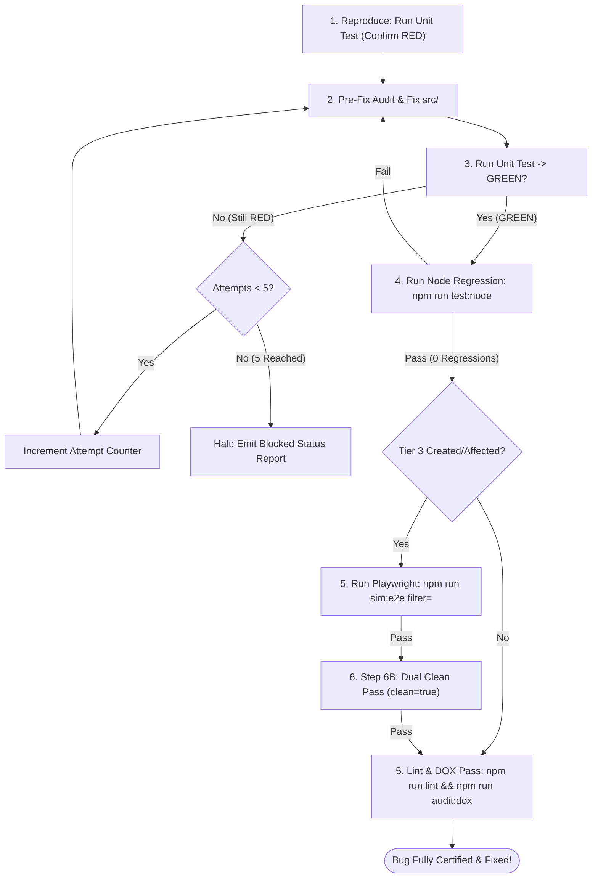

# Verification & Repair Loop Protocol

This reference document defines the closed-loop execution rules, iteration limits, and regression verification gates for the systematic debugging workflow.

---

## 1. The Closed-Loop Repair Cycle



---

## 2. Iteration Counter & Escalation Cap (5-Attempt Limit)

To prevent infinite loops and token waste:

1. **Attempt Tracking**: Maintain an explicit attempt counter (`attempt = 1..5`).
2. **Cap Reached (Attempt 5 Failure)**:
   - If after 5 distinct repair attempts the reproduction test does not turn GREEN or new regressions persist, execution MUST IMMEDIATELY HALT.
3. **Blocked Status Report**: Emit a clear structured report:
   ```markdown
   ### 🛑 Debugging Blocked: Max Iterations Reached (5/5)

   **Bug Under Investigation**: [Brief summary]
   **Failing Test**: `tests/node/.../reproduce_xxx.test.ts`

   **Hypotheses & Fixes Attempted**:
   1. *Attempt 1*: [Summary of approach and resulting error]
   2. *Attempt 2*: [Summary]
   3. *Attempt 3*: [Summary]
   4. *Attempt 4*: [Summary]
   5. *Attempt 5*: [Summary]

   **Current Blocker**: [Why the root cause resists repair]
   **Next Steps / User Input Requested**: [Specific architectural question or recommendation]
   ```

---

## 3. Post-GREEN Regression Verification Pipeline

Once Tier 1 turns GREEN, verify all layers sequentially:

### Step 1: Full Node Unit Regression Check
Run the complete Node test suite to guarantee 0 regressions across the codebase:
```bash
npm run test:node
```
If any unrelated test fails, it is an empirical regression caused by the edit in `src/`. Re-enter the repair loop immediately.

### Step 2: Playwright Simulation Verification (If Tier 3 Applies)
If the bug affected UI, GSAP animations, visual combat, or F5 persistence:
1. **Resume / Targeted Run**:
   ```bash
   npm run sim:e2e filter=<suite_name>
   ```
2. **Step 6B Dual Clean Pass from Zero (SQLite + PostgreSQL)**:
   Once the suite reaches the end via checkpoint resumption, execute a clean pass from case 1:
   ```bash
   npm run sim:e2e filter=<suite_name> clean=true
   ```
   Both SQLite and PostgreSQL must pass 100% clean.

### Step 3: Fast Quality Gate & DOX Pass
1. **Fast Development Lint**:
   ```bash
   npm run lint
   ```
   Ensures domain types, vue-tsc type checking, ESLint, and markdownlint pass cleanly.
2. **DOX Integrity Audit**:
   ```bash
   npm run audit:dox
   ```
3. **DOX Lesson Update (`dox-navigator`)**:
   Update the nearest owning `AGENTS.md` file with the lesson learned, contract clarification, or invariant established by this fix.
