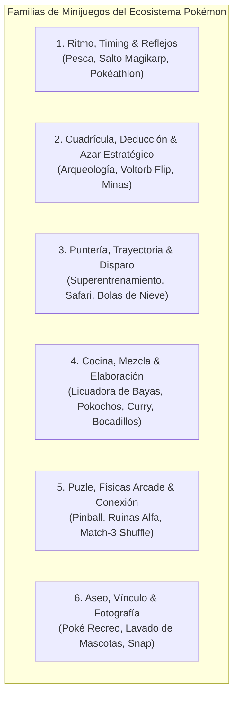
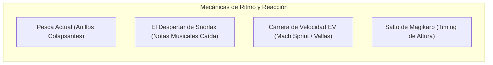
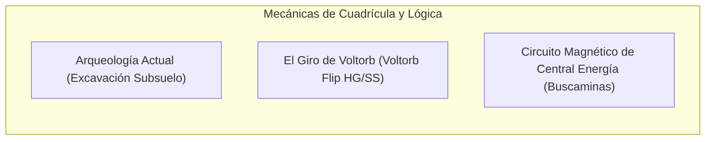
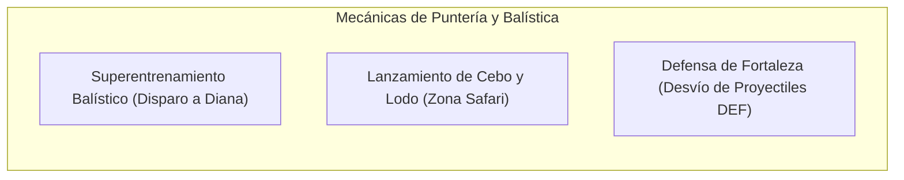
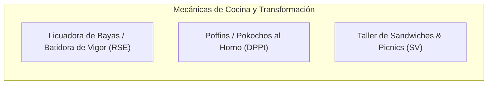
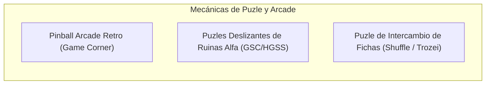
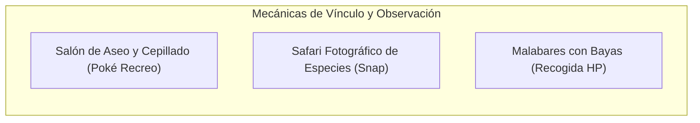
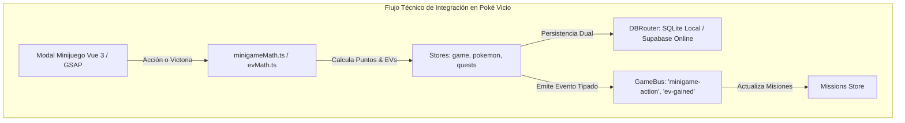

# Catálogo de Minijuegos de Poké Vicio: Estado Actual y Propuestas Oficiales

> **Documento de Diseño de Sistemas y Arquitectura Lúdica**  
> **Ubicación:** `docs/catalogo_minijuegos_actuales_y_propuestas.md`  
> **Estado:** Catálogo Exhaustivo, Análisis Comparativo y Propuestas Técnicas  
> **Alineación:** Poké Vicio (Vue 3, Pinia, GSAP, TypeScript, GameBus, evMath)

---

## 1. Diagnóstico del Estado Actual en Poké Vicio

A diferencia de las configuraciones residuales en el motor de eventos (donde figuran claves como `casinoLuckyMult` o `bugCatchingMult` que no corresponden a interfaces jugables), en Poké Vicio **únicamente existen dos minijuegos interactivos reales** implementados con vistas modales, bucle lúdico y fórmulas matemáticas dedicadas:

| Minijuego Actual | Archivos Core | Mecánica Principal | Propósito en el Bucle de Juego |
| :--- | :--- | :--- | :--- |
| **Pesca (Fishing)** | `FishingModal.vue`; `fishingGameHelper.ts`; `minigameMath.ts` | **Ritmo & Timing de Anillos Concéntricos:** Un anillo exterior colapsa hacia el centro al compás del tiempo de picada; el jugador debe pulsar dentro de la ventana de impacto precisa (`MAX_FISHING_HIT_WINDOW_MS = 190ms`) para acertar notas sucesivas y capturar el ejemplar acuático. | Permite acceder a Pokémon acuáticos exclusivos, competir en el Torneo Semanal de Pesca y recolectar tesoros marinos (perlas, escamas dragón, piedras agua). |
| **Arqueología (Archaeology)** | `ArchaeologyModal.vue`; `archaeologyGameHelper.ts`; `minigameMath.ts` | **Excavación en Cuadrícula 2D (Subsuelo):** Cuadrícula de baldosas de piedra y tierra con distintos niveles de resistencia. El jugador alterna entre pico (impacto puntual) y mazo (impacto en área de 3x3) para desenterrar fósiles y gemas antes de que el muro colapse por fatiga estructural. | Fuente principal de fósiles antiguos (revivibles en el laboratorio), piedras evolutivas, gemas elementales y tesoros vendibles (pepitas, trozos estrella). |

---

## 2. Taxonomía General de Minijuegos en el Ecosistema Pokémon

A lo largo de las 9 generaciones de la línea principal y sus spin-offs (*Pokémon Stadium 1 & 2*, *Pokéathlon en HG/SS*, *Superentrenamiento en X/Y*, *Pokémon Pinball*, *Pokémon Shuffle*, *Pokémon Café ReMix*, *Pokémon Ranger*, *Magikarp Jump* y *Scarlet/Violet*), los minijuegos oficiales se agrupan en **6 grandes familias de mecánicas similares**:

---

## 3. Catálogo Detallado por Familias de Mecánicas Similares

A continuación se detalla cada familia, contrastando lo que ya está en el juego frente a las propuestas oficiales adaptadas a la arquitectura retro-moderna de Poké Vicio.

---

### Familia 1: Ritmo, Timing & Reflejos (Rhythm, Reaction & Timing)

Mecánicas basadas en ventanas de tiempo precisas, reflejos inmediatos y pulsaciones rítmicas al compás de la música chiptune.

#### 1.1. Pesca Acuática [ACTUALMENTE IMPLEMENTADO]

* **Mecánica:** Anillos concéntricos colapsantes con tolerancia en milisegundos calculada en `calculateFishingSpeedBase`. El jugador debe acertar entre 5 y 22 notas continuas según la rareza de la especie.

#### 1.2. El Despertar de Snorlax (La Flauta Poké / Rhythm Notes) [PROPUESTA]

* **Inspiración Oficial:** *Pokémon Stadium 2* (*"Snore Snore Snorlax"*), *Pokémon HG/SS* (Pokéflauta en radio), minijuegos de ritmo estilo *Taiko / Guitar Hero*.
* **Mecánica Jugable:**
  * Para despertar a un Snorlax salvaje que bloquea una ruta o evento especial, el jugador debe interpretar una melodía con la Pokéflauta.
  * Notas de 4 colores o pistas de dirección (↑, ↓, ←, →) descienden verticalmente por la pantalla al ritmo de una pista chiptune GBA.
  * El jugador debe pulsar el botón exacto cuando la nota cruza la línea de meta (con calificaciones: *¡Perfecto!*, *¡Bien!*, *¡Fallo!*).
  * Si la barra de armonía supera el $80\%$, Snorlax despierta plácidamente y comienza el combate de captura con ratio mejorado. Si falla, despierta enfurecido con stats aumentados en $+1$.
* **Recompensas:** Captura de Snorlax, bayas raras (Baya Zreza, Baya Atania), y desbloqueo de paso en el mapa.

#### 1.3. Carrera de Obstáculos de Velocidad (Speed Sprint / Vallas) [PROPUESTA]

* **Inspiración Oficial:** *Pokéathlon - Salto de Vallas (Hurdle Dash)* (*Pokémon HG/SS*), *Superentrenamiento de Velocidad* (*Pokémon X/Y*).
* **Mecánica Jugable:**
  * Mini-runner lateral en 2D controlado mediante toques o barra espaciadora.
  * El Pokémon seleccionado corre por una pista pixel art con vallas, charcos de lodo y paneles turbo que avanzan a velocidad creciente.
  * Saltar en el instante exacto otorga impulso turbo; chocar con una valla reduce la velocidad momentáneamente.
* **Integración y Recompensas:**
  * **Entrenamiento de EVs de Velocidad (SPE):** Concede entre $+12$ y $+32$ EVs de Velocidad directos según la medalla obtenida (Bronce, Plata, Oro), aplicando `applyEvGains` de `evMath.ts`.
  * Plumas de Ímpetu (Swift Feather) y Caramelo Rápido.

#### 1.4. Campeonato de Salto de Magikarp [PROPUESTA]

* **Inspiración Oficial:** *Pokémon Stadium* (*"Magikarp's Splash"*), spin-off oficial *Pokémon: Magikarp Jump*.
* **Mecánica Jugable:**
  * Competición entre 4 Magikarp. Una barra de potencia vertical oscila a gran velocidad.
  * El jugador debe pulsar en el punto álgido de la oscilación para acumular energía cinética en 3 impulsos consecutivos.
  * En el tercer impulso, Magikarp sale disparado hacia la estratosfera; la cámara se eleva en un paneo vertical mostrando la altura alcanzada en metros.
* **Recompensas:** Monedas de torneo, trofeos de récord de salto para el perfil de entrenador y objetos de evolución marina.

---

### Familia 2: Cuadrícula, Deducción Espacial & Azar Táctico (Grid, Digging & Deduction)

Mecánicas analíticas basadas en revelación de celdas, deducción matemática y excavación por capas.

#### 2.1. Arqueología Subterránea [ACTUALMENTE IMPLEMENTADO]

* **Mecánica:** Muro de 10x8 baldosas con capas de tierra, piedra y roca dura. Alternancia estratégica entre pico (precisión sin agrietar) y mazo (área con alto desgaste de pared).

#### 2.2. El Giro de Voltorb (Voltorb Flip) [PROPUESTA DESTACADA]

* **Inspiración Oficial:** *Pokémon HeartGold & SoulSilver* (Minijuego oficial del Game Corner / Casino en las ediciones occidentales).
* **Mecánica Jugable:**
  * Cuadrícula de 5x5 cartas boca abajo.
  * Cada fila y columna tiene dos indicadores al borde:
    1. **La suma total de los puntos** de esa fila/columna (tarjetas x1, x2 o x3).
    2. **El número de Voltorb ocultos** en esa fila/columna.
  * El jugador voltea cartas utilizando pura deducción matemática y lógica (tipo Nonograma / Buscaminas).
  * Multiplicar los valores destapados acumula Fichas de Casino. Si el jugador voltea un Voltorb, el tablero explota, pierde las fichas de esa ronda y desciende de nivel de dificultad (Nivel 1 al 8).
* **Propósito y Recompensas en Poké Vicio:**
  * **Revitalización limpia del Casino:** Permite incorporar el mítico Game Corner de Ciudad Azulona sin mecánicas de apuestas azarosas tóxicas, premiando la habilidad mental del jugador.
  * **Tienda de Fichas de Casino:** Canje de fichas por MTs competitivas (Rayo, Lanzallamas, Rayo Hielo, Sustituto), Monedas de Batalla (BC) y Pokémon clásicos de casino (Porygon, Dratini, Abra).

#### 2.3. Circuito Magnético de la Central de Energía [PROPUESTA]

* **Inspiración Oficial:** *Pokémon Ranger* (Captura de bucle cerrado), mecánicas clásicas de cableado de generadores.
* **Mecánica Jugable:**
  * Cuadrícula de conductos eléctricos desconectados.
  * El jugador rota piezas en forma de L, T y líneas rectas antes de que se agote el tiempo para conectar la batería de un Magnemite con el generador principal de la fábrica.
* **Recompensas:** Piedras Trueno, Baterías Recias, Revestimiento Metálico y encuentros con Pokémon de tipo Acero/Eléctrico.

---

### Familia 3: Puntería, Trayectorias & Disparo Físico (Aim, Projectile & Physics)

Minijuegos orientados a calcular ángulos, fuerzas de lanzamiento, intercepción de dianas y reflejo balístico.

#### 3.1. Superentrenamiento Balístico Elemental [PROPUESTA]

* **Inspiración Oficial:** *Superentrenamiento (Super Training)* (*Pokémon X/Y*).
* **Mecánica Jugable:**
  * Un robot-globo gigante de un Pokémon rival (ej: un robot gigante de Blastoise o Charizard) flota al fondo de la pantalla con dianas móviles que aparecen en sus extremidades.
  * El jugador arrastra y suelta (drag-and-release estilo resorte / catapulta) para disparar balones de energía elemental cargados con el stat del Pokémon activo:
    * Balón Blanco (Estándar): Disparo rápido y recto.
    * Balón Naranja (Ataque Físico): Disparo pesado con trayectoria parabólica que rompe escudos.
    * Balón Azul (Ataque Especial): Disparo veloz de plasma que persigue ligeramente el objetivo.
  * Acertar dianas en movimiento suma puntos antes de que el robot cargue su contraataque.
* **Integración y Recompensas:**
  * **Entrenamiento de EVs de Ataque (ATK) o Ataque Especial (SPA):** Otorga entre $+12$ y $+32$ EVs de ATK o SPA según la puntuación.
  * Vitaminas de entrenamiento (Proteínas, Calcio) y Sacos de Arena para la guardería.

#### 3.2. Lanzamiento Táctico en la Zona Safari (Cebo, Roca y Ball) [PROPUESTA]

* **Inspiración Oficial:** *Zona Safari* (Generaciones I a IV) y mecánicas de lanzamiento táctico de *Pokémon Legends: Arceus*.
* **Mecánica Jugable:**
  * Al ingresar a la Zona Safari, no se combate con el equipo estándar, sino a través de un minijuego en primera persona.
  * El jugador tiene una retícula de puntería para arrojar 3 tipos de proyectiles con físicas de parábola:
    1. **Cebo de Bayas:** Atrae al Pokémon y reduce a cero su probabilidad de huida por 2 turnos, pero reduce levemente el ratio de captura.
    2. **Lodo / Guijarro:** Irrita al Pokémon duplicando su ratio de captura durante el siguiente turno, pero aumenta el riesgo de que escape de la zona.
    3. **Safari Ball:** Lanzamiento medido con círculo de precisión dinámico (Bien, Genial, Excelente).
* **Recompensas:** Especies exóticas exclusivas de la Zona Safari (Chansey, Kangaskhan, Tauros, Scyther, Pinsir) con posibles IVs aumentados.

#### 3.3. Fortaleza Aegis (Desvío de Proyectiles) [PROPUESTA]

* **Inspiración Oficial:** *Pokéathlon - Nievegón / Defensa de Portería* (*HG/SS*).
* **Mecánica Jugable:**
  * El Pokémon defensor se ubica en el centro con 4 cuadrantes de escudo (Arriba, Abajo, Izquierda, Derecha).
  * Oleadas de proyectiles (rocas, flechas de energía, bolas sombra) vuelan hacia el centro. El jugador orienta el escudo con deslizamientos táctiles o flechas de teclado.
  * Bloquear en el último milisegundo realiza un *Parry Perfecto*, devolviendo el proyectil al atacante para multiplicar los puntos.
* **Integración y Recompensas:**
  * **Entrenamiento de EVs de Defensa (DEF) y Defensa Especial (SPD):** Otorga $+12$ a $+32$ EVs defensivos.
  * Hierro, Zinc y Plumas Músculo.

---

### Familia 4: Cocina, Mezcla & Elaboración de Alimentos (Cooking, Crafting & Alchemy)

Minijuegos orientados a transformar ingredientes recolectados en consumibles de alto valor mediante interacción cinemática.

#### 4.1. Licuadora de Bayas / Batidora de Vigor (Berry Blender) [PROPUESTA DESTACADA]

* **Inspiración Oficial:** *Tubo de Pokécubos (Berry Blender)* (*Pokémon R/S/E / OR/AS*).
* **Mecánica Jugable:**
  * Una mesa giratoria central donde se introducen de 2 a 4 bayas del inventario.
  * La ruleta comienza a girar con una aguja marcadora. Cada vez que la aguja pasa por el sector del jugador, este debe pulsar la barra espaciadora o tocar la pantalla.
  * El ritmo se acelera conforme aumenta la velocidad de rotación (RPM). Acertar en el centro del marcador sube las RPM; pulsar fuera de tiempo frena la mezcla.
* **Propósito y Recompensas en Poké Vicio:**
  * **Solución directa a la economía de Bayas:** Transforma el excedente de bayas comunes en **Batidos de Vigor** (para recuperar la energía de los Pokémon en misiones de clase de la Guardería) y **Pokécubos de Colores**.
  * Los Pokécubos aumentan la felicidad de los Pokémon de forma masiva y desbloquean evoluciones por belleza/afecto (como Feebas a Milotic).

#### 4.2. Taller de Poffins / Masas de Crianza [PROPUESTA]

* **Inspiración Oficial:** *Poffin Cooking* (*Pokémon Diamond/Pearl/Platinum*).
* **Mecánica Jugable:**
  * Con el ratón o dedo, el jugador realiza movimientos circulares para revolver una masa en un caldero caliente.
  * Debe mantener una velocidad óptima indicada por flechas: girar muy rápido desborda la mezcla; girar muy lento quema la masa.
* **Recompensas:** Panes de Crianza que reducen en un $25\%$ los pasos necesarios para eclosionar huevos en la Guardería durante 1 hora.

#### 4.3. Picnic y Preparación de Bocadillos (Sandwich Crafting) [PROPUESTA]

* **Inspiración Oficial:** *Sandwich Making* (*Pokémon Scarlet/Violet*).
* **Mecánica Jugable:**
  * Minijuego de físicas de gravedad 2D.
  * El jugador dispone de una barra de pan y coloca ingredientes (tomate, queso, jamón, hierbas místicas) dejándolos caer desde la parte superior.
  * La torre de ingredientes debe equilibrarse sin caerse de la mesa antes de colocar la rebanada superior.
* **Recompensas en Poké Vicio (Poderes Nutricionales Temporales):**
  * *Poder Encuentro:* Multiplica la tasa de aparición de un tipo elemental específico en rutas salvajes durante 30 minutos.
  * *Poder Huevo:* Aumenta la velocidad de generación de huevos en la Guardería.
  * *Poder Variocolor:* Ligero buff temporal a la probabilidad de Shiny salvaje.

---

### Familia 5: Puzle, Físicas Arcade & Conexión (Match, Physics & Sliding Blocks)

Minijuegos orientados a la deducción visual, físicas de rebote retro y emparejamiento de fichas.

#### 5.1. Pinball Arcade Retro de Poké Vicio [PROPUESTA DESTACADA]

* **Inspiración Oficial:** *Pokémon Pinball: Ruby & Sapphire* (Game Boy Advance).
* **Mecánica Jugable:**
  * Mesa de pinball pixel art vertical integrada en un modal GSAP.
  * Los flippers se controlan con las teclas `Z` y `M` (o toques en los extremos izquierdo y derecho de la pantalla táctil).
  * La Poké Ball rebota contra bumpers temáticos (Voltorb que parpadea, nidos de Diglett, rampas de Slowpoke).
  * **Modo Captura de Pinball:** Pasar la bola por la rampa 3 veces inicia el modo captura; golpear la silueta del Pokémon 3 veces lo captura directamente para el inventario del jugador.
* **Propósito en Poké Vicio:**
  * Minijuego de puntuación arcade perfecto para el Game Corner / Casino, con tabla de récords semanales y trofeos para el perfil.

#### 5.2. Puzles de Baldosas Deslizantes de las Ruinas Alfa [PROPUESTA]

* **Inspiración Oficial:** *Ruinas Alfa (Ruins of Alph)* (*Pokémon G/S/C / HG/SS*).
* **Mecánica Jugable:**
  * Rompecabezas de 4x4 piezas de piedra tallada donde una casilla está vacía (puzle de fichas deslizantes clásico).
  * El jugador desliza las piezas para reconstruir la figura ancestral de Pokémon fosilizados o legendarios (Kabuto, Aerodactyl, Omanyte, Ho-Oh).
* **Recompensas:**
  * Desbloqueo de cámaras subterráneas en el mapa con formas raras de Unown, objetos ancestrales y tablas de tipo elemental para potenciar movimientos.

#### 5.3. Duelo de Fichas Elementales (Match-3 Trozei) [PROPUESTA]

* **Inspiración Oficial:** *Pokémon Trozei / Pokémon Shuffle*.
* **Mecánica Jugable:**
  * Tablero de 6x6 iconos de especies Pokémon. Deslizar una fila o columna para alinear 3 o más cabezas idénticas genera una explosión elemental.
  * El daño infligido al jefe salvaje depende de la efectividad de tipos (alinear 4 iconos de Pikachu causa daño cuádruple contra un Gyarados rival).
* **Propósito:** Modo de combate alternativo rápido para eventos móviles o misiones diarias de descanso del motor Showdown.

---

### Familia 6: Aseo, Vínculo & Fotografía (Care, Grooming & Nature Snap)

Minijuegos no combativos orientados al bienestar de los compañeros Pokémon, aumentando el vínculo emocional.

#### 6.1. Salón de Aseo y Cepillado (Grooming Station) [PROPUESTA]

* **Inspiración Oficial:** *Poké Recreo (Pokémon-Amie)* (*X/Y*), *Poké Peluche (Pokémon Refresh)* (*S/M*), *Lavado en Picnic* (*S/V*).
* **Mecánica Jugable:**
  * Tras expediciones largas de clase o combates de gimnasio, el Pokémon aparece sucio o despeinado en la pantalla.
  * El jugador utiliza 3 herramientas interactivas:
    1. **Esponja de Baño:** Limpia manchas de barro frotando con el cursor.
    2. **Secador / Toalla:** Seca al Pokémon con pasadas suaves.
    3. **Cepillo de Pelo:** Acaricia en la dirección de su pelaje evitando las zonas que le disgustan (detectables por su expresión facial).
* **Integración en Poké Vicio:**
  * Restaura el **Vigor** gastado en la Guardería sin necesidad de esperar horas de descanso pasivo.
  * Concede $+30$ a $+50$ de Felicidad directa para agilizar evoluciones por afecto (Riolu, Eevee, Pichu).

#### 6.2. Safari Fotográfico de Naturaleza (Nature Snap) [PROPUESTA]

* **Inspiración Oficial:** *Pokémon Snap*, tareas de fotografía en *Pokémon Scarlet/Violet*.
* **Mecánica Jugable:**
  * En rutas de expedición o miradores del mapa, el jugador activa la cámara de fotos retro.
  * Una escena de naturaleza se desplaza lentamente. Pokémon salvajes asoman fugazmente de copas de árboles, ríos o madrigueras.
  * El jugador debe enfocar, hacer zoom y disparar la foto en el instante en que el Pokémon realiza una animación especial (ej: saltando, durmiendo o usando un ataque).
  * El Profesor evalúa la foto según encuadre, tamaño y pose otorgando estrellas (1 a 4 estrellas).
* **Integración en Poké Vicio:** Completa entradas maestras en la Pokédex y desbloquea medallas cosméticas para el perfil.

#### 6.3. Malabares y Cosecha de Bayas (Entrenamiento de Salud HP) [PROPUESTA]

* **Inspiración Oficial:** *Pokémon-Amie - Recoge-bayas* (*X/Y*), minijuego de HP en propuestas de entrenamiento de EVs.
* **Mecánica Jugable:**
  * El Pokémon sostiene una cesta y se desplaza de izquierda a derecha en la base de la pantalla.
  * Desde lo alto caen bayas nutritivas de diferentes pesos y colores junto a obstáculos peligrosos (espinas, yunques pesados).
  * Atrapar bayas aumenta el contador de nutrición; esquivar las trampas preserva el combo.
* **Integración y Recompensas:**
  * **Entrenamiento de EVs de Salud (HP):** Otorga $+12$ a $+32$ EVs de PS.
  * Más PS (HP Up) y bayas curativas cosechadas directamente para el inventario.

---

## 4. Matriz de Integración Técnica en la Arquitectura de Poké Vicio

Para que estos minijuegos no sean piezas aisladas, sino motores integrados en el ecosistema existente, deben cumplir los siguientes pilares técnicos:

### 4.1. Integración con el Sistema de Misiones (GameBus Zero-Timer)

* Cada vez que un jugador finaliza un minijuego o consigue un hito dentro de él, el componente emite un evento tipado en el bus central:
  * `minigame-completed` $\to$ `{ minigameId: 'fishing', score: 1850, grade: 'gold' }`
  * `minigame-action` $\to$ `{ type: 'dig_fossil', fossilId: 'domefossil' }`
  * `minigame-action` $\to$ `{ type: 'voltorb_flip_level', level: 5, coinsEarned: 450 }`
* Las **Misiones Diarias y Semanales** escuchan este evento y avanzan sus contadores reactivamente sin bucles `setInterval`.

### 4.2. Integración con el Sistema de Entrenamiento de EVs (`evMath.ts`)

* Los minijuegos de entrenamiento (*Speed Sprint*, *Superentrenamiento Balístico*, *Fortaleza Aegis*, *Malabares HP*) delegan su asignación de esfuerzo a la función pura `applyEvGains` de `@/logic/pokemon/evMath`.
* Se respetan de forma estricta los límites máximos del motor: `MAX_STAT_EVS = 252` por estadística y `MAX_TOTAL_EVS = 510` en total por Pokémon.
* Los objetos recios equipados (`powerweight`, `powerbracer`, etc.) multiplican el rendimiento del minijuego correspondiente.

### 4.3. Animaciones Exclusivas GSAP y Rendimiento a 60 FPS

* Cumpliendo con el mandato de `project-standards`:
  * Ningún minijuego utiliza transiciones CSS `@keyframes` ni temporizadores `setTimeout` para su jugabilidad.
  * Toda la cinemática se orquesta mediante **GSAP Tweens y Timelines** (`gsap.timeline()`, `gsap.to()`, `gsap.ticker`), coordinados con `requestAnimationFrame`.
  * Los elementos visuales en pantalla se aíslan en capas GPU con `will-change: transform` para garantizar 60 FPS estables tanto en navegadores de escritorio como en dispositivos móviles.

### 4.4. Paridad de Persistencia con DBRouter (SQLite & Supabase)

* Los récords de puntuación, nivel alcanzado en *Voltorb Flip* y fichas de casino se guardan en la tabla normalizada `user_minigames_progress`.
* La lectura y escritura se canaliza a través de `DBRouter`, garantizando paridad 1:1 tanto si el jugador está jugando sin conexión (SQLite IndexedDB/OPFS) como conectado a la nube (PostgreSQL Supabase).

---

## 5. Matriz Comparativa y Hoja de Ruta de Implementación

Clasificación de todas las propuestas según su **complejidad de desarrollo en Vue 3/GSAP** y su **valor de jugabilidad y retención**:

| Minijuego / Mecánica | Familia | Estado | Complejidad Técnica | Impacto Lúdico | Recompensas Principales |
| :--- | :--- | :---: | :---: | :---: | :--- |
| **Pesca (Fishing)** | Ritmo & Timing | **Implementado** | Media | ⭐⭐⭐⭐ | Pokémon de agua, perlas, trofeos de torneo. |
| **Arqueología (Archaeology)** | Cuadrícula | **Implementado** | Media | ⭐⭐⭐⭐⭐ | Fósiles, piedras evolutivas, gemas. |
| **El Giro de Voltorb (Voltorb Flip)** | Cuadrícula / Lógica | **Propuesta Fase 1** | Baja - Media | ⭐⭐⭐⭐⭐ (Adictivo) | Fichas de Casino, MTs raras, Porygon/Dratini. |
| **Licuadora de Bayas (Berry Blender)** | Cocina / Mezcla | **Propuesta Fase 1** | Baja | ⭐⭐⭐⭐ | Batidos de Vigor para Guardería, Pokécubos. |
| **Speed Sprint (Carrera de Vallas)** | Ritmo & Reflejos | **Propuesta Fase 2** | Media | ⭐⭐⭐⭐⭐ | EVs de Velocidad (SPE), Plumas de Ímpetu. |
| **Superentrenamiento Balístico** | Puntería & Balística | **Propuesta Fase 2** | Media | ⭐⭐⭐⭐⭐ | EVs de Ataque y Ataque Especial (ATK / SPA). |
| **Salón de Aseo y Cepillado** | Aseo & Vínculo | **Propuesta Fase 3** | Baja - Media | ⭐⭐⭐⭐ | Vigor inmediato, Afecto y Evolución rápida. |
| **Lanzamiento Zona Safari** | Puntería / Táctico | **Propuesta Fase 3** | Media | ⭐⭐⭐⭐ | Especies raras exclusivas de la Zona Safari. |
| **El Despertar de Snorlax** | Ritmo Musical | **Propuesta Fase 3** | Media | ⭐⭐⭐ | Desbloqueo de rutas, Snorlax salvaje. |
| **Pinball Retro Arcade** | Puzle / Físicas | **Propuesta Fase 4** | Alta | ⭐⭐⭐⭐⭐ | Récords arcade, trofeos de perfil, tickets. |
| **Puzles Ruinas Alfa** | Puzle Deslizante | **Propuesta Fase 4** | Baja | ⭐⭐⭐ | Formas de Unown, reliquias ancestrales. |

---

*Fin del catálogo de minijuegos actuales y propuestas de expansión para Poké Vicio.*
