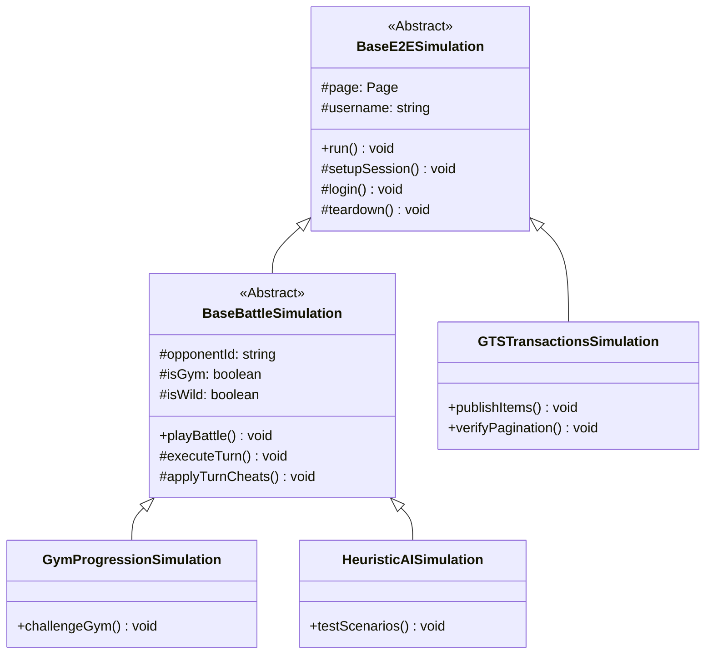

# Plan de Implementación - Refactorización de Simuladores con Herencia y Polimorfismo

Este plan propone erradicar la duplicación de código en los simuladores Playwright del proyecto PokeBorrador a través de una clase base común abstracta `BaseE2ESimulation` y sus correspondientes subclases especializadas.

---

## Cambio de Diseño: Estructura de Clases

Para unificar la lógica de setup, logins de usuarios, persistencia en base de datos y loops de batalla/flujos, introduciremos una jerarquía extensible:

---

## Propuesta de Componentes

### 1. Clase Base: `BaseE2ESimulation` (en `scripts/e2e/base_simulation.ts`) [NEW]
Encapsulará:
- Inicialización del contexto del navegador y página de Playwright.
- Inyección de configuraciones E2E (`setupE2ESession`).
- Proceso de autenticación robusto y determinista con selección de inicial automático (`loginE2ETestUser`).
- Manejo limpio de reloads e importaciones de stores Pinia.

### 2. Clase Base de Batalla: `BaseBattleSimulation` (en `scripts/e2e/base_battle_simulation.ts`) [NEW]
Heredará de `BaseE2ESimulation` y encapsulará:
- Loop de turnos de combate automático determinista (`executeAutoBattle`).
- Sincronización event-driven de la FSM de batalla (`waitForWaitInput` y `waitForWaitInputFsmSync`).
- Clics resilientes en botones de movimientos y menús de cambio.
- Inyección en caliente del flag `isE2eSimulation: true` en el worker.

### 3. Migración de Simuladores

#### Simulaciones de Batalla (Heredarán de `BaseBattleSimulation`):
- [`gym_progression.simulation.ts`](file:///home/franco/Trabajos/PokeBorrador/scripts/e2e/gyms/gym_progression.simulation.ts)
- [`heuristic_ai.simulation.ts`](file:///home/franco/Trabajos/PokeBorrador/scripts/e2e/battle/heuristic_ai.simulation.ts)
- [`battle_held_items.simulation.ts`](file:///home/franco/Trabajos/PokeBorrador/scripts/e2e/battle/battle_held_items.simulation.ts)
- [`battle_healing_regression.simulation.ts`](file:///home/franco/Trabajos/PokeBorrador/scripts/e2e/battle/battle_healing_regression.simulation.ts)
- [`battle_capture.simulation.ts`](file:///home/franco/Trabajos/PokeBorrador/scripts/e2e/battle/battle_capture.simulation.ts)
- [`battle_fsm_sync.simulation.ts`](file:///home/franco/Trabajos/PokeBorrador/scripts/e2e/battle/battle_fsm_sync.simulation.ts)
- [`battle_weather_effects.simulation.ts`](file:///home/franco/Trabajos/PokeBorrador/scripts/e2e/battle/battle_weather_effects.simulation.ts)
- [`search_loop_sequential.simulation.ts`](file:///home/franco/Trabajos/PokeBorrador/scripts/e2e/battle/search_loop_sequential.simulation.ts)

#### Simulaciones de Procesos Generales (Heredarán de `BaseE2ESimulation`):
- [`gts_transactions.simulation.ts`](file:///home/franco/Trabajos/PokeBorrador/scripts/e2e/gts/gts_transactions.simulation.ts)
- [`breeding_lifecycle.simulation.ts`](file:///home/franco/Trabajos/PokeBorrador/scripts/e2e/breeding/breeding_lifecycle.simulation.ts)

---

## Verification Plan

Summary of how you will verify that your changes have the desired effects.

### Automated Tests
- `npx playwright test scripts/e2e/breeding/breeding_lifecycle.simulation.ts scripts/e2e/gts/gts_transactions.simulation.ts scripts/e2e/gyms/gym_progression.simulation.ts scripts/e2e/battle/`

