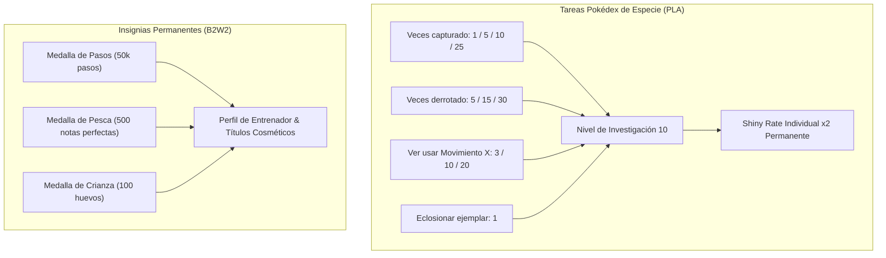
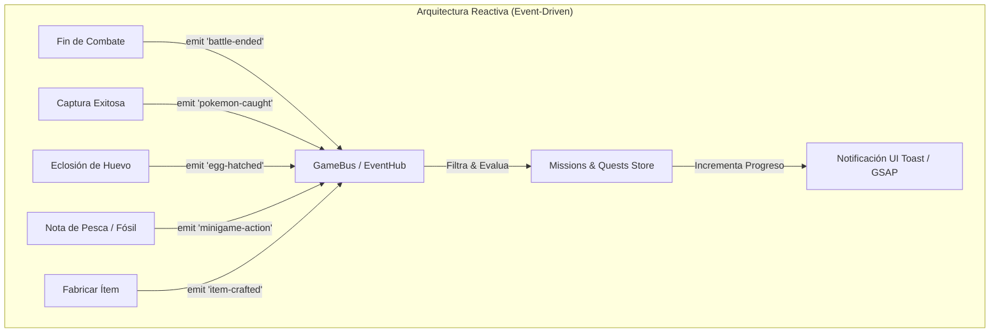

# Ecosistema Integral de Misiones, Eventos y Retención para Poké Vicio

> **Documento de Diseño de Sistemas y Arquitectura**  
> **Ubicación:** `docs/mecanicas_misiones_y_eventos.md`  
> **Estado:** Propuesta Técnica y Catálogo de Mecánicas Faltantes  
> **Alineación:** Poké Vicio (Vue 3, Pinia, GSAP, Pokémon Showdown Engine, DBRouter)

---

## 1. Diagnóstico del Estado Actual en Poké Vicio

Para determinar qué mecánicas se pueden añadir, primero se contrastó lo que **ya existe** en el repositorio frente al universo completo de mecánicas de la franquicia Pokémon:

| Subsistema Actual en Poké Vicio | Ubicación en el Código | ¿Qué Hace Actualmente? | ¿Qué le Falta para ser Completo? |
| :--- | :--- | :--- | :--- |
| **Misión de Guardería Diaria** | `src/logic/breeding/missionEngine.ts` | Genera 1 petición diaria de un NPC que solicita un Pokémon con ciertas condiciones (nivel, IVs, naturaleza o IV 31) a cambio de bayas de vigor o power items. | Es una única entrega aislada. No tiene racha consecutiva, ni calendario de sellos, ni variedad fuera de la guardería. |
| **Misiones de Clase (Expediciones Idle)** | `src/data/player/playerClasses.ts` | Despliegue pasivo de Pokémon por 6h, 12h o 24h para obtener experiencia pasiva y recursos de clase. | Es puramente pasivo (esperar un temporizador de fondo). No involucra jugabilidad activa del jugador. |
| **Eventos Programados de Servidor** | `src/logic/events/eventEngine.ts` | Calendario semanal con multiplicadores pasivos (EXP x2, Dinero x2, Shiny Rate) y torneos temáticos de captura de Pokémon salvajes (pesca, bichos) evaluados por IVs/peso/altura. | No ofrece misiones activas temáticas con tienda de canje, ni metas globales comunitarias cooperativas. |
| **Minijuegos Aislados** | `src/logic/minigames/minigameMath.ts` | Únicamente existen dos minijuegos jugables reales: Pesca rítmica (`FishingModal.vue`) y Arqueología en cuadrícula (`ArchaeologyModal.vue`). | No están integrados en tareas diarias ni en peticiones de aldeanos tipo actividades del biodomo (BBQs). |

---

## 2. Catálogo de Mecánicas No Implementadas (Por Familias)

A continuación se detallan todas las mecánicas que **no están implementadas en Poké Vicio** y que pueden añadirse para enriquecer el bucle de juego retro-moderno.

```mermaid
graph TD
    subgraph Retencion_Diaria["1. Rutinas & Check-in"]
        A1[Check-in Diario / Sellos] --> A2[Rachas Consecutivas x7]
        A3[Eventos RTC / Lotería ID / Brotes / Mercader]
    end

    subgraph Accion_Directa["2. Bucle de Acción Directa"]
        B1[Diarias Atómicas 10-15 min] --> B2[Semanales de Volumen]
        B3[Cuotas Mensuales]
    end

    subgraph Progresion_Narrativa["3. Cadena Progresiva"]
        C1[Investigación Especial por Fases]
        C2[Escalera de Dificultad Progresiva]
    end

    subgraph Eventos_FOMO["4. Evento & Ventana Limitada"]
        D1[Misiones Temáticas de Evento]
        D2[Metas Globales Comunitarias]
        D3[Desafíos Flash Contrarreloj]
    end

    subgraph Aventura_NPC["5. Exploración & Peticiones NPC"]
        E1[Tablón de Rescates & Forajidos PMD]
        E2[Encargos de Aldeanos PLA]
        E3[Patrulla Ecológica Ranger]
    end

    subgraph Maestria_Coleccion["6. Completismo & Maestría"]
        F1[Tareas Pokédex por Especie PLA]
        F2[Sistema de Insignias / Medallas B2W2]
        F3[Investigación de Campo Slots PGO]
    end

    subgraph Combate_Avanzado["7. Condicionales & Combate"]
        G1[Pase de Batalla Estacional 50 Tiers]
        G2[Frente de Batalla / Fábrica de Préstamo]
        G3[Actividades de Minijuego & Crafteo BBQs]
    end
```

---

### Familia 1: Rutinas & Check-in (Retención y Ritmo Diario)

Mecánicas diseñadas para que el jugador abra la aplicación diariamente, con baja fricción inicial y sensación de progreso constante.

#### 1.1. Calendario de Sellos Diario (Daily Login Stamp Card)

* **Origen en la franquicia:** *Pokémon Café ReMix*, *Pokémon Sleep*, *Pokémon UNITE*.
* **Mecánica:**
  * Al iniciar sesión por primera vez en el día (reseteo a las 00:00 GMT-3), aparece una tarjeta retro de 7 o 28 sellos.
  * El jugador reclama el sello del día pulsando sobre la tarjeta (animada con GSAP).
  * **Estructura de Recompensas:**
    * Días 1 al 6: Consumibles básicos (5x Pokéballs, 3x Superpociones, 2x Bayas Meloc, 1.000 Monedas).
    * Día 7: Recompensa premium (1x Chapa Plateada, 1x Piedra Evolutiva a elegir, o 1x Ticket de Ruleta/Gacha).
    * Día 28 (fin de mes): 1x Huevo con movimiento huevo raro o 1x Chapa Dorada.

#### 1.2. Racha de Acción Consecutiva (7-Day Streak)

* **Origen en la franquicia:** *Pokémon GO* (Racha de captura y poképarada de 7 días).
* **Mecánica:**
  * No premia el simple login, sino **completar una acción activa elemental**:
    1. *Primera Captura del Día*: Atrapar al menos 1 Pokémon salvaje.
    2. *Primera Victoria del Día*: Vencer en al menos 1 combate (salvaje, gimnasio o PvP).
  * Cada día consecutivo multiplica la EXP y monedas obtenidas en esa primera acción ($1.2\times, 1.4\times, \dots, 3.0\times$).
  * Si el jugador falta un día, la racha se reinicia a 1.
  * Al alcanzar el Día 7, se garantiza un encuentro con un Pokémon salvaje con al menos **2 IVs perfectos (31)** o un objeto raro garantizado.

#### 1.3. Reseteos Físicos de Mundo / Eventos RTC (Real-Time Clock)

* **Origen en la franquicia:** *Pokémon HG/SS*, *D/P/Pt*, *Scarlet/Violet*.
* **Mecánicas Concretas:**
  * **A. Salón de Masajes / Aseo Diario:** Un NPC en una ciudad específica ofrece 1 masaje al día a un Pokémon del equipo. Incrementa su felicidad en $+30$ y tiene un $20\%$ de probabilidad de encontrar un accesorio cosmético o una baya rara entre su pelaje.
  * **B. Lotería de ID Pokémon (Daily ID Lottery):** La recepcionista del Centro de Lotería extrae cada día un número aleatorio de 5 dígitos. Se compara con el UID / Número de ID de Entrenador Original de todos los Pokémon en el equipo y en las cajas del jugador:
    * Coincide 1 dígito final: 1x Leche Mu-mu.
    * Coinciden 2 dígitos: 1x Más PP.
    * Coinciden 3 dígitos: 1x Repartir Experiencia o Revestimiento Metálico.
    * Coinciden 4 dígitos: 1x Caramelo Raro.
    * Coinciden los 5 dígitos: 1x Master Ball.  
    *(Incentiva enormemente el comercio y los intercambios entre jugadores para tener Pokémon de muchos entrenadores distintos).*
  * **C. Brote Masivo Diario (Daily Swarms):** Cada día a las 00:00, el tablón de noticias o la radio anuncia una ruta con un "Brote Masivo". Durante 24 horas, una especie poco común (ej: Dunsparce, Beldum, Chansey) aparece en esa ruta con una probabilidad del $40\%$ (reemplazando spawns comunes) y con una tasa de variocolor (Shiny) duplicada ($2\times$).
  * **D. Vendedor Ambulante / Mercader Clandestino:** Un mercader nómada que cambia de ruta cada día a las 00:00. Vende únicamente 3 artículos aleatorios pero de stock unitario diario (ej: MTs raras, Piedras Noche/Alba, Menta de Naturaleza con descuento del $40\%$).

---

### Familia 2: Bucle de Acción Directa (Diarias, Semanales y Mensuales)

Misiones orientadas a guiar las sesiones de juego activas con objetivos claros y alcanzables.

#### 2.1. Tareas Diarias Atómicas (Baja Fricción, 10-15 Minutos)

* **Origen en la franquicia:** *Pokémon UNITE*, *Pokémon TCG Live*.
* **Mecánica:**
  * Cada día a las 00:00 se generan aleatoriamente **3 tareas atómicas** para el jugador, seleccionadas de un pool equilibrado:
    * *Rama Combate:* "Gana 3 combates salvajes", "Acierta 2 ataques súper efectivos", "Derrota a 1 entrenador de gimnasio".
    * *Rama Captura & Campo:* "Captura 2 Pokémon de tipo Agua o Planta", "Usa 3 Bayas en combate o captura".
    * *Rama Economía & Minijuegos:* "Acierta 10 notas en el minijuego de Pesca", "Excava 1 objeto en Arqueología", "Gasta 1.500 monedas en la tienda".
  * Cada tarea otorga $25$ Puntos de Misión y recompensas individuales.
  * **Cofre del Día:** Al acumular $75$ Puntos de Misión (completar las 3), se desbloquea un cofre que entrega 50 Battle Coins (BC), 2.500 monedas y 1 Cupón de Reroll.

#### 2.2. Hitos Semanales Acumulativos (Volumen y Esfuerzo Sostenido)

* **Origen en la franquicia:** *Pokémon Sleep*, *Pokémon Masters EX*.
* **Mecánica:**
  * Se reinician cada lunes a las 00:00 GMT-3. No se pueden completar en una sola sesión de 10 minutos; requieren jugar de forma sostenida a lo largo de la semana.
  * **Pool de Objetivos Semanales:**
    * "Eclosiona 3 huevos en la Guardería".
    * "Participa en 10 combates en la Arena PvP".
    * "Captura 20 Pokémon en total".
    * "Excava 5 fósiles o gemas intactas en Arqueología".
    * "Acumula 20.000 monedas ganadas en combate".
    * "Sube un total de 50 niveles combinados entre tus Pokémon".
  * **Recompensa:** Cofre de Fin de Semana con objetos de entrenamiento competitivo (Chapas Plateadas, Menta de Naturaleza, Cápsula de Habilidad, Bayas de Vigor doradas).

#### 2.3. Cuotas Mensuales / Temporada

* **Mecánica:** Metas a largo plazo que abarcan del día 1 al último día de cada mes natural.
* **Ejemplos:** "Derrota a 100 entrenadores", "Completa 50 capturas en rutas distintas", "Consigue 10 victorias clasificatorias en PvP con el rango Plata o superior". Otorga títulos de prestigio para el perfil y cosméticos de temporada.

---

### Familia 3: Cadena Progresiva & Pasos (Investigación Especial Narrativa)

Misiones encadenadas a medio y largo plazo que dotan de propósito la progresión y cuentan micro-historias.

```mermaid
graph LR
    subgraph Fase_1["Fase 1: Primeros Pasos"]
        T1A["Captura 10 Pokémon"]
        T1B["Gira 3 Puntos de Interés"]
        T1C["Gana 3 combates"]
    end

    subgraph Fase_2["Fase 2: El Mundo Ancestral"]
        T2A["Eclosiona 1 Huevo"]
        T2B["Excava 2 Fósiles en Arqueología"]
        T2C["Evoluciona 3 Pokémon"]
    end

    subgraph Fase_3["Fase 3: El Vínculo"]
        T3A["Alcanza 150 de Felicidad"]
        T3B["Derrota a 3 Líderes de Gimnasio"]
        T3C["Equipa 2 Accesorios de Mazmorra"]
    end

    subgraph Fase_Final["Fase 4: Clímax"]
        T4A["Combate Singular contra Mew"]
        T4B["Captura Garantizada"]
    end

    Fase_1 -->|Completar las 3| Fase_2
    Fase_2 -->|Completar las 3| Fase_3
    Fase_3 -->|Completar las 3| Fase_Final
```

#### 3.1. Investigaciones Especiales Narrativas por Fases (Special Research)

* **Origen en la franquicia:** *Pokémon GO* (*«Un descubrimiento mítico»*, *«Una sombra en el horizonte»*).
* **Mecánica:**
  * Misiones permanentes (sin tiempo límite) estructuradas en **Capítulos o Fases (ej: 4 o 5 fases de 3 tareas cada una)**.
  * Cada fase tiene diálogo narrativo interactivo con el Profesor o personajes del lore.
  * Para avanzar a la siguiente fase, el jugador **debe completar las 3 tareas** de la fase actual y reclamar la recompensa intermedia.
  * **Casos de Uso Ideales para Poké Vicio:**
    * **Cadena de Mew («El Genoma Perdido»):** Desbloqueo del combate estático único contra Mew.
    * **Cadena del Trío de Aves Legendarias (Articuno, Zapdos, Moltres):** Desbloqueo tras conseguir 8 medallas y completar investigaciones de tipos Hielo, Eléctrico y Fuego.
    * **Cadena de la Megaevolución o Teracristal:** Explicación y desbloqueo de objetos clave (Mega-Pulsera / Orbe Teracristal).

#### 3.2. Escaleras de Dificultad Progresiva (Tiered Ladders)

* **Origen en la franquicia:** *Pokémon Magikarp Jump*.
* **Mecánica:**
  * Misiones lineales con el mismo tipo de acción pero con metas que se incrementan progresivamente al completarse:
    * *Nivel 1:* Eclosiona 1 huevo (Premio: 1.000 monedas).
    * *Nivel 2:* Eclosiona 5 huevos (Premio: 1x Baya de Plata).
    * *Nivel 3:* Eclosiona 25 huevos (Premio: 1x Piedra Eterna + Título: «Criador Aprendiz»).
    * *Nivel 4:* Eclosiona 100 huevos (Premio: 1x Lazo Destino + Título: «Maestro Genético»).

---

### Familia 4: Evento & Ventana Limitada (Eventos Temporales & FOMO Saludable)

Mecánicas que dinamizan el calendario del juego y generan picos de actividad comunitaria.

#### 4.1. Misiones Temáticas de Evento con Monedas Especiales (Event Store Tasks)

* **Origen en la franquicia:** *Pokémon Masters EX*, *Pokémon UNITE*.
* **Mecánica:**
  * Vinculadas a eventos de duración limitada (ej: 1 o 2 semanas) como "Semana Fantasma de Halloween", "Festival Acuático de Verano" o "Invasión del Team Rocket".
  * Activan una pestaña de misiones de evento en `EventMissionsModal.vue`.
  * **Objetivos temáticos:** "Gana 5 combates usando Pokémon de tipo Fantasma", "Captura 10 Pokémon en rutas nocturnas".
  * **Recompensas en Moneda de Evento:** No dan dinero común; otorgan "Tickets Fantasma" o "Monedas de Halloween" que solo se canjean en la **Tienda Temporal del Evento** por cosméticos retro exclusivos, marcos de avatar, o Pokémon con movimientos de evento o habilidades ocultas.

#### 4.2. Desafíos Globales Cooperativos de la Comunidad (Global Community Goals)

* **Origen en la franquicia:** *Pokémon Ultra Sun / Ultra Moon* (Misiones Globales del Festival Plaza).
* **Mecánica:**
  * Un contador colectivo en tiempo real sincronizado a través de Supabase en el que **todos los jugadores del servidor suman hacia una misma meta**.
  * *Ejemplo Concreto:* **«Operación Limpieza: Derrotar 100.000 Pokémon salvajes entre todos los entrenadores durante el fin de semana»**.
  * **Sistema de Recompensas por Tramos:**
    * **Tramo 25% (25.000):** Activación de multiplicador global $1.5\times$ EXP para todo el servidor.
    * **Tramo 50% (50.000):** Duplicación de probabilidad de objetos caídos en rutas salvajes.
    * **Tramo 100% (100.000):** Todos los entrenadores que hayan aportado al menos 10 derrotas reciben 1x Huevo Especial con IVs altos y 200 BC.

#### 4.3. Desafíos Flash Contrarreloj / Día de la Comunidad (Flash Timed Quests)

* **Origen en la franquicia:** *Pokémon GO* (Community Day / Research Day).
* **Mecánica:**
  * Ventana estricta de 3 horas (ej: sábado de 16:00 a 19:00).
  * Centrado en una especie estrella (ej: Abra o Gastly) con spawn masivo y probabilidad de Shiny $1/25$.
  * Tareas contrarreloj encadenadas de 1 paso: "Captura 5 Pokémon destacados", "Evoluciona a la primera fase". Premia con el movimiento característico exclusivo del evento al evolucionar a la forma final durante esa ventana.

---

### Familia 5: Exploración & Peticiones NPC (Side-Quests & Mundo Vivo)

Misiones secundarias que transforman el mapa y las ciudades en un mundo interactivo con personajes memorables.

#### 5.1. Tablón de Encargos, Rescate y Forajidos (Rescue & Outlaw Board)

* **Origen en la franquicia:** *Pokémon Mystery Dungeon (Red/Blue/Sky/DX)*.
* **Mecánica:**
  * En cada Centro Pokémon o Plaza Mayor se ubica un **Tablón de Anuncios**.
  * Genera periódicamente encargos procedurales categorizados por **Rangos de Dificultad (D, C, B, A, S)**:
    1. **Misiones de Rescate:** "Un Oddish se perdió en la Cueva Celeste. Llévale un Antídoto para rescatarlo".
    2. **Misiones de Forajido (Bounty Hunter):** "Se busca a un Mankey agresivo que roba bayas en Ruta 5. Encuéntralo y véncelo en combate".
    3. **Misiones de Entrega de Suministros:** "El puesto de avanzada de la Ruta 11 se quedó sin Pociones. Entrega 3 Pociones antes de medianoche".
  * **Rango del Equipo de Rescate:** Completar misiones otorga Puntos de Rango (Rango Normal $\to$ Bronce $\to$ Plata $\to$ Oro $\to$ Diamante $\to$ Lucario), lo que desbloquea misiones de mayor calibre, descuentos en tiendas y medallas exclusivas.

#### 5.2. Encargos de Aldeanos con Requisitos Específicos (Villager Side-Quests)

* **Origen en la franquicia:** *Pokémon Legends: Arceus*.
* **Mecánica:**
  * NPCs repartidos por las rutas y casas de los pueblos con un icono `!` interactivo.
  * Solicitan misiones únicas de coleccionismo y curiosidades con diálogos divertidos:
    * *«El Magikarp Gigante»:* Un pescador obstinado que se niega a creer que hay Magikarp de más de 1.10 metros. Te pide enseñarle un Magikarp que cumpla ese tamaño exacto (utilizando el atributo de peso/talla del Pokémon).
    * *«La Flor de los Aromas»:* Una botánica que desea ver las 3 fases evolutivas de Oddish/Gloom/Vileplume registradas en tu Pokédex.
    * *«El Acertijo del Fantasma»:* Un niño que afirma haber visto una sombra morada con dos ojos rojos en el bosque por la noche (resolver encontrando a Gastly a medianoche).

#### 5.3. Misiones Ecológicas y de Patrulla Ranger (Ranger Patrol Quests)

* **Origen en la franquicia:** *Pokémon Ranger: Shadows of Almia*.
* **Mecánica:**
  * Encargos de saneamiento ambiental y auxilio en el mapa exterior:
    * "Apaga 3 incendios forestales en el Bosque usando un Pokémon que conozca Pistola Agua o Hidrobomba en tu equipo".
    * "Destruye las rocas que bloquean la entrada de la cueva con un Pokémon que conozca Golpe Roca o Fuerza".
    * "Alumbra una gruta subterránea profunda con un Pokémon de tipo Eléctrico o que conozca Destello".

---

### Familia 6: Completismo & Maestría (Pokédex & Logros Permanentes)

Mecánicas para los jugadores más dedicados que buscan exprimir al 100% cada especie y subsistema.

#### 6.1. Tareas de Investigación Pokédex por Especie (Pokédex Research Tasks)

* **Origen en la franquicia:** *Pokémon Legends: Arceus*.
* **Mecánica:**
  * La Pokédex trasciende el binomio "visto/capturado". Cada especie cuenta con una ficha de investigación con hasta 4 objetivos acumulativos:
    1. *Capturas totales de la especie:* [1] [5] [10] [20]
    2. *Derrotas en combate:* [5] [15] [30]
    3. *Veces presenciado su movimiento insignia en combate:* [3] [10] [20] (ej: ver a Pikachu usar *Impactrueno*).
    4. *Capturar un ejemplar con una naturaleza específica o con tamaño extraordinario.*
  * **Nivel de Investigación 10 (Entrada Completa):** Al alcanzar el nivel 10 en una especie:
    * Se añade una estrella dorada en la ficha de la Pokédex.
    * **Bonus permanente:** Se duplica la probabilidad de encontrar esa especie en su variante Variocolor (Shiny) en estado salvaje (efecto similar al Amuleto Iris focalizado).

#### 6.2. Sistema de Insignias y Medallas de Honor (Medal System)

* **Origen en la franquicia:** *Pokémon B2/W2* (Sistema de Medallas de Teselia), *Pokémon GO*.
* **Mecánica:**
  * Más de 100 medallas divididas en 5 categorías visibles en `ProfileModal.vue`:
    * *Aventura:* «Paso Ligero» (10.000 / 50.000 / 100.000 pasos en el mapa).
    * *Combate:* «Estratega Imbatible» (Ganar 10 / 50 / 100 combates sin que caiga ningún Pokémon).
    * *Crianza:* «Cigüeña Incansable» (Eclosionar 10 / 50 / 200 huevos).
    * *Minijuegos:* «Rey del Anzuelo» (100 / 500 notas perfectas en Pesca), «Minero Ancestral» (20 / 50 fósiles).
    * *Colección de Tipos:* Medalla de Bronce/Plata/Oro por capturar 100/500/1000 Pokémon de cada tipo elemental (Fuego, Agua, Planta, etc.).
  * Cada medalla otorga puntos de logro y títulos cosméticos equipables en el perfil de entrenador.

#### 6.3. Investigaciones de Campo en 3 Slots con Sello Diario (Field Research)

* **Origen en la franquicia:** *Pokémon GO*.
* **Mecánica:**
  * El jugador dispone de un inventario con **3 ranuras (slots) para tareas de campo**.
  * Se consiguen al interactuar con Poképaradas, tablones o hablar con transeúntes.
  * Tareas cortas e inmediatas: "Haz 3 lanzamientos de Poké Ball seguidos", "Gana 1 combate usando solo 1 Pokémon".
  * **Mecánica de Sellos:** La primera investigación de campo completada en el día otorga 1 **Sello de Investigación**. Al juntar 7 sellos (no requieren ser consecutivos), se desbloquea una **Caja de Investigación Legendaria** con recompensas de alto calibre y un encuentro especial.

---

### Familia 7: Condicionales & Combate Avanzado (Torre, Pases y Retos)

Mecánicas dirigidas al juego competitivo, la maestría estratégica y el progreso estacional.

#### 7.1. Pase de Batalla Estacional / Pase de Entrenador (Battle Pass)

* **Origen en la franquicia:** *Pokémon UNITE*, *Pokémon TCG Live*.
* **Mecánica:**
  * Temporadas fijas de 30 o 45 días vinculadas al ciclo clasificatorio de PvP.
  * Una barra de progreso retro-moderna de **50 Niveles (Tiers)**.
  * **Obtención de Experiencia de Pase (Battle Pass XP):**
    * Completar misiones diarias otorga $50 - 100$ XP.
    * Completar misiones semanales otorga $300 - 500$ XP.
    * Victorias en PvP y Gimnasios otorgan $20$ XP por combate.
  * **Doble Carril de Recompensas (Dual Track):**
    * **Carril Gratuito:** Monedas, consumibles, piedras evolutivas, bayas de vigor.
    * **Carril de Élite / Reputación:** Desbloqueable con Battle Coins (BC) ganadas jugando o mediante reputación de facción. Otorga skins exclusivas de avatar, marcos de tarjeta de entrenador (`AvatarFrameSelector.vue`), chapas doradas y cosméticos retro únicos.

#### 7.2. Desafíos de Torre de Batalla y Frente de Batalla (Battle Facility Trials)

* **Origen en la franquicia:** *Pokémon Battle Frontier / Battle Tower* (Gen III - IV).
* **Mecánica:**
  * Modos de juego de combate con reglas y condiciones de victoria restringidas:
    1. **Fábrica de Batalla (Battle Factory - Modo Draft):** Superar tandas de 7 combates utilizando únicamente Pokémon de préstamo elegidos al azar al iniciar la racha. Tras cada victoria, se puede intercambiar 1 Pokémon con el rival derrotado.
    2. **Desafíos de Racha (Streak Mode):** Ganar 7, 14, 21 combates seguidos sin poder curar con la bolsa (curación automática entre combates). Perder un solo combate reinicia la racha a cero.
    3. **Formatos Restringidos (Little Cup & Monotipo):**
       * *Little Cup:* Solo Pokémon en su primera etapa evolutiva a Nivel 5 exacto.
       * *Monotipo:* Superar la torre con los 6 Pokémon del equipo compartiendo un mismo tipo elemental.

#### 7.3. Misiones de Actividades y Mantenimiento (BBQs / Crafting Tasks)

* **Origen en la franquicia:** *Pokémon Scarlet/Violet* (Actividades Pavesas del Biodomo).
* **Mecánica:**
  * Micro-tareas dinámicas que rotan continuamente cada vez que se completa una:
    * "Fabrica 2 Pociones en la mesa de crafteo".
    * "Cocina o entrega un bocadillo/baya dulce a tu Pokémon acompañante".
    * "Cambia la naturaleza de un Pokémon usando un parche o menta".
    * "Alcanza una puntuación superior a 500 puntos en el minijuego de Arqueología".
  * Otorgan Puntos de Actividad que se pueden canjear en la tienda de la academia o del biodomo por mejoras pasivas de exploración.

---

## 3. Metasistemas y Arquitectura Transversal

Para que estas mecánicas funcionen armónicamente dentro del estándar arquitectónico de Poké Vicio, deben gobernarse bajo 5 principios transversales:

### 3.1. Detección Event-Driven sin Temporizadores (Zero-Timer Mandate)

* En cumplimiento estricto con `project-standards` (prohibición de `setInterval` o polling en lógica de juego), el progreso de las misiones se actualiza de forma **$100\%$ reactiva y basada en eventos**.
* Cuando ocurre una acción en el juego, el subsistema emite un evento tipado en el bus central (`GameBus`):
  * `battle-ended` $\to$ `{ result: 'win', opponentType: 'trainer', enemySpecies: 'geodude', isSuperEffective: true }`
  * `pokemon-caught` $\to$ `{ speciesId: 'pidgey', level: 12, types: ['normal', 'flying'] }`
  * `egg-hatched` $\to$ `{ speciesId: 'riolu', shiny: false }`
  * `minigame-hit` $\to$ `{ minigameId: 'fishing', grade: 'perfect' }`
  * `item-crafted` $\to$ `{ itemId: 'potion', qty: 3 }`
* El store de misiones escucha estos eventos y actualiza los contadores en $O(1)$ sin realizar bucles activos de espera.

### 3.2. Sistema de Pools y Rerolls (Re-sorteo Diario)

* Los jugadores pueden encontrarse con tareas incompatibles con su equipo actual (ej: "Gana con un Pokémon de tipo Dragón" cuando aún están en la primera ruta).
* **Regla de Reroll:** Se otorga **1 descarte gratuito al día**. Descartar una misión diaria genera instantáneamente otra del pool del mismo rango sin penalización. Descartes adicionales pueden costar 10 BC o una pequeña suma de monedas del juego.

### 3.3. Restricción de Slots Activos y Prevención de Saturación

* Para no abrumar la interfaz de usuario ni crear sobrecarga cognitiva:
  * **Ranuras Diarias:** Fijas en 3 misiones simultáneas.
  * **Ranuras de Investigación de Campo:** Máximo 3 tarjetas activas en mano. Si las ranuras están llenas, no se pueden aceptar nuevas tarjetas hasta completar o descartar una.
  * **Investigaciones Especiales:** Máximo 1 investigación narrativa principal guiada en pantalla simultáneamente.

### 3.4. Persistencia Dual Segura (DBRouter: SQLite Local + Supabase Cloud)

* Siguiendo el mandato de **Paridad de Motores de Base de Datos**:
  * El estado de misiones (progreso, fecha del último check-in, racha actual, sellos acumulados, IDs de misiones activas) debe almacenarse en una tabla normalizada `user_quests` y `user_quest_progress`.
  * La persistencia debe funcionar exactamente igual en **SQLite offline/local** (IndexedDB / OPFS) que en **PostgreSQL online** (Supabase), permitiendo continuar misiones sin conexión y sincronizarlas al reconectar.

### 3.5. Estética Retro-Moderna y Animación Exclusiva GSAP

* Siguiendo el estándar visual de Poké Vicio:
  * Las tarjetas de misión (`MissionCard.vue`) utilizan bordes biselados retro, fondos semitransparentes y tipografía pixelada GBA (respetando la regla de minúsculas para acentos y 'ñ').
  * Todas las transiciones de reclamo, sellado de estampas y barras de progreso del Pase de Batalla se orquestan mediante **líneas de tiempo de GSAP** (`gsap.timeline()`, `v-gsap-hover`), prohibiendo animaciones CSS `@keyframes`.
  * Todos los objetos de recompensa mostrados en las tarjetas deben utilizar obligatoriamente el componente oficial `<PVTooltip>` con sprite canónico y descripción oficial del catálogo de ítems.

---

## 4. Matriz Comparativa y Hoja de Ruta Sugerida

Para una implementación ordenada y por etapas, clasificamos las mecánicas según su **costo de desarrollo** y su **impacto en la retención de jugadores**:

| Prioridad / Fase | Mecánicas a Implementar | Complejidad Técnica | Impacto en Retención | Dependencias en el Motor |
| :---: | :--- | :---: | :---: | :--- |
| **Fase 1: Retención Inmediata** | Calendario de Sellos Diario; Racha de 7 Días; 3 Misiones Diarias Atómicas con Cofre Diario | **Baja** | ⭐⭐⭐⭐⭐ (Crítico) | Store de Jugador, `GameBus`, Reloj RTC. |
| **Fase 2: Mundo Vivo y Rol** | Tablón de Rescates y Forajidos (PMD); Encargos de Aldeanos (PLA); Brotes Masivos y Eventos Diarios RTC | **Media** | ⭐⭐⭐⭐ (Alto) | Sistema de Diálogos NPC, Catálogo de Spawns. |
| **Fase 3: Progresión y Temporadas** | Pase de Batalla Estacional (50 Niveles); Misiones Semanales de Volumen; Tareas de Investigación Pokédex por Especie | **Media - Alta** | ⭐⭐⭐⭐⭐ (Crítico) | Sistema de Temporadas, Tienda de Recompensas, Pokédex Store. |
| **Fase 4: Cooperación y Clímax** | Investigaciones Especiales Narrativas por Fases; Metas Globales Cooperativas de Comunidad; Fábrica y Torre de Batalla Condicional | **Alta** | ⭐⭐⭐⭐ (Muy Alto) | Supabase Realtime / RPCs globales, Showdown Worker Draft Engine. |

---

*Fin del documento de especificación de mecánicas de misiones y eventos.*
