# DESIGN DOCUMENT: Showdown Sandbox 6vs6 & Switching System

## 1. Executive Summary

The purpose of this update is to scale the isolated **Showdown Sandbox** simulator from a 1v1 battle tool into a comprehensive **6vs6 Competitive Simulation Arena** with full swapping (switching) mechanics and strategic bot AI. This system operates 100% offline, isolated from Poké Vicio's primary game state, database routing (`DBRouter`), and user accounts, maintaining absolute sandboxing integrity.

---

## 2. Key Objectives & Success Criteria

- **Agile Preparations**: User configures their favorite leader Pokémon. The remaining 5 team members for the player and 6 members for the opponent are randomly generated with competitive movesets from the local database (`showdown_db.json`).
- **Retro-Modern Console UI**: Emulates the classic two-level action menu (`[⚔️ Fight]` and `[🔁 Switch]`), maintaining retro console fidelity.
- **Forced Relevo Mastery**: When the active Pokémon faints, a sleek, forced-selection full-screen modal interrupts normal play, locking input until a healthy candidate is chosen.
- **HUD Party Status Tracker**: Floating HUD cards are enriched with a row of 6 pixelated Pokéballs displaying health status, faints, and status conditions of banking allies.
- **Strategic Bot AI**: The opponent's AI prefers super-effective moves, selects optimal counter-types on forced switches, and has a 15% chance of initiating voluntary swaps on major type disadvantages.
- **GSAP Orchestration**: Smooth physical transformations, slide-ins, slide-outs, and cry sequences without timers or reactive state race conditions.

---

## 3. Architecture & Data Flow (Worker-Centralized)

We utilize a decoupled architecture where the main Vue/Pinia thread governs UI rendering, while a persistent Web Worker manages the state of the official `@pkmn/sim` engine.

```mermaid
sequenceDiagram
    autonumber
    participant UI as Pinia Store & Vue View
    participant Worker as Web Worker (Showdown Engine)
    
    Note over UI: User picks leader & clicks "Start Simulation"
    UI->>UI: Auto-generates remaining 5 allies + 6 enemy members
    UI->>Worker: postMessage("start", { playerTeam, enemyTeam })
    Worker->>Worker: Instantiates full Battle (formatid: 'gen3customgame')
    Worker->>UI: postMessage("started", { logs, playerHP, enemyHP, teamStatus })
    
    rect rgb(15, 20, 35)
        Note over UI, Worker: Loop: Turn Decision
        UI->>UI: Renders Two-level controls
        alt User chooses Attack
            UI->>Worker: postMessage("choose", { playerChoice: "move 1" })
        else User chooses Swap
            UI->>Worker: postMessage("choose", { playerChoice: "switch 2" })
        end
        
        Worker->>Worker: Executes Rival Strategic AI (move or swap)
        Worker->>Worker: Resolves Turn Mechanics
        Worker->>UI: postMessage("turn_resolved", { logs, teamsData })
        
        UI->>UI: ShowdownParser translates raw logs to Action Queue
        UI->>UI: Sequential GSAP Animation Flow executes one by one
    end
```

---

## 4. Decision Log

| Decision Area | Selected Approach | Rationale | Alternatives Considered |
| :--- | :--- | :--- | :--- |
| **Preparation Phase** | **Option B**: Leader Pick + 5 Auto-Completed Competitors | Eliminates teambuilder fatigue, allowing instant play while encouraging tactical adaptability across simulations. | **Option A**: Manual 12-Pokémon teambuilder (tedious), **Option C**: Text-only importer. |
| **HUD Party Tracker** | **Option A**: 6-Pokéballs row inside existing floating HUD cards | Preserves UI space, keeps classic RPG look, and perfectly fits the "Retro Heart" visual standard. | **Option B**: Floating sidebar columns, **Option C**: Slide-out drawer. |
| **Action Control Panel** | **Option A**: Two-level console menu (`Fight` / `Switch` roots) | Cleanest viewport layout. Works flawlessly on mobile screens, avoiding clustered controls. | **Option B**: Split screen controls, **Option C**: Radial hotkey menu. |
| **Debilitation Flow** | **Option A**: Forced Selection Full Overlay Modal | Hard-locks input on faint, ensuring the game FSM never triggers actions until the Showdown worker gets its swap index. | **Option B**: Dialogue inline selectors, **Option C**: Automatic swift backup. |
| **Rival Combat AI** | **Option B**: Basic Strategic AI (Type counters & 15% tactical swaps) | Provides a realistic training playground. Makes bot interactions satisfying without adding network overhead. | **Option A**: Full random (too easy), **Option C**: Heavy deep neural predictions. |
| **Simulation Core** | **Option 1**: Worker-based full `@pkmn/sim` orchestration | Guarantees complete Gen 3 mechanical integrity (Intimidate, entry spikes, status persistent damage) automatically. | **Option 2**: Recreating 1v1 micro-battles in store (extreme fragile). |

---

## 5. Technical Specifications

### 5.1 database/JSON Integration (`showdown_db.json`)

The autocompletion engine fetches healthy, competitive candidates of Gen 3 from `showdown_db.json`.

- The store filters valid entries, grabs a random selection of 5 additional Pokémon IDs, reads their learnset, and selects 4 valid competitive moves for their sets.

### 5.2 Parser Expansion (`ShowdownParser.ts`)

Must be upgraded to recognize:

- `|switch|p1a: [Name]|[Species]|[HP]/[MaxHP]` (Player active swapped out for another species).
- `|switch|p2a: [Name]|[Species]|[HP]/[MaxHP]` (Enemy active swapped out).
- `|-status|p1a: [Name]|[Condition]` and `|-heal|p1a: [Name]|[HP]/[MaxHP]|[Condition]`
- The parser generates visual instructions (`switch-in`, `switch-out`) that map to physical slot switches.

### 5.3 Web Worker Logic (`ShowdownWorker.ts`)

- Configures `setPlayer('p1', { team: playerTeam[] })` and `setPlayer('p2', { team: enemyTeam[] })` with 6 complete objects.
- **Rival AI routine**:
  1. Inspect active enemy: `battle.p2.active[0]`.
  2. Inspect player active: `battle.p1.active[0]`.
  3. Scan bot active moves. Identify moves with positive type-effectiveness multipliers against player's active type.
  4. If a severe type disadvantage exists (e.g. fire vs water) and a healthy resistant counter exists in the bench, trigger `battle.choose('p2', 'switch X')` with a 15% probability. Otherwise, pick the most damaging super-effective move.
  5. On forced switch (faint): Loop bench, identify candidate with highest type resistance to player active's types, and choose it.

### 5.4 GSAP Visual Timelines (`useShowdownSandboxStore.ts`)

For `switch` events:

1. Block UI controls (`isAnimating = true`).
2. Slide out the active sprite (e.g. `x: -150`, `opacity: 0` for player) alongside a brief white/blue flash.
3. Play cry of the incoming Pokémon.
4. Update the active species sprite, name, types, and health on the HUD.
5. Slide/fade the new active sprite in from a digital Pokéball flash.
6. Clear styles using `clearProps` on animation completion.
7. Resolve animation Promise to advance FSM.

---

## 6. Risks, Mitigations & Edge Cases

- **Double Faints**: If both active Pokémon faint at the end of a turn (e.g., from burn/poison or recoil), Showdown demands forced swaps for both sides.
  - *Mitigation*: The store will recognize the dual faint logs. It will prompt the player with the modal first, then resolve the bot's swap inside the worker before unblocking actions.
- **Worker Memory Leaks**: Spamming "Restart Combat" could accumulate Web Workers.
  - *Mitigation*: The store's `startMockBattle` action always calls `this.worker.terminate()` explicitly before instantiating a new Worker instance.
- **Modularity Limits (300/500 rule)**: Accommodating 6vs6 views and layout states in `ShowdownSandboxView.vue` could easily exceed the 500-line limit (currently at 1387 lines including a massive inline CSS section).
  - *Mitigation*: Extract the dialogue controller, the teambuilder overlay, and the HUD cards into sub-components or composables (e.g. `useShowdownTeambuilder.ts`, `ShowdownHudCard.vue`, `ShowdownTeambuilder.vue`). This ensures absolute modularity compliance.

---

## 7. Implementation Roadmap

1. **Step 1**: Modularize `ShowdownSandboxView.vue` by extracting styles and large elements.
2. **Step 2**: Upgrade Web Worker to support full 6-member teams and Strategic AI decision routing.
3. **Step 3**: Extend `ShowdownParser.ts` to handle switch entries and bank statuses.
4. **Step 4**: Implement the 6-Pokéballs HUD Status Tracker and the forced selection Modal in the Vue UI.
5. **Step 5**: Code the GSAP switch timelines in `useShowdownSandboxStore.ts`.
6. **Step 6**: Validate types, run unified audit, and perform manual sandboxed testing.
