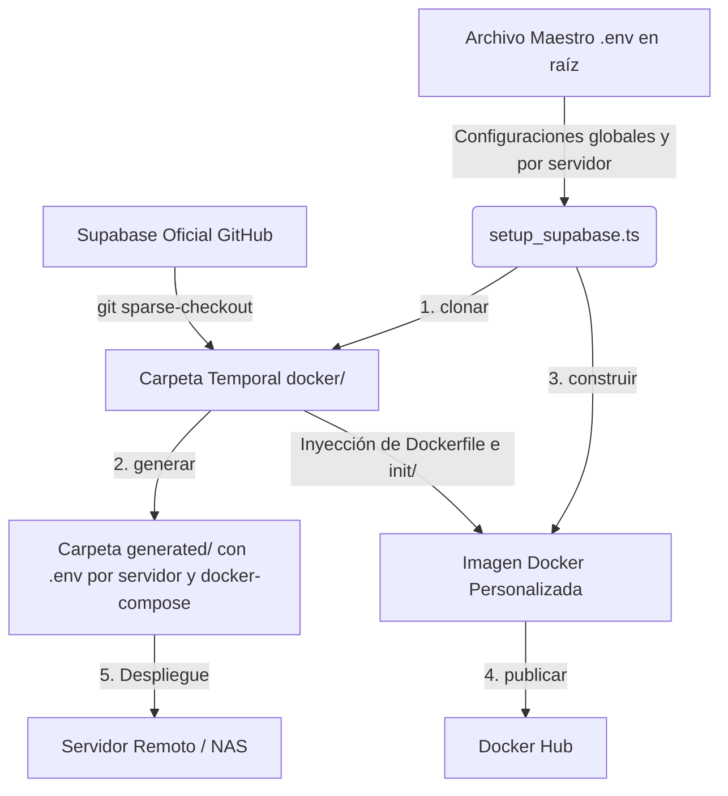

# Supabase Configurator & Deployment Manager

Herramienta de orquestación y automatización CLI (`setup_supabase.ts`) diseñada para gestionar despliegues multi-servidor de Supabase bajo un enfoque **"Cero-Contacto" (Zero-Touch)** y una arquitectura purista de Git, completamente migrada a **Node.js 26+ nativo**.

---

## Características Principales

- **Arquitectura 100% Dinámica**: No almacena archivos estáticos de Supabase (`docker-compose.yml`, `Dockerfile`, `init/`) en el repositorio. Todo se genera al vuelo en tiempo de compilación.
- **Gestión Multi-Servidor**: Centraliza la configuración de múltiples entornos (`cloud`, `nas-franco`, `local`, etc.) en un único archivo `.env` maestro ubicado en la raíz del proyecto.
- **Metadatos de Juego & Tenant DRY**: Incorpora de forma nativa identificadores para la UI del juego (`ID`, `NAME`, `REGION`) y aplica el principio DRY para la gestión de tenants (`TENANT_ID`), propagándolo automáticamente a los servicios de Supavisor y Storage.
- **Despliegues Cero-Contacto**: Encapsula todas las configuraciones, scripts SQL internos de Supabase y servicios (Kong, Vector, Supavisor) dentro de una imagen Docker personalizada, evitando la necesidad de crear o editar archivos manualmente en los servidores remotos.
- **Herencia Inteligente de Variables**: Combina automáticamente las configuraciones base oficiales de Supabase (`.env.example`) con las variables del maestro y las específicas de cada servidor, garantizando que Docker Compose levante sin errores de especificación.
- **Interfaz CLI en Español Modernizada**: Comandos intuitivos y amigables con formato visual enriquecido y compilación ultrarrápida nativa de TypeScript (gracias a Node.js 26+).

---

## Estructura del Proyecto

```text
PokeBorrador/
├── .env.example         # Plantilla del archivo maestro de configuración (Raíz)
└── supabase/
    ├── setup_supabase.ts    # Orquestador CLI principal (Node.js 26+)
    └── README.md            # Esta documentación
```

> [!NOTE]
> Las carpetas `docker/` (clon temporal de Supabase) y `generated/` (archivos listos para despliegue) son **artefactos de compilación**. Git las ignora automáticamente para mantener el repositorio limpio y ultraligero.

---

## Flujo de Trabajo y Arquitectura



---

## Requisitos Previos

- **Node.js 26.1.0+**
- **Docker** y **Docker Compose** (para construir y publicar imágenes)
- **Git** (para la clonación selectiva de Supabase)

---

## Configuración Inicial

1. Editá el archivo `.env` en la raíz de **PokeBorrador** para definir tus credenciales de Docker Hub y los servidores que desees gestionar:

```ini
# === [ CONFIGURACIÓN DOCKER HUB ] ===
DOCKER_USER=francogp612
DOCKER_REPO_DB=pokevicio-db
DOCKER_TAG_DB=latest

# === [ SERVIDOR: cloud ] ===
SERVER_cloud_ID=official-prod
SERVER_cloud_NAME="Poké Vicio Oficial"
SERVER_cloud_REGION="Global"
SERVER_cloud_TENANT_ID=your-tenant-id
SERVER_cloud_SUPABASE_PUBLIC_URL=https://mi-api-cloud.midominio.com
SERVER_cloud_POSTGRES_PASSWORD=mi_password_seguro_cloud

# === [ SERVIDOR: nas-franco ] ===
SERVER_nas_franco_ID=nas-franco
SERVER_nas_franco_NAME="Franco NAS (Docker)"
SERVER_nas_franco_REGION="Desarrollo"
SERVER_nas_franco_TENANT_ID=your-tenant-id
SERVER_nas_franco_SUPABASE_PUBLIC_URL=http://192.168.88.200:8000
SERVER_nas_franco_POSTGRES_PASSWORD=mi_password_seguro_nas
```

> [!TIP]
> Si omites claves obligatorias de Supabase (como `JWT_SECRET`, `ANON_KEY`, `SERVICE_ROLE_KEY` o claves de encriptación), la herramienta las **generará automáticamente de forma criptográficamente segura** utilizando la API nativa de criptografía de Node.js y las guardará en tu `.env` maestro la primera vez que ejecutes `generar`.

---

## Referencia de Comandos CLI

El orquestador se ejecuta a través de `npm run supabase:manage [comando]`. Si se ejecuta sin comandos, listará los servidores configurados.

### `list`

Muestra una tabla resumen con todos los servidores definidos en tu `.env` maestro, sus URLs públicas y su estado de configuración.

```bash
npm run supabase:manage list
```

### `add`

Asistente interactivo para añadir o actualizar un servidor en el archivo `.env` maestro. Solicita metadatos del juego (`ID`, `NAME`, `REGION`), configuración de `Tenant ID`, dominios, puertos y credenciales del dashboard.

```bash
npm run supabase:manage add
```

### `clone`

Descarga la última versión de la carpeta `docker/` oficial de Supabase mediante `git sparse-checkout` y genera dinámicamente el `Dockerfile` personalizado y la carpeta `init/`.

```bash
npm run supabase:manage clone
```

### `generate`

Procesa los servidores del `.env` maestro y crea un archivo `.env` independiente para cada uno dentro de la carpeta `generated/` (ej. `generated/nas_franco.env`). También copia y adapta el `docker-compose.yml` oficial inyectando los volúmenes nombrados y configuraciones de tenant.

```bash
npm run supabase:manage generate
```

### `build`

Construye la imagen Docker de Postgres personalizada empaquetando todos los scripts SQL internos de Supabase y las configuraciones de Kong, Vector y Supavisor.

```bash
npm run supabase:manage build
```

### `publish`

Inicia sesión en Docker Hub (si es necesario) y sube la imagen construida al repositorio configurado en el `.env` maestro.

```bash
npm run supabase:manage publish
```

### `release`

Atajo de productividad que ejecuta secuencialmente `build` y `publish` en un solo paso para agilizar el lanzamiento de nuevas versiones de la imagen base.

```bash
npm run supabase:manage release
```

### `all`

**El comando maestro.** Orquesta secuencialmente el ciclo de vida completo en un solo paso: `clone` -> `generate` -> `build` -> `publish`.

```bash
npm run supabase:manage all
```

---

## Ejemplos Prácticos de Uso

### Ejemplo 1: Despliegue Automatizado Completo (Zero-Touch)

Para actualizar Supabase a la última versión, regenerar todas las configuraciones, compilar la imagen y subirla a Docker Hub en un solo paso:

```bash
npm run supabase:manage all
```

### Ejemplo 2: Creación y Despliegue de un Nuevo Entorno (Staging)

1. Ejecutá el asistente para agregar el servidor y configurar sus metadatos y tenant:

```bash
npm run supabase:manage add
```

*El asistente te pedirá el nombre (ej. `staging`), metadatos del juego, Tenant ID y dominios.*

1. Generá los archivos de despliegue para que se creen las claves de encriptación y el archivo `generated/staging.env`:

```bash
npm run supabase:manage generate
```

1. Subí los archivos generados (`generated/docker-compose.yml` y `generated/staging.env`) a tu servidor remoto o NAS, renombrá `staging.env` a `.env` y levantá los servicios:

```bash
docker compose up -d
```

---

## Guía de Configuración en NAS QNAP (HTTPS & Proxy Inverso)

Para disponibilizar de manera segura la base de datos y la API de Supabase desde fuera de tu red local utilizando tu NAS QNAP y su certificado SSL de **myQNAPcloud**, sigue este flujo paso a paso:

### 1. Activar DDNS y Certificado SSL Nativos

1. Abre la aplicación **myQNAPcloud** en la interfaz web de tu QNAP.
2. Asegúrate de configurar un dominio DDNS personalizado (ej. `francogp.myqnapcloud.com`).
3. En la pestaña **Certificado SSL**, solicita y activa el certificado gratuito de **Let's Encrypt**.
   > [!NOTE]
   > QNAP gestiona automáticamente el HTTPS y renovará el certificado cada 3 meses sin necesidad de configuraciones manuales o contenedores adicionales de Nginx/Certbot.

### 2. Configurar el Proxy Inverso en QTS (QNAP)

1. Ve al **Panel de Control** > **Servidor Web** > pestaña **Proxy Inverso**.
2. Añade una nueva regla de Proxy Inverso con la siguiente configuración:
   - **Nombre de la Regla**: `Supabase API`
   - **Protocolo de Origen**: `HTTPS`
   - **Nombre del Host de Origen**: Tu dominio DDNS (ej. `francogp.myqnapcloud.com`)
   - **Puerto de Origen**: `8443`
   - **Protocolo de Destino**: `HTTP`
   - **Nombre del Host de Destino**: La IP privada de tu NAS (ej. `192.168.88.200`)
   - **Puerto de Destino**: `8000` (el puerto HTTP expuesto por Kong en tu Docker).

### 3. Configurar la Redirección de Puertos (NAT) en tu Router

Para que el tráfico externo de internet llegue correctamente al NAS, debes abrir el puerto seguro `8443` en tu router hogareño.

#### A. Configuración General (Port Forwarding Estándar)

En la interfaz de administración web de tu router, añade una regla de reenvío:

- **Puerto Externo (WAN)**: `8443` (TCP)
- **IP Interna (Destino)**: La IP privada del NAS (ej. `192.168.88.200`)
- **Puerto Interno (Destino)**: `8443` (TCP)

#### B. Configuración Avanzada en Routers MikroTik (RouterOS)

Si utilizas un router MikroTik, debes configurar tanto la regla de redirección estándar (**dst-nat**) como la regla de **Hairpin NAT** (NAT Loopback). Esta última es crucial para permitir que tus dispositivos locales puedan conectarse al dominio `myqnapcloud.com` estando dentro de tu propia red local (de lo contrario, la conexión dará error al jugar por Wi-Fi desde tu casa).

Abre una consola (`New Terminal`) en tu MikroTik o mediante Winbox y ejecuta:

**1. Redirección de Puertos (DST-NAT):**

```routeros
/ip firewall nat
add chain=dstnat action=dst-nat to-addresses=192.168.88.200 to-ports=8443 protocol=tcp dst-port=8443 comment="Supabase HTTPS (NAS QNAP)"
```

**2. Hairpin NAT (NAT Loopback):**

```routeros
/ip firewall nat
add chain=srcnat src-address=192.168.88.0/24 dst-address=192.168.88.200 protocol=tcp dst-port=8443 action=masquerade comment="Hairpin NAT - Supabase NAS"
```

### 4. Evitar Conflictos de Puerto en Docker (`8443`)

Como QNAP se adueña de su puerto host `8443` para escuchar el HTTPS y derivarlo internamente por HTTP, **Docker no debe intentar adueñarse de ese mismo puerto host** para levantar la pasarela HTTPS interna de Kong. De lo contrario, Docker fallará al iniciar con un error de puerto ya bindeado.

Para evitar esto:

1. En tu archivo `.env` maestro en la raíz, asigna un puerto diferente y libre para el bindeo HTTPS interno de Kong agregando esta variable en tu perfil de servidor:

   ```ini
   SERVER_nas_franco_KONG_HTTPS_PORT=8444
   ```

2. Corre el script para regenerar los archivos de despliegue:

   ```bash
   npm run supabase:manage generate
   ```

3. Subí el nuevo `nas_franco.env` (renombrado a `.env`) y `docker-compose.yml` al NAS y recreá el contenedor:

   ```bash
   docker compose down
   docker compose up -d --force-recreate
   ```

   > [!TIP]
   > Con esta arquitectura, los clientes externos de juego se comunicarán de forma segura por HTTPS a `https://francogp.myqnapcloud.com:8443`. QNAP resolverá y descifrará el SSL en su puerto `8443` y enviará las peticiones localmente en HTTP limpio al puerto `8000` del contenedor Docker, mientras que el puerto seguro de Kong Docker se bindea al `8444` del host evitando choques de puertos.

---

## Solución de Problemas Comunes

### Error: `invalid spec: :/var/run/docker.sock:ro,z: empty section between colons`

**Causa:** Estás intentando levantar Docker Compose utilizando un archivo `.env` que no posee las variables base de Supabase (como `DOCKER_SOCKET_LOCATION`).
**Solución:** Asegurate de generar los archivos de entorno utilizando `npm run supabase:manage generate`. La herramienta se encarga de heredar automáticamente todas las variables base del archivo oficial de Supabase.

### Error: `WinError 5: Acceso denegado` al clonar en Windows (Resuelto en Node.js)

**Causa:** Git en Windows marca ciertos archivos internos como solo lectura (`readonly`), impidiendo que Python/Node los elimine directamente al limpiar carpetas temporales.
**Solución:** En Node.js 26+ nativo, el uso de `fs.rm` con `{ recursive: true, force: true }` evita esta restricción y gestiona la limpieza de directorios temporales de manera transparente.

---

## Licencia

Distribuido bajo la Licencia MIT.
