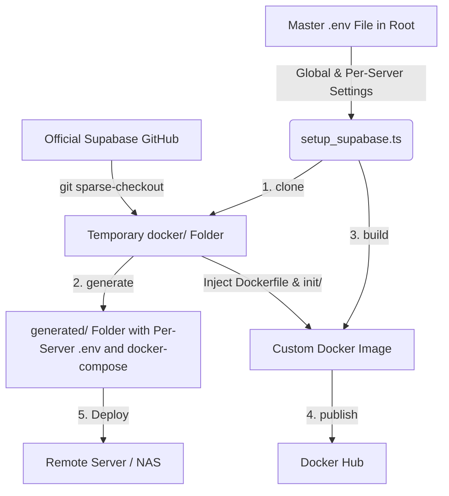

# Supabase Configurator & Deployment Manager

CLI orchestration and automation tool (`setup_supabase.ts`) designed to manage multi-server Supabase deployments under a **"Zero-Touch"** approach and a purist Git architecture, fully running on **native Node.js (version governed by `package.json` / `.nvmrc`)**.

---

## Key Features

- **100% Dynamic Architecture**: Does not store static Supabase files (`docker-compose.yml`, `Dockerfile`, `init/`) in the repository. Everything is generated on the fly at build time.
- **Multi-Server Management**: Centralizes configuration for multiple environments (`cloud`, `nas-franco`, `local`, etc.) in a single master `.env` file located at the project root.
- **Game Metadata & DRY Tenant**: Natively incorporates identifiers for game UI (`ID`, `NAME`, `REGION`) and enforces the DRY principle for tenant management (`TENANT_ID`), propagating it automatically to Supavisor and Storage services.
- **Zero-Touch Deployments**: Encapsulates all configurations, internal Supabase SQL scripts, and services (Kong, Vector, Supavisor) inside a custom Docker image, eliminating the need to manually create or edit files on remote servers.
- **Intelligent Variable Inheritance**: Automatically merges official Supabase base configurations (`.env.example`) with master and server-specific variables, ensuring Docker Compose starts without specification errors.
- **Modernized CLI Interface**: Intuitive, friendly commands with rich visual output and ultra-fast native TypeScript compilation (powered by native Node.js).

---

## Project Structure

```text
Poké Vicio/
├── .env.example         # Master configuration file template (Root)
└── supabase/
    ├── setup_supabase.ts    # Main CLI orchestrator (Native Node.js)
    └── README.md            # This documentation
```

> [!NOTE]
> The `docker/` (temporary Supabase clone) and `generated/` (deployment-ready files) directories are **build artifacts**. Git automatically ignores them to keep the repository clean and lightweight.

---

## Architecture & Workflow


```mermaid
graph TD
    A[Master .env File in Root] -->|Global & Per-Server Settings| B(setup_supabase.ts)
    C[Official Supabase GitHub] -->|git sparse-checkout| D[Temporary docker/ Folder]
    B -->|1. clone| D
    D -->|2. generate| E[generated/ Folder with Per-Server .env and docker-compose]
    D -->|Inject Dockerfile & init/| F[Custom Docker Image]
    B -->|3. build| F
    F -->|4. publish| G[Docker Hub]
    E -->|5. Deploy| H[Remote Server / NAS]
```

---

## Prerequisites

- **Node.js** (version governed by the project SSoT in `package.json` [`engines.node`] and `.nvmrc`)
- **Docker** and **Docker Compose** (to build and publish images)
- **Git** (for selective Supabase cloning)

---

## Initial Setup

1. Edit the `.env` file at the root of **Poké Vicio** to define your Docker Hub credentials and the servers you want to manage:

```ini
# === [ DOCKER HUB CONFIGURATION ] ===
DOCKER_USER=francogp612
DOCKER_REPO_DB=pokevicio-db
DOCKER_TAG_DB=latest

# === [ SERVER: cloud ] ===
SERVER_cloud_ID=official-prod
SERVER_cloud_NAME="Poké Vicio Official"
SERVER_cloud_REGION="Global"
SERVER_cloud_TENANT_ID=your-tenant-id
SERVER_cloud_SUPABASE_PUBLIC_URL=https://my-api-cloud.mydomain.com
SERVER_cloud_POSTGRES_PASSWORD=my_secure_cloud_password

# === [ SERVER: server_franco ] ===
SERVER_server_franco_ID=server_franco
SERVER_server_franco_NAME="Server Franco (Docker)"
SERVER_server_franco_REGION="Development"
SERVER_server_franco_TENANT_ID=your-tenant-id
SERVER_server_franco_SUPABASE_PUBLIC_URL=https://francogp.myqnapcloud.com:50002
SERVER_server_franco_POSTGRES_PASSWORD=my_secure_server_password
```

> [!TIP]
> If you omit required Supabase keys (such as `JWT_SECRET`, `ANON_KEY`, `SERVICE_ROLE_KEY`, or encryption keys), the tool will **automatically generate them in a cryptographically secure manner** using Node.js native crypto API and save them to your master `.env` the first time you run `generate`.

---

## CLI Command Reference

The orchestrator is executed via `npm run supabase:manage [command]`. Running without commands lists configured servers.

### `list`

Displays a summary table of all servers defined in your master `.env`, their public URLs, and configuration status.

```bash
npm run supabase:manage list
```

### `add`

Interactive wizard to add or update a server in the master `.env` file. Prompts for game metadata (`ID`, `NAME`, `REGION`), `Tenant ID` configuration, domains, ports, and dashboard credentials.

```bash
npm run supabase:manage add
```

### `clone`

Downloads the latest version of the official Supabase `docker/` folder via `git sparse-checkout` and dynamically generates the custom `Dockerfile` and `init/` folder.

```bash
npm run supabase:manage clone
```

### `generate`

Processes servers from the master `.env` and creates an independent `.env` file for each in the `generated/` folder (e.g. `generated/server_franco.env`). It also copies and adapts the official `docker-compose.yml`, injecting named volumes and tenant configurations.

```bash
npm run supabase:manage generate
```

### `build`

Builds the custom Postgres Docker image packaging all internal Supabase SQL scripts and configurations for Kong, Vector, and Supavisor.

```bash
npm run supabase:manage build
```

### `publish`

Logs into Docker Hub (if necessary) and pushes the built image to the repository configured in the master `.env`.

```bash
npm run supabase:manage publish
```

### `release`

Productivity shortcut that sequentially runs `build` and `publish` in a single step to streamline base image releases.

```bash
npm run supabase:manage release
```

### `all`

**The master command.** Sequentially orchestrates the full lifecycle in a single step: `clone` -> `generate` -> `build` -> `publish`.

```bash
npm run supabase:manage all
```

---

## Practical Usage Examples

### Example 1: Full Automated Deployment (Zero-Touch)

To update Supabase to the latest version, regenerate all configurations, compile the image, and push it to Docker Hub in a single step:

```bash
npm run supabase:manage all
```

### Example 2: Creating and Deploying a New Environment (Staging)

1. Run the wizard to add the server and configure its metadata and tenant:

```bash
npm run supabase:manage add
```

*The wizard will ask for the name (e.g. `staging`), game metadata, Tenant ID, and domains.*

1. Generate deployment files so encryption keys and `generated/staging.env` are created:

```bash
npm run supabase:manage generate
```

1. Upload the generated files (`generated/docker-compose.yml` and `generated/staging.env`) to your remote server or NAS, rename `staging.env` to `.env`, and start services:

```bash
docker compose up -d
```

---

## QNAP NAS Configuration Guide (HTTPS & Reverse Proxy)

To securely expose the database and Supabase API outside your local network using your QNAP NAS and its **myQNAPcloud** SSL certificate, follow this step-by-step workflow:

### 1. Enable Native DDNS & SSL Certificate

1. Open the **myQNAPcloud** app on your QNAP web interface.
2. Ensure a custom DDNS domain is configured (e.g. `francogp.myqnapcloud.com`).
3. Under the **SSL Certificate** tab, request and activate the free **Let's Encrypt** certificate.

> [!NOTE]
> QNAP automatically manages HTTPS and renews the certificate every 3 months without requiring manual configurations or extra Nginx/Certbot containers.

### 2. Configure Reverse Proxy in QTS (QNAP)

1. Go to **Control Panel** > **Web Server** > **Reverse Proxy** tab.
2. Add a new Reverse Proxy rule with the following settings:
   - **Rule Name**: `Supabase API`
   - **Source Protocol**: `HTTPS`
   - **Source Hostname**: Your DDNS domain (e.g. `francogp.myqnapcloud.com`)
   - **Source Port**: `8443`
   - **Target Protocol**: `HTTP`
   - **Target Hostname**: Your NAS private IP (e.g. `192.168.88.200`)
   - **Target Port**: `8000` (the HTTP port exposed by Kong in your Docker).

### 3. Configure Port Forwarding (NAT) on Your Router

For external internet traffic to properly reach the NAS, forward secure port `8443` on your home router.

#### A. General Setup (Standard Port Forwarding)

In your router web management interface, add a forwarding rule:

- **External Port (WAN)**: `8443` (TCP)
- **Internal IP (Target)**: NAS private IP (e.g. `192.168.88.200`)
- **Internal Port (Target)**: `8443` (TCP)

#### B. Advanced Setup for MikroTik Routers (RouterOS)

If using a MikroTik router, configure both the standard redirection rule (**dst-nat**) and the **Hairpin NAT** rule (NAT Loopback). The latter is crucial to allow local devices to connect to `myqnapcloud.com` from inside your home network (otherwise, connections fail when playing over home Wi-Fi).

Open a terminal (`New Terminal`) in MikroTik or Winbox and run:

**1. Port Redirection (DST-NAT):**

```routeros
/ip firewall nat
add chain=dstnat action=dst-nat to-addresses=192.168.88.200 to-ports=8443 protocol=tcp dst-port=8443 comment="Supabase HTTPS (NAS QNAP)"
```

**2. Hairpin NAT (NAT Loopback):**

```routeros
/ip firewall nat
add chain=srcnat src-address=192.168.88.0/24 dst-address=192.168.88.200 protocol=tcp dst-port=8443 action=masquerade comment="Hairpin NAT - Supabase NAS"
```

### 4. Avoid Port Conflicts in Docker (`8443`)

Because QNAP occupies host port `8443` to listen for HTTPS and route internally over HTTP, **Docker must not attempt to bind that same host port** for Kong's internal HTTPS gateway. Otherwise, Docker will fail to start with a port collision error.

To prevent this:

1. In your master `.env` file at root, assign a different, available port for Kong's internal HTTPS binding by setting this variable in your server profile:

   ```ini
   SERVER_server_franco_KONG_HTTPS_PORT=50002
   ```

2. Run the script to regenerate deployment files:

   ```bash
   npm run supabase:manage generate
   ```

3. Upload the updated `server_franco.env` (renamed to `.env`) and `docker-compose.yml` to the server and recreate the container:

   ```bash
   docker compose down
   docker compose up -d --force-recreate
   ```

> [!TIP]
> Under this architecture, external game clients communicate securely over HTTPS to `https://francogp.myqnapcloud.com:8443`. QNAP resolves and terminates SSL on port `8443` and forwards requests locally via clean HTTP to port `8000` of the Docker container, while Kong Docker's secure port binds to host `8444`, preventing port collisions.

---

## Troubleshooting Common Issues

### Error: `invalid spec: :/var/run/docker.sock:ro,z: empty section between colons`

**Cause:** Attempting to start Docker Compose using a `.env` file that lacks Supabase base variables (such as `DOCKER_SOCKET_LOCATION`).
**Solution:** Ensure environment files are generated using `npm run supabase:manage generate`. The tool automatically inherits all base variables from official Supabase templates.

### Error: `WinError 5: Access is denied` when cloning on Windows (Resolved in Node.js)

**Cause:** Git on Windows marks certain internal files as read-only (`readonly`), preventing Python/Node from deleting them directly when cleaning temporary folders.
**Solution:** In native Node.js 26+, `fs.rm` with `{ recursive: true, force: true }` bypasses this restriction and manages temporary directory cleanup transparently.

---

## License

Distributed under the MIT License.
